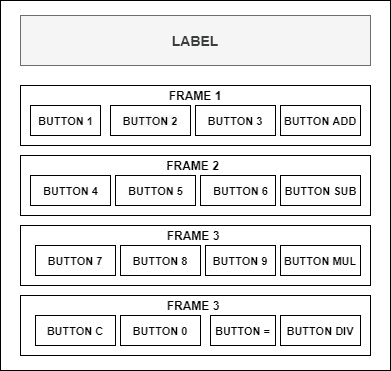
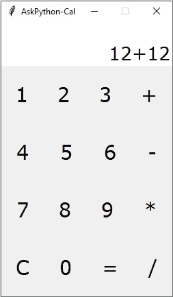

# 如何用 Python 中的 Tkinter 搭建一个 GUI 计算器？

> 原文：<https://www.askpython.com/python/examples/gui-calculator-using-tkinter>

在今天的这篇文章中，我们将学习如何使用 Tkinter 创建一个简单的 GUI 计算器。我们将逐步理解整个代码。

## 使用 Tkinter 开始使用我们的 GUI 计算器

在我们开始之前，确保您已经为 Python 安装了 [Tkinter 库](https://www.askpython.com/python-modules/tkinter/tkinter-canvas)。Tkinter 是 Python 编程语言的标准 GUI 库。当 python 与 Tkinter 合并时，它提供了一种快速简单的方法来创建图形用户界面应用程序。

Tkinter 为 Tk GUI 工具包提供了一个强大的面向对象的接口。如果 python 中没有预装 Tkinter，则打开 windows cmd 并输入以下命令。

```py
pip install python-tk

```

* * *

## Tkinter Messagebox

[Messagebox](https://www.askpython.com/python-modules/tkinter/tkinter-messagebox-and-radiobutton) 是 Python 的 Tkinter 库中的一个小部件。它用于显示 python 应用程序中的消息框。该模块用于使用一定数量的功能显示消息。

**语法:**

```py
messagebox.Name_of_the_function(title,message[, options]) 

```

**参数**:

*   **Function_Name:** 该参数用来表示一个合适的消息框函数。
*   **title:** 该参数是一个字符串，显示为消息框的标题。
*   **message:** 该参数是在消息框上显示为消息的字符串。
*   **选项:**有两个选项可以使用:
    1.  **默认:**该选项用于指定消息框中的默认按钮，如中止、重试或忽略。
    2.  **parent:** 该选项用于指定消息框显示在哪个窗口的顶部。

* * *

## 使用 Tkinter 的 GUI 计算器的结构



**Python Tkinter 标签:**标签用于指定我们可以放置文本或图片的容器框。这个小部件用于向用户提供关于 python 应用程序中使用的其他小部件的消息。

**Python 框架:**框架只是一种小部件。python 中的框架只不过是其子元素的简单容器。使用这些，我们可以给子容器主机，我们可以一帧一帧地划分整个布局。

假设我们运行这个程序，我们在开始有一个标签，然后在根窗口有几个按钮。我们可以把这个根窗口一部分一部分的划分，比如标签作为一个部分，然后按钮分成不同的部分。如果我们把这些部分放在一个框架中，那么这个框架就是一个父元素。这将帮助我们简化复杂的设计。

添加框架后，计算器结构将如下所示:

1.  标签
2.  框架 1 : 4 个按钮
3.  框架 2 : 4 个按钮
4.  框架 3 : 4 个按钮
5.  框架 4 : 4 个按钮

**Python 按钮:**按钮部件用于在 Python 应用程序中添加按钮。这些按钮可以显示传达按钮用途的文本或图像。您可以将一个函数或方法附加到一个按钮上，单击该按钮时会自动调用该函数或方法。

* * *

### 1。定义函数

这里我们将从按钮的编码部分开始。

```py
val=""
A = 0
operator=""

def btn_1_isclicked():
    global val
    #Concatinate string value 1 with the val and store it in the variable val again
    val = val + "1"
    data.set(val)

```

我们将定义第一个名为 **btn_1_isclicked( )** 的函数。我们给它起了一个精心设计的名字，这样我们通过观察它就能更容易地理解这个函数实际上在做什么。

在这里，我们希望每当我们单击任何数字按钮时，我们希望该数字显示在我们的标签上，并将其存储在不同的变量中，以便于计算。

我们将接受一个全局变量，以避免变量名问题。在 Python 中，在函数外部或全局范围内声明的变量称为全局变量。

这意味着全局变量可以在函数内部或外部访问。这里的 val 是一个全局变量。在上面的代码中，我们创建了 val 作为全局变量，并定义了一个`btn_1_isclicked( )`来打印全局变量 val 并存储它的值。

对所有的[t inter 按钮](https://www.askpython.com/python-modules/tkinter/tkinter-buttons)执行相同的步骤。

```py
#import the necessary libraries
import tkinter
from tkinter import *
from tkinter import messagebox

val=""
A = 0
operator=""

def btn_1_isclicked():
    global val
    val = val + "1"
    data.set(val)

def btn_2_isclicked():
    global val
    val = val + "2"
    data.set(val)

def btn_3_isclicked():
    global val
    val = val + "3"
    data.set(val)

def btn_4_isclicked():
    global val
    val = val + "4"
    data.set(val)

def btn_5_isclicked():
    global val
    val = val + "5"
    data.set(val)

def btn_6_isclicked():
    global val
    val = val + "6"
    data.set(val)

def btn_7_isclicked():
    global val
    val = val + "7"
    data.set(val)

def btn_8_isclicked():
    global val
    val = val + "8"
    data.set(val)

def btn_9_isclicked():
    global val
    val = val + "9"
    data.set(val)

def btn_0_isclicked():
    global val
    val = val + "0"
    data.set(val)

def btn_add_clicked():
    global A
    global operator
    global val
    A = int(val)
    operator = "+"
    val = val + "+"
    data.set(val)

def btn_sub_clicked():
    global A
    global operator
    global val
    A = int(val)
    operator = "-"
    val = val + "-"
    data.set(val)

def btn_mul_clicked():
    global A
    global operator
    global val
    A = int(val)
    operator = "*"
    val = val + "*"
    data.set(val)

def btn_div_clicked():
    global A
    global operator
    global val
    A = int(val)
    operator = "/"
    val = val + "/"
    data.set(val)

def btn_equal_clicked():
    global A
    global operator
    global val
    A = int(val)
    operator = "="
    val = val + "="
    data.set(val)

def C_pressed():
    global A
    global operator
    global val
    val = ""
    A=0
    operator=""
    data.set(val)

def result():
    global A
    global operator
    global val
    val2 = val
    if operator == "+":
        x=int((val2.split("+")[1]))
        c = A + x
        data.set(c)
        val=str(c)
    elif operator == "-":
        x=int((val2.split("-")[1]))
        c = A - x
        data.set(c)
        val=str(c)
    elif operator == "*":
        x=int((val2.split("*")[1]))
        c = A * x
        data.set(c)
        val=str(c)
    elif operator == "/":
        x=int((val2.split("/")[1]))
        if x==0:
            messagebox.show("Error","Division by 0 Not Allowed")
            A==""
            val=""
            data.set(val)
        else:
            c=int(A/x)
            data.set(c)
            val=str(c)

```

### 2.使用 Tkinter 为我们的 GUI 计算器创建窗口

为了初始化 tkinter，我们必须创建一个 [Tk root 小部件](https://www.askpython.com/python/tkinter-gui-widgets)，这是一个带有标题栏和窗口管理器提供的其他装饰的窗口。

根窗口是我们程序中的一个主要应用程序窗口。它有一个标题栏和边框。

这些是由窗口管理器提供的。它必须在创建任何其他小部件之前创建。

`geometry`方法设置窗口的大小并将其定位在屏幕上。前两个参数是窗口的宽度和高度。最后两个参数是 x 和 y 屏幕坐标。

通过将 root.resizable 设置为(0，0)，程序员将无法调整窗口的大小。最好使用 root.resizable(0，0 ),因为它会使计算器看起来合适。

```py
#create a root window
root = tkinter.Tk()
#set geometry
root.geometry("250x400+300+300")
#disable the resize option for better UI
root.resizable(0,0)
#Give the tiltle to your calculator window
root.title("AskPython-Cal")

```

### 3.设置标签格式

标签是一个显示框，您可以在其中放置文本或图像。这个小部件显示的文本可以随时更新。也可以给文本的一部分加下划线(就像识别键盘快捷键一样)并将文本跨多行显示。

标签的父标签是根标签。这意味着它不会局限于单个框架，而是整个根窗口。然后，我们将放入一个简单的文本，我们将在整个代码中动态地改变它，直到我们单击的数字按钮显示在标签上。

Tkinter StringVar 帮助您更有效地管理标签或条目等小部件的值。容器是一个与 **StringVar** 对象相关联的小部件。如果跳过容器，它默认为根窗口，value 是初始值，默认为空字符串。

**anchor** :如果小工具的空间超过了文本需要的空间，它控制文本的位置。默认值是 anchor=SE(小部件将被放置在框架的右下角)。

**textvariable :** 为了能够从您的入口小部件中检索当前文本，您必须将该选项设置为 StringVar 类的一个实例，即 data

```py
#Label
data= StringVar()
lbl=Label(
    root,
    text="Label",
    anchor=SE,
    font=("Verdana",20),
    textvariable=data,
    background="#ffffff",
    fg="#000000",
)
#expand option deals with the expansion of parent widget.
lbl.pack(expand=True,fill="both",)

```

### 4.包装窗户上的纽扣

框架是 python 中的一个小部件。这对于以某种友好的方式对其他小部件进行分组和组织是非常重要的。它像一个容器一样工作，负责安排其他小部件的位置。

它使用屏幕上的矩形区域来组织布局，并为这些小部件提供填充。

框架也可以用作基础类来实现复杂的小部件。

我们给 fame 的变量名为 **btnrow1** 。帧的语法是:

```py
variable_name=Frame(parent_window,options..)

```

*   在我们的代码中，root 代表父窗口。
*   **选项**——以下是我们代码中最常用的选项列表。这些选项可以用作逗号分隔的键值对。
*   **bg** :标签和指示器后面显示的正常背景色。

然后我们包装框架。通过调用根窗口，对其他三个帧重复相同的步骤。

```py
#Frame Coding for Buttons
#Frame for root window
#Frame 1
btnrow1=Frame(root,bg="#000000")
#If frame gets some space it can expand
btnrow1.pack(expand=True,fill="both",)

#Frame 2
btnrow2=Frame(root)
btnrow2.pack(expand=True,fill="both",)

#Frame 3
btnrow3=Frame(root)
btnrow3.pack(expand=True,fill="both",)

#Frame 4
btnrow4=Frame(root)
btnrow4.pack(expand=True,fill="both",)

```

### **5。使用 Tkinter 向我们的 GUI 计算器添加按钮**

[按钮小部件](https://www.askpython.com/python/tkinter-gui-widgets)用于使用 Python 中的 Tkinter 库在我们的 GUI 计算器中添加按钮。这些按钮可以显示传达按钮用途的文本或图像。您可以将一个函数或方法附加到一个按钮上，单击该按钮时会自动调用该函数或方法。

**浮雕:**默认值，浮雕=凹槽。您可以将此选项设置为任何其他样式，如:凹陷、刚性、凸起、扁平。

**命令**是点击按钮时要调用的函数或方法。这里我们调用**命令= btn_1_isclicked，**我们之前创建的执行任务的函数。

对于其他按钮，我们也遵循相同的方法。

```py
#Button row One
#Button 1
btn1=Button(
    btnrow1,
    text = "1",
    font = ("Verdana",22),
    relief =GROOVE,
    border=0,
    command = btn_1_isclicked,
)
#Buttons will be side by side
btn1.pack(side=LEFT,expand=True,fill="both",)

#Button 2
btn2=Button(
    btnrow1,
    text = "2",
    font = ("Verdana",22),
    relief =GROOVE,
    border=0,
    command = btn_2_isclicked,
)
#Buttons will be side by side
btn2.pack(side=LEFT,expand=True,fill="both",)

#Button 3
btn3=Button(
    btnrow1,
    text = "3",
    font = ("Verdana",22),
    relief =GROOVE,
    border=0,
    command = btn_3_isclicked,
)
#Buttons will be side by side
btn3.pack(side=LEFT,expand=True,fill="both",)

#Button add
btnadd=Button(
    btnrow1,
    text = "+",
    font = ("Verdana",22),
    relief =GROOVE,
    border=0,
    command = btn_add_clicked,
)
#Buttons will be side by side
btnadd.pack(side=LEFT,expand=True,fill="both",)

#Button row Two
#Button 4
btn4=Button(
    btnrow2,
    text = "4",
    font = ("Verdana",22),
    relief =GROOVE,
    border=0,
    command = btn_4_isclicked,
)
#Buttons will be side by side
btn4.pack(side=LEFT,expand=True,fill="both",)

#Button 5
btn5=Button(
    btnrow2,
    text = "5",
    font = ("Verdana",22),
    relief =GROOVE,
    border=0,
    command = btn_5_isclicked,
)
#Buttons will be side by side
btn5.pack(side=LEFT,expand=True,fill="both",)

#Button 6
btn6=Button(
    btnrow2,
    text = "6",
    font = ("Verdana",22),
    relief =GROOVE,
    border=0,
    command = btn_6_isclicked,
)
#Buttons will be side by side
btn6.pack(side=LEFT,expand=True,fill="both",)

#Button Subtraction
btnsub=Button(
    btnrow2,
    text = "-",
    font = ("Verdana",22),
    relief =GROOVE,
    border=0,
    command = btn_sub_clicked,
)
#Buttons will be side by side
btnsub.pack(side=LEFT,expand=True,fill="both",)

#Button row Three
#Button 7
btn7=Button(
    btnrow3,
    text = "7",
    font = ("Verdana",22),
    relief =GROOVE,
    border=0,
    command = btn_7_isclicked,
)
#Buttons will be side by side
btn7.pack(side=LEFT,expand=True,fill="both",)

#Button 8
btn8=Button(
    btnrow3,
    text = "8",
    font = ("Verdana",22),
    relief =GROOVE,
    border=0,
    command = btn_8_isclicked,
)
#Buttons will be side by side
btn8.pack(side=LEFT,expand=True,fill="both",)

#Button 9
btn9=Button(
    btnrow3,
    text = "9",
    font = ("Verdana",22),
    relief =GROOVE,
    border=0,
    command = btn_9_isclicked,
)
#Buttons will be side by side
btn9.pack(side=LEFT,expand=True,fill="both",)

#Button Multiply
btnmul=Button(
    btnrow3,
    text = "*",
    font = ("Verdana",22),
    relief =GROOVE,
    border=0,
    command = btn_mul_clicked,
)
#Buttons will be side by side
btnmul.pack(side=LEFT,expand=True,fill="both",)

#Button row Four
#Button C
btnC=Button(
    btnrow4,
    text = "C",
    font = ("Verdana",22),
    relief =GROOVE,
    border=0,
    command = C_pressed,
)
#Buttons will be side by side
btnC.pack(side=LEFT,expand=True,fill="both",)

#Button 0
btn0=Button(
    btnrow4,
    text = "0",
    font = ("Verdana",22),
    relief =GROOVE,
    border=0,
    command = btn_0_isclicked,
)
#Buttons will be side by side
btn0.pack(side=LEFT,expand=True,fill="both",)

#Button Equal to
btnequal=Button(
    btnrow4,
    text = "=",
    font = ("Verdana",22),
    relief =GROOVE,
    border=0,
    command=result,
)
#Buttons will be side by side
btnequal.pack(side=LEFT,expand=True,fill="both",)

#Button Divide
btndiv=Button(
    btnrow4,
    text = "/",
    font = ("Verdana",22),
    relief =GROOVE,
    border=0,
    command = btn_div_clicked,

)
#Buttons will be side by side
btndiv.pack(side=LEFT,expand=True,fill="both",)

root.mainloop()

```

最后，我们进入主循环。事件处理从这一点开始。主循环从窗口系统接收事件，并将它们分派给应用程序小部件。当我们点击标题栏的关闭按钮或调用`quit()`方法时，它被终止。



## 结论

在这篇文章中，我们介绍了 Tkinter 按钮、框架、标签及其功能、Tkinter 窗口、输入框以及如何将这些放在一起构建 GUI 应用程序。通过理解这些代码，我们成功地使用 tkinter 库及其小部件构建了一个可工作的 GUI 计算器。希望这篇文章有所帮助。

谢谢你，祝你学习愉快！