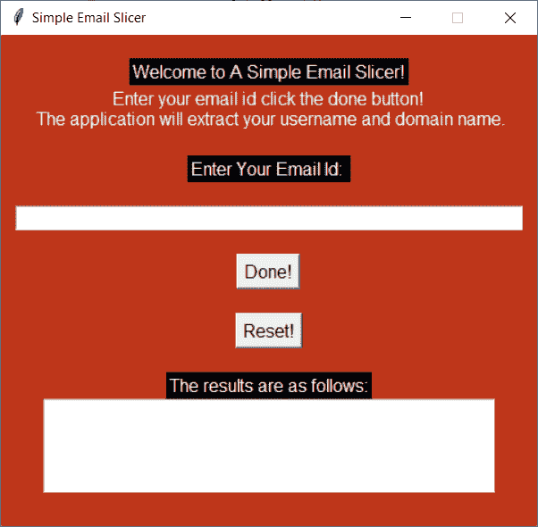
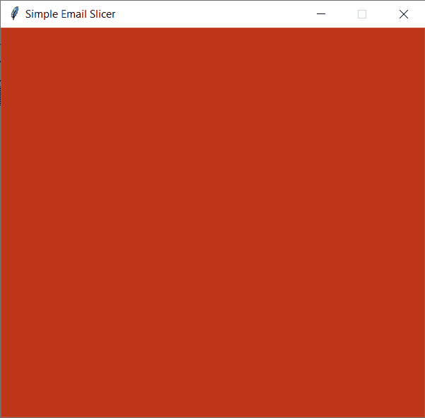
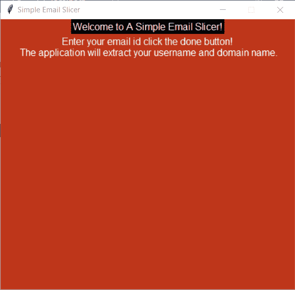
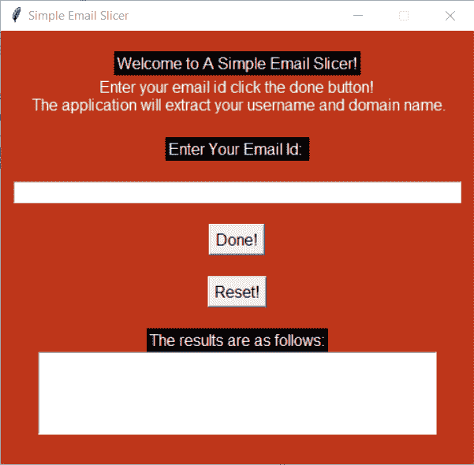
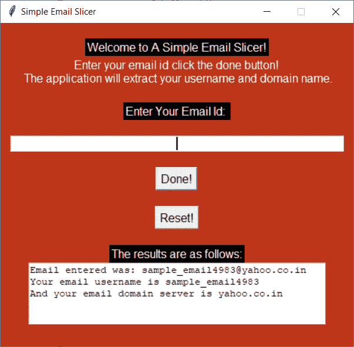

# Python Tkinter:一个简单的电子邮件切片器

> 原文：<https://www.askpython.com/python-modules/tkinter/gui-email-slicer>

你好，初学者！今天我们将使用 Python 中的 [tkinter 模块构建一个简单的电子邮件切片器。在我们开始这个项目之前，让我们知道什么是电子邮件切片机。](https://www.askpython.com/python-modules/tkinter/tkinter-buttons)

## 什么是电子邮件切片机？

电子邮件切片器是一个简单的工具，其中电子邮件地址作为输入和输出提供，应用程序返回用户名和域的电子邮件地址给定。它利用了 Python 的[切片操作。](https://www.askpython.com/python/array/array-slicing-in-python)

同样，在我们开始编写代码之前，让我向您展示一下您最终的输出屏幕将会是什么样子。看看下面的图片。



Initial Screen Email Slicer

看起来很酷，对吧？让我们开始吧！

## 用 Python 构建电子邮件切片器

在构建电子邮件切片器时，让我们首先设计屏幕，然后为按钮的功能声明函数。

### 1.设计屏幕

为了设计屏幕，让我们导入`Tkinter`模块，然后创建一个空白窗口。在这一步，我们还将配置一些更改，如背景颜色和应用程序名称。下面的代码将帮助您做到这一点。

```py
import tkinter as tk
window = tk.Tk()
window.geometry("480x440")
window.config(bg="#BE361A")
window.resizable(width=False,height=False)
window.title('Simple Email Slicer')

```

这里我们首先导入模块。然后我们创建了一个窗口，设置窗口尺寸，并使背景颜色橙色(你可以根据自己的喜好定制你的屏幕！).

我们确保尺寸总体上保持不变，因此我们将 resizable 属性设置为“False”。我们还将应用程序的标题设置为应用程序的名称。现在，最后但同样重要的是，你需要查看窗口，不是吗？

因此，我们运行`mainloop`函数。结果应该看起来像下面的图片！



Screen1 Email Slicer

### 2.向我们的窗口添加必要的元素

现在，一个重要的部分是在我们的应用程序中添加所有必要的元素。我们对应用程序的要求是:

1.  [标签](https://www.askpython.com/python-modules/tkinter/tkinter-frame-and-label)
2.  [输入框](https://www.askpython.com/python-modules/tkinter/tkinter-entry-widget)(取输入)
3.  [按钮](https://www.askpython.com/python-modules/tkinter/tkinter-buttons)
4.  文本框(打印输出)

现在让我们首先添加关于应用程序的所有信息。现在你可以随心所欲地改变它。我会根据自己的喜好保留它们。添加所需标签的代码如下所示。

```py
import tkinter as tk
window = tk.Tk()
window.geometry("480x440")
window.config(bg="#BE361A")
window.resizable(width=False,height=False)
window.title('Simple Email Slicer')

greeting = tk.Label(text="Welcome to A Simple Email Slicer!",font=(12),foreground="white",background="black")
Info = tk. Label(text="Enter your email id click the done button!\n The application will extract your username and domain name.",foreground= "white",background="#BE361A",font=(10))

greeting.pack()
Info.pack()

window.mainloop()

```

添加的行已突出显示，供您参考。显然，标签申报和包装在我们启动窗口之前进行。如果你注意到了，我还做了一些改变，比如前景和背景以及字体大小。还是那句话，你可以根据自己的要求选择所有的改动。新的结果如下:



Screen2 Email Slicer

就像我们添加标签一样，我们将添加按钮以及输入框。到目前为止，我猜你对这些都很熟悉了。所以我现在将向你展示整个设计代码！

```py
import tkinter as tk
window = tk.Tk()
window.geometry("480x440")
window.config(bg="#BE361A")
window.resizable(width=False,height=False)
window.title('Simple Email Slicer')

# All the Labels
greeting = tk.Label(text="Welcome to A Simple Email Slicer!",font=(12),foreground="white",background="black")
Info = tk. Label(foreground= "white",background="#BE361A",font=(10),text="Enter your email id click the done button!\n The application will extract your username and domain name.")
entry_label = tk.Label(foreground= "white",font=(10),background="black",text="Enter Your Email Id: ")
result_label = tk.Label(font=(10),foreground= "white",background="black",text="The results are as follows:")
empty_label0=tk.Label(background="#BE361A")
empty_label1=tk.Label(background="#BE361A")
empty_label2=tk.Label(background="#BE361A")
empty_label3=tk.Label(background="#BE361A")
empty_label4=tk.Label(background="#BE361A")
empty_label5=tk.Label(background="#BE361A")

#The Entry box
entry = tk.Entry(font=(11),width=50,justify='center')

#The two Buttons
button = tk.Button(text="Done!",font=(11))
reset=tk.Button(text="Reset!",font=(11))

#Result
text_box = tk.Text(height=5,width=50)

#Packing Everything Together
empty_label0.pack()
greeting.pack()
Info.pack()
empty_label1.pack()
entry_label.pack()
empty_label4.pack()
entry.pack()
empty_label2.pack()
button.pack()
empty_label5.pack()
reset.pack()
empty_label3.pack()
result_label.pack()
text_box.pack()

window.mainloop()

```

现在你可能已经注意到定义了一些空标签，它们看起来很没用，但是当我们使用`pack`而不是`place`放置元素时，它们有助于在各种元素之间添加换行符(需要 x 和 y 坐标)。现在让我向你展示我们最终的屏幕是什么样的！



Complete Design Email Slicer

所以现在我们已经完成了设计，现在按钮什么也没做。为此，我们将在代码中添加一些额外的函数和变量。

### 3.向按钮添加功能

在直接跳转到按钮之前，我们需要一个地方来存储我们的电子邮件地址，所以我们创建了一个**‘字符串变量’**来存储在输入框中输入的任何内容。我们利用`StringVar`并将名为`textvariable`的属性添加到我们创建的输入框中。我只是给你看你需要改变的部分。

```py
e1=tk.StringVar()
entry = tk.Entry(font=(11),width=50,justify='center',textvariable=e1)

```

### 功能 1:获取用户名和域名

现在，电子邮件地址的存储已经完成！我们也将为这两个按钮创建两个函数。第一个函数将从我们之前创建的变量 e1 获取电子邮件地址，然后对电子邮件地址使用`stripping`操作，以便提取用户名和域。

执行相同操作的代码如下所示。

```py
def result():
    try:
        email=entry.get()
        inp_email = email.strip()
        username = inp_email[0:inp_email.index('@')]
        domain = inp_email[inp_email.index('@') + 1:]
        text_box.delete('1.0', tk.END)
        msg = 'Email entered was: {}\nYour email username is {}\nAnd your email domain server is {}'
        msg_formatted = msg.format(email,username,domain)
        text_box.insert(tk.END,msg_formatted)
        entry.delete(0, 'end')
    except:
        text_box.delete('1.0', tk.END)
        text_box.insert(tk.END,"ERROR!")

```

现在，问题是**‘为什么我在这里使用了 [try-except 块](https://www.askpython.com/python/python-exception-handling)’**

原因是，如果一个人没有输入有效的电子邮件地址，代码可能会导致一系列未处理的错误，甚至用户也不会意识到应用程序有什么问题。

因此，为了避免这种情况，我们确保如果用户输入一个无效的电子邮件 id，那么 except block 将打印**Error**消息。

现在操作非常简单。`get` email 来自输入框变量，`strip`该字符串删除所有的空格(如果有的话)。

现在得到用户名`slice`字符串，直到我们到达 **'@'** 符号，其余的(不包括@符号)进入域名。

现在最后一个操作是利用我们已经创建的**文本框**。为了安全起见，我们删除了文本框中的所有内容(如果有的话),然后插入一条消息，告诉用户找到的域名和用户名。我们还将确保输入框对于下一次输入是干净的。如果发现任何无效条目，运行`except`块，并打印**‘错误’**消息。

### 功能 2:重置应用程序

第一个函数成功完成后，重置函数就变得非常简单了。reset 函数所做的只是清理文本框和输入框。相同的代码如下所示。

```py
def reset_all():
    text_box.delete('1.0', tk.END)
    entry.delete(0, 'end')

```

**但是按键还不行！为什么？**因为我们没有在按钮定义中添加功能。基本上，您需要做的就是将名为`command`的属性添加到按钮定义中。下面的代码显示相同的内容。

```py
button = tk.Button(text="Done!",command=result,font=(11))
reset=tk.Button(text="Reset!",command=reset_all,font=(11))

```

厉害！现在我们已经准备好运行我们的应用程序了！

## 最终的代码和输出

```py
import tkinter as tk
window = tk.Tk()
window.geometry("480x440")
window.config(bg="#BE361A")
window.resizable(width=False,height=False)
window.title('Simple Email Slicer')

def result():
    try:
        email=entry.get()
        inp_email = email.strip()
        username = inp_email[0:inp_email.index('@')]
        domain = inp_email[inp_email.index('@') + 1:]
        text_box.delete('1.0', tk.END)
        msg = 'Email entered was: {}\nYour email username is {}\nAnd your email domain server is {}'
        msg_formatted = msg.format(email,username,domain)
        text_box.insert(tk.END,msg_formatted)
        entry.delete(0, 'end')
    except:
        text_box.delete('1.0', tk.END)
        text_box.insert(tk.END,"ERROR!")

def reset_all():
    text_box.delete('1.0', tk.END)
    entry.delete(0, 'end')

# Labels
greeting = tk.Label(text="Welcome to A Simple Email Slicer!",font=(12),foreground="white",background="black")
Info = tk. Label(foreground= "white",background="#BE361A",font=(10),text="Enter your email id click the done button!\n The application will extract your username and domain name.")
entry_label = tk.Label(foreground= "white",font=(10),background="black",text="Enter Your Email Id: ")
result_label = tk.Label(font=(10),foreground= "white",background="black",text="The results are as follows:")
empty_label0=tk.Label(background="#BE361A")
empty_label1=tk.Label(background="#BE361A")
empty_label2=tk.Label(background="#BE361A")
empty_label3=tk.Label(background="#BE361A")
empty_label4=tk.Label(background="#BE361A")
empty_label5=tk.Label(background="#BE361A")

#Entry
e1=tk.StringVar()
entry = tk.Entry(font=(11),width=50,justify='center',textvariable=e1)

#Buttons
button = tk.Button(text="Done!",command=result,font=(11))
reset=tk.Button(text="Reset!",command=reset_all,font=(11))

#Result
text_box = tk.Text(height=5,width=50)

#Packing Everything Together
empty_label0.pack()
greeting.pack()
Info.pack()
empty_label1.pack()
entry_label.pack()
empty_label4.pack()
entry.pack()
empty_label2.pack()
button.pack()
empty_label5.pack()
reset.pack()
empty_label3.pack()
result_label.pack()
text_box.pack()

window.mainloop()

```

下图显示了代码在一个示例电子邮件地址上运行时的输出。自己用各种电子邮件地址测试一下吧！



Output Email Slicer

## 结论

恭喜你！你已经成功地学会了如何自己实现一个简单的电子邮件切片器！希望你学到了一些东西！编码快乐！