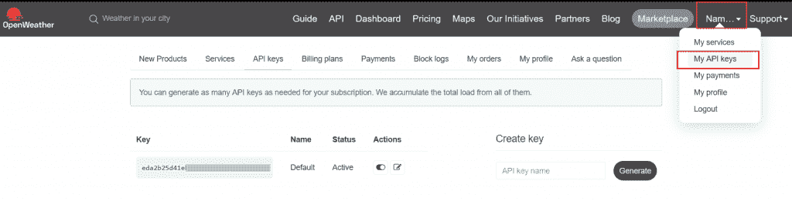
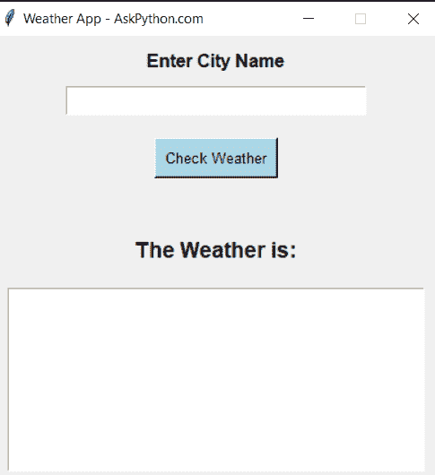

# Python | Tkinter–GUI 中的天气应用程序

> 原文：<https://www.askpython.com/python/examples/gui-weather-app-in-python>

在本教程中，您将了解如何用 Python 创建 GUI 天气应用程序。它使用开放的天气地图 API 来获取全球城市和地方的最新天气信息。此外，我们将使用 GUI(图形用户界面)而不是传统的枯燥方式来实现天气应用程序，这种方式广泛可用，在 CLI(命令行界面)中显示输出。

## Python 中天气应用程序的代码–GUI

事不宜迟，让我们直接进入用 Python 创建 GUI 天气应用程序的代码设置

### 1.安装并导入 Tkinter

我们从使用 [pip 包管理器](https://www.askpython.com/python-modules/python-pip)安装所需的库开始。在命令行或终端中输入以下命令来安装模块。

我们需要安装:

*   [请求](https://www.askpython.com/python-modules/requests-in-python):从 API 获取数据
*   使我们的天气应用程序 GUI(图形用户界面)基于。
*   [DateTime](https://www.askpython.com/python-modules/python-datetime-module) :将时间从 API 转换为不同的格式

```py
pip install tkinter
pip install datetime
pip install requests
pip install json

```

在从终端安装了所需的库之后，我们现在转移到 Python 文件来编码。我们首先将库导入为:

```py
from tkinter import *
import requests
import json
from datetime import datetime

```

### 2.初始化 Tkinter 窗口

下一步，我们使用 Tkinter 模块初始化 GUI 窗口。

```py
#Initialize Window

root =Tk()
root.geometry("400x400") #size of the window by default
root.resizable(0,0) #to make the window size fixed
#title of our window
root.title("Weather App - AskPython.com")

```

### 3\. OpenWeatherMap API

在我们的代码中，我们将使用开放的天气 API(免费层)来获取准确的最新天气信息。

*   为此，请访问 [OpenWeatherMap](https://openweathermap.org/) 网站，然后**创建**一个账户。
*   创建您的帐户后，转到个人资料，然后“**我的 API 密钥**”。
*   这将为您的 API **键**打开一个网页，如下图所示，复制它以便在下一步的代码中使用。



Open Weather Map API

### 4.天气功能

接下来，我们将向代码中添加功能。这一部分对于获取正确的天气信息至关重要，因为这涉及到从 API 获取数据并以准确的格式显示出来。

我们编写了这个代码的最重要的功能，它用于显示天气，我们在代码中这样做:

```py
city_value = StringVar()

def showWeather():

#Enter you api key, copies from the OpenWeatherMap dashboard
    api_key = "eda2b2s6d#sd65f4de7c4b8"  #sample API

    # Get city name from user from the input field (later in the code)
    city_name=city_value.get()

    # API url
    weather_url = 'http://api.openweathermap.org/data/2.5/weather?q=' + city_name + '&appid='+api_key

    # Get the response from fetched url
    response = requests.get(weather_url)

    # changing response from json to python readable 
    weather_info = response.json()

    tfield.delete("1.0", "end")   #to clear the text field for every new output

#as per API documentation, if the cod is 200, it means that weather data was successfully fetched

    if weather_info['cod'] == 200:
        kelvin = 273 # value of kelvin

#-----------Storing the fetched values of weather of a city

        temp = int(weather_info['main']['temp'] - kelvin)                                     #converting default kelvin value to Celcius
        feels_like_temp = int(weather_info['main']['feels_like'] - kelvin)
        pressure = weather_info['main']['pressure']
        humidity = weather_info['main']['humidity']
        wind_speed = weather_info['wind']['speed'] * 3.6
        sunrise = weather_info['sys']['sunrise']
        sunset = weather_info['sys']['sunset']
        timezone = weather_info['timezone']
        cloudy = weather_info['clouds']['all']
        description = weather_info['weather'][0]['description']

        sunrise_time = time_format_for_location(sunrise + timezone)
        sunset_time = time_format_for_location(sunset + timezone)

#assigning Values to our weather varaible, to display as output

        weather = f"\nWeather of: {city_name}\nTemperature (Celsius): {temp}°\nFeels like in (Celsius): {feels_like_temp}°\nPressure: {pressure} hPa\nHumidity: {humidity}%\nSunrise at {sunrise_time} and Sunset at {sunset_time}\nCloud: {cloudy}%\nInfo: {description}"
    else:
        weather = f"\n\tWeather for '{city_name}' not found!\n\tKindly Enter valid City Name !!"

    tfield.insert(INSERT, weather)   #to insert or send value in our Text Field to display output

```

作为添加功能的最后一步，我们添加了一个函数来改变时间格式，这个函数检查本地时间与 UTC( **世界协调时间**)的对比，在 UTC 中，API 根据我们的位置给出时间格式的输出。《出埃及记》世界协调时呼叫 IST。

```py
def time_format_for_location(utc_with_tz):
    local_time = datetime.utcfromtimestamp(utc_with_tz)
    return local_time.time()

```

### 5.编写 GUI 代码(前端元素)

我们现在开始按照 GUI 对元素进行编码，包括标题、文本、标签、按钮等。

首先，我们将**文本字段**编码为我们想要天气的**城市名称**，并附上标签来表明这一点:

*   我们使用 **[Label](https://www.askpython.com/python-modules/tkinter/tkinter-frame-and-label)** 的方法生成一个文本标签来表示城市名称输入字段的用途。
*   **[录入](https://www.askpython.com/python-modules/tkinter/tkinter-entry-widget)** 方法用于制作一个录入字段，用于输入城市名称，查看其天气情况。
*   textvaraible 小部件用于在名为 city_value 的变量中存储输入的值
*   除了这些小部件，我们还在代码中应用了一些样式，比如字体大小、颜色等等。

```py
city_head= Label(root, text = 'Enter City Name', font = 'Arial 12 bold').pack(pady=10) #to generate label heading

inp_city = Entry(root, textvariable = city_value,  width = 24, font='Arial 14 bold').pack() #entry field

```

我们编写了一个**查看天气按钮**，点击它可以查看用户输入城市的天气:

*   我们给我们的按钮一些样式，以及名称——“检查天气”。我们使用' **command** '小部件，它显示了单击(按键)按钮时将运行什么函数(这里是 **showWeather** 函数),如前一步中编码的那样。

```py
Button(root, command = showWeather, text = "Check Weather", font="Arial 10", bg='lightblue', fg='black', activebackground="teal", padx=5, pady=5 ).pack(pady= 20)

```

添加这些内容后，我们在代码中添加输出元素。显示天气信息的元素。

*   同样，我们在下面的文本框中添加了一个标签作为结果的标题
*   为了显示输出，我们使用了一个**文本字段** ，它在每次按下“检查天气”按钮时获取其值。这个函数用于检查处理后从 API 获取的天气信息，showWeather 函数的输出]

```py
weather_now = Label(root, text = "The Weather is: ", font = 'arial 12 bold').pack(pady=10)

tfield = Text(root, width=46, height=10)
tfield.pack()

```

在执行我们的代码时，Tkinter 显示如下输出:



Weather App Frontend In Python

## Python 中 GUI 天气应用程序的最终代码

```py
from tkinter import *
import requests
import json
from datetime import datetime

#Initialize Window

root =Tk()
root.geometry("400x400") #size of the window by default
root.resizable(0,0) #to make the window size fixed
#title of our window
root.title("Weather App - AskPython.com")

# ----------------------Functions to fetch and display weather info
city_value = StringVar()

def time_format_for_location(utc_with_tz):
    local_time = datetime.utcfromtimestamp(utc_with_tz)
    return local_time.time()

city_value = StringVar()

def showWeather():
    #Enter you api key, copies from the OpenWeatherMap dashboard
    api_key = "eda2b2s6d#sd65f4de7c4b8"  #sample API

    # Get city name from user from the input field (later in the code)
    city_name=city_value.get()

    # API url
    weather_url = 'http://api.openweathermap.org/data/2.5/weather?q=' + city_name + '&appid='+api_key

    # Get the response from fetched url
    response = requests.get(weather_url)

    # changing response from json to python readable 
    weather_info = response.json()

    tfield.delete("1.0", "end")   #to clear the text field for every new output

#as per API documentation, if the cod is 200, it means that weather data was successfully fetched

    if weather_info['cod'] == 200:
        kelvin = 273 # value of kelvin

#-----------Storing the fetched values of weather of a city

        temp = int(weather_info['main']['temp'] - kelvin)                                     #converting default kelvin value to Celcius
        feels_like_temp = int(weather_info['main']['feels_like'] - kelvin)
        pressure = weather_info['main']['pressure']
        humidity = weather_info['main']['humidity']
        wind_speed = weather_info['wind']['speed'] * 3.6
        sunrise = weather_info['sys']['sunrise']
        sunset = weather_info['sys']['sunset']
        timezone = weather_info['timezone']
        cloudy = weather_info['clouds']['all']
        description = weather_info['weather'][0]['description']

        sunrise_time = time_format_for_location(sunrise + timezone)
        sunset_time = time_format_for_location(sunset + timezone)

#assigning Values to our weather varaible, to display as output

        weather = f"\nWeather of: {city_name}\nTemperature (Celsius): {temp}°\nFeels like in (Celsius): {feels_like_temp}°\nPressure: {pressure} hPa\nHumidity: {humidity}%\nSunrise at {sunrise_time} and Sunset at {sunset_time}\nCloud: {cloudy}%\nInfo: {description}"
    else:
        weather = f"\n\tWeather for '{city_name}' not found!\n\tKindly Enter valid City Name !!"

    tfield.insert(INSERT, weather)   #to insert or send value in our Text Field to display output

#------------------------------Frontend part of code - Interface

city_head= Label(root, text = 'Enter City Name', font = 'Arial 12 bold').pack(pady=10) #to generate label heading

inp_city = Entry(root, textvariable = city_value,  width = 24, font='Arial 14 bold').pack()

Button(root, command = showWeather, text = "Check Weather", font="Arial 10", bg='lightblue', fg='black', activebackground="teal", padx=5, pady=5 ).pack(pady= 20)

#to show output

weather_now = Label(root, text = "The Weather is:", font = 'arial 12 bold').pack(pady=10)

tfield = Text(root, width=46, height=10)
tfield.pack()

root.mainloop()

```

基于 GUI 的天气应用程序的输出如下所示:

<https://www.askpython.com/wp-content/uploads/2022/01/Output-for-Weather-app-in-Python.mp4>

## 结论

教程到此为止。希望你已经很好地学习了如何用 Python 制作一个天气应用程序，并通过编写一个基于接口的脚本以及 API 调用(打开天气地图)和 Tkinter 来提高水平。