# 黑客新闻克隆——Django 项目创意

> 原文：<https://www.askpython.com/django/hacker-news-clone-django>

在本教程中，我们将使用 [Django Web 框架](https://www.askpython.com/django)构建一个**完整的 Web 应用**——类似于黑客新闻网站。如果你想创建一个完整的网站，这是一个很好的 Django 项目想法。学习任何框架都没有比自己开发更好的方法了。

## 关于黑客新闻

Hacker News 是一家社交新闻网站，由投资基金和初创企业孵化器 Y-Combinator 运营和管理。该网站主要关注计算机科学和企业家精神。

该网站将自己定义为一个平台，在这里人们可以分享任何“满足自己求知欲”的东西。

看看这里的网站—[黑客新闻](https://news.ycombinator.com/)

我们将制作一个包含网站所有主要功能的 web 应用程序。说够了；现在让我们深入研究一下吧！！

## 该网站的一些有趣的特点

现在我们将看到使用 Django 创建的网站的有趣特性

### 1.顶部导航栏

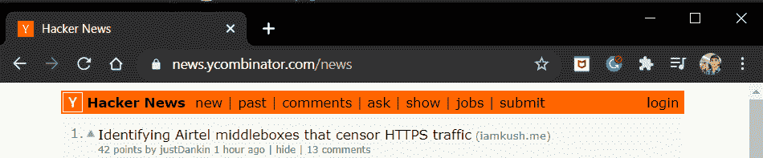

HackerNews NavBar

*   **黑客新闻**按钮带你回到主页。
*   **新**按钮显示所有最新的提交。
*   **过去**按钮显示的是 **30 分钟**之前提交的内容。
*   同样，还有**问、秀、****工作岗位**不那么重要。
*   然后有一个**提交**选项和一个**注销/登录**选项

我们将在我们的应用程序中编码所有这些。

### 2.个人以及职位列表

然后我们有一个显示在主页上的帖子列表。

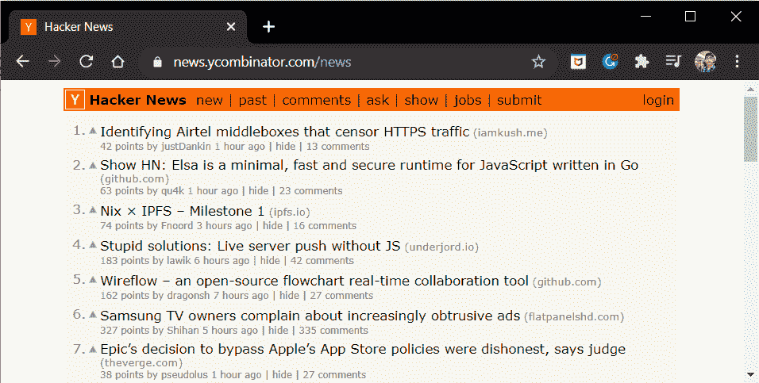

List Of Posts

*   每个帖子都有一个**向上投票**选项来投票
*   每个帖子都显示了对它们的**总投票**和**总评论**
*   显示创建者的**用户名**
*   显示**提交时间**

此外，当您点击评论时，网站会将您重定向到评论页面:

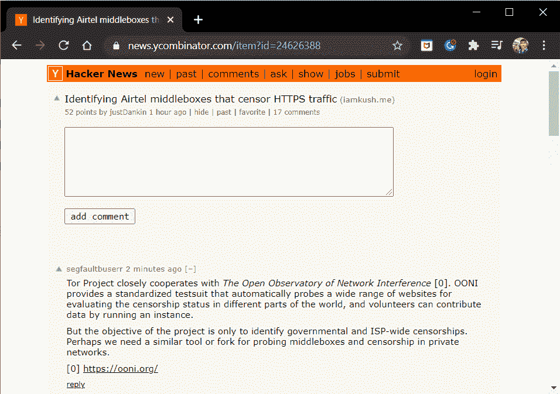

Post

我们可以在这里发表评论，也可以回复别人。

这里一个有趣的特性是形成**线程注释**。

那是我们回复评论的时候；我们的回复应该显示在它的正下方。这并不像听起来那么简单，不要担心，我们将在接下来的章节中讨论这个问题。

### 3.用户认证

一个更重要的特性是用户认证。在网站上，我们只有拥有账号才能**发帖、**评论、**** 或**回复**。

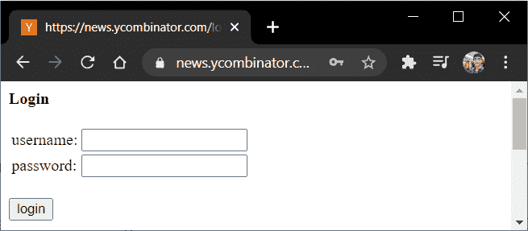

Signin

和注册视图

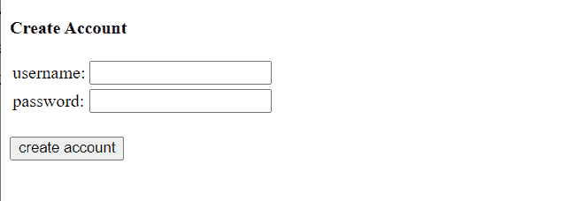

Sign Up

我们将再次在代码中包含这两个视图！！

### 4.提交后视图

该网站有一个提交视图:

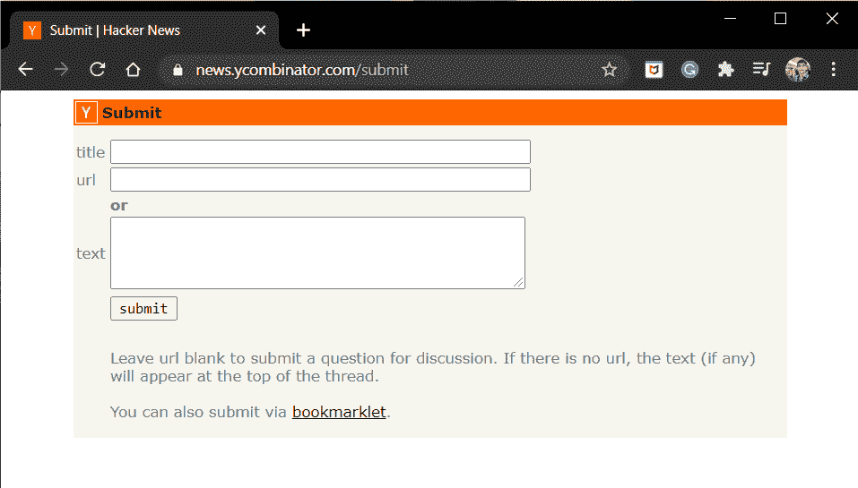

Submit

在这里，我们可以提交帖子的**标题、URL、**和**描述**。就这样了，伙计们！！这是我们必须做的。所以让我们开始吧！！

## 在 Django Web 应用程序中编写黑客新闻克隆

首先，我们必须[创建一个新的 Django 项目](https://www.askpython.com/django/django-app-structure-project-structure)。所以让我们开始吧:

```py
django-admin startproject HackerNews

```

另外，创建 Django 应用程序。我已经把我的名字命名为—**hnapp**。所以代码应该是:

```py
django-admin startapp hnapp

```

很好。不要忘记在 settings.py 文件中添加**应用名称**。此外，我们将使用[模板继承](https://www.askpython.com/django/django-template-inheritance)来编码我们的模板。

在 Django HackerNews 项目目录中创建一个 **templates** 文件夹，并在 settings.py 文件中提到它的路径。

我们通过在 TEMPLATES/settings.py 中添加下面一行来实现

```py
'DIRS': [os.path.join(BASE_DIR,'HackerNews/templates')],

```

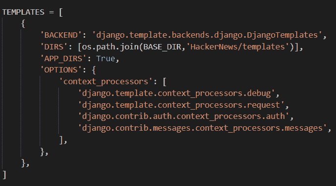

Templates

好的，酷，现在添加**base.html**——我们网站的基本模板，在创建的模板文件夹中:

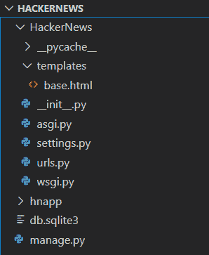

Base

在文件中，添加代码:

```py
<!DOCTYPE html>
<html>
<head>
<meta name="viewport" content="width=device-width, initial-scale=1">
<link rel="stylesheet" href="https://www.w3schools.com/w3css/4/w3.css">
<style>
body {
  margin: 0;
  font-family: Arial, Helvetica, sans-serif;
}

.topnav {
  overflow: hidden;
  background-color: #333;
}

.topnav a {
  float: left;
  color: #f2f2f2;
  text-align: center;
  padding: 14px 16px;
  text-decoration: none;
  font-size: 17px;
}

.topnav a:hover {
  background-color: #ddd;
  color: black;
}

.topnav a.active {
  background-color:	#FF0000;
  color: white;
}

.topnav-right {
  float: right;
}

p.ex1 {
  padding-left: 40px;
}

</style>
</head>
<body>
    
    
</body>
</html>

```

这段代码是为了我们的 web 应用程序的美观。我已经尝试添加 CSS，使它看起来比默认布局更好。

同样在**项目/urls.py** 中添加一行:

```py
from django.contrib import admin
from django.urls import path,include
urlpatterns = [
    path('admin/', admin.site.urls),
    path('',include('hnapp.urls')),
]

```

有了这些，现在让我们开始真正的姜戈部分。

## 1.编码所需的模型

对于网站，我们需要 **:**

*   **岗位模型**:存储岗位信息
*   **投票模型**:存储每个帖子的 Upvotes
*   **评论模型**:存储每篇文章的评论。

以及预先构建的**用户模型**来存储用户账户信息。所以在 **models.py** 中添加了以下型号:

**岗位型号:**

```py
class Post(models.Model):
    title = models.CharField("HeadLine", max_length=256, unique=True)
    creator = models.ForeignKey(User, on_delete= models.SET_NULL, null=True)
    created_on = models.DateTimeField(auto_now_add=True)
    url = models.URLField("URL", max_length=256,blank=True)
    description = models.TextField("Description", blank=True)
    votes = models.IntegerField(null=True)
    comments = models.IntegerField(null=True)    

    def __unicode__(self):
        return self.title

    def count_votes(self):
        self.votes = Vote.objects.filter(post = self).count()

    def count_comments(self):
        self.comments = Comment.objects.filter(post = self).count()

```

这里，我们有两个函数来统计每个帖子的总投票数和总评论数。**注意**当创建者删除他的账户时，帖子不应该被删除，因此设置 **on_delete** 到 **models。SET_NULL。**

**投票模式:**

```py
class Vote(models.Model):
    voter = models.ForeignKey(User, on_delete=models.CASCADE)
    post = models.ForeignKey(Post, on_delete=models.CASCADE)

    def __unicode__(self):
        return f"{self.user.username} upvoted {self.link.title}" 

```

这个模型将存储关于哪个**用户**投票赞成哪个**帖子**的信息。

**和最终评论模式:**

```py
class Comment(models.Model):
    creator = models.ForeignKey(User, on_delete=models.SET_NULL, null=True)
    post = models.ForeignKey(Post, on_delete=models.CASCADE)
    content = models.TextField()
    identifier = models.IntegerField()
    parent = models.ForeignKey('self', on_delete=models.SET_NULL, null=True)

    def __unicode__(self):
        return f"Comment by {self.user.username}"

```

每个评论都会有一个**创建者**，创建者评论的**帖子**，以及**评论内容**本身。

现在，每个**回复评论**也将有一个父评论，即回复所针对的评论。因此我们需要一个父字段，它是**评论模型**本身的外键

我们还需要另一个字段，一个**标识符字段，**来标识不同级别的回复评论。为了理解这一点，考虑下面的图像:

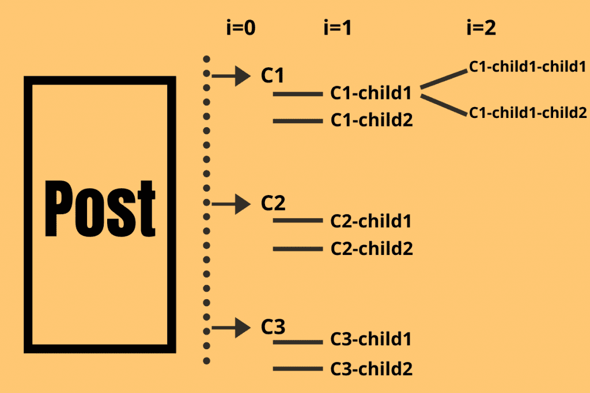

Comment Threads

因此，

*   对帖子本身的评论将有**标识符= 0 和 parent = None** ，因为它们是最上面的评论。
*   第一级的回复评论将具有**标识符= 1** ，并且给予回复的评论作为**父评论(标识符=0)**
*   类似地，第二层上的回复评论将具有标识符= 2 的**标识符和标识符= 1 的**父评论。****

我们将在后面看到，我们将如何使用这两个字段以线程方式显示注释。

这就是模型，现在使用**admin . site . register(model _ name)**行在 **admin.py** 中注册三个模型。

另外，不要忘记使用以下代码运行迁移:

```py
python manage.py migrate
python manage.py makemigrations
python manage.py migrate

```

## 2.为视图和相应的模板编码

有了[模型](https://www.askpython.com/django/django-models)之后，现在让我们对[视图](https://www.askpython.com/django/django-views)进行编码。现在，对于完整的网站，我们需要以下视图:

1.  **首页视图:**显示帖子列表
2.  **新帖子视图:**显示所有最新的帖子
3.  **过去的帖子视图:**显示 30 分钟或以上的帖子
4.  **单篇帖子视图:**显示评论表单和已有评论
5.  **回复-评论视图:**显示已有评论的回复表单
6.  **用户信息视图:**显示用户信息
7.  **用户**帖子**视图:**显示特定用户的帖子
8.  **提交视图:**显示提交表单
9.  **编辑视图:**编辑提交的表单
10.  **签到视图:**显示签到页面
11.  **注册视图:**显示注册页面
12.  **注销视图**:注销用户

除此之外，我们还需要**两个**视图来处理帖子的**向上投票**和**向下投票**。

哇很多的观点！！所以让我们开始吧，不要浪费太多时间。

### 1.主页视图

所以在 **Views.py** 中，添加了 **PostListView** (主页)功能视图:

```py
def PostListView(request):
    posts = Post.objects.all()
    for post in posts:
        post.count_votes()
        post.count_comments()

    context = {
        'posts': posts,
    }
    return render(request,'postlist.html',context)

```

对于每一篇帖子，我们在将它们显示在网页上之前都会计算总投票数和评论数。

**urls.py** 中的 url 端点:

```py
path('',PostListView, name='home'),

```

将**postlist.html**模板添加到 **Django App** 文件夹本身的**模板**文件夹中。

```py



<div class="topnav">
  <a class="active" href="">Hacker News</a>
  <a href="">New</a>
  <a href="">Past</a>
  <a href="">Submit</a>

  
    <div class="topnav-right">
      <a href="">Sign Out </a>
    </div>
  
    <div class="topnav-right">
      <a href="">Sign In </a>
    </div>
  
</div>

<div class="w3-panel w3-light-grey w3-leftbar w3-border-grey">
  <ol>


  <li><p><a href = "{{post.url}}"><strong>{{post.title}}</strong></a> - <a href = "">Upvote</a> - <a href = "">Downvote</a></p>

  
    <p>{{post.votes}} votes | Created {{post.created_on}}| <a href = "">{{post.creator.username}}</a> | <a href=""> {{post.comments}} Comments</a> | <a href=""> Edit</a></p></li>
  
    <p>{{post.votes}} votes | Created {{post.created_on}}| <a href = "">{{post.creator.username}}</a> | <a href=""> {{post.comments}} Comments</a></p></li>
  


</ol>
</div>



```

这里，如果用户已经登录，我们将在导航栏中显示**注销**，如果用户没有登录，则显示登录。

对于每个帖子，我们将显示**帖子的标题、创建者、创建日期和时间、总投票数和评论。**

此外，如果帖子的创建者是用户本身，那么我们也将显示一个**编辑**选项。

### 2.新帖子和旧帖子视图

新视图将首先显示所有最新的帖子。所以这样做的代码应该是:

```py
def NewPostListView(request):
    posts = Post.objects.all().order_by('-created_on')
    for post in posts:
        post.count_votes()
        post.count_comments()    
    context = {
        'posts': posts,
    }
    return render(request,'hnapp/postlist.html', context)

```

类似地，为了显示 30 分钟或更早之前创建的帖子，我们使用 Python 的 **[DateTime](https://www.askpython.com/python-modules/python-datetime-module)** 库。因此，代码应该是:

```py
from datetime import datetime,timedelta
from django.utils import timezone

def PastPostListView(request):
    time = str((datetime.now(tz=timezone.utc) - timedelta(minutes=30)))
    posts = Post.objects.filter(created_on__lte = time)
    for post in posts:
        post.count_votes()
        post.count_comments()

    context={
        'posts': posts,
    }
    return render(request,'hnapp/postlist.html',context)

```

这里的 **__lte** 函数代表小于或等于的**。因此，它会过滤掉 created_on 时间小于半小时前的所有帖子。**

视图的 url 端点:

```py
path('new',NewPostListView, name='new_home'),
path('past',PastPostListView, name='past_home'),

```

这两个模板将与**主页**视图相同。

### 3.用户信息和用户帖子视图

当客户点击**帖子的创建者**的名字时，他应该到达用户信息页面。

用户信息页面应该显示**用户名，创建日期，**和一个**链接**到一个显示用户帖子的页面。

因此，让我们在这里对用户信息和用户帖子视图进行编码:

```py
def UserInfoView(request,username):
    user = User.objects.get(username=username)
    context = {'user':user,}
    return render(request,'user_info.html',context)

def UserSubmissions(request,username):
    user = User.objects.get(username=username)
    posts = Post.objects.filter(creator = user)
    for post in posts:
        post.count_votes()
        post.count_comments()    
    return render(request,'user_posts.html',{'posts': posts})

```

在 UserSubmissions 视图中，在显示帖子之前，我们使用循环的[计算总投票和评论。](https://www.askpython.com/python/python-for-loop)

视图的 URL 端点是:

```py
path('user/<username>', UserInfoView, name='user_info'),
path('posts/<username>',UserSubmissions, name='user_posts'),

```

相应的模板将是:

**用户信息 html:**

```py



<div class="topnav">
  <a class="active" href="">Hacker News</a>
  <a href="">New</a>
  <a href="">Past</a>
  <a href="">Submit</a>

  
    <div class="topnav-right">
      <a href="">Sign Out </a>
    </div>
  
    <div class="topnav-right">
      <a href="">Sign In </a>
    </div>
  
</div>

<div class="w3-panel w3-light-grey w3-leftbar w3-border-grey">
<p><strong>User: </strong>{{user.username}}</p>
<p><strong>Created: </strong>{{user.date_joined}}</p>
</div>

<a href="">Submissions</a>



```

**user_post.html:**

```py



<div class="topnav">
  <a class="active" href="">Hacker News</a>
  <a href="">New</a>
  <a href="">Past</a>
  <a href="">Submit</a>

  
    <div class="topnav-right">
      <a href="">Sign Out </a>
    </div>
  
    <div class="topnav-right">
      <a href="">Sign In </a>
    </div>
  
</div>

<ol>

  <div class="w3-panel w3-light-grey w3-leftbar w3-border-grey">
  <li><p><a href = "{{post.url}}">{{post.title}}</a></p>
  <p>{{post.votes}} | Created {{post.created_on}}| <a href = "">{{post.creator.username}}</a> | <a href=""> {{post.comments}} Comments</a></p></li>
</div>

</ol>


```

### 4.提交和编辑视图

好了，现在，让我们编写**提交视图**和**编辑视图**的代码。如果用户已经登录，提交页面应该显示一个提交表单。

编辑页面也会做同样的工作，但是它会更新一个现有的帖子，而不是创建一个新的。

所以两个函数视图将是:

```py
from datetime import datetime

def SubmitPostView(request):
    if request.user.is_authenticated:
        form = PostForm()

        if request.method == "POST":
            form = PostForm(request.POST)

            if form.is_valid():
                title = form.cleaned_data['title']
                url = form.cleaned_data['url']
                description = form.cleaned_data['description']
                creator = request.user
                created_on = datetime.now()

                post = Post(title=title, url=url, description=description, creator = creator, created_on=created_on)
                post.save()
                return redirect('/')
        return render(request,'submit.html',{'form':form})
    return redirect('/signin')

def EditPostView(request,id):
    post = get_object_or_404(Post,id=id)
    if request.method =='POST':
        form = PostForm(request.POST, instance=post)
        if form.is_valid():
            form.save()
            return redirect('/')

    form = PostForm(instance =post)
    return render(request,'submit.html',{'form':form})

```

在 SubmitPostView 中，我们创建了一个全新的 Post 对象，而在 EditPostView 中，我们只是更新了现有的对象。

这两个视图的 URL 端点是:

```py
path('submit',SubmitPostView, name='submit'),
path('edit/<int:id>',EditListView, name='edit')

```

还要在 **forms.py** 文件中添加 PostForm:

```py
from django import forms
from .models import Comment,Post

class PostForm(forms.ModelForm):
    class Meta:
        model = Post
        fields = ('title','url','description')

```

此外，它们的模板是相同的，因为两者都显示相同的表单

因此， **submit.html:**

```py



<div class="topnav">
    <a class="active" href="">Hacker News</a>
    
      <div class="topnav-right">
        <a href="">Sign Out </a>
      </div>
        
      <div class="topnav-right">
        <a href="">Sign In</a>
      </div>
    
</div>

<div class="w3-panel w3-light-grey w3-leftbar w3-border-grey">
<form method ='post'>
    
    {{form.as_p}}
    <input type="submit" value = "Submit">
</form>
</div>


```

### 5.注册、登录和注销视图

这里我们将使用**[django . contrib . auth](https://www.askpython.com/django/django-user-authentication)**库来认证、登录和注销用户。

此外，我们将使用内置的 Django 用户模型，AuthenticationForm，和**用户创建表单。**

所以观点会是:

```py
from django.contrib.auth import authenticate,login,logout
from django.contrib.auth.forms import AuthenticationForm,UserCreationForm

def signup(request):
    if request.user.is_authenticated:
        return redirect('/')

    if request.method == 'POST':
        form = UserCreationForm(request.POST)

        if form.is_valid():
            form.save()
            username = form.cleaned_data['username']
            password = form.cleaned_data['password1']
            user = authenticate(username = username,password = password)
            login(request, user)
            return redirect('/')

        else:
            return render(request,'auth_signup.html',{'form':form})

    else:
        form = UserCreationForm()
        return render(request,'auth_signup.html',{'form':form})

def signin(request):
    if request.user.is_authenticated:
        return redirect('/')

    if request.method == 'POST':
        username = request.POST['username']
        password = request.POST['password']
        user = authenticate(request, username =username, password = password)

        if user is not None:
            login(request,user)
            return redirect('/')
        else:
            form = AuthenticationForm()
            return render(request,'auth_signin.html',{'form':form})

    else:
        form = AuthenticationForm()
        return render(request, 'auth_signin.html', {'form':form})

def signout(request):
    logout(request)
    return redirect('/')

```

**视图的 URL 端点:**

```py
path('signin',signin, name='signin'),
path('signup',signup, name='signup'),
path('signout',signout, name='signout'),

```

**auth_signup.html** 和 **auth_signin.html** 都将显示表单以获取用户凭证。

因此， **auth_signup.html** 将是:

```py



<div class="topnav">
  <a class="active" href="">Hacker News</a>
  <a href="">New</a>
  <a href="">Past</a>
  <a href="">Submit</a>
</div>

<form method ='post'>
    
    {{form.as_p}}
    <input type="submit" value = "Submit">
</form>
<br>

<h3>Already Have an Account??</h3>
<a href = "">Sign In Here</a>



```

以及 **auth_signin.html**

```py



<div class="topnav">
  <a class="active" href="">Hacker News</a>
  <a href="">New</a>
  <a href="">Past</a>
  <a href="">Submit</a>
</div>

<form method ='post'>
    
    {{form.as_p}}
    <input type="submit" value = "Submit">
</form>
<br>
<h3>Dont have an account??</h3>
<a href = "">SignUp Here</a>



```

### 6.向上投票和向下投票逻辑编码

每当用户点击 **Upvote** 按钮，该帖子的投票数就会增加**一个**，反之亦然 **Downvote** 。

另外，**注意**一个用户**不能在一个特定的帖子上投赞成票/反对票超过一次**。所以现在让我们为向上投票和向下投票的视图编码

```py
def UpVoteView(request,id):
    if request.user.is_authenticated:
        post = Post.objects.get(id=id)
        votes = Vote.objects.filter(post = post)
        v = votes.filter(voter = request.user)
        if len(v) == 0:
            upvote = Vote(voter=request.user,post=post)
            upvote.save()
            return redirect('/')
    return redirect('/signin')

def DownVoteView(request,id):
    if request.user.is_authenticated:
        post = Post.objects.get(id=id)
        votes = Vote.objects.filter(post = post)
        v = votes.filter(voter = request.user)
        if len(v) != 0:
            v.delete()
            return redirect('/')
    return redirect('/signin')    

```

这里的逻辑很简单:

*   **UpVoteView:** 如果对于一个**特定帖子**，一个特定用户的投票数**等于零**，那么在投票模型中创建并保存该用户的一个新的 upvote。
*   **DownVoteView:** 如果对于**某个帖子**，某个特定用户的投票数**不等于，即大于零**，则从投票模型中删除该用户的 upvote

两者的 URL 端点:

```py
path('vote/<int:id>',UpVoteView,name='vote'),
path('downvote/<int:id>',DownVoteView,name='dvote'),

```

不错！！

### 7.对评论页面视图编码

现在是项目最激动人心的部分。评论视图应该显示**评论表单**。此外，它应该显示评论和相应的回复在**正确的线程顺序**。

也就是说，评论应该只按下面的顺序显示: **C1** 然后**C1-孩子**然后**C1-孩子的孩子**，然后 **C2，C2-孩子，**等等。

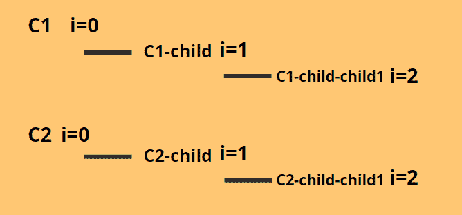

Thread Sequence

为此，我们将使用一个递归函数，将**标识符**和**父实例作为参数**。因此对于特定的帖子= **帖子**。

递归函数如下所示:

```py
def func(i,parent):
    children = Comment.objects.filter(post =post).filter(identifier =i).filter(parent=parent)
    for child in children:
        gchildren = Comment.objects.filter(post =post).filter(identifier = i+1).filter(parent=child)

        if len(gchildren)==0:
            comments.append(child)
        else:
            func(i+1,child)
            comments.append(child)

```

我们首先获取所有孩子对某个特定家长评论的评论。然后我们发现每个子实例有多少个子实例。

如果**孩子**没有任何孙辈(gchild)，即。这是该父评论的最底部回复。因此，我们将**子节点**保存到一个空列表中。

如果**孩子**有“**孩子，”**，那么我们再次使用函数，将**孩子**作为父参数。我们这样做，直到我们到达线程的底部。到达那里后，我们将注释实例添加到列表中。

因此，每个线程将以相反的顺序添加到列表中，首先保存最底部的线程注释，最后保存最顶部的。

但是，我们需要以正确的顺序显示评论线程，评论(标识符=0)在上面，后续的回复在下面。所以在显示它们之前，我们使用 Python 列表的 **reversed(list)** 属性。

因此，完整的**注释视图**将是:

```py
def CommentListView(request,id):
    form = CommentForm()
    post = Post.objects.get(id =id)
    post.count_votes()
    post.count_comments()

    comments = []    
    def func(i,parent):
        children = Comment.objects.filter(post =post).filter(identifier =i).filter(parent=parent)
        for child in children:
            gchildren = Comment.objects.filter(post =post).filter(identifier = i+1).filter(parent=child)
            if len(gchildren)==0:
                comments.append(child)
            else:
                func(i+1,child)
                comments.append(child)
    func(0,None)

    if request.method == "POST":
        if request.user.is_authenticated:
            form = CommentForm(request.POST)
            if form.is_valid():
                content = form.cleaned_data['content']
                comment = Comment(creator = request.user,post = post,content = content,identifier =0)
                comment.save()
                return redirect(f'/post/{id}')
        return redirect('/signin')

    context ={
        'form': form,
        'post': post,
        'comments': list(reversed(comments)),
    }
    return render(request,'commentpost.html', context)

```

我们调用 **func(0，None)** 因为我们想要完整的注释线程。

视图的 URL 端点:

```py
path('post/<int:id>',CommentListView, name='post')

```

我们还需要一个评论表来提交评论。因此在 **forms.py** 中，添加 CommentForm:

```py
class CommentForm(forms.ModelForm):
    class Meta:
        model = Comment
        fields = ('content',)

```

并且**commentpost.html**应该显示表单和线程注释。

So **commentpost.html:**

```py



<div class="topnav">
  <a class="active" href="">Hacker News</a>
  <a href="">New</a>
  <a href="">Past</a>
  <a href="">Submit</a>

  
    <div class="topnav-right">
      <a href="">Sign Out </a>
    </div>
  
    <div class="topnav-right">
      <a href="">Sign In </a>
    </div>
  
</div>

<div class="w3-panel w3-light-grey w3-leftbar w3-border-grey">
<p><a href = "{{post.url}}"><strong>Title: {{post.title}}</strong></a></p>

<p>{{post.votes}} votes | Created {{post.created_on}}| <a href = "">{{post.creator.username}}</a> | {{post.comments}} Comments | <a href=""> Edit</a></p>

<p>{{post.votes}} votes | Created {{post.created_on}}| <a href = "">{{post.creator.username}}</a> | {{post.comments}} Comments</p>

<p><strong>Description: </strong>{{post.description}}</p>

<form method ='post'>
    
    {{form.as_p}}
    <input type="submit" value = "Submit">
</form>
<br>
</div>



<div class="w3-panel w3-orange w3-leftbar w3-border-red">
<p class="ex1" style="font-family:helvetica;" style="color:black"><a href = "">Comment by: {{comment.creator.username}}</a> | Thread Level: {{comment.identifier}}</p>
<p class="ex1" style="font-family:helvetica;" style="color:black"><strong>{{comment.content}}</strong></p>
<p class="ex1" style="font-family:helvetica;" style="color:black"><a href = "">reply</a></p>
</div>

<div class="w3-panel w3-red w3-leftbar w3-border-orange">
<p style="font-family:helvetica;" style="color:black"><a href = "">Comment by: {{comment.creator.username}}</a> | Thread Level: {{comment.identifier}}</p>
<p style="font-family:helvetica;" style="color:black"><strong>{{comment.content}}</strong></p>
<p style="font-family:helvetica;" style="color:black"><a href = "">reply</a></p>
</div>



```

### 8.编写回复评论视图的代码

现在，当我们点击评论下面的回复按钮时，我们应该得到一个**表单**来提交我们的回复。

因此**注释视图**将为:

```py
def CommentReplyView(request,id1,id2):
    form = CommentForm()
    comment = Comment.objects.get(id = id2)
    post = Post.objects.get(id=id1)

    if request.method == "POST":
        if request.user.is_authenticated:
            form = CommentForm(request.POST)

            if form.is_valid():
                reply_comment_content = form.cleaned_data['content']
                identifier = int(comment.identifier + 1)

                reply_comment = Comment(creator = request.user, post = post, content = reply_comment_content, parent=comment, identifier= identifier)
                reply_comment.save()

                return redirect(f'/post/{id1}')
        return redirect('/signin')

    context ={
        'form': form,
        'post': post,
        'comment': comment,
    }
    return render(request,'reply_post.html', context)

```

回复评论将有一个**父实例**，不像普通的帖子评论有**父实例=无**。

视图的 URL 端点:

```py
path('post/<int:id1>/comment/<int:id2>',CommentReplyView,name='reply'),

```

**reply_post.html** 应该显示父评论实例和回复表单。

因此，模板 **reply_post.html** 将是:

```py



<div class="topnav">
  <a class="active" href="">Hacker News</a>
  <a href="">New</a>
  <a href="">Past</a>
  <a href="">Submit</a>

  
    <div class="topnav-right">
      <a href="">Sign Out </a>
    </div>
  
    <div class="topnav-right">
      <a href="">Sign In </a>
    </div>
  
</div>

<div class="w3-panel w3-light-grey w3-leftbar w3-border-grey">
<p> <h5><a href = "">{{comment.creator.username}}</a> | On : <a href = "">{{post.title}}</a></h5></p>
<p>{{comment.content}}</p>

<form method ='post'>
    
    {{form.as_p}}
    <input type="submit" value = "Submit">
</form>
</div>


```

太好了！！就这样伙计们！！

## Django 项目的最终代码

**整个项目可以在我的 [Github 简介](https://github.com/nishant-gudipaty/Hacker-News-Clone)中找到**。请随意在您的系统中克隆存储库，并使用代码。为了您的方便，我也贴出了下面每个文件的完整代码。

### 1.Models.py

```py
from django.db import models
from django.contrib.auth.models import User
# Create your models here.

class Post(models.Model):
    title = models.CharField("HeadLine", max_length=256, unique=True)
    creator = models.ForeignKey(User, on_delete= models.SET_NULL, null=True)
    created_on = models.DateTimeField(auto_now_add=True)
    url = models.URLField("URL", max_length=256,blank=True)
    description = models.TextField("Description", blank=True)
    votes = models.IntegerField(null=True)
    comments = models.IntegerField(null=True)    

    def __unicode__(self):
        return self.title

    def count_votes(self):
        self.votes = Vote.objects.filter(post = self).count()

    def count_comments(self):
        self.comments = Comment.objects.filter(post = self).count()

class Vote(models.Model):
    voter = models.ForeignKey(User, on_delete=models.CASCADE)
    post = models.ForeignKey(Post, on_delete=models.CASCADE)

    def __unicode__(self):
        return f"{self.user.username} upvoted {self.link.title}" 

class Comment(models.Model):
    creator = models.ForeignKey(User, on_delete=models.SET_NULL, null=True)
    post = models.ForeignKey(Post, on_delete=models.CASCADE)
    content = models.TextField()
    identifier = models.IntegerField()
    parent = models.ForeignKey('self', on_delete=models.SET_NULL, null=True)

    def __unicode__(self):
        return f"Comment by {self.user.username}"

```

### 2.Views.py

```py
from django.shortcuts import render,redirect,get_object_or_404
from django.views.generic import ListView
from .models import Post,Vote,Comment
from .forms import CommentForm,PostForm

from django.contrib.auth.models import User
from django.contrib.auth import authenticate,login,logout
from django.contrib.auth.forms import AuthenticationForm,UserCreationForm

from datetime import datetime,timedelta
from django.utils import timezone

from django.contrib.auth import authenticate,login,logout
from django.contrib.auth.forms import AuthenticationForm,UserCreationForm
# Create your views here.

def PostListView(request):
    posts = Post.objects.all()
    for post in posts:
        post.count_votes()
        post.count_comments()

    context = {
        'posts': posts,
    }
    return render(request,'hnapp/postlist.html',context)

def NewPostListView(request):
    posts = Post.objects.all().order_by('-created_on')
    for post in posts:
        post.count_votes()
        post.count_comments()    
    context = {
        'posts': posts,
    }
    return render(request,'hnapp/postlist.html', context)

def PastPostListView(request):
    time = str((datetime.now(tz=timezone.utc) - timedelta(minutes=30)))
    posts = Post.objects.filter(created_on__lte = time)
    for post in posts:
        post.count_votes()
        post.count_comments()

    context={
        'posts': posts,
    }
    return render(request,'hnapp/postlist.html',context)

def UpVoteView(request,id):
    if request.user.is_authenticated:
        post = Post.objects.get(id=id)
        votes = Vote.objects.filter(post = post)
        v = votes.filter(voter = request.user)
        if len(v) == 0:
            upvote = Vote(voter=request.user,post=post)
            upvote.save()
            return redirect('/')
    return redirect('/signin')

def DownVoteView(request,id):
    if request.user.is_authenticated:
        post = Post.objects.get(id=id)
        votes = Vote.objects.filter(post = post)
        v = votes.filter(voter = request.user)
        if len(v) != 0:
            v.delete()
            return redirect('/')
    return redirect('/signin')    

def UserInfoView(request,username):
    user = User.objects.get(username=username)
    context = {'user':user,}
    return render(request,'hnapp/userinfo.html',context)

def UserSubmissions(request,username):
    user = User.objects.get(username=username)
    posts = Post.objects.filter(creator = user)
    print(len(posts))
    for post in posts:
        post.count_votes()
        post.count_comments()    
    return render(request,'hnapp/user_posts.html',{'posts': posts})

def EditListView(request,id):
    post = get_object_or_404(Post,id=id)
    if request.method =='POST':
        form = PostForm(request.POST, instance=post)
        if form.is_valid():
            form.save()
            return redirect('/')

    form = PostForm(instance =post)
    return render(request,'hnapp/submit.html',{'form':form})

def CommentListView(request,id):
    form = CommentForm()
    post = Post.objects.get(id =id)
    post.count_votes()
    post.count_comments()

    comments = []    
    def func(i,parent):
        children = Comment.objects.filter(post =post).filter(identifier =i).filter(parent=parent)
        for child in children:
            gchildren = Comment.objects.filter(post =post).filter(identifier = i+1).filter(parent=child)
            if len(gchildren)==0:
                comments.append(child)
            else:
                func(i+1,child)
                comments.append(child)
    func(0,None)

    if request.method == "POST":
        if request.user.is_authenticated:
            form = CommentForm(request.POST)
            if form.is_valid():
                content = form.cleaned_data['content']
                comment = Comment(creator = request.user,post = post,content = content,identifier =0)
                comment.save()
                return redirect(f'/post/{id}')
        return redirect('/signin')

    context ={
        'form': form,
        'post': post,
        'comments': list(reversed(comments)),
    }
    return render(request,'hnapp/post.html', context)

def CommentReplyView(request,id1,id2):
    form = CommentForm()
    comment = Comment.objects.get(id = id2)
    post = Post.objects.get(id=id1)

    if request.method == "POST":
        if request.user.is_authenticated:
            form = CommentForm(request.POST)

            if form.is_valid():
                reply_comment_content = form.cleaned_data['content']
                identifier = int(comment.identifier + 1)

                reply_comment = Comment(creator = request.user, post = post, content = reply_comment_content, parent=comment, identifier= identifier)
                reply_comment.save()

                return redirect(f'/post/{id1}')
        return redirect('/signin')

    context ={
        'form': form,
        'post': post,
        'comment': comment,
    }
    return render(request,'hnapp/reply_post.html', context)

def SubmitPostView(request):
    if request.user.is_authenticated:
        form = PostForm()

        if request.method == "POST":
            form = PostForm(request.POST)

            if form.is_valid():
                title = form.cleaned_data['title']
                url = form.cleaned_data['url']
                description = form.cleaned_data['description']
                creator = request.user
                created_on = datetime.now()

                post = Post(title=title, url=url, description=description, creator = creator, created_on=created_on)

                post.save()
                return redirect('/')
        return render(request,'hnapp/submit.html',{'form':form})
    return redirect('/signin')

def signup(request):

    if request.user.is_authenticated:
        return redirect('/')

    if request.method == 'POST':
        form = UserCreationForm(request.POST)

        if form.is_valid():
            form.save()
            username = form.cleaned_data['username']
            password = form.cleaned_data['password1']
            user = authenticate(username = username,password = password)
            login(request, user)
            return redirect('/')

        else:
            return render(request,'hnapp/auth_signup.html',{'form':form})

    else:
        form = UserCreationForm()
        return render(request,'hnapp/auth_signup.html',{'form':form})

def signin(request):
    if request.user.is_authenticated:
        return redirect('/')

    if request.method == 'POST':
        username = request.POST['username']
        password = request.POST['password']
        user = authenticate(request, username =username, password = password)

        if user is not None:
            login(request,user)
            return redirect('/')
        else:
            form = AuthenticationForm()
            return render(request,'hnapp/auth_signin.html',{'form':form})

    else:
        form = AuthenticationForm()
        return render(request, 'hnapp/auth_signin.html', {'form':form})

def signout(request):
    logout(request)
    return redirect('/')

```

### 3\. Urls.py

```py
from django.contrib import admin
from django.urls import path
from .views import *

urlpatterns = [
    path('',PostListView, name='home'),
    path('new',NewPostListView, name='new_home'),
    path('past',PastPostListView, name='past_home'),
    path('user/<username>', UserInfoView, name='user_info'),
    path('posts/<username>',UserSubmissions, name='user_posts'),
    path('post/<int:id>',CommentListView, name='post'),
    path('submit',SubmitPostView, name='submit'),
    path('signin',signin, name='signin'),
    path('signup',signup, name='signup'),
    path('signout',signout, name='signout'),
    path('vote/<int:id>',UpVoteView,name='vote'),
    path('downvote/<int:id>',DownVoteView,name='dvote'),
    path('edit/<int:id>',EditListView, name='edit'),
    path('post/<int:id1>/comment/<int:id2>',CommentReplyView,name='reply'),
]

```

### 4.Forms.py

```py
from django import forms
from .models import Comment,Post

class CommentForm(forms.ModelForm):
    class Meta:
        model = Comment
        fields = ('content',)

class PostForm(forms.ModelForm):
    class Meta:
        model = Post
        fields = ('title','url','description')

```

### 6\. Admin.py

```py
from django.contrib import admin
from .models import *

# Register your models here.
admin.site.register(Post)
admin.site.register(Vote)
admin.site.register(Comment)
#admin.site.register(UserInfo)

```

## 守则的实施

编码部分就这样了！！现在运行服务器

```py
python manage.py runserver

```

并进入主页:"**www.localhost.com**"

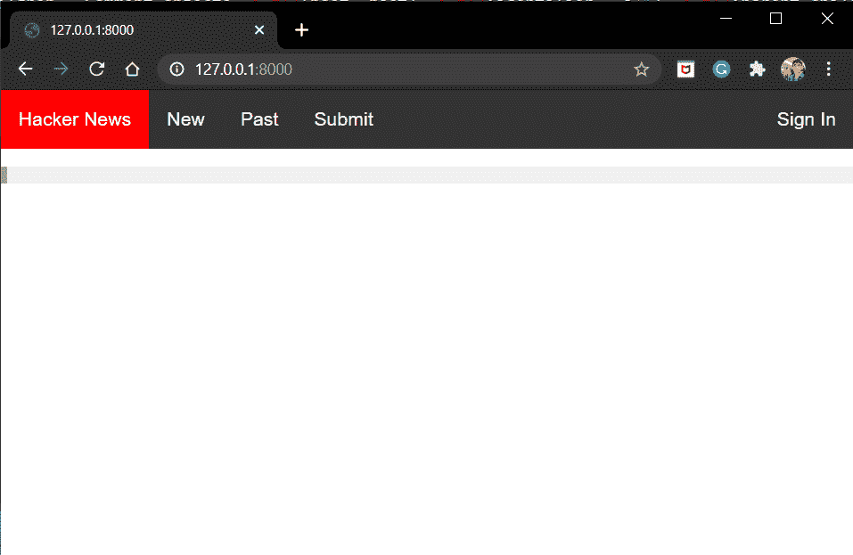

Home Page

没有帖子，请点击登录:

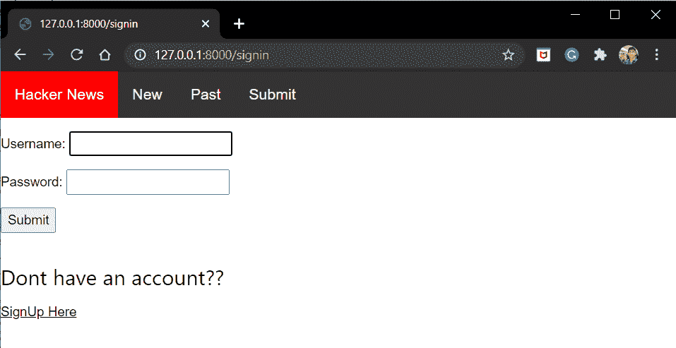

Signin

点击在此注册并注册您的帐户

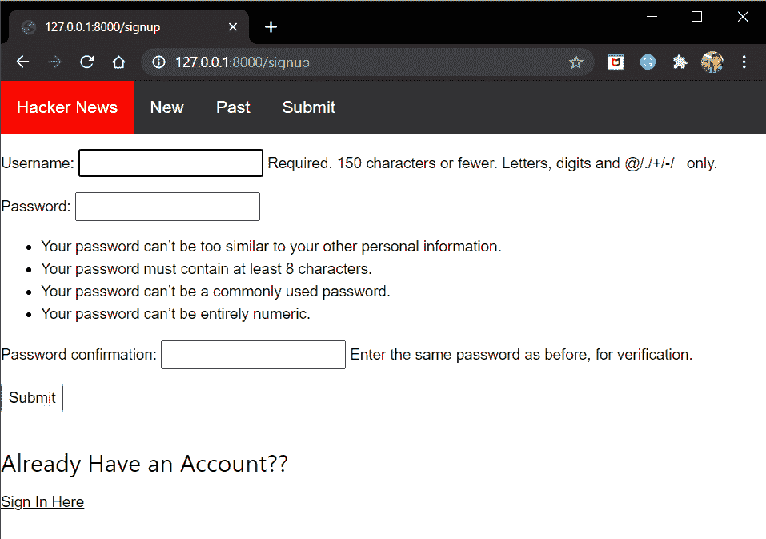

Signup

注册完成后，请提交并添加一些帖子

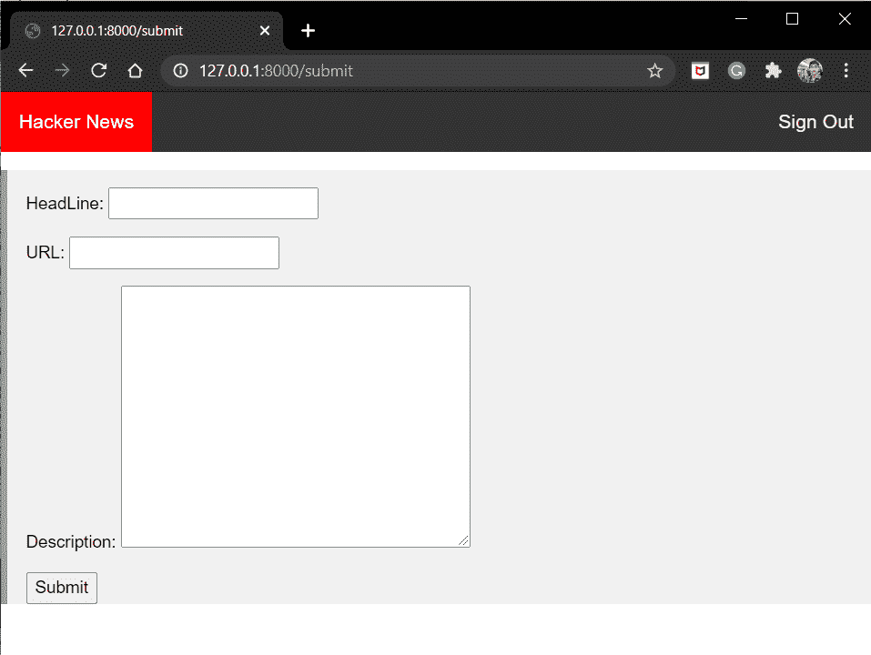

Submit

我在那里提交了几篇文章，所以现在点击导航栏上的黑客新闻按钮进入主页:

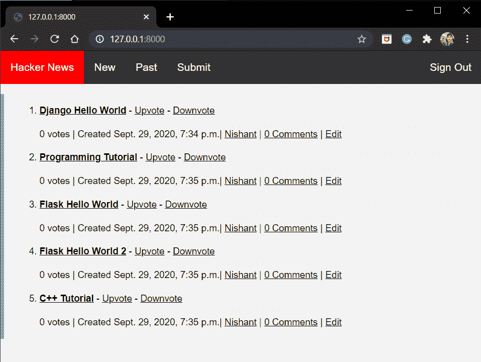

Home Page Posts

你现在可以**投票赞成**和**投票反对**帖子。同样点击**新**和**过去**按钮。现在点击帖子下方的用户名——**我的情况是 Nishant** :

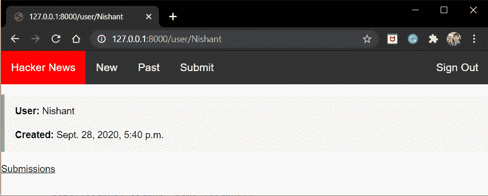

User

你会看到**用户信息**以及**提交**按钮。好了，现在回去点击**评论；**您将进入评论页面

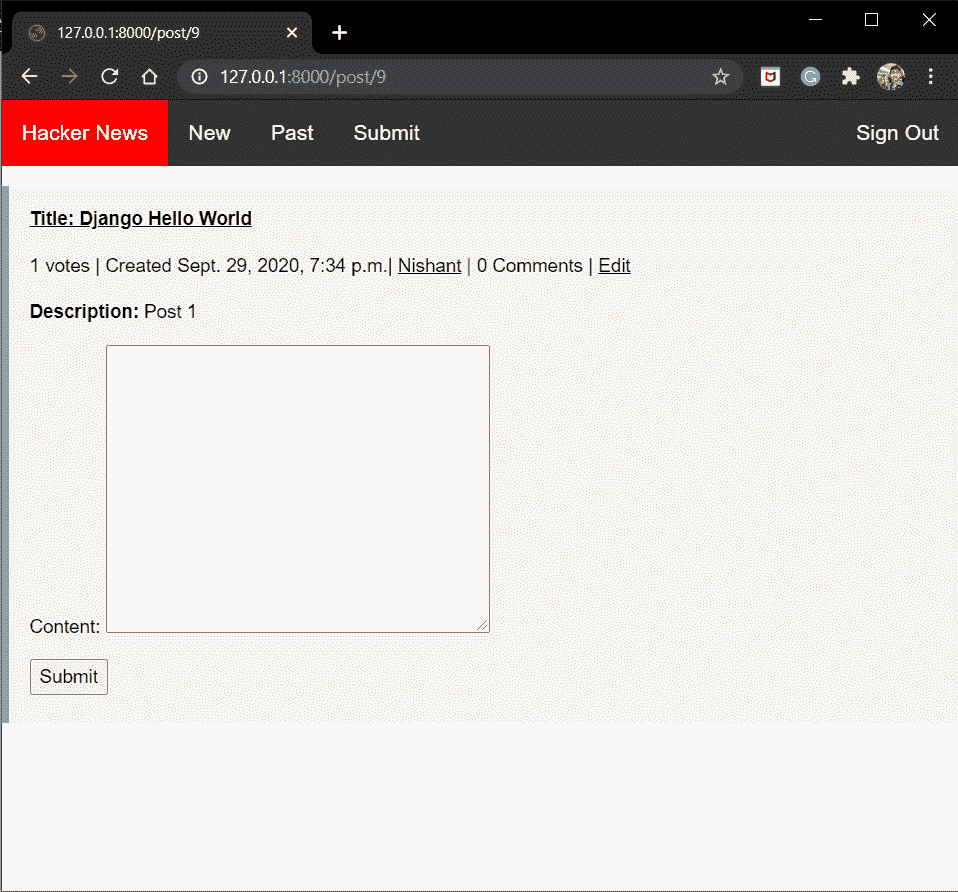

Post

提交评论

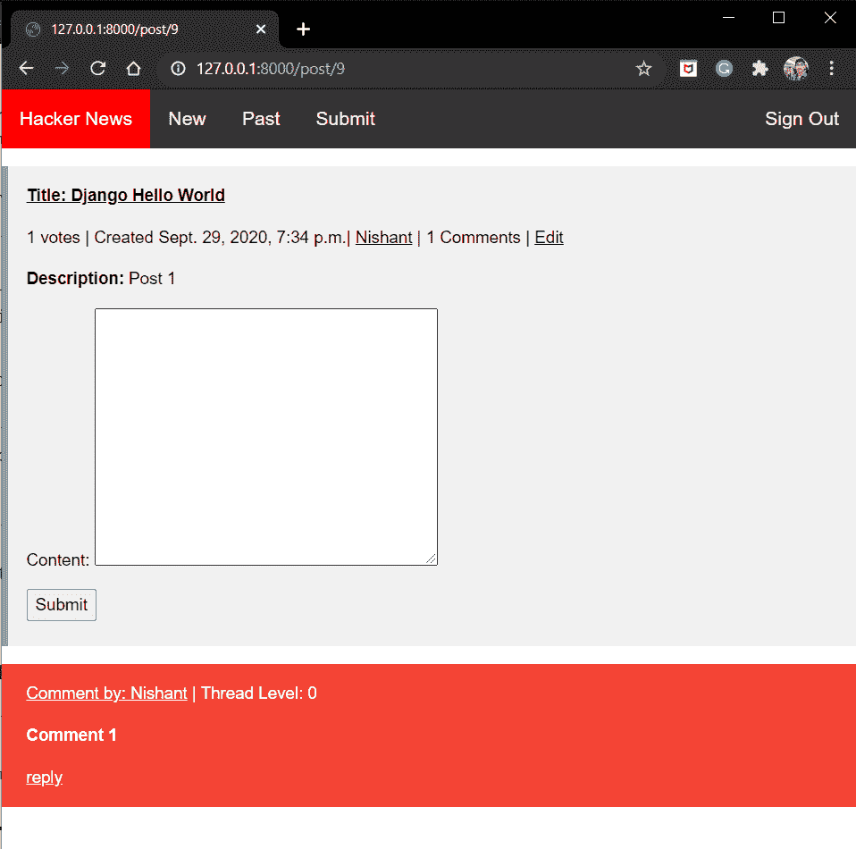

Comment

这就是我们最热门的评论。现在当点击回复时:

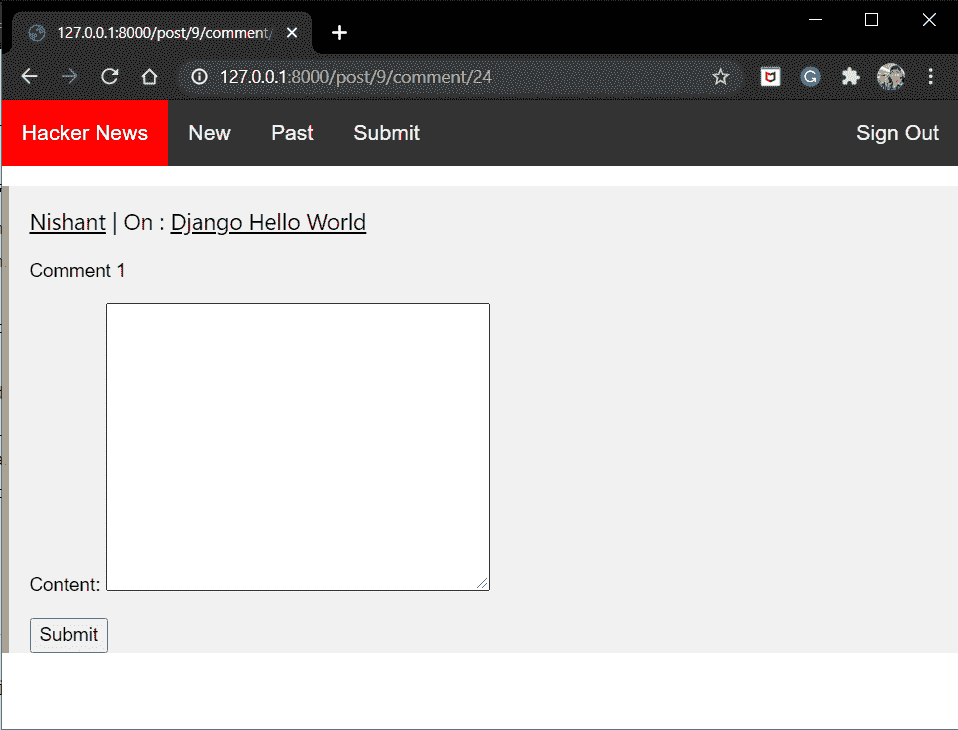

Reply To Comment 1

输入随机回复，然后单击提交。

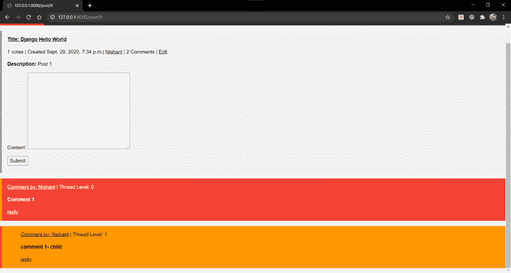

Reply Thread

参见线程级别= 1，已经重新安排了自己，使得父注释在顶部。这就是递归函数正在做的事情。尝试添加更多的回复，看看它如何安排自己。

太好了！！我们自己的姜戈项目的想法变成了现实。

## 参考

*   [Django 车型](https://www.askpython.com/django/django-models)
*   [Django 观点](https://www.askpython.com/django/django-views)
*   [Django 模板](https://www.askpython.com/django/django-templates)
*   [Django 模型表格](https://www.askpython.com/django/django-model-forms)

## 结论

就这样，伙计们！你自己的黑客新闻网络应用已经准备好了。为了更好地理解，请尝试自己实现所有的逻辑代码！