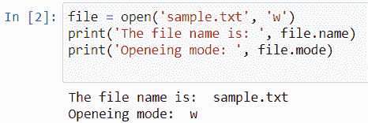
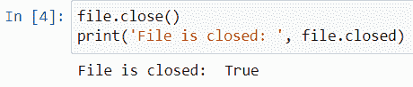
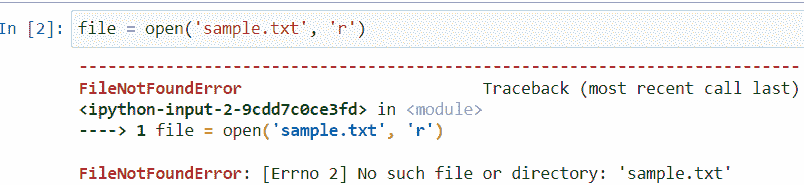
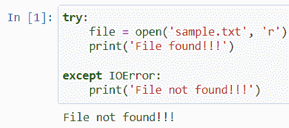

# 在 Python 中处理 IOErrors 完全指南

> 原文：<https://www.askpython.com/python/examples/handling-ioerrors>

在本文中，我们将学习在 Python 中处理 IOErrors，假设我们正在对一个特定的例子执行数学运算。当它很长的时候，可能会更悲惨。当我们被困在某个地方时，主要问题就出现了。经过很多努力，我们解决了这个问题。但是，答案并不令人满意或者是错误的。这有两种可能性:

1.  要么我们试图解决的问题从一开始就被错误地构建。
2.  或者我们在整个过程或步骤中输入错误。

整个事情用一个简单的词来说就是一个**错误**。在不同的条件下，它们可以是不同的类型。这要看问题本身。同样的，编程中也有**错误。**它们是**输出**的不同形式，出现在特殊情况下。

## Python 中的 IOError 是什么？

*IOError 表示输入/输出错误。当我们引用的文件、文件路径或操作系统操作不存在时，就会出现这种情况。例如，如果您在一个现有文件上运行运行时操作，并且该文件从该位置丢失，Python 将抛出一个 IOError。*

现在，在我们学习如何在 Python 中处理 IOErrors 之前，让我们了解不同类型的错误。

### Python 中的错误类型

编译器将错误分成不同的类别，以便更好地识别和解决问题。下面是您在编程过程中会遇到的一些最常见的错误类型。

1.  当我们试图将一个数除以零时就会出现错误。
2.  **AssertionError** :当一个 Python 脚本的调试或者[断言语句](https://www.askpython.com/python/built-in-methods/assertions-in-python)失败时，就会出现这个。
3.  **AttributeError** :当给定的属性错误或者在模块或脚本中不存在时。
4.  **FloatingPointError** :浮点实现过程中的错误。
5.  **ImportError**/**ModuleNotFoundError**:如果我们试图[导入一个模块](https://www.askpython.com/python/python-import-statement)而它并不存在，那么这将引发。
6.  ***IOError** :当我们试图访问的文件在系统中不存在时引发。*

您可以通过这个[链接](https://docs.python.org/3/library/exceptions.html)从官方 Python 文档中浏览更多关于不同异常的信息。

## 在 Python 中检测和处理 IOErrors

通常，在较新的 Python 版本中，这个异常有一个新的名称。

### 在文件操作期间处理 Python 中的 IOErrors

让我们创建一个函数来引用一个文件，然后我们将处理 IOError。

**代码:**

```py
file = open('sample.txt', 'w')
print('The file name is: ', file.name)
print('Openeing mode: ', file.mode)

```



Opening A File

```py
file.close()
print('File is closed: ', file.closed)

```



Closing a file

现在，我们将删除该文件，然后尝试打开它，这将引发所需的错误。

**输出:**



FileNotFoundError occurred

FileNotFoundError 是 IOError 的子类。我们也可以使用 Python 中的异常处理方法来检测它。

让我们使用 [try and catch 块](https://www.askpython.com/python/python-exception-handling)来处理我们的 filenotfounderror，并为我们提供更好、更容易理解的输出。

```py
try:
    file = open('sample.txt', 'w')
    print('File found!!!')

except IOError:
    print('File not found!!!')

# Output: File not found!!!

```



Error Detection

**说明:**

1.  在 try 块中，我们尝试以读取模式打开文件。
2.  然后我们添加一条消息，如果文件存在，则打印**“文件找到”**。
3.  如果文件不存在，except 语句会处理这个问题。
4.  当一个错误发生时，这个块将捕获错误并打印出**文件未找到**，而不是我们之前看到的复杂错误消息。

## 结论

因此，处理 IOError 的主题结束了。该错误特别符合 Python 编程的文件处理标准。这是一个容易研究的话题，我们可以使用**try-except**块来消除错误。再次修改简单的代码以获得更清晰的概念。

我希望你喜欢这篇非常简短的关于在 Python 中使用 IOErrors 的指南。