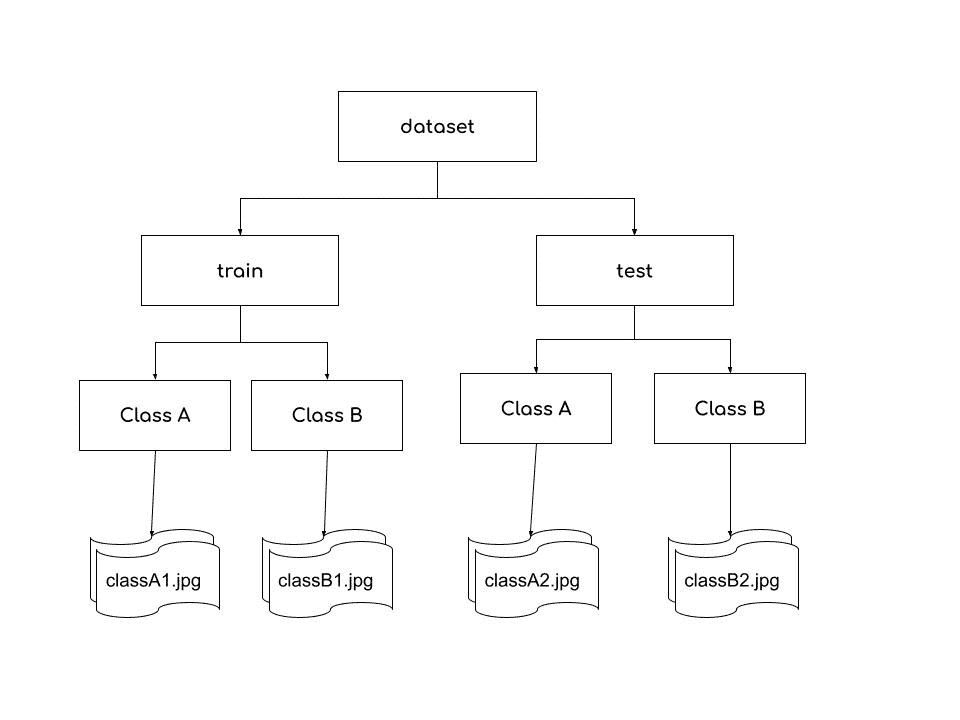
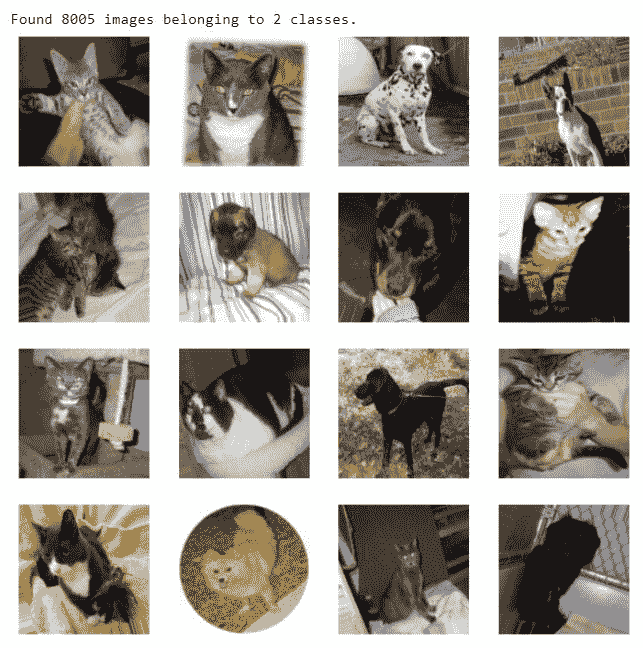

# 在 Python 中处理用于机器学习的大数据集

> 原文：<https://www.askpython.com/python/examples/handling-large-datasets-machine-learning>

大型数据集现在已经成为我们机器学习和数据科学项目的一部分。如此大的数据集不适合 RAM，并且不可能对其应用机器学习算法。你的系统变得很慢，这也让你无法执行其他任务。因此，在本教程中，我们将学习如何为您的机器学习或数据科学项目处理大型数据集。

## 用熊猫处理大型数据集

[Pandas](https://www.askpython.com/python-modules/pandas/python-pandas-module-tutorial) 模块最广泛用于数据操作和分析。它提供了强大的数据框架，支持 CSV、JSON 等文件格式，并且易于删除重复项和数据清理。

然而，处理大型数据集仍然是熊猫面临的一个问题。以下是你可以尝试的方法。

我们将使用各种方法从 Kaggle 加载 [NYC Yellow Taxi 2015 数据集](https://www.kaggle.com/edwinytleung/nyc-yellow-taxi-2015-sample-data)的训练数据集，并使用`psutil.virtual_memory()`查看内存消耗。

### 1.将您的数据分块

如果您不需要同时使用所有数据，您可以分块加载数据。组块是我们数据集的一部分。我们可以使用`read_csv()`并传递一个参数`chunksize`。块大小取决于你有多少内存。

```py
import pandas as pd
import psutil

# Loading the training dataset by chunking dataframe
memory_timestep_1 = psutil.virtual_memory()

data_iterator = pd.read_csv("dataset/train_2015.csv", chunksize=100000)
fare_amount_sum_chunk = 0
for data_chunk in data_iterator:
  fare_amount_sum_chunk += data_chunk['fare_amount'].sum()

memory_timestep_2 = psutil.virtual_memory()

memory_used_pd = (memory_timestep_2[3] - memory_timestep_1[3])/(1024*1024)
print("Memory acquired with chunking the dataframe: %.4f MB"%memory_used_pd)

# Loading the training dataset using pandas
memory_timestep_3 = psutil.virtual_memory()

training_data_pd = pd.read_csv("dataset/train_2015.csv")
fare_amount_sum_pd = training_data_pd['fare_amount'].sum()

memory_timestep_4 = psutil.virtual_memory()

memory_used_pd = (memory_timestep_4[3] - memory_timestep_3[3])/(1024*1024)
print("Memory acquired without chunking the dataframe: %.4f MB"%memory_used_pd)

```

```py
Memory acquired with chunking the dataframe: 103.0469 MB
Memory acquired without chunking the dataframe: 854.8477 MB

```

### 2.删除列

有时，我们只需要列的子集，而不是所有的列来进行分析。数据集中存在许多不需要的列。因此，我们将通过使用名为`usecols`的`read_csv()`中的参数，只将一些有用的列加载到内存中。

```py
import pandas as pd
import psutil

# Loading the training dataset by chunking dataframe
memory_timestep_1 = psutil.virtual_memory()

columns = ['fare_amount', 'trip_distance']
data_1 = pd.read_csv("dataset/train_2015.csv", usecols=columns)

memory_timestep_2 = psutil.virtual_memory()

memory_used_pd = (memory_timestep_2[3] - memory_timestep_1[3])/(1024*1024)
print("Memory acquired by sampling columns: %.4f MB"%memory_used_pd)

# Loading the training dataset using pandas
memory_timestep_3 = psutil.virtual_memory()

data_2 = pd.read_csv("dataset/train_2015.csv")

memory_timestep_4 = psutil.virtual_memory()

memory_used_pd = (memory_timestep_4[3] - memory_timestep_3[3])/(1024*1024)
print("Memory acquired without sampling columns: %.4f MB"%memory_used_pd)

```

```py
Memory acquired by sampling columns: 25.7812 MB
Memory acquired without sampling columns: 896.5195 MB

```

### 3.选择正确的数据类型

pandas 为值使用的默认数据类型不是最有效的内存。我们可以根据一些列存储的值来更改它们的数据类型，从而可以在内存中加载大型数据集。

例如，我们的数据集包含列 VendorID，它只取值 1 和 2。但是熊猫用的型号是 int64。我们可以把它转换成一个布尔值，这样可以减少存储空间。此外，我们将把列 pick up _ latitude pick up _ longitude、dropoff_latitude、dropoff_longitude 从 float64 转换为 float32，并将 payment_type 转换为 categorical。

```py
import pandas as pd
from sys import getsizeof

data = pd.read_csv("dataset/train_2015.csv")

size = getsizeof(data)/(1024*1024)
print("Initial Size: %.4f MB"%size)

# chaning VendorID to boolean
data.VendorID = data.VendorID.apply(lambda x: x==2)

# chaning pickup_latitude, pickup_longitude, dropoff_latitude, dropoff_longitude to float32
location_columns = ['pickup_latitude','pickup_longitude',
                    'dropoff_latitude','dropoff_longitude']
data[location_columns] = data[location_columns].astype('float32')

# chaning payment_type to categorical
data.payment_type = data.payment_type.astype('category')

size = getsizeof(data)/(1024*1024)
print("Size after reduction: %.4f MB"%size)

```

```py
Initial Size: 957.8787 MB
Size after reduction: 873.8545 MB

```

## 用 Dask 处理大型数据集

[Dask](https://www.dask.org/) 是一个并行计算库，伸缩 [NumPy](https://www.askpython.com/python-modules/numpy/python-numpy-arrays) ，pandas， [scikit](https://www.askpython.com/python/data-analytics-libraries) 模块，实现快速计算和低内存。它利用了一台机器有多个内核的事实，dask 利用这一事实进行并行计算。

我们可以使用 dask 数据帧，它类似于 pandas 数据帧。dask 数据帧由多个较小的 pandas 数据帧组成。对单个 Dask 数据帧的方法调用会产生许多 pandas 方法调用，Dask 知道如何协调一切以获得结果。

让我们使用 pandas 和 dask 从 Kaggle 加载 [NYC Yellow Taxi 2015 数据集](https://www.kaggle.com/edwinytleung/nyc-yellow-taxi-2015-sample-data)的训练数据集，并使用`psutil.virtual_memory()`查看内存消耗。

```py
import pandas as pd
import dask.dataframe as ddf
import psutil

#Loading the training dataset using dask
memory_timestep_3 = psutil.virtual_memory()

training_data_ddf = ddf.read_csv("dataset/train_2015.csv")

memory_timestep_4 = psutil.virtual_memory()

memory_used_ddf = (memory_timestep_4[3] - memory_timestep_3[3])/(1024*1024)
print("Memory acquired using dask: %.4f MB"%memory_used_ddf)

# Loading the training dataset using pandas
memory_timestep_1 = psutil.virtual_memory()

training_data_pd = pd.read_csv("dataset/train_2015.csv")

memory_timestep_2 = psutil.virtual_memory()

memory_used_pd = (memory_timestep_2[3] - memory_timestep_1[3])/(1024*1024)
print("Memory acquired using pandas: %.4f MB"%memory_used_pd)

```

```py
Memory acquired using dask: 5.1523 MB
Memory acquired using pandas: 832.1602 MB

```

dask 和 pandas 数据帧之间的一个主要区别是 dask 数据帧操作是懒惰的。操作不会像 pandas 那样立即执行，而是由 dask 生成任务图，并在需要时读取值。使用完这些值后，它们会被从内存中丢弃，这就是 dask 处理不适合内存的数据的原因。

## 图像数据发生器

如果您正在处理占用大量磁盘内存并且无法同时加载到内存中的图像，您可以使用 Keras `ImageDataGenerator`直接从磁盘批量加载图像。

不仅如此，它还为您提供了图像增强的能力，您可以使用旋转、缩放、翻转等方式变换图像，而无需创建新图像，这有助于您为 ML 项目生成多样化的数据集。

有一种标准的方法可以让你的数据集目录结构适合使用`ImageDataGenerator`。您的训练数据集目录应该包含与您的类同名的子目录。在你的子目录中，存储你的同类图片，图片文件名无关紧要。



ImageDataGenerator Directory

让我们使用来自 Kaggle 的[猫狗数据集](https://www.kaggle.com/tongpython/cat-and-dog)，并使用`ImageDataGenerator`加载它。首先，我们将创建一个 ImageDataGenerator 对象，并使用`flow_from_directory()`方法加载数据。

```py
from tensorflow.keras.preprocessing.image import ImageDataGenerator
import matplotlib.pyplot as plt

# Create object of ImageDataGenerator
datagen = ImageDataGenerator(
    rotation_range=20, # randomly rotate images by 20 degrees
    horizontal_flip = True # randomly flip images
)

# Create generator using flow_from_directory method
data_generator = datagen.flow_from_directory(
    directory = "/content/dataset/training_set/training_set", # specify your dataset directory
    batch_size=16, # specify the no. of images you want to load at a time
)

# load a batch using next
images, labels = next(data_generator)

nrows = 4
ncols = 4
fig = plt.figure(figsize=(10,10))
for i in range(16):
  fig.add_subplot(nrows, ncols, i+1)
  plt.imshow(images[i].astype('uint8'))
  plt.axis(False)

plt.show()

```



ImageDataGenerator Results

## 自定义数据生成器

如果以上方法对你都不起作用，而你仍然在寻找一些奇迹发生，这是你可以做的。

您可以通过继承`[tf.keras.utils.Sequence](https://www.tensorflow.org/api_docs/python/tf/keras/utils/Sequence)`类来定义自己的数据生成器，并拥有完全的控制权。你的类必须实现`__getitem__`和`__len__`方法。如果您想在不同时期之间修改数据集，您可以实现`on_epoch_end`。

这样，您可以直接从目录中动态加载数据集，并且只使用所需的内存。你可以在你的`model.fit()`中使用这个来提供数据集。

```py
import tensorflow as tf
import cv2
import numpy
import os
import matplotlib.pyplot as plt

class CustomDataGenerator(tf.keras.utils.Sequence):

  def __init__(self, batch_size, dataset_directory):
    self.batch_size = batch_size
    self.directory = dataset_directory
    self.list_IDs = os.listdir(self.directory)

  # Returns the number of batches to generate
  def __len__(self):
    return len(self.list_IDs) // self.batch_size

  # Return a batch of given index
  # Create your logic how you want to load your data
  def __getitem__(self, index):
    batch_IDs = self.list_IDs[index*self.batch_size : (index+1)*self.batch_size]
    images = []
    for id in batch_IDs:
      path = os.path.join(self.directory, id)
      image = cv2.imread(path)
      image = cv2.resize(image, (100,100))
      images.append(image)

    return images

dog_data_generator = CustomDataGenerator(
    batch_size = 16, 
    dataset_directory = "/content/dataset/training_set/training_set/dogs"
)

# get a batch of images
images = next(iter(dog_data_generator))

nrows = 4
ncols = 4
fig = plt.figure(figsize=(10,10))
for i in range(16):
  fig.add_subplot(nrows, ncols, i+1)
  plt.imshow(images[i].astype('uint8'))
  plt.axis(False)

plt.show()

```


Custom Data Generator

## 结论

恭喜你！您现在已经知道了处理大型数据集的不同方法。现在，您可以在您的数据科学和机器学习项目中使用它们，低内存将不再是一个问题。

感谢阅读！