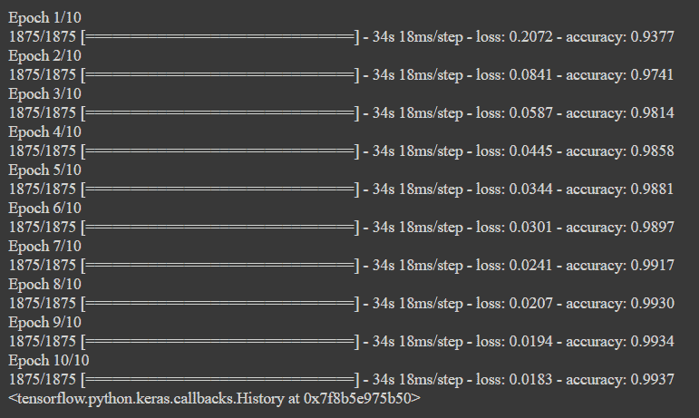
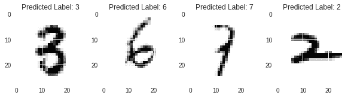

# Python 中的手写数字识别

> 原文：<https://www.askpython.com/python/examples/handwritten-digit-recognition>

你好，初学者！今天在本教程中，我们将学习如何从 sklearn 数据集中已经可用的 [MNIST 数据集](https://www.askpython.com/python/examples/load-and-plot-mnist-dataset-in-python)中识别手写数字。为了识别数字，我们将利用[卷积神经网络](https://www.askpython.com/python/examples/relu-function) (CNN)。

我们先从了解 CNN 是什么开始。

## 什么是卷积神经网络？

CNN 是基于多层感知器的计算任务的最重要的神经网络模型之一。这些模型在图像处理方面表现尤为出色。例如，手写的识别。手写识别是神经网络最基本和最优秀的用途之一。CNN 模型经过多层训练，可以做出正确的预测

### 卷积神经网络用例

CNN 在图像处理等领域发挥着重要作用。它对探测和预测有很大的影响。它甚至被用于纳米技术，如制造半导体。在这里，它被用来检测材料中的缺陷。如果 CNN 与 [Keras](https://www.askpython.com/python/examples/handling-large-datasets-machine-learning) 或 [Tensorflow](https://www.askpython.com/python-modules/saving-loading-models-tensorflow) 一起使用，与各种分类算法相比，它给出了最高的准确度。与任何其他数据集相比，CNN 和反向传播架构使 MNIST 数据集具有最高的准确性。通过研究，CNN 每天都在开发新的应用。在德国，提出了使用 CNN 的交通标志识别模型。

## 手写数字识别数据集的加载和准备

我们将要使用的数据集包含大约**60000 张训练图像**和 **10000 张测试图像**。然后我们将数据分别分成[训练和测试数据集](https://www.askpython.com/python/examples/split-data-training-and-testing-set)。

`x_train`和`x_test`包含图像的像素代码，而`y_test`和`y_train`包含来自`0–9`的标签，其代表数字，因为数字可以从 0 到 9 变化。

现在，我们需要检查数据集的形状是否可以在 CNN 模型中使用。数据的大小被观察为 **(60000，28，28)** ，这意味着 60000 个大小为 **28×28** **像素**的图像。

但是为了使用 Keras API，我们需要一个 4 维数组数据集，因此我们需要将 3 维数据转换成 4 维数据集。

```py
import tensorflow as tf
(x_train, y_train), (x_test, y_test) = tf.keras.datasets.mnist.load_data()

x_train = x_train.reshape(x_train.shape[0], 28, 28, 1)
x_test = x_test.reshape(x_test.shape[0], 28, 28, 1)
input_shape = (28, 28, 1)

```

下一步是标准化数据，首先将数据转换为浮点型，然后除以 255(最大 RGB 码–最小 RGB 码)。

```py
x_train = x_train.astype('float32')
x_test = x_test.astype('float32')

x_train /= 255
x_test /= 255

```

## 构建模型

在本教程中，用户将利用 **Keras API** 来构建模型，为了做到这一点，我们将从 Keras 导入**顺序模型**并添加多层，如下所示:

1.  Conv2D
2.  最大池化
3.  变平
4.  拒绝传统社会的人
5.  稠密的

脱落层负责对抗过度拟合，展平层将 2D 阵列展平为 1D 阵列。

```py
from tensorflow.keras.models import Sequential
from tensorflow.keras.layers import Dense, Conv2D, Dropout, Flatten, MaxPooling2D
model = Sequential()
model.add(Conv2D(28, kernel_size=(3,3), input_shape=input_shape))
model.add(MaxPooling2D(pool_size=(2, 2)))
model.add(Flatten())
model.add(Dense(128, activation=tf.nn.relu))
model.add(Dropout(0.2))
model.add(Dense(10,activation=tf.nn.softmax))

```

## **编译和拟合模型**

所以现在我们创造了一个**非优化的空 CNN** 。然后，我们设置一个具有给定的**损失函数**的**优化器**，该优化器利用一个度量，并且通过使用创建的训练数据集来拟合模型。ADAM 优化器优于其他类似的优化器。

```py
model.compile(optimizer='adam', loss='sparse_categorical_crossentropy', metrics=['accuracy'])
model.fit(x=x_train,y=y_train, epochs=10)

```

培训过程的结果如下。



Training Result Handwritten Digit Recog

在使用`evaluate`函数评估模型时，我们观察到**的准确度为 98.4%** 。

## 可视化结果

我们的最后一步是可视化训练模型的结果，并在`subplots`的帮助下绘制它们。同样的代码和输出如下所示。我们可以看到结果相当准确。

```py
import matplotlib.pyplot as plt
plt.style.use('seaborn')

plt.figure(figsize=(10,10))
plt.subplot(4,4,1)
image_index = 2853
predict = x_test[image_index].reshape(28,28)
pred = model.predict(x_test[image_index].reshape(1, 28, 28, 1))
plt.imshow(x_test[image_index].reshape(28, 28),cmap='Greys')
plt.title("Predicted Label: "+str(pred.argmax()))

plt.subplot(4,4,2)
image_index = 2000
predict = x_test[image_index].reshape(28,28)
pred = model.predict(x_test[image_index].reshape(1, 28, 28, 1))
plt.imshow(x_test[image_index].reshape(28, 28),cmap='Greys')
plt.title("Predicted Label: "+str(pred.argmax()))

plt.subplot(4,4,3)
image_index = 1500
predict = x_test[image_index].reshape(28,28)
pred = model.predict(x_test[image_index].reshape(1, 28, 28, 1))
plt.imshow(x_test[image_index].reshape(28, 28),cmap='Greys')
plt.title("Predicted Label: "+str(pred.argmax()))

plt.subplot(4,4,4)
image_index = 1345
predict = x_test[image_index].reshape(28,28)
pred = model.predict(x_test[image_index].reshape(1, 28, 28, 1))
plt.imshow(x_test[image_index].reshape(28, 28),cmap='Greys')
plt.title("Predicted Label: "+str(pred.argmax()))

```



Handwritten Digit Recog Output

## 结论

在本教程中，我们构建了自己的 CNN 集成手写数字识别模型。而且精度出来还挺不错的！

感谢您的阅读！