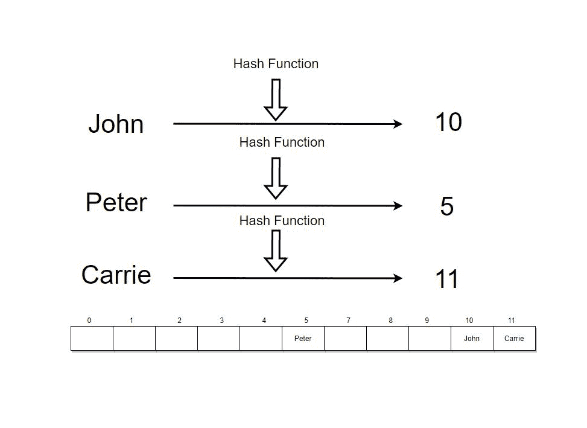
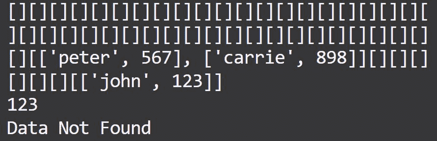

# 在 Python 中实现 HashMaps

> 原文：<https://www.askpython.com/python/examples/hashmaps-in-python>

每当我们试图通过我们的数据实现某种搜索逻辑时，我们都希望它是*。对于小程序来说可能不是这样，但是对于具有巨大代码库的大型应用程序来说，运行任何类型的逻辑的搜索、删除或修改时间都应该是最小的。*

*Python 中的字典用于将数据存储为**键:值**对。他们使用一种叫做**哈希**的技术来执行基于时间的搜索操作，这种操作几乎与字典**的大小无关。***

****也读: [Python 字典(Dict)教程](https://www.askpython.com/python/dictionary/python-dictionary-dict-tutorial)****

## *哈希是什么？*

*哈希是一种用于对任何类型的数据进行排序和索引的技术。哈希允许我们获取大量要索引的数据或输入，并使用通常使用称为**哈希函数**的东西创建的键将它们存储在更少的输出空间中，哈希函数本质上是应用于我们的输入数据的某种数学逻辑，产生一个数值。*

*

The Concept Of Hashing* 

*假设我们有三个字符串，我们想用一些数学逻辑以一种有效的方式存储它们。这里我们有一串约翰、彼得、T1 和 T2、凯莉和 T3。所以如果你想用散列法存储它们，第一步是我们用散列函数把这些字符串变成一个数字。*

*如果我们使用哈希函数将这些字符串转换为数字，我们首先将约翰的单词转换为 10，然后将 T2 的彼得的单词转换为 T3。换算成 5。然后我们继续转换**卡丽**，将是 11。因此，我们将字符串转换成了数字。*

*现在你可能对如何转换感兴趣，这里的**散列函数** 是什么，以及它是如何工作的。我们将在文章中进一步理解这一点。*

## *Python 中的散列函数*

**哈希函数负责通过使用一些公式将这些字符串转换成数字。**

*接下来，我们必须将这些数字存储在一些数据结构中。如果我们有一个数组或 python 列表，其中有 12 个单元格，如此处所示，通过使用这个哈希函数生成的数字，我们将把这些字符串插入到这些数组中。*

*所以对于第一串，也就是约翰，我们有 10 个。我们将把**约翰**字符串插入到这个数组中 10 个 的 ***索引中。然后，下一串是**彼得**。所以当我们把它转换成数字时，它就变成了 5。****

*我们将把**彼得**字符串插入到 5T5 的**T3 的索引中。现在，下一个单词是 **Carrie** 。当我们在这里使用哈希函数转换 Carrie 时，它变成了 11。所以我们将把 11 个** 的 ***索引的 Carrie 插入到这个数组中。我们已经完成了这些字符串到整数的转换，我们正在将这些字符串插入到这个数组中。****

## *使用哈希函数读取或访问数据*

*现在的问题是，如果我们想从这个数组中读取数据，我们如何访问它？*

*同样，逻辑是一样的。例如，如果我们想要访问 **John** ，我们要做的第一件事就是使用相同的哈希函数并将 John 转换为数字。每次我们转换同一个字符串，结果都是一样的。所以我们会得到 10。基于索引 10，我们可以访问这里的元素。*

## *为什么我们需要散列？*

*我们知道，根据索引访问数组或 Python 列表中的元素需要 ***O(1)*** ***时间复杂度*** 。这就是为什么在数据结构中搜索一个给定值时散列是非常重要的。这样做，我们可以很容易地识别字符串是否在这个数组中。*

*假设我们想开发一个应用程序，其中搜索操作被大量使用，我们希望我们的应用程序执行得尽可能快。在这种情况下，我们可以使用散列法。就搜索操作而言，散列也比任何其他数据结构表现得更好。*

## *哈希术语*

*   ***哈希函数**:它是一种逻辑或数学公式，可以用来将任意大小的输入数据映射为固定大小或更小大小的输出。*
*   ***散列值**:散列函数返回的值。*
*   ***哈希表**:是实现关联数组抽象数据类型的数据结构，也是可以将键映射到值的结构。*
*   ***冲突**:当散列函数的两个不同键产生相同的输出时，就会发生冲突。*

## *用 Python 实现散列表*

*让我们通过实现一个 Hashmap 来了解它的概况。我们将创建一个包含基本函数的自定义类。下面是我们的自定义类中包含的函数。代码本身包含了我们在文章前面讨论过的所有解释。*

*   ***_hash( *self* ， *key* ):** 这是我们定义的哈希函数或者数学逻辑，我们应用到 key 上，把它转换成整数值。*
*   ****set* ( *self* ， *key* ， *value* ):** 这个函数允许我们将一个 key | value 对添加到我们的 Hash Map 中。*
*   ***get( *self* ， *key* )** :为了检索给定 key 的值，使用该函数。*
*   ***__str__( *self* ):** 将完整的 Hash 图打印到我们的终端。*

##### *密码*

```py
*class HashMap(object):
    def __init__(self, size):
        """Initializing the list with the argument size for our HashMap"""
        self.data = [[]] * (size)

    def _hash(self, key):
        """Hash Function:
        marked as a private method in the Object"""

        # Initialize
        hash_value = 0

        # Iterating and generating hashed values using the logic below
        # Logic: Taking the initial value of 0 and adding to it the ASCII encoding for each character,
        # and multiplying by the index value. After that we are taking the modulus of the result using the
        # length of the array
        # This becomes our hashed value i.e. the index position of the input to be placed
        # in the output space
        for i in range(len(key)):
            hash_value = (hash_value + ord(key[i]) * i) % len(self.data)

        return hash_value

    def set(self, key, value):
        # Represents the index position where we want to store our data
        address = self._hash(key)

        if not self.data[address]:
            self.data[address] = []
        # If there is a collision of index value i.e. our hashed value
        # then simply add on to that array
        self.data[address].append([key, value])
        return self.data

    def get(self, key):
        # Getting the hashed value again, with the same hash function to locate the value
        # for the given key
        address = self._hash(key)
        # assigning the entire array to a variable in-order to operate later
        currentBucket = self.data[address]

        if currentBucket:
            # Iterating over the entire list to get the value
            for i in range(len(currentBucket)):
                # Check to retrieve the value
                if currentBucket[i][0] == key:
                    # If found, return the current bucket
                    return currentBucket[i][1]

        # If no value present
        return "Data Not Found"

    # In order to print the hashmap to see the structure
    def __str__(self):
        return "".join(str(item) for item in self.data)

# Instantiating from our Object Class with 50 buckets
myHash = HashMap(50)

# Setting the values to the hash table
myHash.set("john", 123)
myHash.set("peter", 567)
myHash.set("carrie", 898)

# Printing the entire hash table
print(myHash)

# Getting the values from the hash table using the keys
print(myHash.get("john"))  # Output: 123
print(myHash.get("guava"))  # Output: Data Not Found* 
```

##### *输出*

*

Generated HashMap* 

## *结论*

*在本文中，我们讨论了使用 Python 创建散列图的关键术语和方法。顾名思义，这就像使用数据创建一个地图，在底层逻辑上提供一个抽象来表示。它们提供了一种基于键显示和定位值以及基于键插入和删除值的有效方法。*