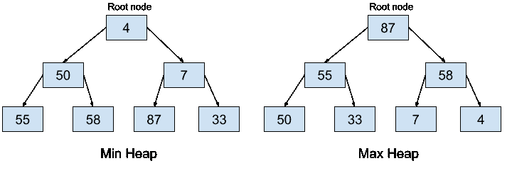
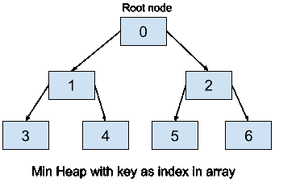
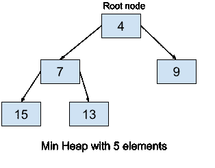

# Python 中的堆

> 原文：<https://www.askpython.com/python/examples/heaps-in-python>

在本文中，我们将了解一个重要的数据结构，Python 中的堆(Python 中称为堆队列)。我们将学习数据结构及其实现，然后查看 Python 代码。

## **Python 中的堆是什么**？

Python 中的堆是完整的[二叉树](https://www.askpython.com/python/examples/binary-tree-implementation)，其中每个节点或者小于等于或者大于等于它的所有子节点(小于或大于取决于它是最大堆还是最小堆)。

因此，堆的根节点要么是最小的，要么是最大的元素。**堆数据结构一般用来表示优先级队列**。

通常，堆有两种形式:

*   最小堆(Min-Heap):最小堆是指所有节点都小于其子节点的堆。根包含最小堆中的最低值。
*   **Max-Heap** : Max heap 是所有节点大于其子节点的堆。根包含最大堆中的最高值。

以下是最小堆和最大堆的示例。



Heap in Python

默认情况下，Python 中的堆是最小堆，在本文的后面，当我们讨论堆时，我们将考虑最小堆。现在让我们看看堆数据结构是如何实际实现的。

## Python 中堆是如何表示的？

堆数据结构理论上是二叉树的形式，但是由于其完整性(其中除了最后一层中最右边的节点之外，树是完整的)，堆以[数组](https://www.askpython.com/python/array/python-array-declaration)的形式存储在存储器中。第一个元素包含最小元素(在 min-heap 的情况下)。

树形式的堆存储在数组中，其元素按以下方式进行索引:

*   根元素将位于数组的第 0 个位置，即 Heap[0]。
*   对于任何其他节点，比如说 Heap[i]，我们有以下内容:
    *   父节点由:Heap[(i -1) / 2]给出。
    *   左边的子节点由下式给出:Heap[(2 * i) + 1]
    *   右边的子节点由下式给出:Heap[(2 * i) + 2]



Heap Python Array index Representation

## **使用 heapq 模块在 Python 中实现堆**

Python 有[“heapq”模块](https://www.askpython.com/python-modules/python-heapq-module)用于堆队列(或简称堆)的实现。它包含的功能是最小的元素总是在顶部，当调用 pop 函数时会弹出。

每当元素被压入或弹出时，堆属性将被保持，heap[0]将总是给我们最小的函数。

该模块包含堆的以下主要功能:

*   heap ify(iterable _ name):我们使用这个函数来传递任何 iterable(例如一个列表),它将它转换成一个堆数据结构。
*   **heappush** ( heap_name，element_to_be_inserted):顾名思义，这个函数向堆中推送/添加一个元素。我们需要传递堆名和要作为参数插入的元素。该函数负责重新排列堆(如果需要的话)以满足堆属性。
*   **heappop** ( heap_name):顾名思义，这个函数从作为参数传递的堆中弹出/移除一个元素。该函数负责重新排列堆(如果需要的话)以满足堆属性。

## Python 堆的实际实现

现在，我们将在 Python 中实现一个 min-heap。我们在代码中使用了一个 `list [15, 7, 9, 4, 13]` ，并使用`heapify`函数将其转换为一个堆。生成的堆将如下所示:



Min heap Example

**Python 中堆的实现:**

```py
# The heap functionalities are in the heapq package, so import it
import heapq 
# we now initialise a list to be converted to heap 
lis = [15, 7, 9, 4, 13] 

# converting lis to heap using the heapify function
heapq.heapify(lis) 
print ("The heap looks like: ") 
print(lis)

#using the heappop function
print ("The popped item using heappushpop() is : ",end="") 
print (heapq.heappop(lis))

print ("After popping, the heap looks like: ")
print(lis)

#using the heappush function to push 2
print ("After pushing 2, the heap looks like: ") 
heapq.heappush(lis, 2) 
print(lis)

```

输出:

```py
The heap looks like: 
[4, 7, 9, 15, 13]
The popped item using heappop() is : 4
After popping, the heap looks like: 
[7, 13, 9, 15]
After pushing 2, the heap looks like: 
[2, 7, 9, 15, 13]

```

在这里，我们可以看到 heapq 包提供了创建队列的功能，并向它推送和弹出元素。推送或弹出后，堆会自动重新排列自己，如输出所示。

## 结论

在本文中，我们学习了 Python 中堆的概念。我们研究了 Python 中的最大堆和最小堆是什么，以及它们是如何表示的。

我们使用`heapify`、`heappush`和`heappop` 函数在 python 中进一步实现了它。请继续关注更多内容丰富的文章。

快乐学习！