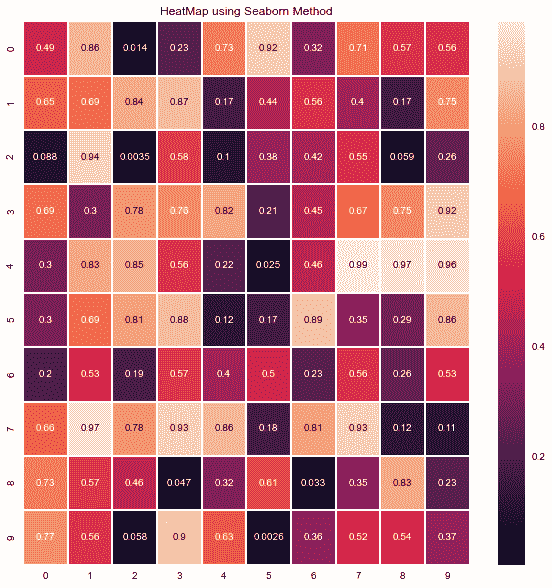
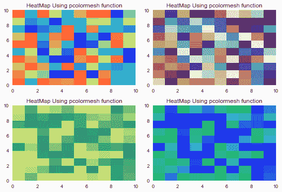
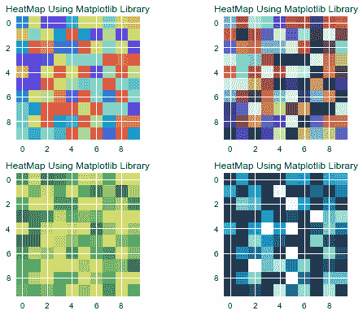

# Python 中的热图——如何用 Python 创建热图？

> 原文：<https://www.askpython.com/python/examples/heatmaps-in-python>

你好。今天，我们将了解 Python 中热图的用法，以及如何为不同的数据集创建热图。

## 什么是热图？

热图利用色调、饱和度或亮度等颜色变化将数据可视化为二维彩色图。热图以颜色而不是数字的形式描述变量之间的关系。

这些变量绘制在两个轴上。颜色变化根据特定块中颜色的强度来描述两个值之间的关系。

热图有很多应用，下面列出了其中一些:

1.  可视化业务分析
2.  探索数据分析
3.  探索营销和销售
4.  可视化网站或应用程序的访问者数量

* * *

## 使用热图的行业

如今，许多行业都在使用热图。一些行业是:

*   **医疗保健**
*   **金融**
*   **技术**
*   **房地产**

* * *

## 用 Python 绘制热图

在 python 编程语言中，有多种绘制热图的方法。我们将一个接一个地理解每一种方法。为了方便起见，我们先把这些方法列出来。

1.  **使用 Seaborn 库**
2.  **使用 pcolormesh()函数**
3.  **使用 matplotlib.pyplot 库**

### 方法 1:使用 Seaborn 库

为了使用 [seaborn 库](https://www.askpython.com/python-modules/python-seaborn-tutorial)绘制热图，我们首先需要将所有必要的模块/库导入到我们的程序中。

然后，我们生成一个特定大小的“随机矩阵”,然后在`heatmap`函数的帮助下绘制热图，并将数据集传递给函数。

```py
# 1\. Import Modules
import numpy as np
import seaborn as sns
import matplotlib.pylab as plt
plt.style.use("seaborn")

# 2\. Generate a 10x10 random integer matrix
data = np.random.rand(10,10)
print("Our dataset is : ",data)

# 3\. Plot the heatmap
plt.figure(figsize=(10,10))
heat_map = sns.heatmap( data, linewidth = 1 , annot = True)
plt.title( "HeatMap using Seaborn Method" )
plt.show()

```



Heatmap Using Seaborn

* * *

### 方法 2:使用 pcolormesh 函数

为了使用`pcolormesh`函数绘制热图，我们首先需要将所有必要的模块/库导入到我们的代码中。

我们将使用各种`cmaps`绘制热图，因此我们将在 matplotlib 中使用`subplots`。matplotlib 的`pcolormesh`函数需要数据集，我们可以指定颜色图来绘制热图。

```py
import matplotlib.pyplot as plt
import numpy as np

data= np.random.rand(10,10)

plt.subplot(2,2,1)
plt.pcolormesh(data, cmap = 'rainbow')
plt.title('HeatMap Using pcolormesh function')

plt.subplot(2,2,2)
plt.pcolormesh(data, cmap = 'twilight')
plt.title('HeatMap Using pcolormesh function')

plt.subplot(2,2,3)
plt.pcolormesh(data, cmap = 'summer')
plt.title('HeatMap Using pcolormesh function')

plt.subplot(2,2,4)
plt.pcolormesh(data, cmap = 'winter')
plt.title('HeatMap Using pcolormesh function')

plt.tight_layout()

plt.show()

```



Heatmap Using Pcolormesh Function

* * *

### 方法三:**使用 matplotlib.pyplot 库**

为了使用`matplotlib.pyplot`库绘制热图，我们首先需要将所有必要的模块/库导入到我们的程序中。

就像前面的方法一样，我们将使用各种`cmaps`绘制热图，因此我们将利用 matplotlib 中的`subplots`。`matplotlib`库利用了需要数据集的`imshow`函数，我们可以指定颜色图来绘制热图。

```py
import numpy as np
import matplotlib.pyplot as plt

data= np.random.random((10,10))

plt.subplot(2,2,1)
plt.imshow( data, interpolation = 'nearest',cmap="rainbow")
plt.title('HeatMap Using Matplotlib Library')

plt.subplot(2,2,2)
plt.imshow( data, interpolation = 'nearest',cmap="twilight")
plt.title('HeatMap Using Matplotlib Library')

plt.subplot(2,2,3)
plt.imshow( data, interpolation = 'nearest',cmap="summer")
plt.title('HeatMap Using Matplotlib Library')

plt.subplot(2,2,4)
plt.imshow( data, interpolation = 'nearest',cmap="ocean")
plt.title('HeatMap Using Matplotlib Library')

plt.tight_layout()

plt.show()

```



Heatmap Using Matplotlib Library

## 结尾词

感谢您阅读本教程！我相信我已经介绍了绘制热图的所有方法，现在您可以尝试绘制实时数据！敬请关注更多此类教程！