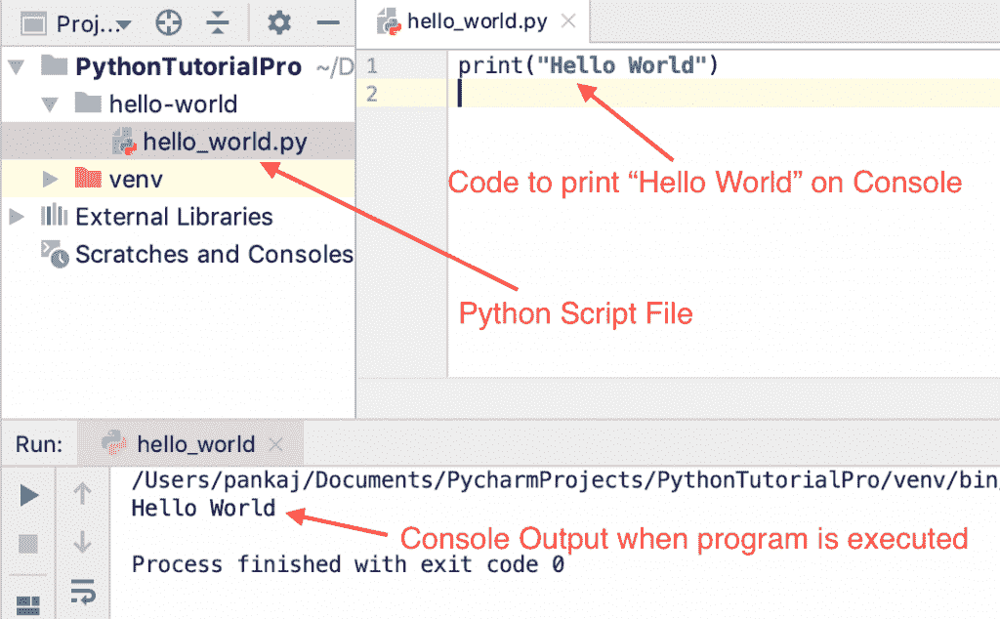
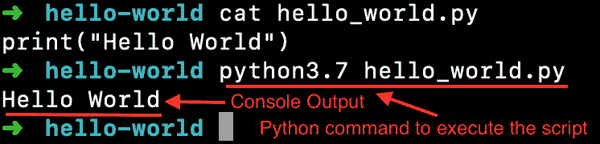
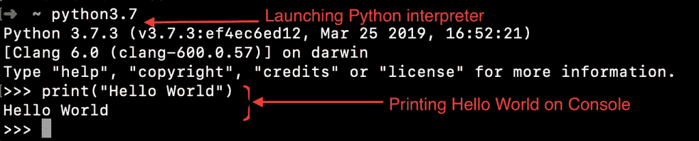

# Python Hello World 程序

> 原文：<https://www.askpython.com/python/hello-world>

如果您来到这里，我假设您听说过 Python 编程并想学习它。那太好了。学习任何新的编程语言的第一步是编写臭名昭著的 Hello World 程序。

让我们编写第一个 Python 程序，在控制台上打印“Hello World”。让我们先来看看这个程序，然后我们将学习 Python 程序是如何工作的。但是，在此之前，我们必须在电脑上安装 Python。

## 下载和安装 Python

Python 为不同的操作系统提供了不同的安装程序。因此，安装过程也略有不同，但在任何操作系统上安装 Python 都非常简单快捷。

### 1.在 Windows 上安装 Python

Python 为 Windows 提供了基于 UI 的完整安装程序。进入 [Python Releases for Windows](https://www.python.org/downloads/windows/) 页面，从“**稳定版本**部分，下载 **Windows Installer EXE** 文件。只要运行安装程序，它就会在 Windows 中安装 Python。确保选中将 Python 二进制文件夹添加到路径的选项，以节省额外的工作。

### 2.在 Mac OS 上安装 Python

转到 [Python Releases for macOS](https://www.python.org/downloads/macos/) 页面，从“稳定版本”部分下载 **macOS 64 位 universal2 安装程序**包。运行安装程序，它将在瞬间完成。

### 3.在 Linux/Unix 上安装 Python

大多数 Linux 操作系统都预装了 Python。只需运行“**python 3–version**”命令进行确认并检查版本即可。如果你想使用最新版本，请遵循 Python Docs 上[这一页的说明。](https://docs.python.org/3/using/unix.html#getting-and-installing-the-latest-version-of-python)

## 我喜欢这里

如果你是认真学习 Python 的，PyCharm IDE 是必须的。转到 [PyCharm 下载](https://www.jetbrains.com/pycharm/download/)页面，下载适用于您的操作系统的免费社区版本并进行安装。这非常简单，会节省你很多时间。

* * *

## Python Hello World 程序

现在我们已经在系统中安装了 Python，我们准备编写 Python 程序来打印 Hello World。下面是在控制台上打印“Hello World”的 python 脚本。

```py
print("Hello World")

```

对，就是这样。没有比这更简单的了。

下面是从 PyCharm IDE 中执行这个脚本时的输出。



Python Hello World Program Output

这是我们编写的最简单的程序。让我们也从 python 命令行解释器执行它。

```py
$ cat hello_world.py 
print("Hello World")
$ python3.7 hello_world.py 
Hello World
$

```



Python Hello World Program Execute From Terminal

* * *

## 从 Python 命令行解释器打印“Hello World”

Python 附带了一个解释器，这是一个类似 shell 的接口，用于运行 python 脚本。让我们看看如何从 python 解释器在控制台上打印“Hello World”消息。

```py
$ python3.7
Python 3.7.3 (v3.7.3:ef4ec6ed12, Mar 25 2019, 16:52:21) 
[Clang 6.0 (clang-600.0.57)] on darwin
Type "help", "copyright", "credits" or "license" for more information.
>>> print("Hello World")
Hello World
>>> 

```



Python Interpreter Hello World Example

* * *

## 了解 Python Hello World 程序

*   print()函数是内置函数之一。该函数将参数打印到控制台。
*   我们用字符串参数“Hello World”调用 print()函数，以便在控制台上打印出来。
*   当我们执行一个 python 脚本文件时，语句被一个接一个地执行。print()语句被执行，它将“Hello World”消息打印到控制台上。

* * *

## 摘要

我们从传统的“Hello World”程序开始了学习 Python 编程的旅程。我们在系统中安装了 Python 和 PyCharm IDE。我们了解到 python 程序可以从 PyCharm IDE 和终端执行。我们还对 python 解释器工具有了一些了解，它在运行小的 python 代码片段时非常有用。

## 下一步是什么？

如果你已经走到这一步，你注定要学习 Python。我建议你接下来浏览这 5 个教程。

*   [Python 数据类型](https://www.askpython.com/python/python-data-types)
*   [Python 函数](https://www.askpython.com/python/python-functions)
*   [Python 中的字符串](https://www.askpython.com/python/string/strings-in-python)
*   [Python 列表](https://www.askpython.com/python/list/python-list)
*   [Python 字典](https://www.askpython.com/python/dictionary/python-dictionary-dict-tutorial)