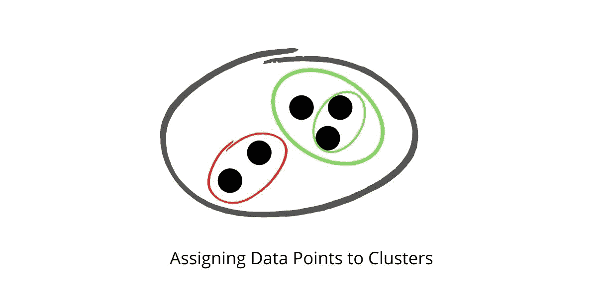
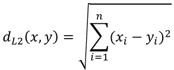
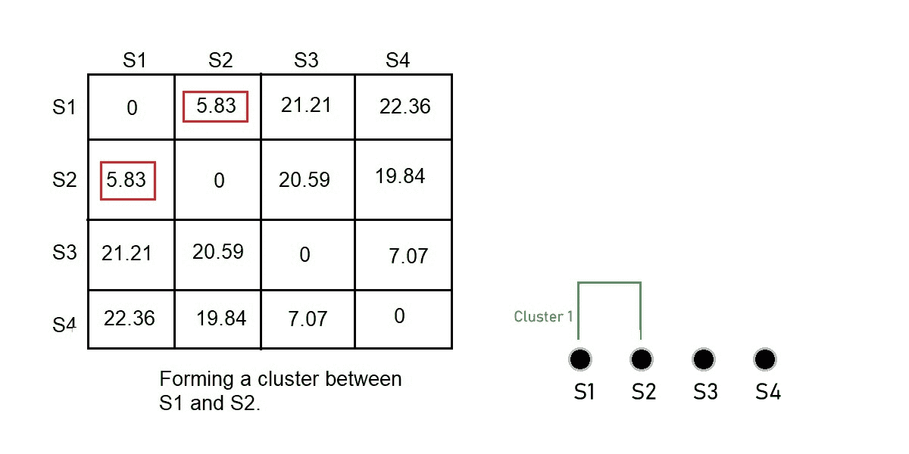
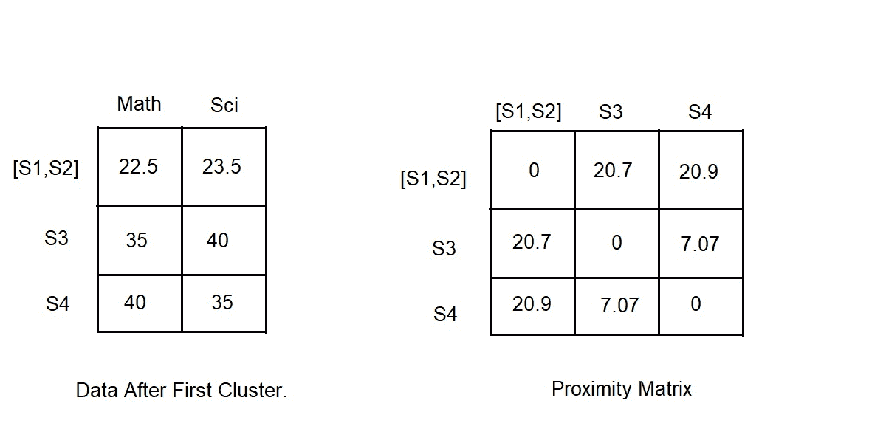
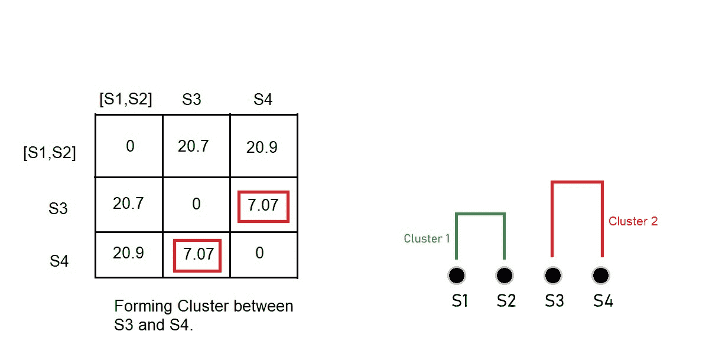
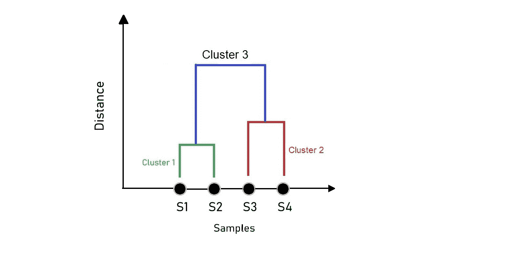
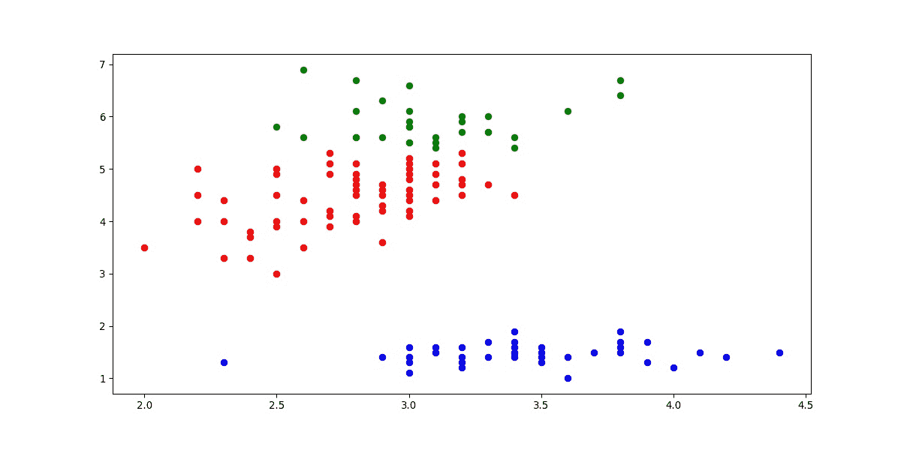
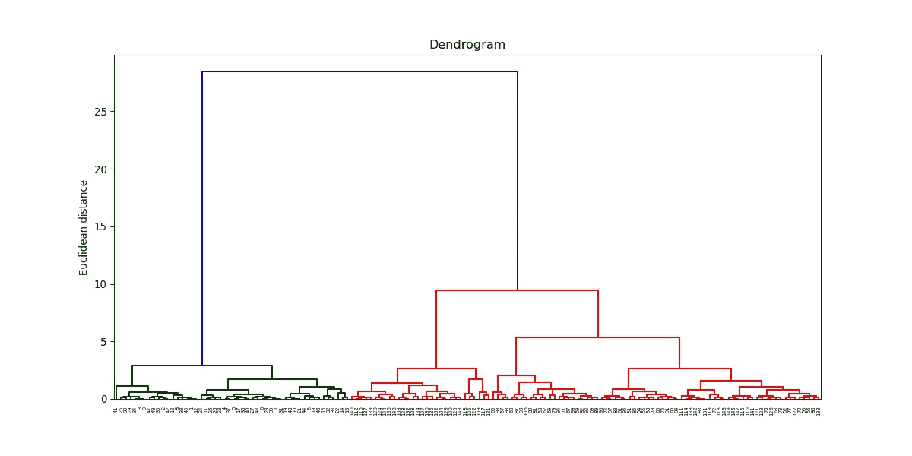

# 使用 Python 进行分层聚类

> 原文：<https://www.askpython.com/python/examples/hierarchical-clustering>

聚类是一种将相似数据点分组在一起的技术，所形成的相似数据点组被称为聚类。

很多时候，我们的数据没有任何标签；由于这一点，从中得出洞见和模式变得非常困难。

在这种情况下，无监督聚类技术开始发挥作用。在层次聚类中，我们基本上构建了一个聚类的层次结构。



**What Clustering Looks Like**

## **层次聚类的类型**

**层次聚类分为两种**:

*   凝聚层次聚类。
*   分裂层次聚类

### 1.**凝聚层次聚类**

在**凝聚层次聚类中，**每个数据点被认为是单个聚类，使得聚类的总数等于数据点的数量。然后，我们继续根据相似性指标对数据进行分组，随着我们在层次结构中的向上移动，形成聚类。这种方法也称为自底向上方法。

### 2.**分裂式层次聚类**

分裂的层次聚类与凝聚的 HC 相反。这里，我们从包含所有数据点的单个集群开始。在每次迭代中，我们会根据距离度量将距离较远的点分开，直到每个聚类都有一个数据点。

## 执行分层聚类的步骤

让我们用一个例子来形象化地展示层次聚类是如何工作的。

假设我们有与 4 名学生在数学和科学上的分数相关的数据，我们需要创建学生集群来获得洞察力。


**Example Dataset**

现在我们有了数据，我们需要做的第一步是查看每个数据点之间的距离。

为此，我们构建一个[距离矩阵](https://en.wikipedia.org/wiki/Distance_matrix)。每个点之间的距离可以使用各种度量来找到，即欧几里德距离、曼哈顿距离等。

在本例中，我们将使用欧几里德距离:



**Euclidean Distance**



**Distance Calculated Between Each Data Point**

我们现在在 S1 和 S2 之间形成了一个集群，因为它们彼此更接近。现在出现了一个问题，我们的数据现在是什么样子的？

我们取了 S1 和 S2 得分的平均值，我们得到的值将代表该组的得分。我们可以考虑聚类中数据点的最大值或最小值，而不是平均值。



**Dataset After First Clustering**

再次找到最近的点，并创建另一个集群。



**Clustering S3 And S4**

如果我们重复上面的步骤，继续进行聚类，直到只剩下一个包含所有聚类的聚类，我们会得到类似这样的结果:



**Dendrogram Of Our Example**

我们得到的图形就是我们所说的[树状图](https://en.wikipedia.org/wiki/Dendrogram)。树状图是一个类似树的图表，说明了由相应的分析产生的聚类的排列。x 轴上的样本会自动排列，表示彼此距离较近的点。

选择最佳的集群数量可能是一项棘手的任务。但是根据经验，我们寻找具有最长“分支”或“最长树状图距离”的集群。聚类的最佳数量也受到专家知识、上下文等的影响。

有了足够的想法，让我们继续用 python 实现一个。

## **用 Python 实现层次聚类**

让我们深入一个例子来最好地展示分层集群

我们将使用 Iris 数据集来执行聚类。你可以在这里获得更多关于虹膜数据集[的细节。](https://scikit-learn.org/stable/modules/generated/sklearn.datasets.load_iris.html)

### 1.绘制和创建集群

`sklearn.cluster`模块为我们提供了`AgglomerativeClustering`类来对数据集进行聚类。

作为输入参数，它需要多个集群(`n_clusters`)、`affinity`，这些集群对应于在创建[集群](https://www.askpython.com/python/examples/plot-k-means-clusters-python)、`linkage`、*链接{ "沃德"、"完整"、"平均"、"单一" }、默认= "沃德"*时要使用的距离度量的类型。

链接标准决定了在给定的观察组之间使用哪个距离。

你可以在这里了解更多`AgglomerativeClustering`班[。](https://scikit-learn.org/stable/modules/generated/sklearn.cluster.AgglomerativeClustering.html)

```py
#Importing required libraries

from sklearn.datasets import load_iris
from sklearn.cluster import AgglomerativeClustering
import numpy as np
import matplotlib.pyplot as plt

#Getting the data ready

data = load_iris()
df = data.data
#Selecting certain features based on which clustering is done 
df = df[:,1:3]

#Creating the model

agg_clustering = AgglomerativeClustering(n_clusters = 3, affinity = 'euclidean', linkage = 'ward')

#predicting the labels

labels = agg_clustering.fit_predict(df)

#Plotting the results

plt.figure(figsize = (8,5))
plt.scatter(df[labels == 0 , 0] , df[labels == 0 , 1] , c = 'red')
plt.scatter(df[labels == 1 , 0] , df[labels == 1 , 1] , c = 'blue')
plt.scatter(df[labels == 2 , 0] , df[labels == 2 , 1] , c = 'green')
plt.show()

```



**Output From The Code Above**

在上面的代码中，我们认为集群的数量是 3。

这一点很明显，因为 iris 数据集只包含 3 个不同的类，但在现实生活中，我们对数据执行无监督聚类，因为我们没有关于每个数据点所属标签的信息。

因此，找出集群的最佳数量取决于一些领域的专业知识。但是很少有方法可以找出我们将在以后的文章中讨论的最佳集群。

### 2.绘制树状图

`scipy.cluster`模块包含我们将用来绘制树状图的 hierarchy 类。

层次结构[类](https://www.askpython.com/python/oops/python-classes-objects)包含`dendrogram`方法和`linkage`方法。

`linkage`方法将数据集和最小化距离的方法作为参数，即 ward，并返回一个链接矩阵，该矩阵在提供给`dendrogram`方法时创建拟合数据的树状图。

我们用一个例子来看看上面的说法是什么意思。

```py
#Importing libraries
from sklearn.datasets import load_iris
from sklearn.cluster import AgglomerativeClustering
import numpy as np
import matplotlib.pyplot as plt
from scipy.cluster.hierarchy import dendrogram , linkage

#Getting the data ready

data = load_iris()
df = data.data
#Selecting certain features based on which clustering is done 
df = df[:,1:3]

#Linkage Matrix
Z = linkage(df, method = 'ward')

#plotting dendrogram
dendro = dendrogram(Z)
plt.title('Dendrogram')
plt.ylabel('Euclidean distance')
plt.show()

```



**Dendrogram Of The Data**

## 结论

在本文中，我们试图获得层次聚类真正是什么及其工作机制背后的一些基本直觉。我们也了解了如何用 Python 构建树状图并最终实现 HC。

快乐学习！