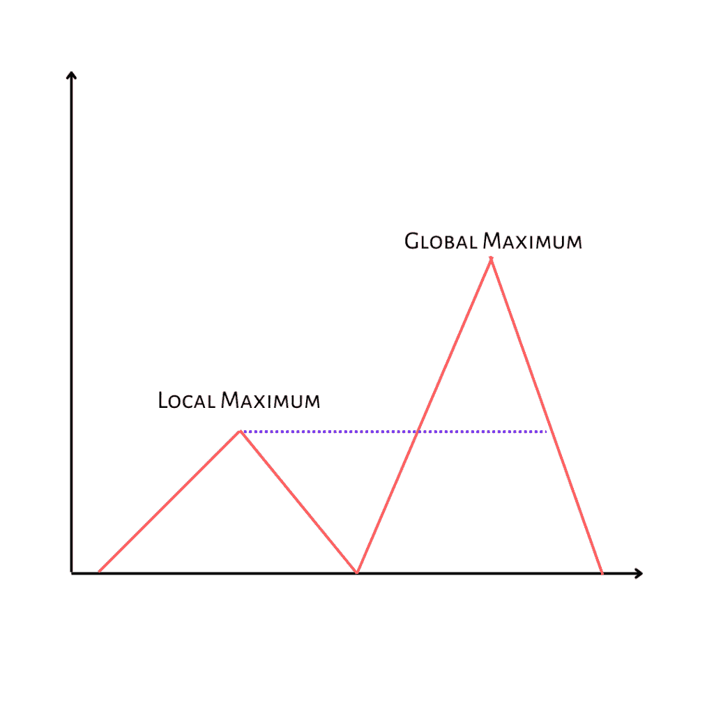
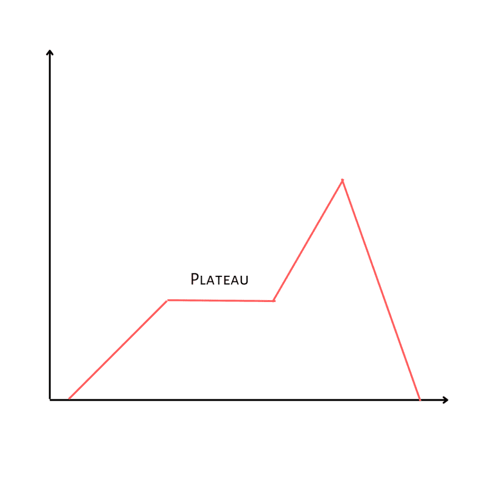
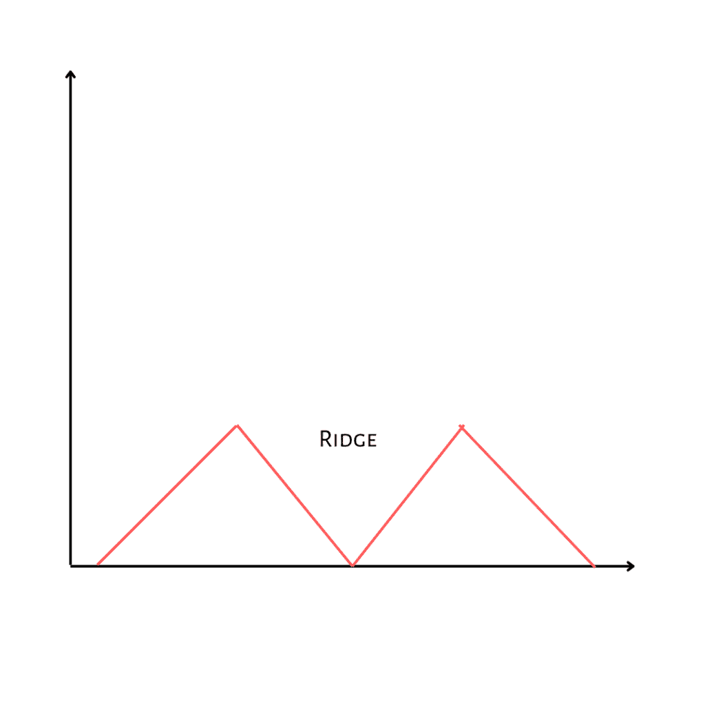

# Python 中的爬山算法

> 原文：<https://www.askpython.com/python/examples/hill-climbing-algorithm-in-python>

在本文中，让我们试着理解爬山算法。这是人工智能领域常用的启发式搜索技术。启发式技术是选择多个选项中的哪一个最能成功实现特定目标的标准。

***也读作:[分支和绑定搜索用 Python 实现](https://www.askpython.com/python/examples/branch-and-bound-search)** 和*

## 什么是爬山算法？

爬山来自于[深度优先搜索](https://www.askpython.com/python/examples/depth-first-search-in-a-graph)中的质量测量(生成和测试策略的变体)。这是一种优化策略，是局部搜索家族的一部分。

这是一个相当简单的实现策略，因为它是一个受欢迎的首选方案。有爬山是有效的例子，即使更复杂的算法可能产生更大的好处。

> 爬山可以用很多方法解决问题，但是有些方法比其他方法更好。旅行推销员问题可以用爬山来解决。找到一个访问每个城市的解决方案是很简单的，但是这个解决方案与理想的解决方案相比可能是不合格的。

如果有一种排列选项的技术，以便首先探索最有希望的节点，则可以提高搜索效率。爬山是以深度优先的顺序通过路径树进行的，但是选项是根据一些启发值(即从当前状态到目标状态的剩余成本的度量)排列的。

例如，在旅行推销员问题中，两个城市之间的直线距离可以作为剩余距离的启发式度量。

## 要记住的属性

*   局部搜索算法
*   遵循贪婪的方法
*   没有回溯。

## 爬山算法的类型

***简单爬山:*** 最简单的爬山方法叫做简单爬山。目标是登上这座山的最高峰。在这里，攀登者的脚步和移动决定了他如何移动。如果他认为他的下一步会比上一步更好，或者如果他停留在同一位置，他会继续移动。这个搜索只是关注他之前和之后的行为。

***最陡爬坡:*** 与简单的爬山搜索不同，它会比较所有后续节点，并选择最接近答案的一个。因为它集中在每个节点上，而不仅仅是一个，所以最陡爬山搜索可以与最佳优先搜索相媲美。

***随机爬山:*** 随机爬山中节点并不都集中在一起。它随机选择一个节点，然后决定是扩大它还是寻找更好的节点。

***随机重启爬山:*** 试错法是随机重启算法的基础。直到没有达到目标，它迭代地搜索节点，并在每个阶段选择最佳候选。成功往往取决于山峰的形状。如果没有很多山脊、高原或局部最大值，到达那里会更容易。

## 爬山的简单例子

为了更好地理解这个概念，让我们尝试使用爬山算法来实现一个旅行推销员的问题。下面是对该问题的描述。

寻找多个点和必须访问的地点之间的最短路径是被称为“旅行推销员问题”(TSP)的算法问题的目标。这里的输入是一个城市坐标的 2D 数组，输出是一个整数列表，按顺序表示城市的数量(从零开始)

## 用 Python 实现爬山算法

```py
import random
import numpy as np
import networkx as nx

#coordinate of the points/cities
coordinate = np.array([[1,2], [30,21], [56,23], [8,18], [20,50], [3,4], [11,6], [6,7], [15,20], [10,9], [12,12]])

#adjacency matrix for a weighted graph based on the given coordinates
def generate_matrix(coordinate):
    matrix = []
    for i in range(len(coordinate)):
        for j in range(len(coordinate)) :       
            p = np.linalg.norm(coordinate[i] - coordinate[j])
            matrix.append(p)
    matrix = np.reshape(matrix, (len(coordinate),len(coordinate)))
    #print(matrix)
    return matrix

#finds a random solution    
def solution(matrix):
    points = list(range(0, len(matrix)))
    solution = []
    for i in range(0, len(matrix)):
        random_point = points[random.randint(0, len(points) - 1)]
        solution.append(random_point)
        points.remove(random_point)
    return solution

#calculate the path based on the random solution
def path_length(matrix, solution):
    cycle_length = 0
    for i in range(0, len(solution)):
        cycle_length += matrix[solution[i]][solution[i - 1]]
    return cycle_length

#generate neighbors of the random solution by swapping cities and returns the best neighbor
def neighbors(matrix, solution):
    neighbors = []
    for i in range(len(solution)):
        for j in range(i + 1, len(solution)):
            neighbor = solution.copy()
            neighbor[i] = solution[j]
            neighbor[j] = solution[i]
            neighbors.append(neighbor)

    #assume that the first neighbor in the list is the best neighbor      
    best_neighbor = neighbors[0]
    best_path = path_length(matrix, best_neighbor)

    #check if there is a better neighbor
    for neighbor in neighbors:
        current_path = path_length(matrix, neighbor)
        if current_path < best_path:
            best_path = current_path
            best_neighbor = neighbor
    return best_neighbor, best_path

def hill_climbing(coordinate):
    matrix = generate_matrix(coordinate)

    current_solution = solution(matrix)
    current_path = path_length(matrix, current_solution)
    neighbor = neighbors(matrix,current_solution)[0]
    best_neighbor, best_neighbor_path = neighbors(matrix, neighbor)

    while best_neighbor_path < current_path:
        current_solution = best_neighbor
        current_path = best_neighbor_path
        neighbor = neighbors(matrix, current_solution)[0]
        best_neighbor, best_neighbor_path = neighbors(matrix, neighbor)

    return current_path, current_solution
final_solution = hill_climbing(coordinate)
print("The solution is \n", final_solution[1])

```

#### **输出**

解决方法是

[2, 4, 8, 3, 7, 5, 0, 6, 9, 10, 1]

## 爬山的问题

爬山有几个问题。搜索过程可能会到达一个不是解决方案的位置，但从那里没有任何行动来改善这种情况。如果我们到达了当地的最大值、平台或山脊，就会发生这种情况。

***局部最大值:*** 一个状态比它所有的邻居都好，但并不比远处的其他一些状态好，(前面可能有更好的解，这个解称为全局最大值。)从这种状态来看，所有的招式看起来都更差。在这种情况下，回溯到某个更早的状态，尝试从不同的方向寻找解决方案。



Local Maximum

***高原:*** 是搜索空间中所有相邻状态值相同的平坦区域。不可能确定最佳方向。在这种情况下，向某个方向进行一次大的跳跃，并尝试进入搜索空间的一个新部分。它也被称为平坦最大值。



Plateau

***山脊:*** 是搜索空间中高于周围区域，但在任何一个方向上不能被单次移动穿越的区域。它是一种特殊的局部极大值。在进行测试之前，应用两个或更多的规则，即同时向几个方向移动。



Ridge

### 摘要

本文深入解释了爬山算法的概念。我们了解了解决著名的旅行推销员问题的不同类型以及算法的实现。爬山算法广泛应用于数据科学和人工智能领域。