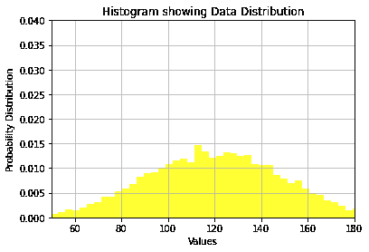
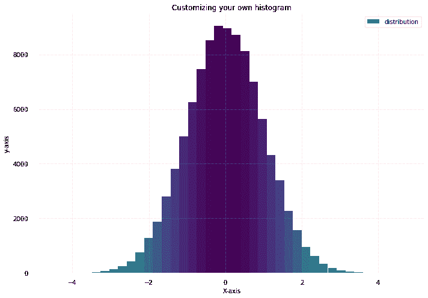
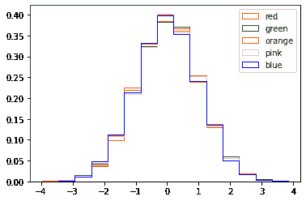
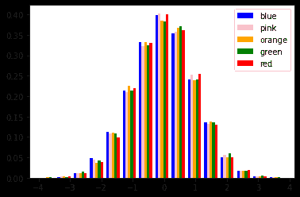
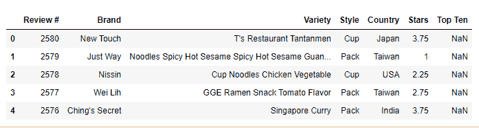
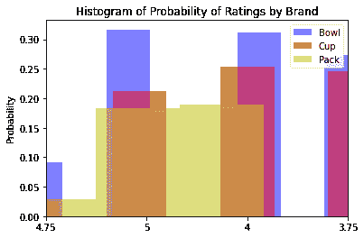
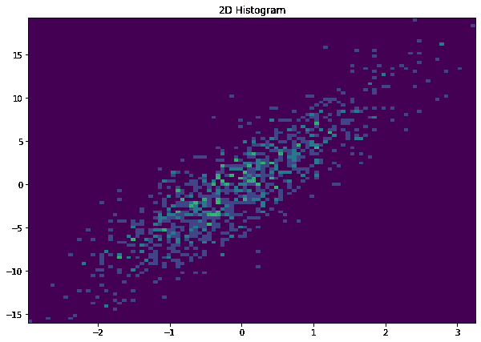

# 从基础到高级的 Matplotlib 直方图

> 原文：<https://www.askpython.com/python-modules/matplotlib/histogram-basic-to-advanced>

在今天的日报上，我们经常看到直方图和饼图解释股票或金融或新冠肺炎数据。毫无疑问，直方图使我们的日常生活变得更加容易。它们帮助我们直观地看到数据，并了解数据。在今天的这篇文章中，我们将学习直方图(从基础到高级)，以帮助您进行数据分析或机器学习项目。

## 什么是直方图？

直方图是一种条形图，用于表示数字数据分布。在直方图中，X 轴代表仓范围，Y 轴给出频率。直方图创建一个区间，将整个范围的值分布到区间中，并计算落入每个区间的值的数量(频率)。matplotlib.pyplot.hist()函数帮助我们绘制直方图。

## Python 中的 Matplotlib 库是什么？

Matplotlib 是 Python 中最常用的数据可视化库之一。对于简单的可视化和复杂的可视化，它都是一个很好的工具。

让我们快速看一下 matplotlib 直方图函数的语法:

```py
matplotlib.pyplot.hist(x, bins=None, range=None, density=False, weights=None, cumulative=False, bottom=None, histtype=’bar’, align=’mid’, orientation=’vertical’, rwidth=None, log=False, color=None, label=None, stacked=False)

```

| **参数** | **描述** |
| x | 这表示数组形式的输入参数。 |
| 垃圾箱 | 这表示值的范围。它可以接受整数值和序列值。 |
| 范围 | 通过此参数，包括箱的下限和上限范围。 |
| 密度 | 这通常包含布尔值，并表示为密度=计数/(总和(计数)* np.diff(面元))。 |
| 砝码 | 此参数表示每个值的权重。 |
| 累积的 | 该参数表示每个容器的计数以及先前值的容器计数。 |
| 底部 | 这表示每个箱的基线位置。 |
| 主机类型 | 该参数用于表示要绘制的直方图的类型。例如:条形、条形堆叠、阶梯或阶梯填充。如果你没有提到任何东西，它会把酒吧作为默认。 |
| 排列 | 这将有助于您确定直方图的位置。例如左、右或中间。它将取中间值作为默认值。 |
| 方向 | 此参数帮助您决定是要水平还是垂直绘制直方图。它将默认为垂直。 |
| 宽度 | 此参数帮助您设置条形相对于料箱宽度的相对宽度。 |
| 颜色 | 此参数将帮助您设置序列的颜色。 |
| 标签 | 此命令将帮助您设置直方图的标签。 |
| 叠放在一起的 | 此参数采用布尔值(真或假)。如果您将它作为 False 传递，那么数据将以并排的方式排列(如果您将 histtype 作为一个条给出),或者如果它是一个步骤，则数据将排列在彼此之上。如果您将此参数作为 True 传递，数据将相互堆叠。
该参数的默认值为假。 |

## 导入 Matplotlib 和必要的库

在开始绘制直方图之前，我们将导入所有必要的库。让我们来看看如何安装 matplotlib 和必要的库。

```py
import matplotlib.pyplot as plt
import numpy as np
import pandas as pd

```

现在，让我们从最基本的开始，然后我们将移动到高级直方图。

## 基本分布直方图

为了创建基本分布的直方图，我们在这里使用了 random NumPy 函数。为了表示数据分布，我们还传递了平均值和标准偏差值。

在直方图函数中，我们已经提供了值的总计数、箱的数量和补丁的数量。

我们还传递了输入参数，如密度、面颜色和 alpha，以使直方图更具代表性。你可以试着改变箱子的大小和数量。我们将直方图类型作为条形传递到这里。

xlim 和 ylim 分别用于设置 X 轴和 Y 轴的最小值和最大值。如果您不希望有网格线，您仍然可以将 plt.grid 函数作为 False 传递。

```py
import matplotlib.pyplot as plt
import numpy as np
import pandas as pd

# Using numpy random function to generate random data
np.random.seed(19685689)

mu, sigma = 120, 30
x = mu + sigma * np.random.randn(10000)

# passing the histogram function
n, bins, patches = plt.hist(x, 70, histtype='bar', density=True, facecolor='yellow', alpha=0.80)

plt.xlabel('Values')
plt.ylabel('Probability Distribution')
plt.title('Histogram showing Data Distribution')
plt.xlim(50, 180)
plt.ylim(0, 0.04)
plt.grid(True)
plt.show()

```

输出:



## 带颜色分布的直方图

用颜色表示绘制直方图是一种很好的方法，可以直观显示数据范围内的不同值。我们将对这种类型的情节使用支线剧情功能。我们已经删除了轴棘和 x，y 刻度，使情节看起来更像样。我们还添加了填充和网格线。

对于颜色表示，我们已经将直方图分成分数或块，然后为直方图的不同部分设置不同的颜色。

```py
#importing the packages for colors 
from matplotlib import colors 
from matplotlib.ticker import PercentFormatter 

# Forming the dataset with numpy random function
np.random.seed(190345678) 
N_points = 100000
n_bins = 40

# Creating distribution 
x = np.random.randn(N_points) 
y = .10 ** x + np.random.randn(100000) + 25
legend = ['distribution'] 

# Passing subplot function
fig, axs = plt.subplots(1, 1, figsize =(10, 7),  tight_layout = True) 

# Removing axes spines  
for s in ['top', 'bottom', 'left', 'right']:  
    axs.spines[s].set_visible(False)  

# Removing x, y ticks 
axs.xaxis.set_ticks_position('none')  
axs.yaxis.set_ticks_position('none')  

# Adding padding between axes and labels  
axs.xaxis.set_tick_params(pad = 7)  
axs.yaxis.set_tick_params(pad = 15)  

# Adding x, y gridlines  
axs.grid(b = True, color ='pink',  linestyle ='-.', linewidth = 0.6,  alpha = 0.6)  

# Passing histogram function
N, bins, patches = axs.hist(x, bins = n_bins) 

# Setting the color 
fracs = ((N**(1 / 5)) / N.max()) 
norm = colors.Normalize(fracs.min(), fracs.max()) 

for thisfrac, thispatch in zip(fracs, patches): 
    color = plt.cm.viridis_r(norm(thisfrac)) 
    thispatch.set_facecolor(color) 

# Adding extra features for making it more presentable    
plt.xlabel("X-axis") 
plt.ylabel("y-axis") 
plt.legend(legend) 
plt.title('Customizing your own histogram') 

plt.show()

```

输出:



## 带条形图的直方图

这很容易做到。为此，我们刚刚使用 Numpy random 函数创建了随机数据，然后我们使用了 hist()函数，并将 histtype 参数作为一个条传递。您可以将参数更改为条形堆叠台阶或台阶井。

```py
np.random.seed(9**7) 
n_bins = 15
x = np.random.randn(10000, 5) 

colors = ['blue', 'pink', 'orange','green','red'] 

plt.hist(x, n_bins, density = True,  histtype ='step', color = colors, label = colors) 

plt.legend(prop ={'size': 10}) 

plt.show()

```

输出:



## KDE 图和直方图

这是另一种用 KDE 绘制直方图的有趣方法。在这个例子中，我们将在子图函数的帮助下绘制 KDE(内核密度估计)和直方图。KDE 图有助于确定给定空间中数据的概率。因此，结合 KDE 图和直方图，我们可以表示数据的概率分布。为此，我们首先通过生成均值和标准差的随机值创建了一个数据框，并为 loc 参数分配了均值，为 scale 参数分配了标准差。

```py
np.random.seed(9**7) 
n_bins = 15
x = np.random.randn(10000, 5) 

colors = ['blue', 'pink', 'orange','green','red'] 

plt.hist(x, n_bins, density = True,  histtype ='bar', color = colors, label = colors) 

plt.legend(prop ={'size': 10}) 

plt.show()

```

输出:



## 多变量直方图

在本例中，我们使用“拉面评级”数据集来绘制包含多个变量的直方图。我们给三种不同品牌的拉面分配了不同的变量。我们已经使用 hist()函数三次来创建三个不同品牌的拉面的直方图，并绘制三个不同品牌的拉面获得 5 星评级的概率。

```py
import pandas as pd
df = pd.read_csv("C://Users//Intel//Documents//ramen-ratings.csv")
df.head()

```



```py
x1 = df.loc[df.Style=='Bowl', 'Stars']
x2 = df.loc[df.Style=='Cup', 'Stars']
x3 = df.loc[df.Style=='Pack', 'Stars']

# Normalize
kwargs = dict(alpha=0.5, bins=60, density=True, stacked=False)

# Plotting the histogram
plt.hist(x1,**kwargs,histtype='stepfilled',color='b',label='Bowl')
plt.hist(x2,**kwargs,histtype='stepfilled',color='r',label='Cup')
plt.hist(x3,**kwargs,histtype='stepfilled',color='y',label='Pack')
plt.gca().set(title='Histogram of Probability of Ratings by Brand', ylabel='Probability')
plt.xlim(2,5)
plt.legend();

```

输出:



## 二维直方图

2D 直方图是可视化数据的另一种有趣方式。我们可以使用函数 plt.hist2d 绘制一个直方图，我们可以像前面一样定制绘图和 bin 大小。下面让我们来看一个非常简单的 2D 直方图的例子。

```py
import numpy as np
import matplotlib.pyplot as plt
import random

# Generating random data
n = 1000
x = np.random.standard_normal(1000)
y = 5.0 * x + 3.0* np.random.standard_normal(1000)

fig = plt.subplots(figsize =(10, 7))

# Plotting 2D Histogram
plt.hist2d(x, y,bins=100)
plt.title("2D Histogram")

plt.show()

```

输出:



## 结论

总之，我们学习了绘制直方图和自定义直方图的五种不同方法，以及如何在数据集中创建包含多个变量的直方图。这些方法将对您在任何数据科学项目中可视化数据有很大帮助。