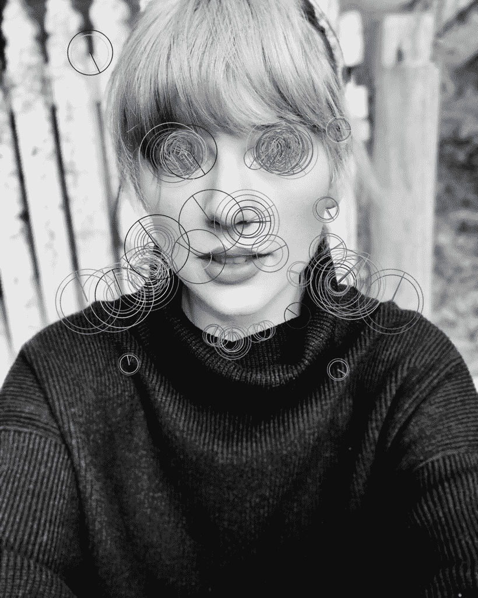

# 使用 Python OpenCV 识别图像中的关键点

> 原文：<https://www.askpython.com/python/examples/identifying-keypoints-in-images-opencv>

嘿伙计们！在本教程中，我们将了解如何使用 Python 编程语言中的 OpenCV 库来识别图像中的关键点。

OpenCV 关键点用于各种计算机视觉应用，包括人体姿势检测、人脸识别、手势检测等。

* * *

## 为什么有必要识别图像中的关键点？

在执行图像处理时，计算机应该能够识别给定图像中的可比质量，而不管它经历的变换和旋转。

计算机还应该能够发现同类照片之间的相似之处。这可以通过观察给定图像中的重要点来实现。

例如，人脸上的主要点是两个眼角、两个嘴角、下巴和鼻尖。

基本的概念是，不管一张图片有多大的变化，计算机应该在新的图像中发现相同的重要特征。

当照片更新时，计算机检查某个关键点周围的像素值并识别它。

* * *

## 代码实现

所有计算机视觉应用的基本概念是关键点的确定。在这一节中，我们将在给定的图片上标出关键点。

为此，我们将采用 ORB 算法。首先，我们将包括 **cv2 库**和 **cv2 imshow()方法**。

```py
from google.colab.patches import cv2_imshow
import cv2

```

现在我们将使用 **imread()方法**来读取图片。我们要利用的图像是彩色的。因此，我们将通过将标志值设置为零来将其更改为黑白。

```py
img = cv2.imread('sample.jpg',0)
cv2_imshow(img)

```


Loaded Image Keypoints

我们现在将利用 **cv2。ORB create()方法**。我们将传递 200 作为期望的点数。

```py
orb = cv2.ORB_create(200)

```

现在我们将使用 **orb.detectAndCompute()** 来查找关键点并计算描述符。最后将图片作为参数传递。

它返回两个值:**要点和描述**。

我们将使用 **drawKeypoints()** 方法绘制所有的关键点。然后，图片、关键点和标志值将作为输入发送。

```py
keypoint, des = orb.detectAndCompute(img, None)
img_final = cv2.drawKeypoints(img, keypoint, None, flags=cv2.DRAW_MATCHES_FLAGS_DRAW_RICH_KEYPOINTS)

```

最后，我们将使用 **cv2_imshow** 来绘制图片中的所有关键点()。

```py
cv2_imshow(img_final)

```



Final Keypoints Image Output

* * *

## 结论

恭喜你！您刚刚学习了如何使用 Python 中的 OpenCV 库在图像中找到关键点。

希望你喜欢它！😇

喜欢这个教程吗？无论如何，我建议你看一下下面提到的教程:

1.  [使用直方图可视化图像中的颜色–Python OpenCV](https://www.askpython.com/python/visualizing-colors-in-images)
2.  [使用 OpenCV 绘制形状——完整的操作指南](https://www.askpython.com/python/examples/draw-shapes-using-opencv)
3.  [使用 OpenCV 的 Python 信用卡读卡器](https://www.askpython.com/python/examples/opencv-credit-card-reader)
4.  [Python OpenCV filter2D()函数——完整指南](https://www.askpython.com/python-modules/opencv-filter2d)

感谢您抽出时间！希望你学到了新的东西！！😄

* * *