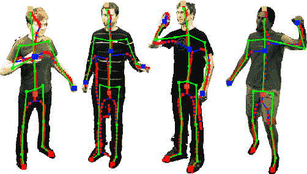
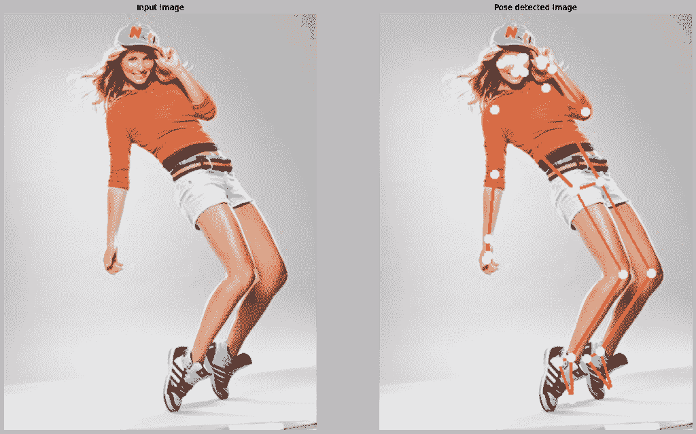

# Python 编程语言中的图像姿态检测

> 原文：<https://www.askpython.com/python-modules/image-pose-detection-mediapipe>

在本教程中，我们将实现一个程序，这将有助于检测图像中的姿态，并将它们标记为图像上的地标。我们先来了解一下什么是姿态检测。

姿态估计是一种计算机视觉方法，用于跟踪人或物体的运动。这通常通过为所提供的项目定位关键点来实现。我们将使用`mediapipe`库，这是一个跨平台的开源工具，用于创建多模型机器学习管道。它能够实现前沿模型，如人脸识别、多手跟踪、头发分割、对象检测和跟踪等。



Pose Detection Demo

## 用 Python 实现图像后期检测器

让我们从将我们需要的所有必要的库导入程序开始。这些库包括 OpenCV、mediapipe 和 matplotlib 库。

```py
import cv2
import mediapipe as mp
import matplotlib.pyplot as plt

```

第一步是初始化我们的姿态检测模型。使用`solutions.pose`函数对其进行初始化。

接下来，我们将使用 Pose 方法`mp_pose.Pose`存储 pose_image。该函数将接受许多参数。这些参数定义了我们正在处理的图像，并且还设置了置信度得分。我们将为视频设置一个类似的 Pose 方法，并传递必要的参数值。

最后，我们将使用`drawing_utils`函数在图像上绘制所有的姿态估计点。

**看下面的代码。**

```py
mp_pose = mp.solutions.pose

pose_image = mp_pose.Pose(static_image_mode=True, 
                          min_detection_confidence=0.5)

pose_video = mp_pose.Pose(static_image_mode=False, 
                          min_detection_confidence=0.7,
                          min_tracking_confidence=0.7)

mp_drawing = mp.solutions.drawing_utils

```

下面显示的函数是主函数，它将在向函数输入一些参数后估计姿态。

我们将从创建用户提供的原始图像的副本开始，只是为了有一个安全的备份。接下来，我们将把图像转换成 RGB 格式，以便于处理。

下一步将在`process`功能的帮助下对 RGB 转换图像进行姿态检测。现在我们检查标志的有效性，并决定是否需要绘制线和标志点。

```py
def detectPose(image_pose, pose, draw=False, display=False):
    original_image = image_pose.copy()
    image_in_RGB = cv2.cvtColor(image_pose, cv2.COLOR_BGR2RGB)
    resultant = pose.process(image_in_RGB)
    if resultant.pose_landmarks and draw:    
        mp_drawing.draw_landmarks(image=original_image, 
                                  landmark_list=resultant.pose_landmarks,
                                  connections=mp_pose.POSE_CONNECTIONS,
                                  landmark_drawing_spec=mp_drawing.DrawingSpec(color=(255,255,255),
                                                                               thickness=2, circle_radius=2),
                                  connection_drawing_spec=mp_drawing.DrawingSpec(color=(49,125,237),
                                                                               thickness=2, circle_radius=2))
    if display:
            plt.figure(figsize=[22,22])
            plt.subplot(121);plt.imshow(image_pose[:,:,::-1])
            plt.title("Input Image",size=14)
            plt.axis('off');
            plt.subplot(122);plt.imshow(original_image[:,:,::-1])
            plt.title("Pose detected Image",size=14)
            plt.axis('off');

    else:        
        return original_image, resultant

```

最后，我们将针对一些图像测试上面代码片段中的函数。其中一些的输出如下所示。

## 样本输出


Pose Detection Output 1



Pose Detection Output 2


Pose Detection Output 3

## 结论

你可以看到结果非常令人满意，我们可以肯定地说，Mediapipe 在检测图像中的姿势方面做得非常好。

感谢您的阅读！