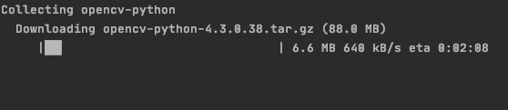
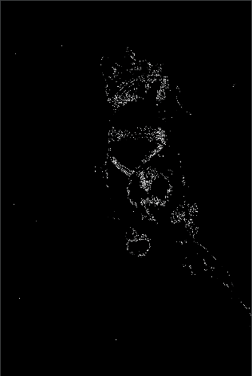
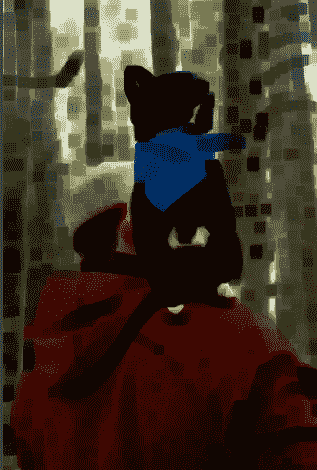
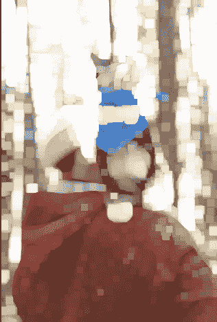

# Python 中的图像处理–边缘检测、调整大小、腐蚀和膨胀

> 原文：<https://www.askpython.com/python/examples/image-processing-in-python>

图像处理是计算机科学中一个发展迅速的领域。它在越来越多的未来技术中得到了应用。Python 中的图像处理也为计算机视觉和人工智能等更高级的领域提供了空间。

它是您可以对图像执行的操作的集合。通常需要这些操作来将图像转换成更容易训练的格式。其中一些操作是转换为灰度、旋转、裁剪和边缘检测。

**一个合适的定义可以给出为:**

***图像处理**涉及到对一幅图像执行一些操作，以得到一幅增强的图像或者从中提取一些有用的信息。*

我们将在本教程中探讨一些重要的图像处理操作。

在本教程中，我们使用 **OpenCV** 来实现图像处理的任务。这是我们上一篇关于[用 Python](https://www.askpython.com/python-modules/read-images-in-python-opencv) 读取图像的后续教程。

因此，让我们从学习如何使用 OpenCV 将图像导入 python 开始。在此之前，我们需要在我们的系统上安装 OpenCV。

## 安装 Python 的图像处理库——OpenCV

您可以使用下面给出的 pip 命令安装 OpenCV:

```py
pip install opencv-python

```



Install Opencv

完成安装后，您可以在导入后开始使用它。

将 OpenCV 导入 python 笔记本的代码行是:

```py
import cv2

```

## 使用 Python 进行边缘检测

OpenCV 还为您提供了检测图像边缘的选项。边缘检测广泛应用于特征描述、图像分割、图像增强、图像恢复、模式识别和图像压缩。

我们将使用 **canny 边缘检测器**执行边缘检测。Canny 边缘检测需要一个**最大值**和一个**最小值**来进行边缘检测。

强度梯度大于 maxVal 的任何边缘肯定是边缘，而小于 minVal 的边缘肯定是非边缘，因此被丢弃。

要执行边缘检测，请使用以下代码行:

```py
edges = cv2.Canny(image,50,300)

```

第一个参数是图像的变量名。

保存结果图像的完整代码是:

```py
import cv2
image = cv2.imread("sample.jpg")
edges = cv2.Canny(image,50,300)
cv2.imwrite('sample_edges.jpg',edges)

```

生成的图像如下所示:



Edge Detection

## 在 Python 中调整图像大小

调整大小是处理图像时需要执行的另一个重要操作。

OpenCV 为您提供了一种调整图像大小的方法。要调整图像的大小，请使用以下代码行:

```py
res = cv2.resize(img,None,fx=2, fy=2, interpolation = cv2.INTER_CUBIC)

```

这里 **fx** 是沿水平轴的比例因子，而 **fy** 是沿垂直轴的比例因子。

不同的插值方法可用于不同的功能。

可以用 **cv2。用于收缩的 INTER_AREA** 和 **cv2。INTER_CUBIC** & **cv2。INTER_LINEAR** 用于变焦。与线性插值相比，三次插值速度较慢。

## 形态学图像处理操作

OpenCV 还为您提供了对图像执行形态学操作的选项，如腐蚀、膨胀、打开、关闭。

形态学运算是基于形状的。要对图像应用形态学操作，您需要一个结构化元素。结构化元素是 2D 二进制矩阵。

### 1.图像腐蚀

图像处理中侵蚀的基本概念类似于土壤侵蚀。它侵蚀了前景对象的边界。

侵蚀会减少图像中的白色区域。

要在图像上应用腐蚀，请使用下面几行代码。

```py
kernel = np.ones((5,5),np.uint8)
erosion = cv2.erode(image,kernel,iterations = 30)

```

这里的第一行声明了内核，第二行使用内核来执行侵蚀。

**保存结果图像的完整代码是:**

```py
import cv2
import numpy as np
image = cv2.imread("sample.jpg")
kernel = np.ones((5,5),np.uint8)
erosion = cv2.erode(image,kernel,iterations = 30)
cv2.imwrite('sample_erode.jpg',erosion)

```

生成的图像如下所示:



Erosion

### 2.图像膨胀

膨胀是侵蚀的反义词。它增加了图像中的白色区域。

要在图像上应用膨胀，请使用以下代码行:

```py
kernel = np.ones((5,5),np.uint8)
dilation = cv2.dilate(image,kernel,iterations = 30)

```

**保存结果图像的完整代码如下:**

```py
import cv2
import numpy as np
image = cv2.imread("sample.jpg")
kernel = np.ones((5,5),np.uint8)
dilation = cv2.dilate(image,kernel,iterations = 30)
cv2.imwrite('sample_dilate.jpg',dilation)

```

生成的图像如下所示:



Dilation

为了去除图像中的噪声，您可以先进行**腐蚀，然后再进行膨胀。**

## 结论

本教程是关于 python 中的图像处理的。我们讨论了 OpenCV 提供的一些基本的图像处理操作。想了解更多关于 OpenCV 的内容，可以参考他们的[官方教程](https://opencv-python-tutroals.readthedocs.io/en/latest/index.html)。