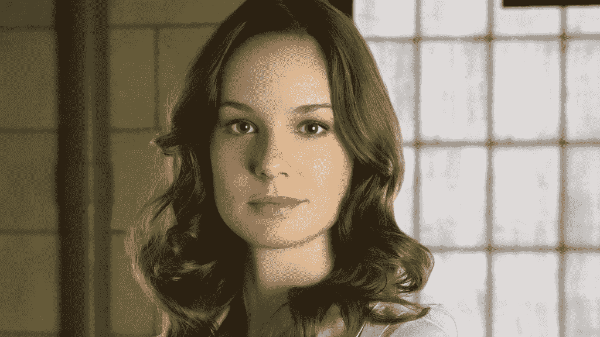
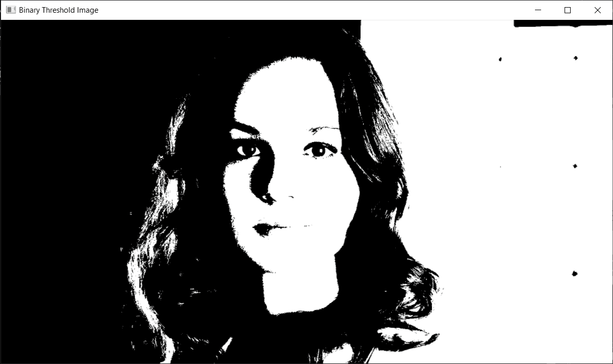
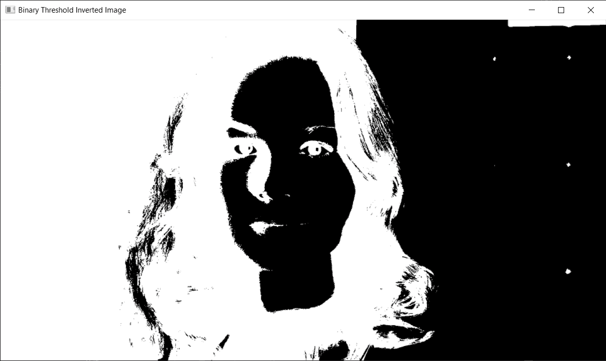
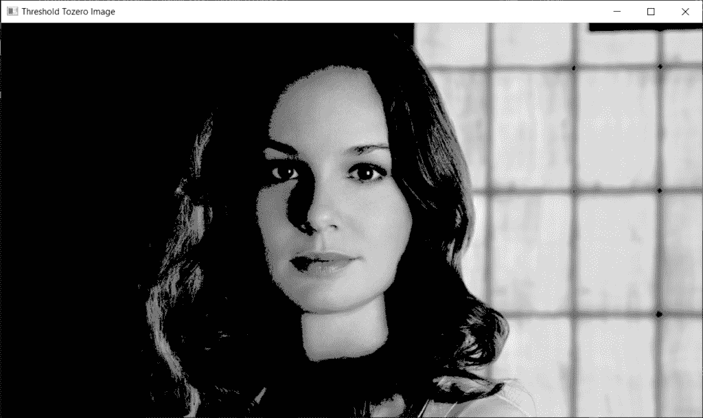
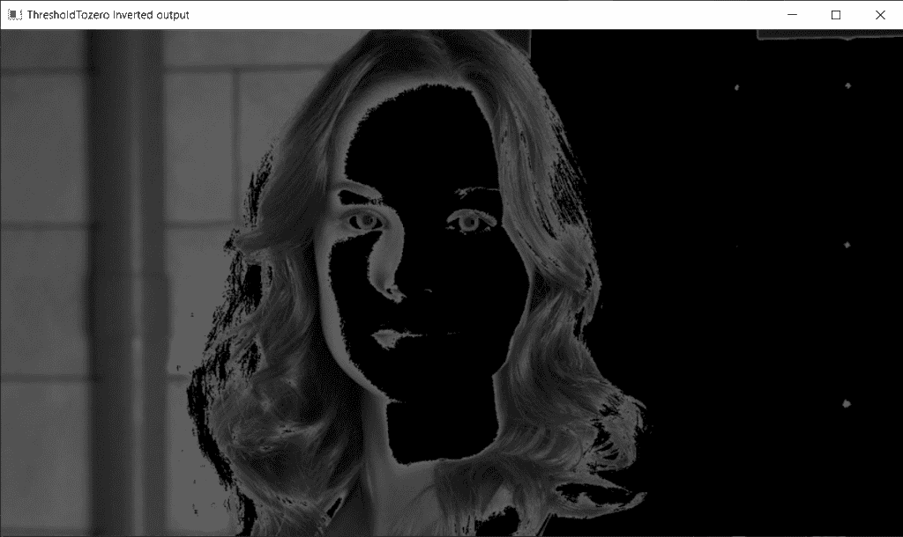
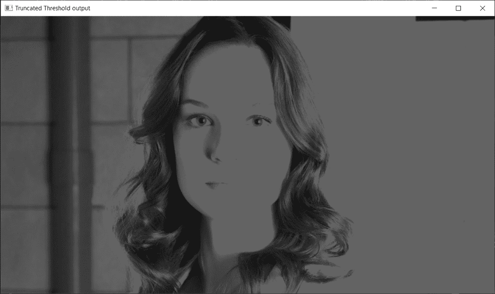
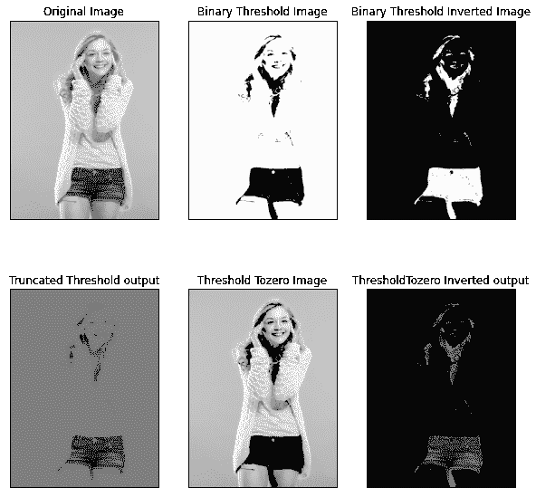

# Python 中的图像阈值处理——简单快速指南

> 原文：<https://www.askpython.com/python/examples/image-thresholding>

嘿，程序员朋友！今天，我们将了解什么是图像阈值，以及如何在 python 编程语言中实现图像阈值。

让我们直接进入概念！

***也读作:*** [***利用 Python 进行图像中的边缘检测***](https://www.askpython.com/python/examples/edge-detection-in-images) 。

## 什么是图像阈值处理？

`Thresholding`定义为将图像分为两部分的过程，即:**“前景”和“背景”**。它主要用于各种图像处理任务，允许更好的图像识别和分割等。

## 不同类型的阈值技术

人们可以实现各种阈值技术，这些技术在下面被命名和描述:

| **序列号** | **阈值技术名称** | **功能名称** | **描述** |
| one | 二元阈值 | cv2。THRESH_BINARY | 1.(像素强度) >设置阈值:255(白色)
2。否则设置为 0(黑色)。 |
| Two | 二元反向阈值 | cv2。阈值 _ 二进制 _INV | cv2 的反例。THRESH_BINARY。 |
| three | 零阈值 | cv2.THRESH_TOZERO | 1.(像素强度)< set threshold value : 0 (black)
2。否则将其设置为白色 |
| four | 零反转阈值 | S7-1200 可编程控制器 | cv2 的反例。阈值为零 |
| five | 截断阈值 | cv2。TRUNC 阈值 | 1.(像素强度) >阈值:截断到阈值。
2。像素值被设置为与阈值相同。
3。所有其他值保持不变。 |

Various Thresholding Techniques

* * *

***也读: [Python:将图像转换成铅笔素描](https://www.askpython.com/python/examples/images-to-pencil-sketch)***

## 完整的代码

由于阈值方法具有用于实现的直接函数，我们可以直接查看阈值方法的代码实现。我希望你理解同样的编码实现。

```py
import cv2  
import numpy as np

img = cv2.imread('lori.jpg')  
img = cv2.cvtColor(img,cv2.COLOR_BGR2GRAY) 

ret, thresh_hold = cv2.threshold(img, 100, 255, cv2.THRESH_BINARY) 
ret, thresh_hold1 = cv2.threshold(img, 100, 255, cv2.THRESH_BINARY_INV) 
ret, thresh_hold2 = cv2.threshold(img, 100, 255, cv2.THRESH_TOZERO) 
ret, thresh_hold3 = cv2.threshold(img, 100, 255, cv2.THRESH_TOZERO_INV) 
ret, thresh_hold4 = cv2.threshold(img, 100, 255, cv2.THRESH_TRUNC)   

thresh_hold = cv2.resize(thresh_hold, (960, 540))    
cv2.imshow('Binary Threshold Image', thresh_hold) 

thresh_hold1 = cv2.resize(thresh_hold1, (960, 540))    
cv2.imshow('Binary Threshold Inverted Image', thresh_hold1) 

thresh_hold2 = cv2.resize(thresh_hold2, (960, 540))    
cv2.imshow('Threshold Tozero Image', thresh_hold2) 

thresh_hold3 = cv2.resize(thresh_hold3, (960, 540))    
cv2.imshow('ThresholdTozero Inverted output', thresh_hold3) 

thresh_hold4= cv2.resize(thresh_hold4, (960, 540))    
cv2.imshow('Truncated Threshold output', thresh_hold4) 

if cv2.waitKey(0) & 0xff == 25:  
    cv2.destroyAllWindows()

```

* * *

## 样本输出–1

### 1.原始图像输出



Lori

### 2.二值阈值图像输出



Binary Threshold Image

### 3.二进制反转阈值图像输出



Binary Inverted Threshold Image

### 4.阈值到零输出



Threshold Tozero Image

### 5.阈值归零反相输出



Threshold Tozero Inverted Image

### 6.截断阈值图像输出



Truncated Threshold Image

* * *

## 样本输出–2



Threshold Sample Output 2

* * *

## 结论

最后，我想让你自己尝试对不同的图像进行阈值处理，看看不同图像的输出结果。感谢您的阅读！

快乐学习！