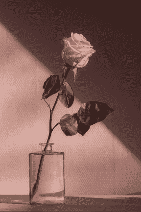

# ImageEnchance:增强 Python 中的图像

> 原文：<https://www.askpython.com/python-modules/imageenchance>

你好，程序员朋友！在本教程中，我们将讨论枕头库下 Python 中可用的`ImageEnchance`库。借助子库中的各种功能，它可以用于以多种方式处理图像。

***也读作:[使用直方图可视化图像中的颜色——Python OpenCV](https://www.askpython.com/python/visualizing-colors-in-images)***

我们开始吧！

## 图像增强。Color()函数

这个函数返回一个图像输出，但是颜色发生了变化。因子值可以是您想要的任何值。值 0 表示黑白图像，值 1 表示原始图像。

让我们从显示原始图像开始。我已经采取了一个样本图像的玫瑰，你可以采取任何其他图像你想要的。

```py
from PIL import ImageEnhance, Image
img = Image.open('samp.jpg')
factor = 1.0
enhancer = ImageEnhance.Color(img)
enhancer.enhance(factor).show()

```


ImageEnhancer Original Image

现在，让我们试着想象同一张图片的黑白版本。

```py
from PIL import ImageEnhance, Image
img = Image.open('samp.jpg')
factor = 0.0
enhancer = ImageEnhance.Color(img)
enhancer.enhance(factor).show()

```


ImageEnhancer Black And White Image

你想知道如果我给函数传递一个负值会发生什么吗？很明显，图像将开始向负方向移动。下面看看。

```py
from PIL import ImageEnhance, Image
img = Image.open('samp.jpg')
factor = -1.0
enhancer = ImageEnhance.Color(img)
enhancer.enhance(factor).show()

```


ImageEnhancer Negative Image

## 图像增强。亮度()函数

你也可以使用下面的代码来调整图像的亮度。我们需要做的就是使用`ImageEnhance.Brightness`函数捕捉图像的当前亮度，然后对图像应用新的亮度因子。

```py
from PIL import ImageEnhance, Image
img = Image.open('samp.jpg')

curr_bri = ImageEnhance.Brightness(img)
new_bri = 2.0

enhancer = curr_bri.enhance(new_bri)
enhancer.show()

```


ImageEnhancer Changed Brightness

## 图像增强。Contrast()函数

当此处的因子值设置为 0.0 时，将给出纯灰图像，而值 1.0 将返回原始图像。我们将保持该值为 3，以查看高对比度图像。

```py
from PIL import ImageEnhance, Image
img = Image.open('samp.jpg')
factor = 3.0
enhancer = ImageEnhance.Contrast(img)
enhancer.enhance(factor).show()

```


ImageEnhancer High Contrast Image

## 图像增强。锐度()函数

在此功能的帮助下，您还可以体验一下图像的清晰度。这里的因子设置为 30，以获得更清晰的图像。值越低，图像越模糊！

```py
from PIL import ImageEnhance, Image
img = Image.open('samp.jpg')
factor = 30.0
enhancer = ImageEnhance.Sharpness(img)
enhancer.enhance(factor).show()

```



ImageEnhancer Sharpen Image

## 结论

我希望您在 Python 中使用 ImageEnchance 库时感到愉快。尝试所有不同的函数和不同的值，并惊讶于结果是多么完美！

编码快乐！

***也可阅读:[Python 中的图像去噪——分步指南](https://www.askpython.com/python/examples/denoising-images-in-python)***