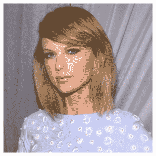

# 枕头中的 ImageOps 模块简介

> 原文：<https://www.askpython.com/python/examples/imageops-module-in-pillow>

程序员们，你们好！在本教程中，我们将看看 Python 的 ImageOps 模块。

该模块包括许多预置的图像处理方法。此外，大多数操作者只处理 L 和 RGB 图像。ImageOps 模块的许多功能如下所列。

* * *

## 选择的原始图像



ImageOps Original Image

* * *

## 使用枕头的自动构建功能

自动对比度功能用于均衡图片的对比度。它需要三个参数:image、cutoff 和 ignore。若要处理图像，请使用 image 参数。

为了使图像对比度正常化，采用了截止值。ignore 参数用于隐藏背景像素。这个函数产生一个图片作为结果。

```py
from PIL import ImageOps, Image
img = Image.open('pic1.jpg')
img2 = ImageOps.autocontrast(img, cutoff=40)
img2.show()

```


ImageOps Autocontrast

* * *

## 使用 Python Pillow 的着色功能

用这个功能给灰度照片上色。它需要使用总共七个参数。第一个参数是要着色的图片。第二个选项是黑色，它只接受黑色像素作为输入。

同样，第三个参数是 white，它接受白色像素作为输入。第四个选项 mid 用于中间色调输入像素。最后三个参数是黑点、白点和中间点。

这三个参数各自的映射都有一个整数输入[0，255]。colorize 函数创建一个图像并返回它。

```py
from PIL import ImageOps, Image
img = Image.open('pic1.jpg')
img2 = ImageOps.colorize(img, black="red", white="white", mid="yellow")
img2.show()

```


ImageOps Colorize

* * *

## 使用 Python Pillow 反转功能

此功能用于通过反转图片来否定图片。例如，反转功能接受单个图片输入并产生反转图像。

```py
from PIL import ImageOps, Image
img = Image.open('pic1.jpg')
img2 = ImageOps.invert(img)
img2.show()

```


ImageOps Invert

* * *

## 极化函数

该功能减少了每个颜色通道中的位数。它需要两个参数。第一个输入是图片，第二个参数是 bits，它记录每个通道中的位数。

```py
from PIL import ImageOps, Image
img = Image.open('pic1.jpg')
img2 = ImageOps.posterize(img, 3)
img2.show()

```


ImageOps Polorize

* * *

## 结论

恭喜你！您刚刚了解了枕头中的 ImageOps 模块。希望你喜欢它！😇

喜欢这个教程吗？无论如何，我建议你看一下下面提到的教程:

1.  [xlrd 模块——如何在 Python 中处理 Excel 文件？](https://www.askpython.com/python-modules/xlrd-module)
2.  Python Yagmail 模块——发送电子邮件的简单方法！
3.  [pyzbar 模块:用 Python 解码条形码](https://www.askpython.com/python-modules/pyzbar-module)

感谢您抽出时间！希望你学到了新的东西！！😄

* * *