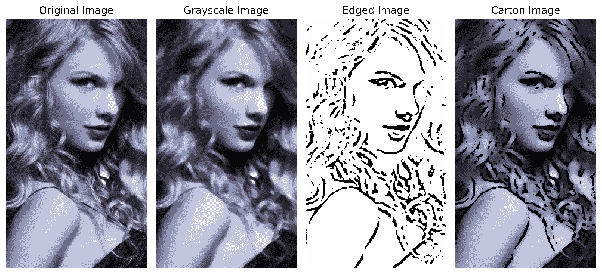
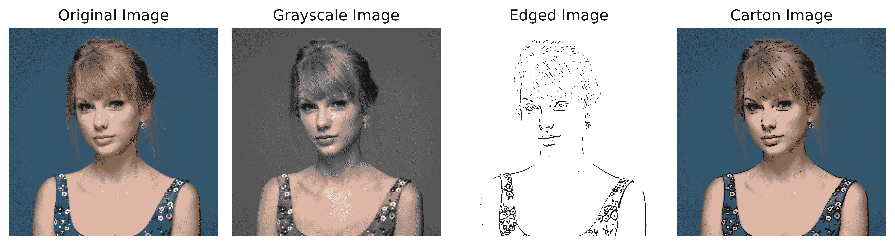

# 使用 Python 将图像转换成卡通

> 原文：<https://www.askpython.com/python/examples/images-into-cartoons>

你好，读者！在本教程中，我们将学习如何把图像变成卡通！很酷吧？！所以让我们开始吧！

## 1.导入模块

每个程序的第一步是将所有必要的模块(如果有的话)导入到我们的文件中。对于这个问题，我们将导入三个模块，即 openCV，numpy 和 matplotlib 模块。

```py
import cv2
import numpy as np
import matplotlib.pyplot as plt

```

## 2.加载并绘制原始图像

下一步是使用`imread`功能读取图像，然后在`cvtColor`功能的帮助下将其转换为 RGB 格式。然后我们使用`imshow`函数绘制图像。相同的代码如下所示:

```py
img = cv2.imread("image.jpg")
img = cv2.cvtColor(img,cv2.COLOR_BGR2RGB)
plt.figure(figsize=(10,10))
plt.imshow(img)
plt.axis("off")
plt.title("Original Image")
plt.show()

```

## 3.将图像转换为灰度

该过程的下一步是使用`cvtColor`功能将图像转换成灰度格式。这样做的原因是它简化了过程，并有助于降低程序的时间复杂度。

实现相同功能的代码如下所示。

```py
gray = cv2.cvtColor(img, cv2.COLOR_BGR2GRAY)
gray = cv2.medianBlur(gray, 5)
plt.figure(figsize=(10,10))
plt.imshow(gray,cmap="gray")
plt.axis("off")
plt.title("Grayscale Image")
plt.show()

```

## 4.获取边缘图像

为了让事情变得简单，我们将获得灰度图像的边缘图像，然后将 T2 卷积网络应用于图像。

通过使用`adaptiveThreshold`并设置所需的参数来获得边缘图像，也可以做到这一点。下面显示了相同的代码。

```py
edges = cv2.adaptiveThreshold(gray, 255, cv2.ADAPTIVE_THRESH_MEAN_C, cv2.THRESH_BINARY, 9, 9)
plt.figure(figsize=(10,10))
plt.imshow(edges,cmap="gray")
plt.axis("off")
plt.title("Edged Image")
plt.show()

```

## 5.把图像变成卡通

最后一步是使用`bilateralFilter`函数应用卷积滤波器。然后，我们利用[位运算](https://www.askpython.com/python-modules/numpy/numpy-bitwise-operations)，传递原始图像和边缘图像，将图像变成卡通。

相同的代码如下所示。

```py
color = cv2.bilateralFilter(img, 9, 250, 250)
cartoon = cv2.bitwise_and(color, color, mask=edges)
plt.figure(figsize=(10,10))
plt.imshow(cartoon,cmap="gray")
plt.axis("off")
plt.title("Cartoon Image")
plt.show()

```

## 把图像变成卡通的最终输出

下图显示了从原始图像到卡通图像的所有不同版本的图像。



Cartoonify Image Output

代码已针对另一个图像进行了测试。结果如下。



Cartoonify Image Output 2

## 结论

恭喜你！今天你学会了如何通过几行代码把图片变成卡通。

希望你学到了一些东西！感谢您的阅读！