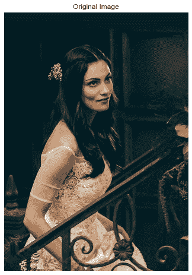
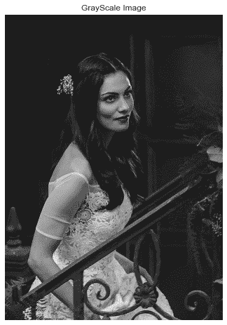
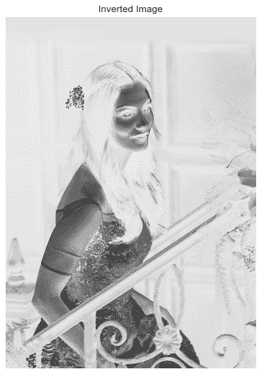
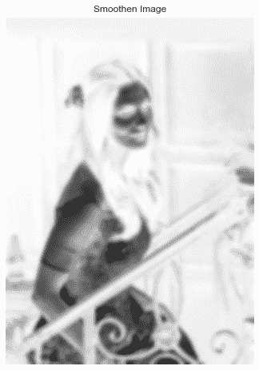
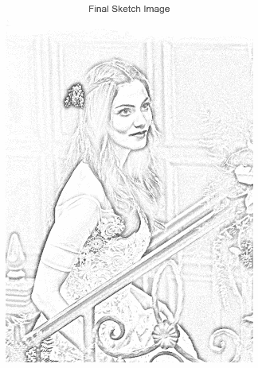
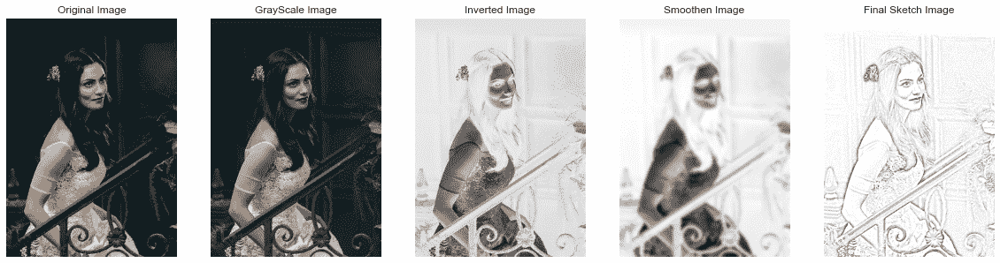
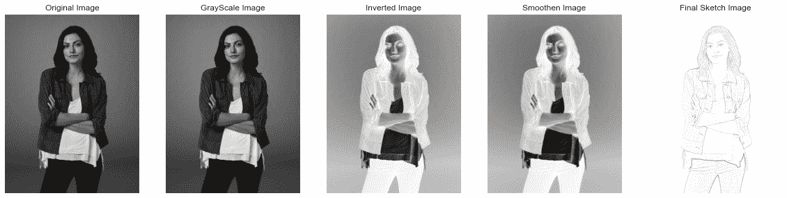

# Python:将图像转换为铅笔草图

> 原文：<https://www.askpython.com/python/examples/images-to-pencil-sketch>

你好。今天我们将学习如何在 OpenCV 的帮助下将图像转换为铅笔草图，并使用 [matplotlib](https://www.askpython.com/python-modules/matplotlib/python-matplotlib) 在不同阶段绘制图像。

***推荐阅读:[Python 中的边缘检测](https://www.askpython.com/python/examples/edge-detection-in-images)***

## 1.导入模块

让我们首先从将模块导入我们的程序开始。我们将利用 OpenCV 函数和 matplotlib 模块来绘制图像。

我们也将根据我的喜好设置绘图风格。

```py
import cv2
import matplotlib.pyplot as plt
plt.style.use('seaborn')

```

## 2.加载和绘制原始图像

现在我们将通过使用获取文件路径的`imread`函数将图像文件加载到我们的程序中。请确保文件路径正确。

我们还将改变图像的颜色代码为 RGB 格式，以获得原始颜色，并使用`imshow`函数绘制图像。

相同的代码如下所示。

```py
img = cv2.imread("image1.png")
img = cv2.cvtColor(img,cv2.COLOR_BGR2RGB)
plt.figure(figsize=(8,8))
plt.imshow(img)
plt.axis("off")
plt.title("Original Image")
plt.show()

```

我一直使用的图像是在上述代码的帮助下绘制的，如下所示。



Original Image Pencil Sketch

## 3.将图像转换为灰度

为了降低图像的复杂性并使处理更容易，我们将借助`cvtColor`功能将图像转换为灰度图像。下面提到的代码帮助绘制了相同的图形。

```py
img_gray = cv2.cvtColor(img, cv2.COLOR_BGR2GRAY)
plt.figure(figsize=(8,8))
plt.imshow(img_gray,cmap="gray")
plt.axis("off")
plt.title("GrayScale Image")
plt.show()

```

输出图像如下所示。



GrayScale Image Pencil Sketch

## 4.反转图像

现在下一步是反转图像。现在你的问题是为什么要这么做？同样的答案是，当图像被倒置时，它有助于更精确和详细地研究图像。

更详细的研究对于草图生成是重要的，因为草图需要精确和良好。下面显示了反转图像的代码。

```py
img_invert = cv2.bitwise_not(img_gray)
plt.figure(figsize=(8,8))
plt.imshow(img_invert,cmap="gray")
plt.axis("off")
plt.title("Inverted Image")
plt.show()

```

反转图像的输出如下所示。



Inverted Image Pencil Sketch

除此之外，我们还将平滑图像，以确保我们获得的草图不那么尖锐和平滑。相同的代码如下所示。

```py
img_smoothing = cv2.GaussianBlur(img_invert, (21, 21),sigmaX=0, sigmaY=0)
plt.figure(figsize=(8,8))
plt.imshow(img_smoothing,cmap="gray")
plt.axis("off")
plt.title("Smoothen Image")
plt.show()

```

输出图像如下所示。



Smooth Inverted Image Pencil Sketch

## 5.将您的图像转换为铅笔草图

现在，整个图像处理已经完成，我们将把先前的输出传递给函数，并传递正确和准确的参数，以便对图像进行适当的更改。下面的代码中也提到了这一点。

```py
final = cv2.divide(img_gray, 255 - img_smoothing, scale=255)
plt.figure(figsize=(8,8))
plt.imshow(final,cmap="gray")
plt.axis("off")
plt.title("Final Sketch Image")
plt.show()

```

最终输出如下所示。



Final Sketch Pencil Sketch

## 6.最终输出

下面的代码将使用支线剧情显示一帧中的所有图像。

```py
plt.figure(figsize=(20,20))
plt.subplot(1,5,1)
plt.imshow(img)
plt.axis("off")
plt.title("Original Image")
plt.subplot(1,5,2)
plt.imshow(img_gray,cmap="gray")
plt.axis("off")
plt.title("GrayScale Image")
plt.subplot(1,5,3)
plt.imshow(img_invert,cmap="gray")
plt.axis("off")
plt.title("Inverted Image")
plt.subplot(1,5,4)
plt.imshow(img_smoothing,cmap="gray")
plt.axis("off")
plt.title("Smoothen Image")
plt.subplot(1,5,5)
plt.imshow(final,cmap="gray")
plt.axis("off")
plt.title("Final Sketch Image")
plt.show()

```

输出显示如下。



All Outputs Pencil Sketch Output

你可以看到结果相当准确！厉害！同样的代码被用于另一个图像，结果非常好！看一看一样的。



All Outputs Pencil Sketch Output 1

## 结论

所以今天我们学习了如何把我们的图像变成铅笔素描。干得好！自己尝试一些图片。

编码快乐！敬请关注更多此类教程！