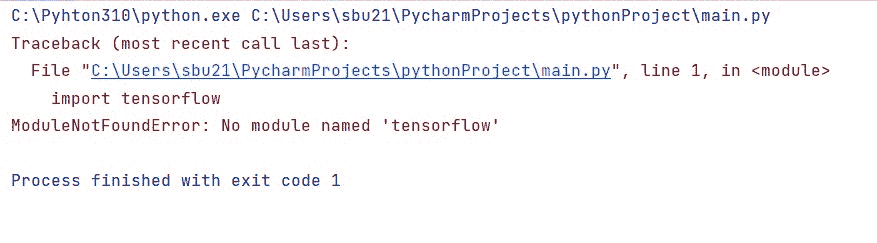
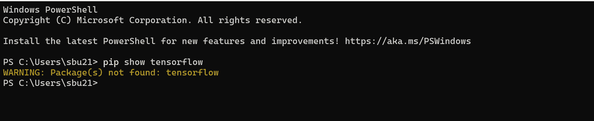
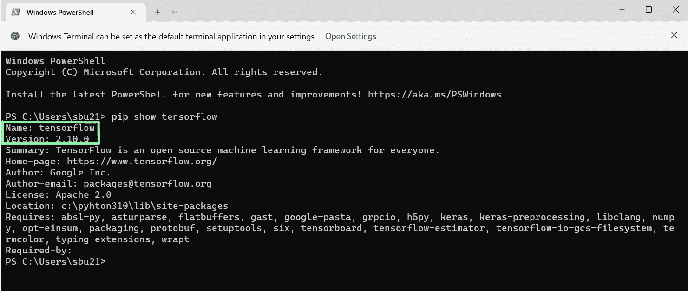
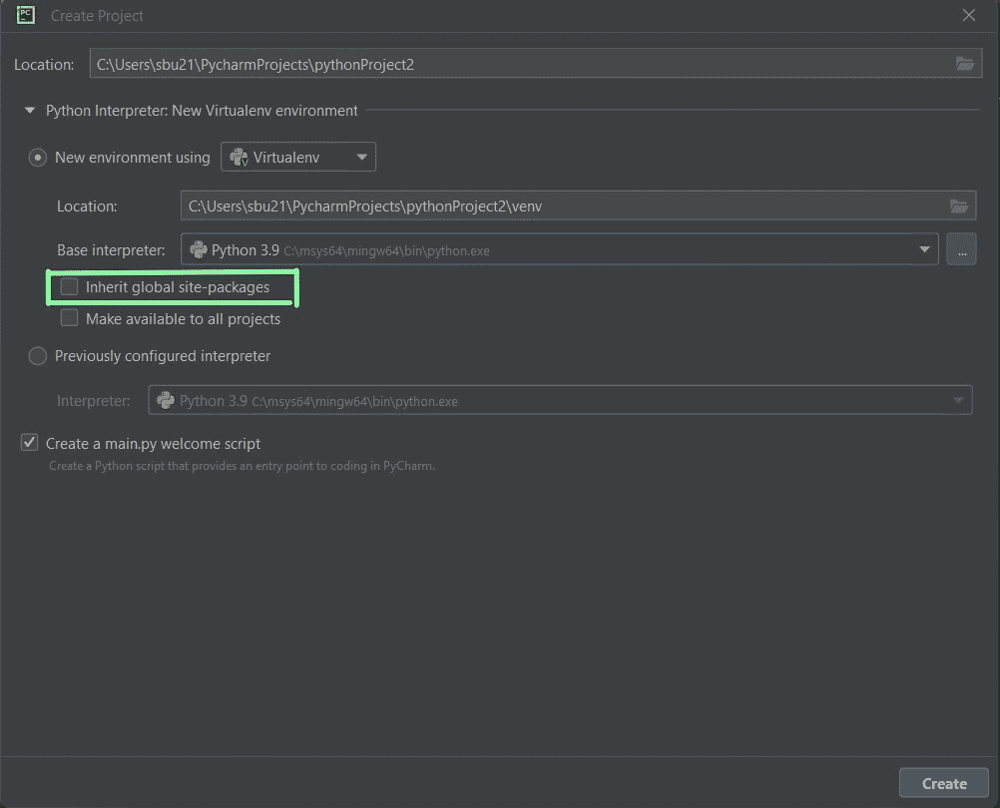
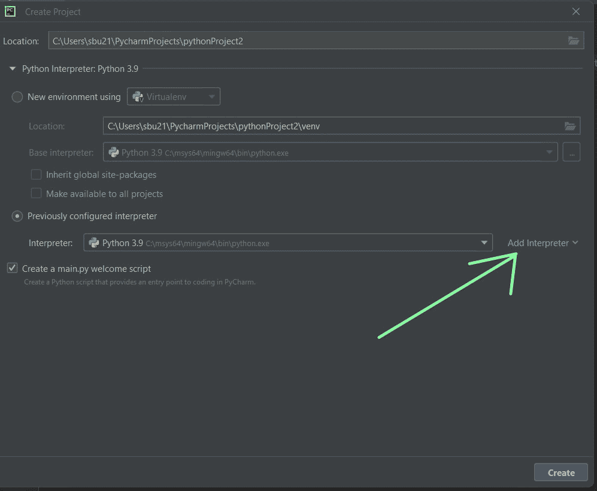
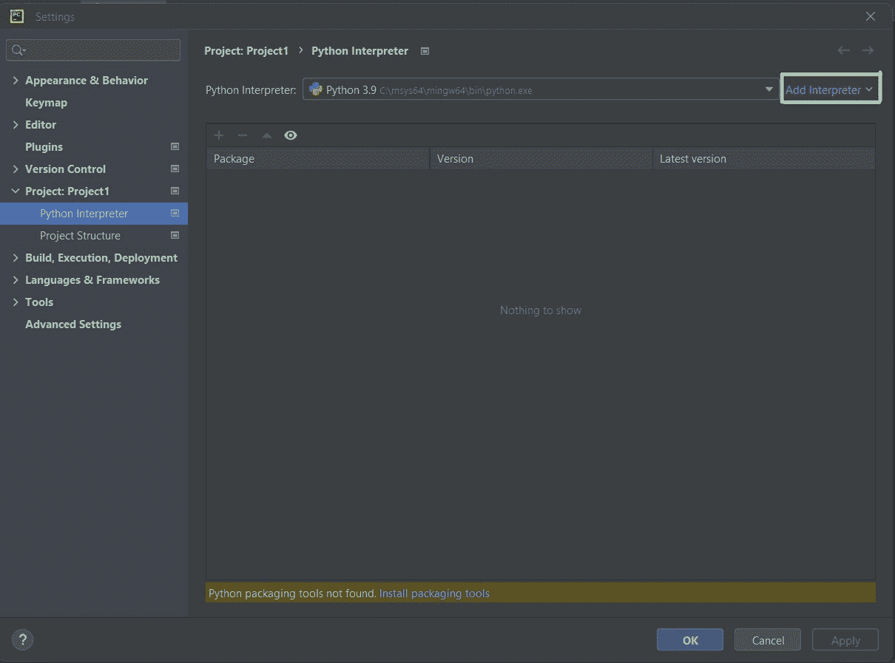
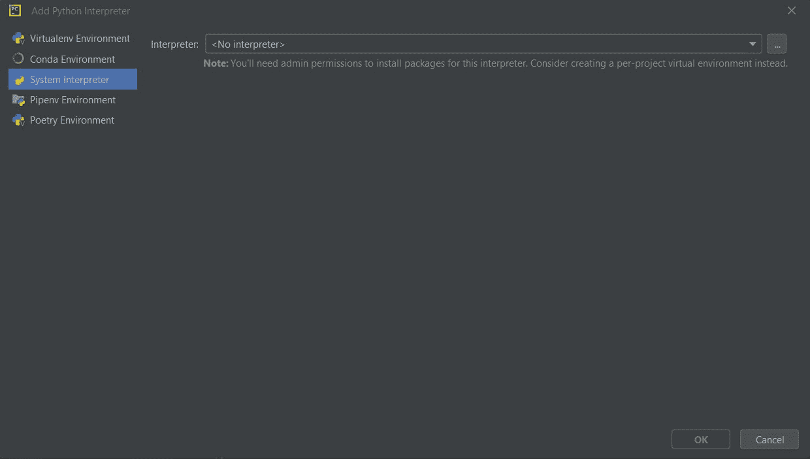
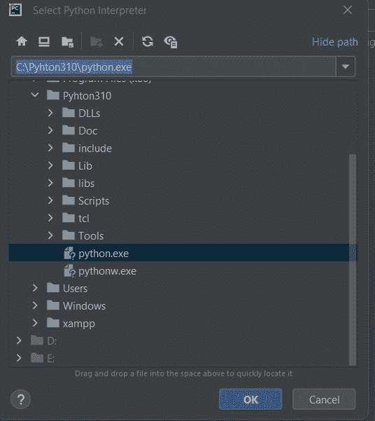
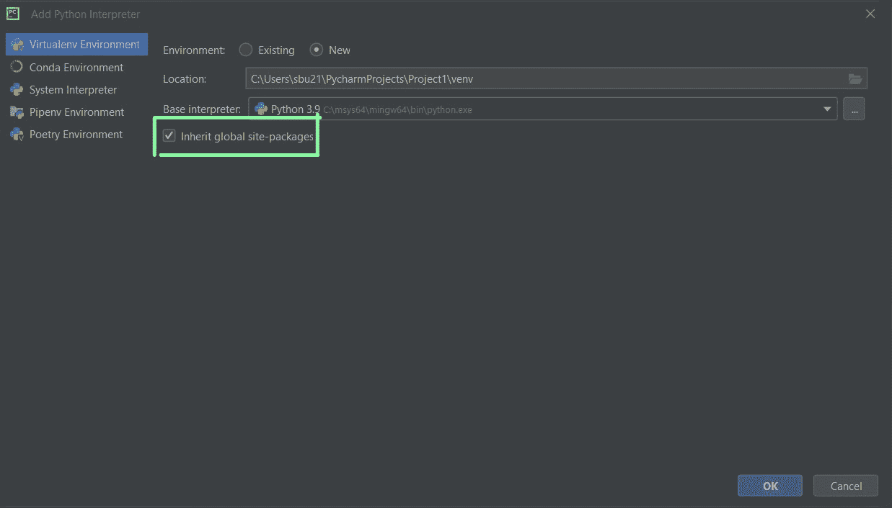

# 导入错误-未找到名为 Tensorflow 的模块[已解决]

> 原文：<https://www.askpython.com/python/examples/import-error-no-module-named-tensorflow-found>



得到类似模块未找到的提示错误:没有名为' TensorFlow '的模块，就像我在 IDE 中得到的一样(Py-Charm)。别担心，我会掩护你的。我们开始吧。

## 找不到名为 Tensorflow 的模块，因为未安装该模块

如果 TensorFlow 模块没有安装在您的系统上，导入错误消息肯定会出现。那么，如何检查是否安装了 Tensorflow 模块呢？

要进行检查，请在各自的操作系统中打开终端，并写下:

```py
pip show tensorflow

```



执行上述命令后，出现以下提示，这意味着需要安装 TensorFlow 包。

### Install Tensorflow

Tensorflow 模块可通过执行以下步骤进行安装:

TensorFlow 需要 pip 的**最新版本**，因此升级您的 pip 安装以确保您运行的是**最新版本**。

```py
pip install --upgrade pip

```

然后，用 pip 安装 TensorFlow

```py
pip install tensorflow

```

安装完成后，运行以下命令:

```py
pip show tensorflow

```



好了，你已经成功安装了 Tensorflow 模块。

之后，安装模块有很少的机会，你得到一个导入错误信息。

* * *

### Python 解释器选择–py charm

现在可能有另一种情况，模块已经安装在系统上，但仍然得到错误消息。

我们中的许多人使用 PyCharm 作为 IDE 来编写 Python 程序。在 PyCharm 中创建新项目时，我们可以选择 Python 解释器。

在这一步，PyCharm 为我们提供了两个选项，即使用新环境和之前配置的解释器。默认情况下，如果未选中**继承全局站点包**，则会设置第一个选项“新环境使用”,导致出现**导入错误**消息。



如果你在这个阶段，确保你选择了先前配置的解释器，点击**添加解释器**，然后给出 **python** **的正确路径。exe** 文件(小心操作)。



**有关详细信息，请参阅下一节。**

如果您在创建新项目时使用选择了选项**新环境，那么不用担心，您可以通过以下步骤轻松更改解释器设置🙂**

*   转到 PyCharm IDE 左上角的**文件**选项，选择设置

*   选择 **Python 解释器**并点击添加解释器



*   在**系统解释器**下，选择三个点给出 python.exe 文件的**路径**



*   给出**python.exe**文件的正确路径(**仔细做好这一步**



*   很好，单击确定并应用更改

以上是关于 PyCharm 中 Python 解释器设置的全部内容，希望对你的错误信息有所帮助。

提示:如果你想继续使用 python 解释器的**虚拟环境**选项，只需**勾选下图所示的框**



* * *

### **总结**

务必确保不要用模块名创建 python 文件，如 tensorflow.py、pandas.py、matplotlib.py 等。这也导致了这些导入错误消息。确保您已经安装了该模块的最新版本。

感谢阅读和快乐编码😀