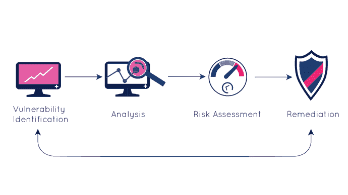

# 补救在开源安全中的重要性

> 原文：<https://www.askpython.com/resources/importance-of-remediation-in-open-source-security>

**Photo by** [**Safar Safarov**](https://unsplash.com/@safarslife?utm_source=unsplash&utm_medium=referral&utm_content=creditCopyText) **on** [**Unsplash**](https://unsplash.com/s/photos/coding?utm_source=unsplash&utm_medium=referral&utm_content=creditCopyText)

开源代码越来越受欢迎可以归因于这样一个事实，即开源项目本质上是协作性的和公共的。开源代码为开发人员提供了各种各样的优势，包括质量——因为他们能够轻松自由地使用代码，并可以根据自己的需要修改代码；速度——因为工具已经创建好了，开发人员只需要做很小的调整(如果有的话),然后合并它们；和降低项目成本。

然而，它也有一些缺点，其中最显著的是安全性。开放源代码可能包含漏洞；许可问题；或者管理不当，所有这些都有可能影响组织的数据和安全并破坏组织的声誉。即使是现在，仍有一些项目是在很多年前开始的，但不再由任何人维护。因此，发现的任何安全缺陷都可能无法解决。

因此，[开源安全](https://www.mend.io/open-source-security/)是通过开源发布给公众的许多不同代码的重要组成部分。有必要对所有这些举措进行持续的补救，以确保它们没有漏洞，不会给本组织的安全带来风险。

## **为什么补救很重要？**

Source

虽然不是所有的开源项目都是不安全的，但是那些在大量软件中广泛使用的项目正在被传播给大量的组织。即使是基于产品的组织最终也会继承大量的开源代码。

在软件中使用任何开放源代码之前，必须进行开放源代码审查，以验证代码可以安全地包含在软件中，并确定项目或存储库是否得到维护。此审查还应确定软件是否正在更新。

如果代码不安全或者存储库没有得到维护，那么在组织中包括这一点将不是一个好主意，因为将来可能出现的任何错误都没有任何可用的修复，组织将不得不自己寻找问题的解决方案。因此，需要进行开源审查，并且应该尽快解决发现的任何漏洞，以便保护组织及其基础设施。

例如，由于在 Apache 的[日志库](https://logging.apache.org/log4j/2.x/security.html)中发现的一个缺陷，整个互联网变得容易受到远程代码执行的影响。在这种情况下，补救措施对于确保组织的安全至关重要。

补救甚至有助于提高软件或开发组件的生产率。随着开发人员的效率通过使用开源代码片段而提高，这些代码片段在修复过程中不再存在漏洞。开源组件的持续补救降低了与维护项目及其依赖项相关的成本，以及其他好处。所有这些步骤都将减少团队所需的工作量。

## **结论**

由于如此多的公司使用开源代码或代码片段，越来越多的软件开发人员正集中精力解决开源软件中的安全缺陷。然而，公司可以通过进行代码审查来解决这些缺陷。

内部代码应用程序的补救相对简单。另一方面，修复开源软件中的漏洞是一个巨大的挑战。所以，做好这件事很重要。除了增强整体安全性之外，补救还可以在提高项目完成效率方面发挥作用。因此，在使用任何开源项目之前，一定要验证它们包含什么样的漏洞，以及在使用它们之前是否有可能修复它们。