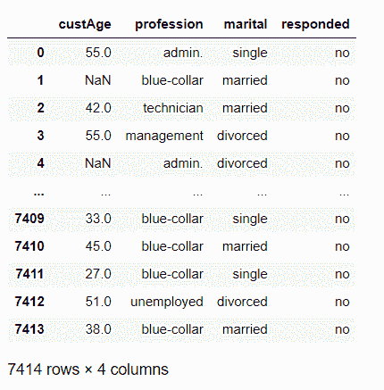

# 用 python 输入缺失的数据值——3 种简单的方法！

> 原文：<https://www.askpython.com/python/examples/impute-missing-data-values>

大家好！在本文中，我们将关注 Python 中估算缺失数据值的 **3 个重要技术。**

那么，让我们开始吧。

* * *

## 为什么我们需要估算缺失的数据值？

在进行插补之前，让我们了解什么是缺失值。

因此，缺失值是数据集看起来缺失的部分，或者是一个[空值](https://www.askpython.com/python/oops/python-none)，可能是由于研究或数据收集过程中的一些缺失数据。

机器学习模型中缺少值被认为是非常低效和危险的，原因如下:

*   **降低 ML 模型的效率**。
*   **影响数据值的总体分布**。
*   它导致 ML 模型估计中的**偏差效应**。

这就是归罪进入画面的时候。

通过插补，我们的意思是用整个数据集中的特定值替换缺失值或空值。

可以使用以下任何技术进行插补

*   **通过平均值估算**
*   **根据中位数估算**
*   **Knn 插补**

现在让我们理解并实现下一节中的每一项技术。

* * *

## 1.通过平均值估算缺失数据值

缺失值可以用特定特征/数据变量的平均值来估算。也就是说，空值或缺失值可以替换为特定数据列或数据集的数据值的平均值。

让我们看看下面的数据集，我们将在整篇文章中使用它。



**Dataset For Imputation**

可以清楚地看到，上面的数据集包含空值。现在让我们试着用特征的平均值来估算它们。

### 导入所需的库

首先，让我们将必要的数据集加载到工作环境中。

```py
#Load libraries
import os
import pandas as pd
import numpy as np

```

我们已经使用 [pandas.read_csv()函数](https://www.askpython.com/python-modules/python-csv-module)将数据集加载到环境中。

```py
marketing_train = pd.read_csv("C:/marketing_tr.csv")

```

### 验证数据库中缺少的值

在输入缺失数据值之前，有必要使用如下所示的`isnull() function`来检查和检测缺失值的存在

```py
marketing_train.isnull().sum()

```

在执行上面的代码行之后，我们得到以下缺失值的计数作为输出:

```py
custAge       1804
profession       0
marital          0
responded        0
dtype: int64

```

可以清楚地看到，数据变量“custAge”包含 7414 条记录中的 1804 条缺失值。

### 对所有空值使用 mean()方法

此外，我们已经使用`mean() function`用列“custAge”的平均值估算所有空值。

```py
missing_col = ['custAge']
#Technique 1: Using mean to impute the missing values
for i in missing_col:
 marketing_train.loc[marketing_train.loc[:,i].isnull(),i]=marketing_train.loc[:,i].mean()

```

### 验证更改

在用平均值进行插补后，让我们检查是否所有的值都被插补了。

```py
marketing_train.isnull().sum()

```

如下所示，所有缺失值都已估算，因此，我们看不到更多缺失值。

```py
custAge       0
profession    0
marital       0
responded     0
dtype: int64

```

* * *

## 2.中位数插补

在这种技术中，我们用数据值或数据集的中值来估算缺失值。

让我们通过下面的例子来理解这一点。

**举例:**

```py
#Load libraries
import os
import pandas as pd
import numpy as np

marketing_train = pd.read_csv("C:/marketing_tr.csv")
print("count of NULL values before imputation\n")
marketing_train.isnull().sum()

missing_col = ['custAge']

#Technique 2: Using median to impute the missing values
for i in missing_col:
 marketing_train.loc[marketing_train.loc[:,i].isnull(),i]=marketing_train.loc[:,i].median()

print("count of NULL values after imputation\n")
marketing_train.isnull().sum()

```

这里，我们使用`median() function`用中值估算缺失值。

**输出:**

```py
count of NULL values before imputation
custAge       1804
profession       0
marital          0
responded        0
dtype: int64
count of NULL values after imputation
custAge          0 
profession       0
marital          0
responded        0
dtype: int64

```

* * *

## 3.KNN 插补

在该技术中，缺失值基于 KNN 算法进行估算，即**K-最近邻算法**。

在该算法中，缺失值由最近邻估计值代替。

让我们用下面的例子来理解实现:

**KNN 插补:**

```py
#Load libraries
import os
import pandas as pd
import numpy as np
marketing_train = pd.read_csv("C:/marketing_tr.csv")
print("count of NULL values before imputation\n")
marketing_train.isnull().sum()

```

这里是缺失值的计数:

```py
count of NULL values before imputation
custAge       1804
profession       0
marital          0
responded        0
dtype: int64

```

在下面这段代码中，我们已经将数据变量的数据类型转换为对象类型，并为它们分配了分类代码。

```py
lis = []
for i in range(0, marketing_train.shape[1]):

    if(marketing_train.iloc[:,i].dtypes == 'object'):
        marketing_train.iloc[:,i] = pd.Categorical(marketing_train.iloc[:,i])
        #print(marketing_train[[i]])
        marketing_train.iloc[:,i] = marketing_train.iloc[:,i].cat.codes 
        marketing_train.iloc[:,i] = marketing_train.iloc[:,i].astype('object')

        lis.append(marketing_train.columns[i])

```

`KNN() function`用于用可能的最近邻估算缺失值。

```py
#Apply KNN imputation algorithm
marketing_train = pd.DataFrame(KNN(k = 3).fit_transform(marketing_train), columns = marketing_train.columns)

```

**插补输出**:

```py
Imputing row 1/7414 with 0 missing, elapsed time: 13.293
Imputing row 101/7414 with 1 missing, elapsed time: 13.311
Imputing row 201/7414 with 0 missing, elapsed time: 13.319
Imputing row 301/7414 with 0 missing, elapsed time: 13.319
Imputing row 401/7414 with 0 missing, elapsed time: 13.329
.
.
.
.
.
Imputing row 7101/7414 with 1 missing, elapsed time: 13.610
Imputing row 7201/7414 with 0 missing, elapsed time: 13.610
Imputing row 7301/7414 with 0 missing, elapsed time: 13.618
Imputing row 7401/7414 with 0 missing, elapsed time: 13.618

```

```py
print("count of NULL values after imputation\n")
marketing_train.isnull().sum()

```

**输出:**

```py
count of NULL values before imputation
custAge          0
profession       0
marital          0
responded        0
dtype: int64

```

* * *

## 结论

到此，我们就结束了这个话题。在本文中，我们实现了 3 种不同的插补技术。

如果你遇到任何问题，欢迎在下面评论。

更多此类与 Python 相关的帖子，敬请关注@ [Python with AskPython](https://www.askpython.com/) 继续学习！