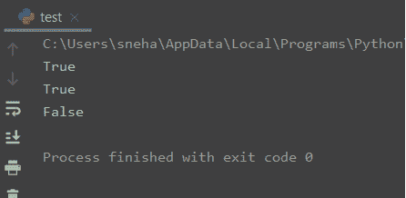
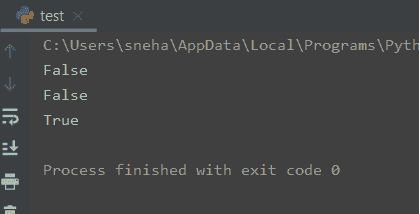
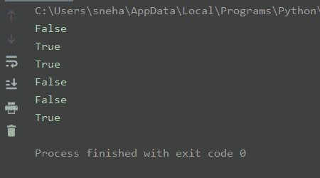

# Python 中的“in”和“not in”运算符

> 原文：<https://www.askpython.com/python/examples/in-and-not-in-operators-in-python>

嘿！所以今天我们要讨论 Python 中的“in”和“not in”操作符。

## python“in”运算符

基本上，Python 中的`in`操作符检查一个指定的值是否是一个序列的组成元素，如[字符串](https://www.askpython.com/python/string)、[数组](https://www.askpython.com/python/array/python-array-examples)、[列表](https://www.askpython.com/python/list/python-list)或[元组](https://www.askpython.com/python/tuple/python-tuple)等。

在条件中使用时，该语句返回一个布尔结果，评估为`True`或`False`。当指定值是在序列中找到的的**时，语句返回`True`。而当没有找到**时，我们得到一个`False`。

让我们举个例子来更好地理解`in`操作符的工作原理。

```py
#in operator working

list1= [1,2,3,4,5]
string1= "My name is AskPython"
tuple1=(11,22,33,44)

print(5 in list1) #True
print("is" in string1) #True
print(88 in tuple1) #False

```

**输出:**



Python in Output

这里:

首先，我们已经用一些值初始化了一个列表`list1`，一个字符串`string1`和一个元组`tuple1`。然后我们使用`in`操作符来检查一些值是否是上述序列的一部分。

从上面的输出中我们可以看到，`5 in list1`评估为**真**。这表示在列表中找到了值 **5** 。

类似地，使用`in`操作符，我们还确认了字符串**“is”**在`string1`中的存在。但是对于最后一种情况，该条件导致**假**，因为 **88** 不存在于序列`tuple1`中。

## Python“不在”运算符

Python 中的`not in`操作符与`in`操作符的工作方式完全相反。它还检查给定序列中指定值的存在，但是它的返回值与`in`操作符的完全相反。

当在序列中存在指定值的条件下使用时，该语句返回`False`。反之，当它不是，我们得到一个`True`。

让我们以前面的例子为例，只是将`in`操作符替换为`not in`操作符。

```py
#not in operator working

list1= [1,2,3,4,5]
string1= "My name is AskPython"
tuple1=(11,22,33,44)

print(5 not in list1) #False
print("is" not in string1) #False
print(88 not in tuple1) #True

```

**输出:**



not in Output

正如所料，结果输出是我们之前使用`in`操作符得到的与相反的**。**

## Python 字典中“in”和“not in”运算符的使用

之前我们讨论了`in`和`not in`操作符在不同类型序列上的工作。但是[字典](https://www.askpython.com/python/dictionary/python-dictionary-dict-tutorial)不是序列。与它们不同，字典是基于**键**来索引的。

那么上面的操作符对字典起作用吗？如果有，他们如何评估病情？

让我们试着用一个例子来理解。

```py
#in and not in operator working on Dictionary

dict1 = {1: "one", 2: "two", 3: "three", 4: "four"}

print("one" in dict1)
print("one" not in dict1)

print(3 in dict1)
print(3 not in dict1)

print(5 in dict1)
print(5 not in dict1)

```

**输出:**



Using in And not in on Dictionary

首先，我们已经用某组**键**和相应的**值**初始化了字典`dict1`。

正如我们从上面的输出中看到的，`"one" in dict1`评估为一个**假**。然而，`3 in dict1`给了我们**真**。

所以很明显，in 操作符在字典**键**中寻找元素，而不是**值**。因此，类似地，最后一个语句`5 in dict1`也导致**假**，因为它不是字典中的键。

如前所述，这里的`not in`操作符也以同样的方式进行计算。

## 结论

所以在本教程中，我们学习了 Python 中的`in`和`not in`操作符，以及它们在一些例子中的工作。

如有任何进一步的问题，欢迎使用下面的评论。

## 参考

*   Python“在”和“不在”成员操作符——期刊开发帖子，
*   [python 中的“in”和“not in”语句如何工作](https://stackoverflow.com/questions/45707721/how-does-the-in-and-not-in-statement-work-in-python)–stack overflow 问题。