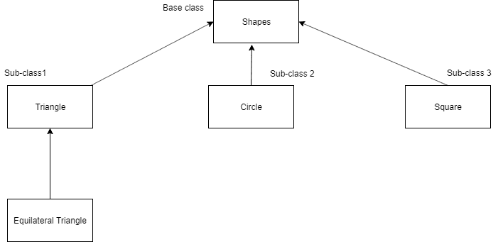

# Python 中的继承

> 原文：<https://www.askpython.com/python/oops/inheritance-in-python>

## 传承一目了然！

在面向对象编程(OOP)的世界中，继承指的是一个类在运行中从另一个类派生或扩展属性的能力机制。该属性使派生类能够获取基类的属性或特征。

继承被认为是 OOP 最重要的方面之一，因为它提供了**可重用性**的特性，从而使代码更加可靠。



Python Inheritance

* * *

## 继承的好处

*   继承描述了类似真实世界场景的关系。
*   它提供了可重用的特性，允许用户在不改变派生类的情况下向其添加更多的特性。
*   如果一个类 Y 继承自类 X，那么 Y 的所有子类都会自动继承自类 X。

* * *

## 遗传的基本术语

1.  *子类/派生类*:是从另一个类(通常是基类)继承属性的类。
2.  *超类/基类*:是衍生其他子类的类。
3.  派生类通常*派生/继承/扩展*基类。

* * *

## Python 继承语法

```py
class SuperClassName:
  Body of Super class

class DerivedClass_Name(SuperClass):
  Body of derived class

```

* * *

## Python 继承示例

让我们通过简单的例子深入 Python 中的继承世界。

### 步骤 1:创建一个基类

```py
class Father:
    # The keyword 'self' is used to represent the instance of a class.
    # By using the "self" keyword we access the attributes and methods of the class in python.
    # The method "__init__"  is called as a constructor in object oriented terminology.
    # This method is called when an object is created from a class.
    # it allows the class to initialize the attributes of the class.
    def __init__(self, name, lastname):
        self.name = name
        self.lastname = lastname

    def printname(self):
        print(self.name, self.lastname)

# Use the Father class to create an object, and then execute the printname method:

x = Father("Anees", "Mulani")
x.printname()

```

**输出** : Anees Mulani

* * *

### 步骤 2:创建派生类

```py
# The subclass __init__() function overrides the inheritance of the base class __init__() function.

class Son(Father):
    def __init__(self, name, lastname):
        Father.__init__(self, name, lastname)

x = Son("Dev", "Bajaj")
x.printname()

```

**输出** : Dev Bajaj

* * *

## super()函数的使用

通过使用`super()`函数，您不必使用父元素的名称，它将自动从其父元素继承方法和属性。

```py
class Father:
  def __init__(self, name, lastname):
    self.name = name
    self.lastname = lastname

  def printname(self):
    print(self.name, self.lastname)

class Son(Father):
  def __init__(self, name, lastname):
    super().__init__(name, lastname)

x = Student("Dev", "Bajaj")
x.printname()

```

**输出** : Dev Bajaj

* * *

## 参考资料:

*   JournalDev 上的 Python 继承
*   [Python.org 文件](https://docs.python.org/3/tutorial/classes.html#inheritance)