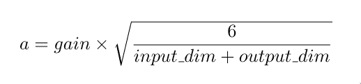
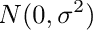
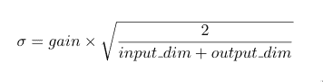
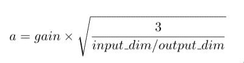
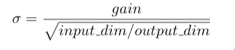

# 如何在 PyTorch 中初始化模型权重

> 原文：<https://www.askpython.com/python-modules/initialize-model-weights-pytorch>

知道如何初始化模型权重是[深度学习](https://www.askpython.com/python/examples/standardize-data-in-python)的重要课题。初始权重影响很多因素——梯度、输出子空间等。在本文中，我们将了解一些最重要和最广泛使用的权重初始化技术，以及如何使用 [PyTorch](https://www.askpython.com/python-modules/pytorch) 实现它们。本文希望用户对 PyTorch 有初级的熟悉程度。

## 为什么初始化模型权重很重要？

训练任何深度学习模型的目标都是找到模型的最佳权重集，从而给出我们想要的结果。深度学习中使用的训练方法通常在本质上是迭代的，并要求我们提供一组初始权重，这些权重需要随着时间的推移而更新。

初始重量在决定训练的最终结果方面起着巨大的作用。权重的错误初始化会导致渐变消失或爆炸，这显然是不希望的。因此，我们使用一些标准的方法来初始化这些层，这将在本文中讨论。

## 一般的经验法则

一个经验法则是*“初始模型权重需要接近零，而不是零”*。一个天真的想法是从任意接近 0 的分布中取样。

例如，您可以选择使用从 U(-0.01，0.01)或 N(0，0.01)中采样的值来填充权重。

事实证明，上述想法一点也不幼稚，大多数标准方法都是基于均匀分布和正态分布的抽样。

但是真正的技巧在于为这些分布设置边界条件。一个常用的边界条件是 1/sqrt(n)，其中 n 是层的输入数。

在 PyTorch 中，我们可以使用`uniform_`和`normal_`函数从均匀分布或[正态分布](https://www.askpython.com/python/normal-distribution)中设置要采样的层的权重。这里有一个简单的`uniform_()`和`normal_()`的例子。

```py
# Linear Dense Layer
layer_1 = nn.Linear(5, 2)
print("Initial Weight of layer 1:")
print(layer_1.weight)

# Initialization with uniform distribution
nn.init.uniform_(layer_1.weight, -1/sqrt(5), 1/sqrt(5))
print("\nWeight after sampling from Uniform Distribution:\n")
print(layer_1.weight)

# Initialization with normal distribution
nn.init.normal_(layer_1.weight, 0, 1/sqrt(5))
print("\nWeight after sampling from Normal Distribution:\n")
print(layer_1.weight)

```

**输出:**

```py
Initial Weight of layer 1:
Parameter containing:
tensor([[-0.0871, -0.0804,  0.2327, -0.1453, -0.1019],
        [-0.1338, -0.2465,  0.3257, -0.2669, -0.1537]], requires_grad=True)

Weight after sampling from Uniform Distribution:

Parameter containing:
tensor([[ 0.4370, -0.4110,  0.2631, -0.3564,  0.0707],
        [-0.0009,  0.3716, -0.3596,  0.3667,  0.2465]], requires_grad=True)

Weight after sampling from Normal Distribution:

Parameter containing:
tensor([[-0.2148,  0.1156,  0.7121,  0.2840, -0.4302],
        [-0.2647,  0.2148, -0.0852, -0.3813,  0.6983]], requires_grad=True)

```

但是这种方法也有一些限制。这些方法有点过于一般化，对于具有非线性激活函数的层，如`Sigmoid`、`Tanh`和`ReLU`激活，往往会有一些问题，在这些层中，消失和爆炸梯度的可能性很高。

因此，在下一节中，我们将探讨一些已经提出的解决这个问题的高级方法。

## 非线性激活层的初始化

对于具有非线性激活的层的权重初始化，有两种标准方法-Xavier(Glorot)初始化和明凯初始化。

我们不会深究数学表达式和证明，而是更关注在哪里使用它们以及如何应用它们。这绝对不是邀请跳过数学背景。

### 1.Xavier 初始化

Xavier 初始化用于具有`Sigmoid`和`Tanh`激活功能的层。Xavier 初始化有两个不同的版本。区别在于我们对数据进行采样的分布——均匀分布和正态分布。以下是这两种变体的简要概述:

### 2.**泽维尔均匀分布**

在该方法中，权重张量填充有从均匀分布 U(-a，a)采样的值，其中，



`input_dim`和`output_dim`是输出和输入维度，或者更明确地是前一层和前一层的维度，`gain`只是一个比例因子。

**举例:**

```py
# The convolution layer
conv_layer = nn.Conv2d(1, 4, (2,2))

# Initiliazing with Xavier Uniform 
nn.init.xavier_uniform_(conv_layer.weight)

```

### 3.泽维尔正态分布

该方法类似于前一种方法，除了数值是从正态分布中采样的事实，其中，



并且`input_dim`和`output_dim`是输出和输入维度，或者更明确地是前一层和前一层的维度。

**举例:**

```py
# The convolution layer
conv_layer = nn.Conv2d(1, 4, (2,2))

# Initiliazing with Xavier Normal
nn.init.xavier_normal_(conv_layer.weight)

```

## 明凯初始化

到目前为止，我们已经讨论了当层具有`sigmoid`和`Tanh`激活函数时如何初始化权重。我们还没有讨论过关于`ReLU`的问题。

具有`ReLU`激活函数的层曾经使用 Xavier 方法初始化，直到明凯提出他的初始化层`ReLU`激活函数的方法。明凯与泽维尔的初始化有一点不同，只是在数学公式中加入了边界条件。

Kaming 的 PyTorch 实现不仅处理 ReLU，还处理 LeakyReLU。PyTorch 提供了两种不同的明凯初始化模式——扇入模式和扇出模式。使用扇入模式将确保数据不会爆炸或内爆。类似地，扇出模式将试图在反向传播中保持梯度。

### 1.明凯均匀分布

权重张量填充有从均匀分布 U(-a，a)采样的值，其中，



对于扇入模式，使用输入尺寸，而对于扇出模式，使用输出尺寸。ReLU 的增益为√2，LeakyReLu 的增益为√(1/a^2 +1)。

增益通常由`kaiming_uniform_()`和`kaiming_normal_()`函数负责，我们只需指定要处理的非线性类型。

**举例:**

```py
conv_layer = nn.Conv2d(1, 4, (2,2))

 nn.init.kaiming_uniform_(conv_layer.weight, mode='fan_in', nonlinearity='relu')

```

### 2.明凯正态分布

层权重从正态分布中采样，其中，



并且 input_dim 和 output_dim 是输出和输入尺寸，并且根据操作模式的选择来选择。

**举例:**

```py
conv_layer = nn.Conv2d(1, 4, (2,2))

 nn.init.kaiming_normal_(conv_layer.weight, mode='fan_in', nonlinearity='relu')

```

## 在 PyTorch 模型中集成初始化规则

现在我们已经熟悉了如何使用 PyTorch 初始化单层，我们可以尝试初始化现实生活中的 PyTorch 模型的层。我们可以在模型定义中进行这种初始化，或者在定义模型之后应用这些方法。

### 1.定义模型时初始化

```py
import torch.nn as nn
import torch.nn.functional as F

class Net(nn.Module):
    def __init__(self):
        # Layer definitions
        super().__init__()
        self.conv1 = nn.Conv2d(3, 6, 5)
        self.pool = nn.MaxPool2d(2, 2)
        self.conv2 = nn.Conv2d(6, 16, 5)
        self.fc1 = nn.Linear(16 * 5 * 5, 120)
        self.fc2 = nn.Linear(120, 84)
        self.fc3 = nn.Linear(84, 10)

        # Initialization
        nn.init.kaiming_normal_(self.fc1.weight, mode='fan_in', 
                                 nonlinearity='relu')
        nn.init.kaiming_normal_(self.fc2.weight, mode='fan_in', 
                                 nonlinearity='relu')
        nn.init.xavier_normal_(self.fc3.weight)

    def forward(self, x):
        x = self.pool(F.relu(self.conv1(x)))
        x = self.pool(F.relu(self.conv2(x)))
        x = x.view(-1, 16 * 5 * 5)
        x = F.relu(self.fc1(x))
        x = F.relu(self.fc2(x))
        x = self.fc3(x)
        x = nn.sigmoid(x)
        return x

# Every time you create a new mode, it will have a weight initialized model
net = Net()

```

### 2.创建模型后初始化

您可以在创建模型后随时更改权重，您可以通过为特定类型的层定义规则并将其应用于整个模型，或者仅通过初始化单个层来实现这一点。

```py
# Defining a method for initialization of linear weights
# The initialization will be applied to all linear layers
# irrespective of their activation function

def init_weights(m):
    if type(m) == nn.Linear:
        torch.nn.init.xavier_uniform(m.weight)

# Applying it to our net
net.apply(init_weights)

```

```py
# Create the model
net = Net()

# Apply the Xavier normal method to the last layer
nn.init.xavier_normal_(self.fc3.weight)

```

## 结论

这就把我们带到了本文关于权重初始化的结尾。敬请关注更多关于深度学习和 PyTorch 的此类文章。