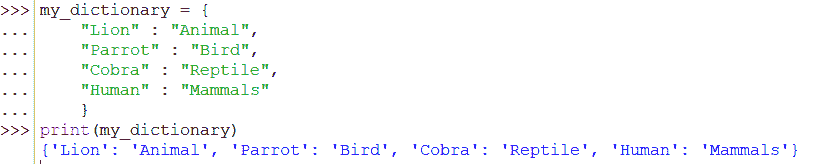
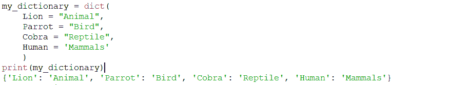
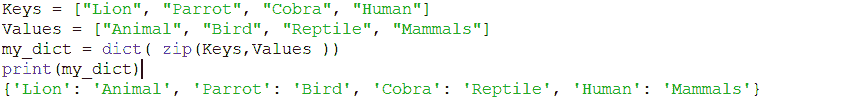
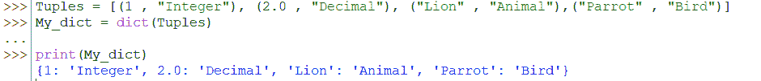
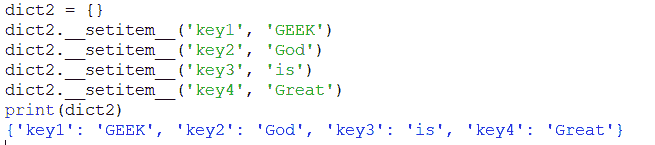
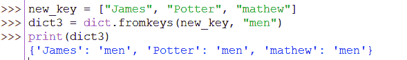
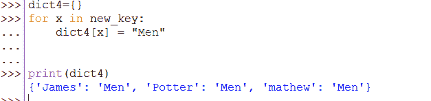
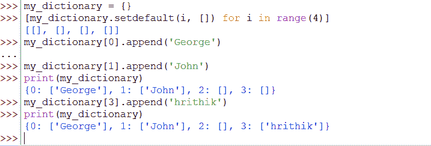
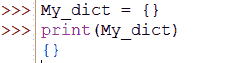

# 如何在 Python 中初始化字典——分步指南

> 原文：<https://www.askpython.com/python/dictionary/initialize-python-dictionary>

您来这里是因为您想学习如何用 Python 初始化字典。我来告诉你怎么做。

* * *

## python 中的字典是什么？

在 Python 中，Dictionary 是一个无序的项集合，包含成对的键和值。我们可以通过下面的例子更好地理解。

```py
dictionary = { 1:"integer", 2.03:"Decimal", "Lion":"Animal"}

```

在上面的字典中:

*   “整数”是键“1”的值
*   “Decimal”是键“2.03”的值
*   “动物”是“狮子”的关键值

## 初始化 Python 字典的不同方法

我们可以使用 python 中的不同方法来定义或初始化我们的字典，如下所示。

### 通过传递文字初始化字典

我们可以通过将键值对作为文字传递来创建字典。下面通过一个适当的例子给出了传递文字的语法。

```py
dictionary_name = {
    key1 : value1,
    key2 : value2,
    key3 : value3
    }

```

```py
my_dictionary = {
    "Lion" : "Animal",
    "Parrot" : "Bird",
    "Cobra" : "Reptile",
    "Human" : "Mammals"
    }
print(my_dictionary)

```

我们名为“`my_dictionary`”的字典将会这样创建，

```py
{'Lion': 'Animal', 'Parrot': 'Bird', 'Cobra': 'Reptile', 'Human': 'Mammals'}

```



Initializing Dictionary By Passing Literals

### 使用 dict()构造函数初始化字典

我们可以使用 [`dict`()构造函数](https://www.askpython.com/python/dictionary/python-dictionary-dict-tutorial)创建一个字典，如下所示。

```py
my_dictionary = dict(
    Lion = "Animal",
    Parrot = "Bird",
    Cobra = "Reptile",
    Human = 'Mammals'
    )
print(my_dictionary)  

```

我们的字典将像前面的方法一样被创建。

{ '狮子':'动物'，'鹦鹉':'鸟'，'眼镜蛇':'爬行动物'，'人类':'哺乳动物' }



Initializing Dictionary Using `Dict`() Constructor

### 使用列表初始化字典

我们可以通过分别使用两个不同的键和值列表来创建字典，如下所示。

让我们按照代码片段分别创建两个不同的键和值列表。

```py
Keys = ["Lion", "Parrot", "Cobra", "Human"]
Values = ["Animal", "Bird", "Reptile", "Mammals"]

```

我们将在`dict`()构造函数中使用 [`zip`()方法](https://www.askpython.com/python/list/convert-list-to-a-dictionary)，如下所示。

```py
my_dict = dict(zip(Keys,Values ))
print(my_dict)

```

我们的字典将被创建如下

```py
{1: 'Integer', 2.0: 'Decimal', 'Lion': 'Animal', 'Parrot': 'Bird'}

```



Initializing Dictionary Using `Lists`

***也读:[如何用 Python 把列表转换成字典？](https://www.askpython.com/python/list/convert-list-to-a-dictionary)***

### 使用元组初始化字典

我们可以使用元组来创建字典。元组是单个变量中多个项目的集合，与数据类型无关。它可以存储一个或多个不同数据类型的值。我们可以通过使用元组来创建字典。让我们首先创建一个元组列表。

```py
Tuples = [(1 , "Integer"), (2.0 , "Decimal"), ("Lion" , "Animal"),("Parrot" , "Bird")]
My_dict = dict(Tuples)
print(My_dict)

```

在上面的代码片段中，`(1 , "Integer"), (2.0 , "Decimal"), ("Lion" , "Animal")` & `("Parrot" , "Bird")`都是元组。

我们已经创建了一个名为“`Tuples`”的元组列表。我们通过在`dict`()构造函数中将`Tuple`作为参数传递来创建我们需要的`Dictionary`。我们的字典是这样创建的。

```py
{1: 'Integer', 2.0: 'Decimal', 'Lion': 'Animal', 'Parrot': 'Bird'}

```



Initializing Dictionary Using Tuples

### 使用`__setitem__` 方法初始化字典

通过下面给出的代码片段，我们可以使用`__setitem__` 方法创建一个字典。首先，我们需要创建一个空字典。

```py
dict2 = {}

```

我们需要使用下面的 **`__setitem__`** 方法将**键**以及**值**输入到 **dict2** 中。

```py
dict2.__setitem__('key1', 'GEEK')
dict2.__setitem__('key2', 'God')
dict2.__setitem__('key3', 'is')
dict2.__setitem__('key4', 'Great')
print(dict2)

```

我们的字典将会像这样被创建，

```py
{'key1': 'GEEK', 'key2': 'God', 'key3': 'is', 'key4': 'Great'}

```



Initializing Dictionary Using `__setitem__` Method

### 使用`fromkeys`()方法初始化字典

我们可以使用 fromkeys()方法将一个公共值赋给字典中的某些键。

让我们取一列键并使用`fromkeys`()方法如下:

```py
new_key = ["James", "Potter", "mathew"]
dict3 = dict.fromkeys(new_key, "men")
print(dict3)

```

print 函数应该打印上面代码片段的字典。

```py
{'James': 'men', 'Potter': 'men', 'mathew': 'men'}

```



Initializing Dictionary Using `fromkeys`() Method

除了使用`fromkeys`()方法，我们还可以为循环应用一个[来获得与上面相同的输出。](https://www.askpython.com/python/python-for-loop)

```py
dict4={}
for x in new_key:
    dict4[x] = "Men"

```

我们可以买同样的字典。

```py
{'James': 'men', 'Potter': 'men', 'mathew': 'men'}

```



Initializing Dictionary Using For Loop Instead Of `fromkeys`() Method

### 使用`setdefault`()方法初始化字典

我们可以使用 setdefault()方法在 python 中初始化字典，如下所示。这个方法返回一个列表理解中的键值。

让我们创建一个名为`my_dictionary` 的空字典，并使用`setdefault`()方法为各个键指定 null 值。

```py
my_dictionary = {}
[my_dictionary.setdefault(i, []) for i in range(4)]

```

同样，在我们的字典中追加各自需要的值。

```py
my_dictionary[0].append('George') 
my_dictionary[1].append('John')
print(my_dictionary)

```

我们可以如下得到我们的字典。

```py
{0: ['George'], 1: ['John'], 2: [], 3: []}

```

再次追加一个值:

```py
my_dictionary[3].append('hrithik')
print(my_dictionary)

```

同样，我们可以如下获取字典。

```py
{0: ['George'], 1: ['John'], 2: [], 3: ['hrithik'] }

```



Initializing Dictionary Using `setdefault`() Method

### 初始化空字典

我们可以按照代码片段初始化一个空字典。

```py
My_dict = {}

```

它将创建一个空字典。

```py
print(My_dict)
{}

```



Empty Dictionary

## **结论**

在本文中，我们介绍了如何以不同的方式初始化 Python 字典。希望你已经练习并喜欢了我们的代码片段。我们必须带着一些更令人兴奋的话题再次访问。