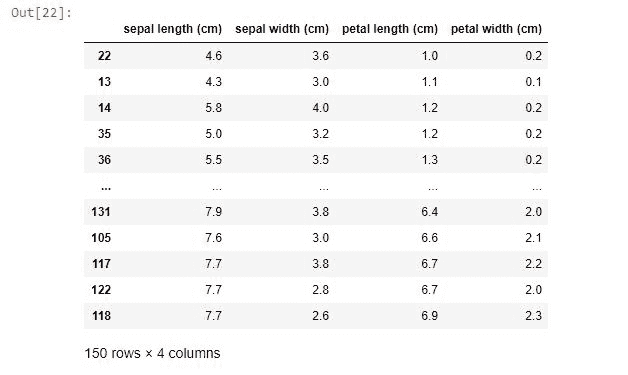

# 在 Python 中 inplace = True 是什么意思？

> 原文：<https://www.askpython.com/python-modules/pandas/inplace-true-parameter>

当开始使用 [pandas](https://www.askpython.com/python-modules/pandas/python-pandas-module-tutorial) 甚至在网站上查询 pandas 操作时，我们经常会遇到代码中出现的**就地**参数。**原地的默认值设置为假。**

在本文中，我们将探讨在数据帧上执行操作时，inplace 参数的作用。

## inplace 参数有什么作用？

`inplace=True` 的使用取决于我们是否要对原始 df 进行修改。

让我们考虑删除已删除 NA 条目的行的操作。我们有一个数据框架(df)。

```py
df.dropna(axis='index', how='all', inplace=True)

```

在熊猫中，上述代码的意思是:

1.  熊猫创建原始数据的副本。
2.  对其执行所需的操作。
3.  将结果分配给原始数据。(这里要考虑的重要一点)。
4.  然后删除副本。

上面的代码什么也不返回，只是修改了原始的[数据帧](https://www.askpython.com/python-modules/pandas/dataframes-in-python)。

如果 inplace 设置为`False`，那么 pandas 将返回一个数据帧的副本，并在其上执行操作。

在 Pandas 中，我们有许多带有`inplace`参数的函数。

因此，当我们做`df.dropna(axis='index', how='all', inplace=True)`时，pandas 知道我们想要改变原始数据帧，因此它在原始数据帧上执行所需的改变。

## Inplace =真实的行动

让我们看看 inplace 参数的作用。我们将对 IRIS 数据集执行[排序操作](https://www.askpython.com/python/examples/quicksort-algorithm)，以演示`inplace`参数的用途。

点击可以了解更多关于加载虹膜数据集[的信息。](https://scikit-learn.org/stable/modules/generated/sklearn.datasets.load_iris.html)

```py
# Importing required libraries
from sklearn.datasets import load_iris
import pandas as pd

#Loading the dataset
data = load_iris(as_frame=True)
df = pd.DataFrame(data.data)

df

```


**Original Dataframe**

现在让我们对`petal length`特征进行排序操作

```py
df.sort_values('petal length (cm)' , ascending = True) #inplace by default set to False

```


Output After Sorting

现在让我们检查一下我们的原始数据帧发生了什么。

```py
df

```


Original Dataframe When Inplace Was At Its Default Value

***我们只是在打印时得到了原始数据帧，即使我们对它进行了排序操作。***

那么…刚刚发生了什么？

上面的例子很好地演示了 inplace 参数的应用。

默认情况下，它被设置为 False，因此该操作不会修改原始数据帧。相反，它返回一个对其执行操作的副本。

在上面的代码中，我们没有将返回的数据帧赋给任何新的变量，我们没有得到一个已排序的新数据帧。

```py
new_df = df.sort_values('petal length (cm)' , ascending = True , inplace=False)

new_df

```


Sorted New Dataframe When Inplace Is Set To False

我们只是将返回的数据帧赋给一个名为 new_df 的变量。

现在，它是原始数据帧的排序副本。

这里要考虑的重要一点是，原始数据帧仍然是相同的，并且确实经历了我们指定的任何转换。

现在让我们看看如果我们设置`inplace = True`会发生什么

```py
df.sort_values('petal length (cm)' , ascending = True , inplace = True)

```

运行代码似乎没有返回任何输出。但是等等..！

在检查了原始数据帧之后，我们得到了`inplace = True`正在做的事情的本质。

```py
df

```



Output When Inplace Is Set To True

在 Python 中设置了 inplace=true 之后，原始数据帧被修改了。

## 结论

这篇文章是关于就地参数的。我们现在对这个隐藏的参数有了一定的了解，它经常出现在函数中，而我们甚至没有意识到。

最后，我们在使用 inplace=True 时应该非常小心，因为它会修改原始数据框。

快乐学习！