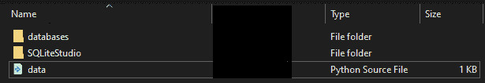
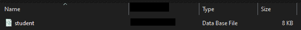
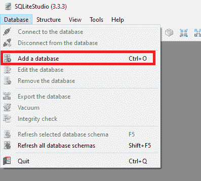
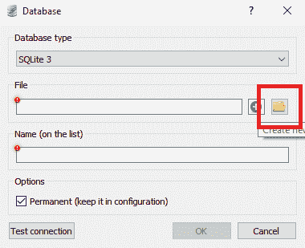
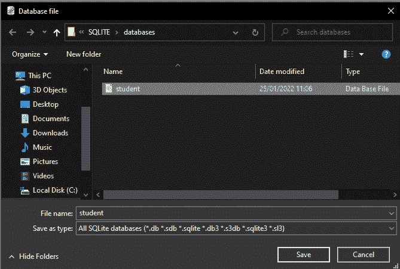
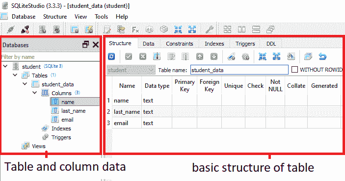
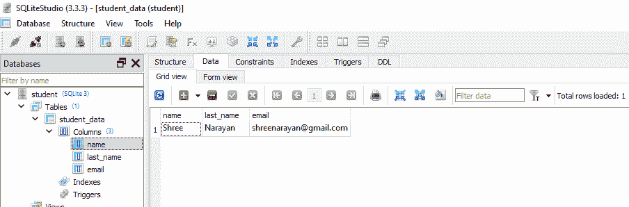
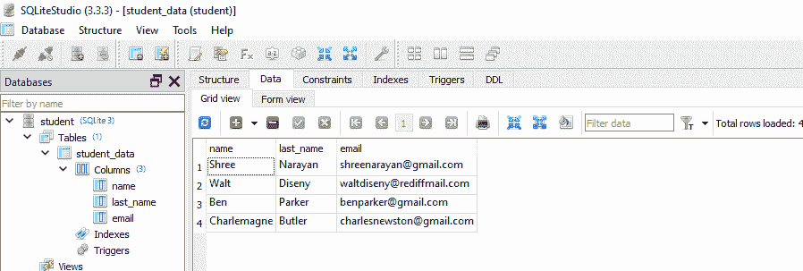

# 如何在 Sqlite3 数据库中插入多条记录

> 原文：<https://www.askpython.com/python/examples/insert-multiple-records-sqlite3>

大家好，在本文中，我们将学习 Sqlite3 数据库如何工作，以及如何使用 Python 一次添加多行。现在，数据库基于四种基本操作 CRUD。

1.  创造
2.  恢复
3.  更新
4.  删除

当今技术领域中最常用的数据库类型是关系数据库。它们的名字本身就定义了它们的功能——用一些特殊的键连接起来的桌子。其中之一是 Sqlite3 数据库。

## SQL 与 SQLite3

让我们快速比较一下 SQL 和 SQLite 有什么相似和不同之处。

### 什么是 SQL？

SQL 是一种帮助我们与数据库交流的语言。SQL 的命令被专门称为“查询”。每个查询都有一个特殊的目的。这种解释语言没有任何特殊的编译器，而是从特殊的 SQL 框架中执行它。互联网上有各种各样的服务器。其中一个就是 SQLite3。

### 什么是 SQLite3？

SQLite3 框架是一个轻量级的 SQL 服务器。以下是 SQLite3 的一些特性。

1.  原始工作不需要服务器连接。
2.  需要更少的内存空间。
3.  不需要安装，解压 zip 文件，就可以使用了。
4.  命令更容易执行。
5.  跨平台——在 Windows、Linux 和 Mac 系统上运行。
6.  集成–可以使用 C/C++、Java、Python 等语言进行操作。

## 在 Sqlite3 数据库中插入多条记录的步骤

本文的这一部分告诉我们如何将 SQLite3 与 Python 结合使用，并在 SQL 的一个命令中添加多个记录。

**注意:[对于使用 Python 在 SQLite3 数据库中添加多条记录的代码，跳到第 5 点](#5-adding-multiple-records-at-a-time)** 。

### 1.设置环境

当我们使用任何数据库时，我们需要设置一些点。在处理大型项目时，这是一个很好的实践。

1.  创建一个文件夹 SQLITE 来保存我们所有的数据库和代码。
2.  在该文件夹中创建另一个文件夹作为数据库。这将包含所有的数据库。
3.  从官网:[https://sqlite.org/download.html](https://sqlite.org/download.html)下载 slqite3 压缩包，搜索预编译的 Windows 二进制文件。我们可以根据我们的系统选择它是 32 位还是 64 位。
4.  下载完成后，将 zip 文件解压到我们的 SQLite 文件夹中。这就行了，不需要安装任何东西。
5.  创建一个 python 文件 data.py，其中包含我们将要编写的全部代码。

**现在看起来会是这样:**



Folder Setup

### 2.使用 Python 在 SQLite3 中创建数据库

Python 提供了一个特殊的库，名为 **sqlite3** ，它是一个内置的包。这样，我们的任务就变得容易了。我们只需要在我们的系统中安装 Python 3.x.x 版本。建议使用 3.6.x 版本进行无错误编程。

**代码:**

```py
import sqlite3

connection = sqlite3.connect('databases/student.db') # file path

# create a cursor object from the cursor class
cur = connection.cursor()

cur.execute('''
   CREATE TABLE customers(
       first_name text,
       last_name text,
       email text
       )''')

# committing our connection
connection.commit()

# close our connection
connection.close()

```

**SQLITE 中的数据类型**:SQLITE 3 中有五种数据类型

1.  空
2.  整数
3.  实数:小数点数字
4.  文本:字符串
5.  Blob:图像、mp3 文件、视频文件等。

**说明:**

1.  导入 sqlite3 模块。
2.  使用 connect()方法创建一个连接对象。这个方法创建一个数据库。使用连接对象存储它。
3.  使用 cursor()函数创建一个游标对象。为简单的工作流程创建一个简单的对象。游标对象有助于连接到新的或现有的数据库，并对其执行操作。
4.  然后使用同一个游标对象调用 execute()函数。这个函数以字符串参数的形式接受所有的 SQL 查询。
5.  创建一个简单的数据库，保存三条记录“名字”、“姓氏”和“电子邮件”。使用 Commit()函数提交操作。使用点“.”通过连接对象调用它接线员。
6.  使用 Close()方法关闭连接。

该命令还将一个“student.db”文件插入数据库文件夹。



Student Database Created In The Database Folder

### 3.在 SQLite studio 中查看数据库

从解压后的 zip 文件夹中打开 SQLite studio，选择语言为**“美式英语”**。然后，它会打开这样一个界面:


SQLite Studio Interface

点击**数据库**栏，从中选择**添加数据库**选项。我们也可以使用**“Ctrl+O”**命令来执行。



Adding A Database



To add the database from the system click on the folder icon



Select the appropriate database from the folder



View of the added database

### 4.将值插入数据库

这是最重要的查询之一。因为创建一个表并让它空着没有任何好处。因此，我们将在表中插入一些样本数据。SQLite 模块的两个方法为我们提供了同样的帮助。

1.  **execute()–一次只插入一条记录**。
2.  execute many()–一次插入多条记录。

#### 一次添加一条记录

**代码:**

```py
import sqlite3

connection = sqlite3.connect('databases/student.db') # file path

# create a cursor object from the cursor class
cur = connection.cursor()

cur.execute("INSERT INTO student_data VALUES ('Shree', 'Narayan', '[email protected]')")
# committing our connection

print('Command executed successfully!!!')
connection.commit()

# close our connection
connection.close()

```

**输出:**

要查看数据库中的更改，只需打开 Sqlite3 studio 并查看 studio 的**数据**选项。



Checking the inserted data

**说明:**

1.  首先，连接数据库。
2.  然后创建一个光标对象。
3.  然后使用 execute()函数添加具有 **name = "Shree "，last_name = "Narayan "和 email = "[【email protected】](/cdn-cgi/l/email-protection)"**的学生记录。
4.  提交更改，然后关闭连接。

### 5.一次添加多条记录

**代码:**

```py
import sqlite3

# connection = sqlite3.connect(':memeory:')
connection = sqlite3.connect('databases/student.db') # file path

# create a cursor object from the cursor class
cur = connection.cursor()

# creating a list of items

multiple_columns = [('Walt', 'Diseny', '[email protected]'),
                    ('Ben', 'Parker', '[email protected]'),
                    ('Charlemagne', 'Butler', '[email protected]')]

cur.executemany("INSERT INTO student_data VALUES (?,?,?)", multiple_columns)

# committing our connection

print('Command executed successfully!!!')
connection.commit()

# close our connection
connection.close()

```

**说明:**

1.  首先，连接数据库。
2.  然后创建一个光标对象。
3.  我们需要创建一个包含三个学生数据的元组列表。将其命名为**多记录**。
4.  使用光标对象，我们将使用 **executemany()** 函数。使用(插入到 student_data 列值(？, ?, ?)，multiple_records)命令。
5.  这里(？, ?, ?)是一个带有问号的**占位符**，问号根据特定表格的列数使用。我们有三列，所以我们使用三个占位符。

**execute many()函数的语法:**

```py
cursor_object.executemany("INSERT INTO database_name VALUES (?,?,?,...?)", column_list)

```

**输出:**

转到工作室，然后点击**刷新按钮或按 F5，**我们得到更新后的 student_data。



Inserted multiple records at a time

## 结论

在这里，我们总结了这篇文章，我希望这有助于每个人在各自的 DBMS 中进行所有可能的更改。SQLite with Python 很容易学习，但是要对每段代码进行修改。