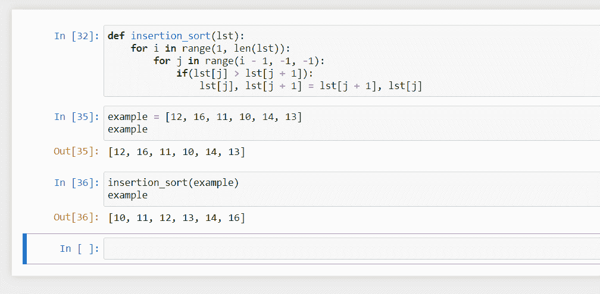

# Python 中的插入排序

> 原文：<https://www.askpython.com/python/examples/insertion-sort-in-python>

在本教程中，我们将学习 Python 中的插入排序，这是一种排序算法，与我们在现实生活中排序的方式非常相似。让我们开始吧。

## 插入排序算法

如果你有一套从 1 到 10 的混洗卡片，并要求你对它们进行分类，你可能会一张一张地捡起每张卡片，并把它们按正确的位置插入另一个分类堆中。

与我们倾向于对事物进行排序的方式非常相似，插入排序在给定的序列中维护一个已排序的部分，从未排序的部分中取出一个项目，然后*将*插入到已排序部分的正确位置。

开始时，排序部分中只有一个元素，也就是第一个元素(排序部分位于列表的开头)。

我们使用索引跟踪未排序部分的开始位置，未排序部分从第二个元素开始，因此索引需要为 1(在 Python 的情况下)。

现在，我们从未排序的部分中取出第一个元素(未排序索引处的元素),并尝试在已排序的部分中找到它的位置。

我们通过连续地将它与排序部分中的每个元素进行比较，直到我们找到比新元素更小(如果列表是升序)或更大(如果列表是降序)的元素。

接下来，我们将它插入到这个位置，并将所有已排序的元素移动一次，以容纳新元素。重复该过程，直到整个[数组](https://www.askpython.com/python/array/python-array-declaration)被排序。

## Python 中的插入排序

Python 中的算法如下所示:

```py
def insertion_sort(lst):
    for i in range(1, len(lst)):
        for j in range(i - 1, -1, -1):
            if(lst[j] > lst[j + 1]):
                lst[j], lst[j + 1] = lst[j + 1], lst[j]

```

请注意，该函数接收一个列表并就地执行排序。然而，改变算法返回一个排序列表是相当简单的。

### 了解插入排序算法

让我们试着在一个例子上运行这个算法，看看它是如何工作的。

*   比如说，给定的列表是:12，16，11，10，14，13。
*   给定列表的大小:6
*   按升序排序。

*   现在，`i`将从 1 到 5，因此，从 16 到 13 的所有元素将被插入到它们正确的位置。
*   在第一个循环里面，`j`会从`i - 1`到 0，所以它负责找到正确的位置。`j`会随着所选项目在列表中向后移动，试图找到正确的位置。
*   在更里面，我们将比较在`j`的项目和被选择的项目(总是在`j + 1`)，如果在`j`的项目更大，位置`j`和`j + 1`将被交换，项目将向后移动。
*   此后`j`将减 1，确保所选项目始终在位置`j + 1`。
*   最后，`j`处的项目将不再大于所选项目，并且所选项目将已经移动到其正确的位置，并且它将结束内部循环。
*   外部循环现在将对下一个项目做同样的事情。

序列的变化看起来大概是这样的:
12 ， 16 ，11，10，14，13
12， 11 ，16，10，14，13
11 ， 12 ， 16 ，16 10 ， 12 ， 16 ，14
1310， 11 ， 12 ， 16 ，14
1310， 11 ， 12 ， 16
10 ， 11 ， 12 ， 13 ， 14 ， 16
10 ， 11 ， 12 ，

*   绿色的项目表示它们在排序部分中处于正确的位置。
*   红色的项目在向左移动到正确位置时被排序。
*   未着色的项目是列表中未排序的部分。

## 输出

对算法运行相同的列表，将产生以下结果:



Insertion Sort in action

## 结论

在本教程中，我们看到了插入排序与我们在现实生活中如何排序非常相似，我们讨论了它使用的算法，并用 Python 实现了插入排序。

之后，我们讨论了该算法是如何工作的，并在一个未排序的例子上运行了该算法。最后，我们使用代码的实际输出来验证模拟运行。插入排序和[冒泡排序](https://www.askpython.com/python/examples/bubble-sort-in-python)一样，复杂度也是 O(n² )。

与此类似，如果输入大小增加一倍，执行时间增加四倍，如果输入增加三倍，执行时间增加九倍。

这使得该算法在实际应用中效率很低，但它是一种非常直观的算法。

我希望你喜欢学习插入排序，下一课再见。