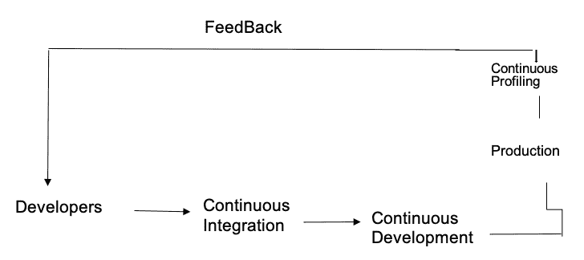
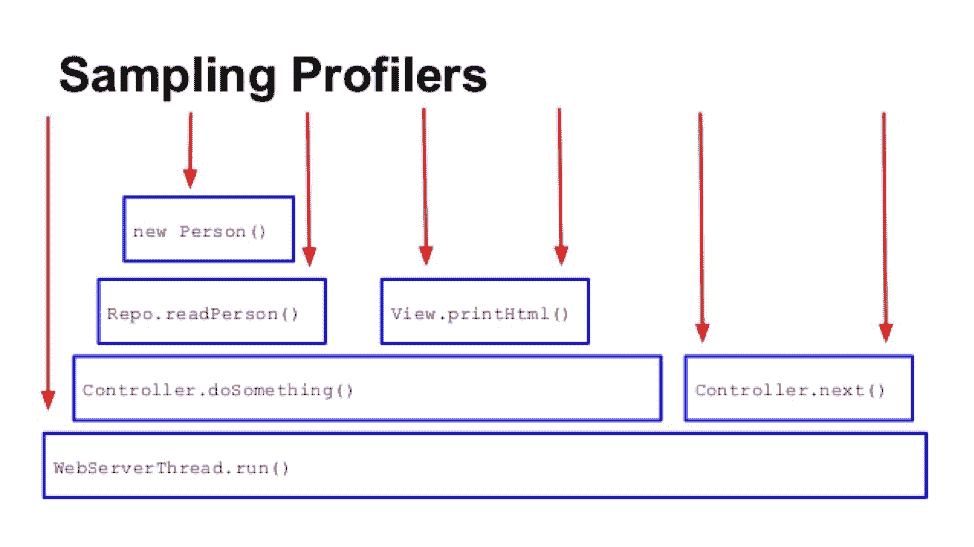
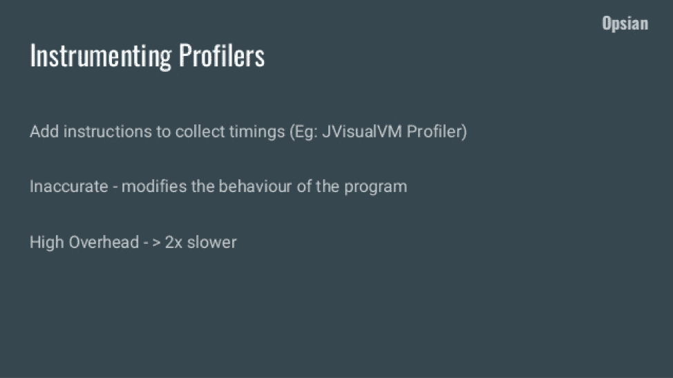

# 为什么您应该在工作流程中集成连续分析

> 原文：<https://www.askpython.com/python/integrate-continuous-profiling-in-workflow>

Photo by [Firmbee.com](https://unsplash.com/@firmbee?utm_source=unsplash&utm_medium=referral&utm_content=creditCopyText) on [Unsplash](https://unsplash.com/s/photos/web-design?utm_source=unsplash&utm_medium=referral&utm_content=creditCopyText)

您已经编写了在开发中有效的精致代码。是时候将它投入生产供不同的人使用了。这时，成千上万的问题开始涌入你的脑海:如果 web 应用程序在生产过程中崩溃了怎么办？我如何知道我的 web 应用程序是否处于最佳性能？有没有一种技术可以让我轻松理解生产绩效？我的团队有办法解决可能导致真正生产问题的缺陷吗？

本文将回答这些问题，并教您一个将应用程序转移到生产环境的过程。

## 什么是连续剖析？

[持续剖析](https://granulate.io/introduction-to-continuous-profiling/)是在任何时间、任何规模上优化您的代码在生产中的性能的过程。它包括从生产环境中持续收集性能数据，并将其提供给开发人员和运营团队进行快速和深入的分析。

这是一个草图，显示了持续的分析反馈。

## 为什么要使用持续剖析？

您需要一个持续的概要分析架构，以便程序员可以获得关于他们代码性能的行级反馈。当我在这里说性能时，我的意思是你将看到一些有限的资源的利息消耗率。资源可以是[挂钟时间](https://whatis.techtarget.com/definition/wall-time-real-world-time-or-wall-clock-time)，内存，CPU 时间，磁盘 I/O 等等。

如果这些资源耗尽，会导致系统内的瓶颈。因此，如果您能够识别并改进利用这些资源的代码库部分，您将很快从性能衰退中恢复过来；降低成本；并改善可伸缩性、程序员的思维模式和用户体验。

尽管您觉得需要为每种编码语言实现连续的分析器，但是概念并没有太大的不同。连续分析器无计划地定期获取概要文件，以确保开销不明显。

分析器通过帮助像您这样的开发人员以低廉的成本解决性能问题，并自动使用为您提供有关应用程序生产行为的重要数据的分析报告，提供了惊人的好处。这些信息允许您理解和分析对您来说是热点的重要代码区域。

## 我们拥有的连续轮廓仪的类型

有两种主要类型的代码分析器:采样分析器和检测分析器。

**1。采样分析器:**也称为统计分析器，它们通过获取各种时间点的样本来估计应用程序中“花费的时间”分配。

[Source](https://www.slideshare.net/RichardWarburton/jvm-profiling-under-the-hood)

**2。检测分析器:**它们通过升级应用程序代码和向函数中插入调用来工作，这些函数计算进程被调用的次数和在函数中花费的时间。与这种性能分析相关的开销通常很高，因为探查器直接将检测注入到应用程序代码中。

[Source](https://www.slideshare.net/RichardWarburton/production-profiling-what-why-and-how)

## 您应该了解的连续分析器

#### Gprofiler

gProfiler 是一个开源的连续分析器，你可以用最少的努力无缝地安装它，不需要修改代码:它是即插即用的。产品代码的可见性立即得到了促进，gProfiler 被配置为在后台持续工作。

因此，以最少的 CPU 使用量实时分析性能问题变得更加容易。它还致力于优化应用程序的云使用，使其成为一个经济高效的解决方案。

它支持 Python、Java、Go、Scala、Clojure 和 Kotlin 应用程序等编程语言。

#### **Datadog 连续剖面仪**

Datadog 的[连续分析器](https://www.datadoghq.com/product/code-profiling/)可以轻松发现占用更多 CPU 或内存的代码行。它配备了运行在主机应用程序上的 Datadog 代理。它可以支持用不同的编码语言编写的应用程序，如 Python、Java 和 Go，但是您获得的概要信息类型会因语言而异。

例如，Java 应用程序是唯一一个为您提供每个方法读写文件所用时间的分析信息的应用程序。但是，CPU 中使用的每个函数的时间在所有编程语言中都是可以访问的。

#### **亚马逊 CodeGuru Profiler**

[Amazon CodeGuru Profiler](https://aws.amazon.com/codeguru/) 帮助程序员理解应用程序的行为运行时，并找到代价高昂的代码行。您可以利用它来诊断性能问题，如[高延迟](https://www.cloudflare.com/learning/performance/glossary/what-is-latency/)或通过寻找机会提高 CPU 和内存使用率来降低吞吐量。它帮助你削减成本。

因此，它可以在生产中不断运行，以发现性能问题，并提供机器学习支持的建议，说明如何了解和优化代码应用程序中成本最高或资源密集型的行。亚马逊 CodeGuru 支持 Java 和 Python 应用。

#### **Dynatrace 代码分析器**

[Dynatrace Code Profiler](https://www.dynatrace.com/technologies/net-monitoring/net-profiler/) 使用他们获得专利的 PurePath 技术，该技术基于跨越端到端事务的代码级跟踪。它提供了 CPU 和内存工具的概要分析，允许开发人员深入到方法级别来检测问题。它支持 PHP、Java、.NET，Node.js，还有 Go。

我们可以看到，连续概要分析器是应用程序生产中不可或缺的一部分，我希望这篇文章能够回答您关于连续概要分析的许多问题。非常感谢您的阅读。