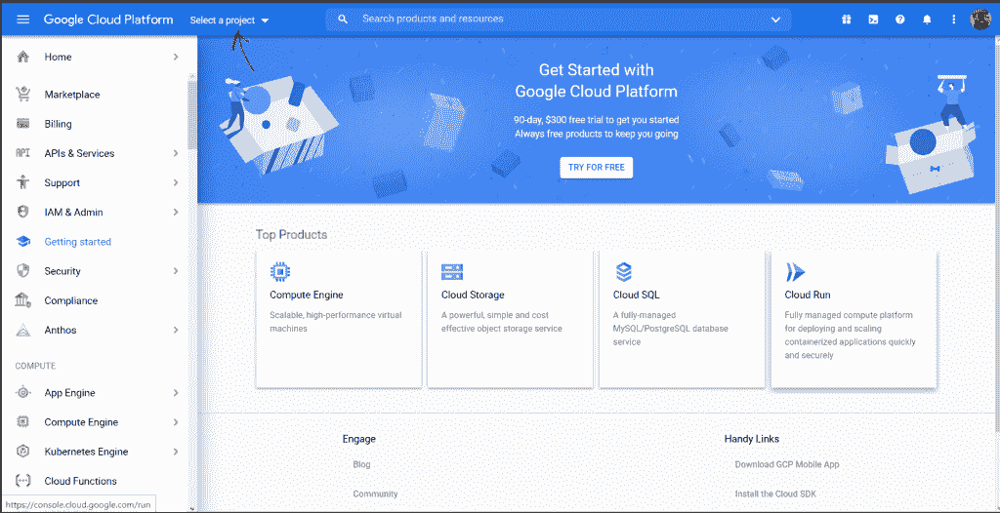
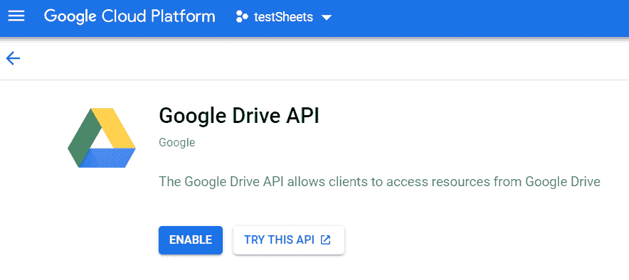
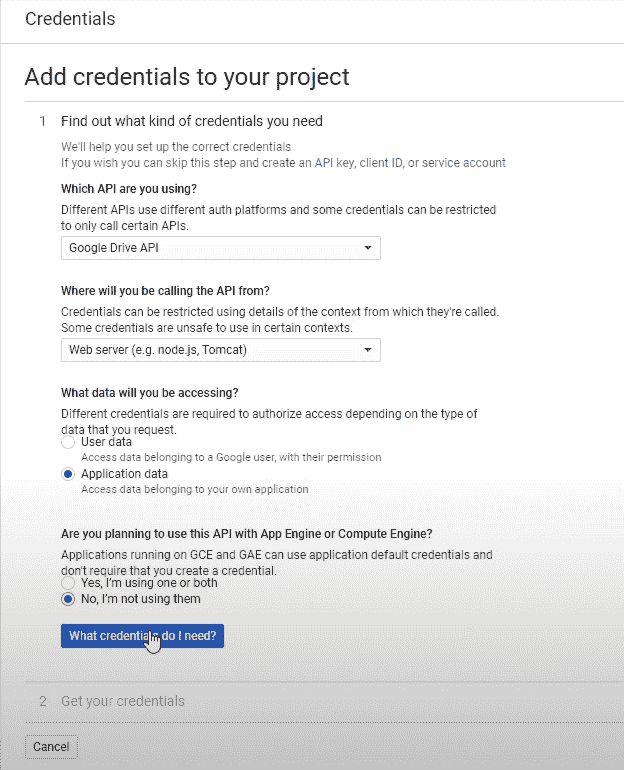
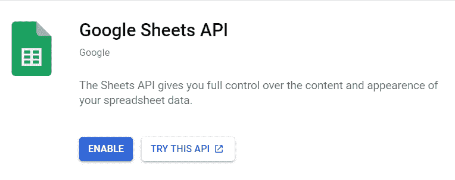
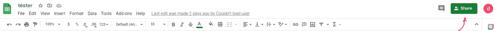
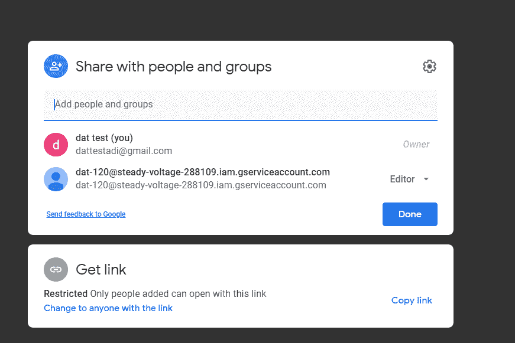
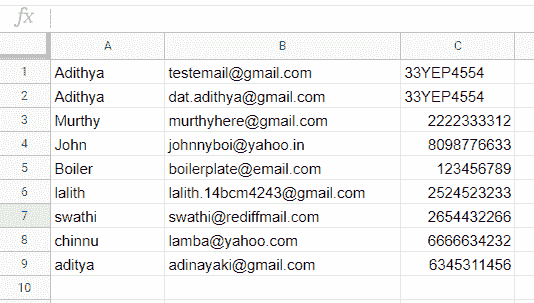

# 为初学者集成 GSheets 和 Python

> 原文：<https://www.askpython.com/python/examples/integrating-gsheets-with-python-beginners>

在本文中，我们将通过一个简单的循序渐进的教程来学习如何将 GSheets 与 Python 集成在一起。

## 介绍

很多时候，当我们处理代码时，我们最终会意识到我们需要一个地方来存储代码产生的信息或代码使用的信息。

最终，在进一步观察后，我们意识到全球使用的解决方案是一种被称为**数据库**的东西。

您也逐渐发现可以通过您的代码访问这些数据库，欣喜若狂之余，您迫不及待地想尝试一下。

几周后，你意识到数据库有很多选择，你一直使用的 Google Sheets 也可以充当数据库。

具有创建、读取、更新和删除的所有操作，或缩写为 **CRUD** 。

好消息是，你是对的！

Google Sheets 是一款允许我们在线查看、编辑和协作记录日常生活中使用的记录的软件。

但是，有一点很多人都没有意识到。Google 还为我们提供了从代码中轻松访问工作表的功能。

通过我们的代码，我们可以在浏览器中执行所有我们可以执行的操作！

然而，像往常一样，为了理解代码如何工作，需要开始一步。

所以，现在你知道接下来会发生什么了，让我们开始使用 Google Sheets 吧！

## 安装 Google Python 客户端 API

为了开始通过 Python 使用 Google Sheets，我们首先需要确保我们有运行它的功能和能力。

也就是说，下面是**谷歌客户端库**的`pip`安装命令，

```py
pip install --upgrade google-api-python-client google-auth-httplib2 google-auth-oauthlib

```

我们将使用其他几个模块，这些模块使处理记录变得更容易，这是直接使用 Google Sheets 的一种迂回方式，

```py
pip install gspread oauth2client

```

这应该适用于 Python 的大多数实例，但是，如果您似乎有任何问题，您可能希望查看[安装页面](https://github.com/googleapis/google-api-python-client)。

## 将 GSheets 与 Python 集成的步骤

接下来，我们将看看将 GSheets 与 Python 集成的步骤。请遵循以下步骤:

### 1.在 GCP 建立一个项目

为了使用 GSheets API，我们首先需要创建并使用我们在**谷歌云平台**中创建的项目，也称为 **GCP** 。

根据定义，**谷歌云平台**是一套云计算服务，为了与基于云的 API 进行交互，我们需要与 **GCP** 合作作为先决条件。

所以，一定要记住 **GCP** ，和你的**谷歌驱动**是链接的，这意味着如果你创建一个项目，并且只启用**驱动 API** ，我们将能够接收 API 与脚本交互和检索数据所需的凭证。

所以，重要的事情先来！我们必须登录各自的账户，进入[谷歌云控制台](https://console.cloud.google.com)。



A bit overwhelming, but, it gets easier when you look at it a bit closer.

现在，让我们创建一个项目。方法是简单地点击**选择图中红色箭头指示的项目**，并在弹出窗口时创建一个**新项目**。

您可以选择将任何名称作为您的项目标题，如果您不将此项目连接到特定组织，请选择“无组织”选项。

如果您还没有重定向到仪表板，您可以通过侧栏**(主页- >仪表板)**访问它。

### 2.启用驱动器 API

现在我们已经创建了项目，是时候引入 API 了。

寻找 API 的一个简单的解决方案是使用顶部的搜索栏，查询 **Google Drive API** 。


Search bar located next to the selected project

如果你找到了正确的，它应该看起来像这样，



The Google Drive API allows for access to the Google Drive of the particular account

现在我们在这里，让我们启用它，这应该会自动导致该 API 的概述页面。

接下来，您需要通过侧栏进入凭证部分。
**概述- >凭证**。

让我们根据我们的项目生成凭证，这意味着我们的响应必须符合， **Google Drive API** 、 **Web 服务器**、**应用程序数据、**以及对计算引擎集成的**否，看起来像这样，**



Credentials Generation Selection

然后，我们用我们输入的**服务帐户名称**创建一个服务帐户，它可以是任何名称，角色为编辑。

我们将我们的权限分配给一个编辑器，因为这允许我们执行所有的 CRUD 操作，但是不允许我们删除整个文件本身。

我们还希望这个文件是一个 **JSON** 文件，正如我们将在这个例子中使用的。

然后，我们还以类似的方式启用 **Sheets API** ，但是不创建任何凭证。



Enabling the Sheets API in a similar fashion

### 3.使用 creds.json

现在，您可能想要返回到您已经下载的`JSON`格式的凭证，并将它存储在我们将要创建脚本的目录中。

在这个项目中，我们将把凭证文件重命名为`creds.json`,但是，请记住，您可以对其进行重命名，但是，无论何时提到或使用该文件，都需要对其进行重命名。

现在，在`creds.json`中，我们将收到一堆键和值，但是，我们只需要担心`client_email`键。复制这个键的值，因为我们需要用这个电子邮件 ID 来共享我们的 Google 表单，以便访问它的内容。

接下来，要么创建一个新的工作表，要么使用现有的工作表，并通过页面右上角的共享选项添加电子邮件。



Add the email to the collaborators of the spreadsheet

在这一步结束时，您应该会得到类似这样的结果。



The gservice account requires the editor permission to be able to edit the file.

这使得 Google 服务帐户能够访问和修改您提供的表单。

### 4.用 Python 访问 Gsheets

终于！

我们现在到达了实际开始编写代码的部分。

因此，回到文章开头，我们安装了一些额外的模块，现在是我们开始使用它们的时候了。

`gspread`模块本质上是 Google Sheets 模块的 Python API，由一个像样的[文档](https://docs.gspread.org/en/latest/)组成，而`oauth2client`模块只是一个与 OAuth 一起工作的库。

oauth2client 库现在被认为是不推荐使用的，并且已经这样做了以支持 [google-auth](https://google-auth.readthedocs.io/en/latest/) 库。

然而，它将满足我们的工作与表的例子。让我们首先导入模块，开始编写脚本！

```py
# Authentication and access modules
import gspread
from oauth2client.service_account import ServiceAccountCredentials

# pprint is used for pretty printing the output
# It is not vital to the script in any way, but rather for us
# to view the examples
from pprint import pprint 

```

接下来，我们添加访问工作表的范围，

```py
# sheet access
scope = ["https://spreadsheets.google.com/feeds",'https://www.googleapis.com/auth/spreadsheets',"https://www.googleapis.com/auth/drive.file","https://www.googleapis.com/auth/drive"]

```

这定义了我们从中检索电子表格的页面。一旦我们完成了这些，脚本将知道在哪里寻找我们的文档，因此有了术语`scope`。

接下来，我们继续使用`oauth2client`模块为服务帐户提供和授权我们的凭证。

```py
creds = ServiceAccountCredentials.from_json_keyfile_name("creds.json", scope)
client = gspread.authorize(creds)

```

现在，我已经创建的工作表被命名为 **tester** ，并且我正在使用第一个工作表中的记录，因此，将特定的工作表分配给一个变量是以这样的方式完成的，

```py
sheet = client.open("tester").sheet1

```

我们结束了！

现在，我们已经建立了到工作表的连接，剩下的代码是测试电子表格的功能。

建议您在自己的工作表/示例中进行测试，因为这是一次非常实用的体验。

```py
# retrieves all records
print("Retrieving all records.... ")
data = sheet.get_all_records()
pprint(data)

# retrieving specific row values
print("\nRetrieving information from row 3... ")
row = sheet.row_values(3)
pprint(row)

# retrieving specific column values
print("\nRetrieving information from column 3... ")
col = sheet.col_values(3)
pprint(col)

# retrieving specific cell
print("\nRetrieving value of a cell placed at (1, 2) in the sheet... ")
cell = sheet.cell(1, 2).value
pprint(cell)

# inserting details into the sheet
print("\nInserting details into the sheet... ")
insertDetails = ["Adithya", "[email protected]", "33YEP4554"]
sheet.insert_row(insertDetails, 1)

# updating details in the sheet
print("\nUpdating details in the sheet...")
sheet.update_cell(2, 2, "[email protected]")

```

最后，我们通过`sheet.insert_row`向工作表中插入一个值，并指定它是第 1 行的一部分。

这是命令行的输出，

```py
[{'33YEP4554': 2222333312,
  'Adithya': 'Murthy',
  '[email protected]': '[email protected]'},
 {'33YEP4554': 8098776633,
  'Adithya': 'John',
  '[email protected]': '[email protected]'},
 {'33YEP4554': 123456789,
  'Adithya': 'Boiler',
  '[email protected]': '[email protected]'},
 {'33YEP4554': 2524523233,
  'Adithya': 'lalith',
  '[email protected]': '[email protected]'},
 {'33YEP4554': 2654432266,
  'Adithya': 'swathi',
  '[email protected]': '[email protected]'},
 {'33YEP4554': 6666634232,
  'Adithya': 'chinnu',
  '[email protected]': '[email protected]'},
 {'33YEP4554': 6345311456,
  'Adithya': 'aditya',
  '[email protected]': '[email protected]'}]

Retrieving information from row 3...
['John', '[email protected]', '8098776633']

Retrieving information from column 3...
['33YEP4554',
 '2222333312',
 '8098776633',
 '123456789',
 '2524523233',
 '2654432266',
 '6666634232',
 '6345311456']

Retrieving value of a cell placed at (1, 2) in the sheet...
'[email protected]'

Inserting details into the sheet...

Updating details in the sheet...

```

这是电子表格本身的图像，



The spreadsheet at the end of the script.

### 5.走向

既然我们已经使用了 sheets 模块的基本原理，那么在某种程度上实现自动化将是明智的。

几个例子是通过命令行输入出现在会场的人的出席情况，或者只是将一个文件的所有记录添加到 Google Sheet 中，对输入进行一点格式化。

gspread 文档包含了比本文所讨论的更多的特性，从更新单元格到删除整个工作表。

## 结论

当谈到记录细节时，使用 Python 使用 Google Sheets 打开了许多大门，可能是将其用作数据库、协作记录，甚至只是更新细节，以便非编码人员可以理解它。

总的来说，这是一个开始使用 Google API 的好方法。

也就是说，看看其他一些可以帮助您处理数据库和配置的模块也是一个好主意，比如 [SQL](https://www.askpython.com/python-modules/sql-in-python) 、[熊猫](https://www.askpython.com/python-modules/pandas/python-pandas-module-tutorial)和 [dotenv 模块](https://www.askpython.com/python/python-dotenv-module)。

**此外，在你查看这些之前，这里是我们今天开发的脚本的链接—[要点链接](https://gist.github.com/dat-adi/c8cc33a6209e1a9aeb8d03b5e46e6483)。**

## 参考

*   [谷歌官方文档](https://developers.google.com/sheets/api/guides/concepts)
*   [谷歌控制台云主页](https://console.cloud.google.com/getting-started)
*   [表单 API](https://developers.google.com/sheets/api/quickstart/python#step_1_turn_on_the)
*   [谷歌的快速入门代码](https://developers.google.com/sheets/api/quickstart/python#step_3_set_up_the_sample)
*   [测试脚本](https://gist.github.com/dat-adi/c8cc33a6209e1a9aeb8d03b5e46e6483#file-test_sheet-py)