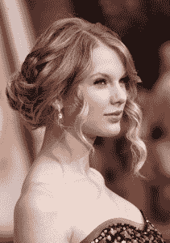
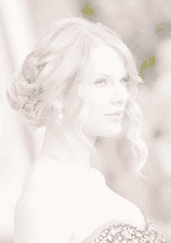
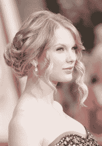
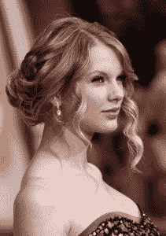
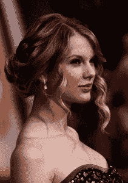

# Python OpenCV 中图像的灰度变换操作

> 原文：<https://www.askpython.com/python-modules/intensity-transformation-python-opencv>

嘿伙计们！在本教程中，我们将看看如何使用 Python 编程语言来改变图像的亮度。

* * *

## 图像强度变换介绍

为了对比度处理或图像阈值处理，对图像进行强度修改。这些是在空间域中，这意味着它们是直接在手边的图片的像素上完成的，而不是在图像的傅立叶变换上完成的。

* * *

## 对图像实施强度变换操作–Python OpenCV

第一步包括加载必要的模块/库，并使用 **OpenCV** 库的 **cv2.imread** 函数加载我们想要在程序中处理的图像。

```py
import cv2
import numpy as np
from google.colab.patches import cv2_imshow

img = cv2.imread('sample.jpg')
cv2_imshow(img)

```



Intensity Transformations Sample Image

接下来，我们设置一个伽马值，它将定义图像的强度，并沿伽马值进行伽马校正，以获得正确强度的图像。

最后一步，我们使用 **OpenCV** 库的 **cv2.imwrite** 方法保存图像。

```py
for gamma in [0.1, 0.5, 1.2, 2.2]:
	gamma_corrected = np.array(255*(img / 255) ** gamma, dtype = 'uint8')
	cv2.imwrite('gamma_transformed_'+str(gamma)+'.jpg', gamma_corrected)

```

四个 gamma 值的所有输出图像显示如下。



Gamma Transformed0 1



Gamma Transformed0 5



Gamma Transformed1 2



Gamma Transformed2 2

* * *

## **结论**

恭喜你！您刚刚学习了如何使用 Python 中的 OpenCV 库构建一个 Python 程序来修改图像的亮度。希望你喜欢它！😇

喜欢这个教程吗？无论如何，我建议你看一下下面提到的教程:

1.  [使用直方图可视化图像中的颜色–Python OpenCV](https://www.askpython.com/python/visualizing-colors-in-images)
2.  [使用 OpenCV 绘制形状——完整的操作指南](https://www.askpython.com/python/examples/draw-shapes-using-opencv)
3.  [使用网络摄像头和 Python OpenCV[简易指南]进行实时素描](https://www.askpython.com/python/examples/sketch-using-webcam)
4.  [Python OpenCV filter2D()函数——完整指南](https://www.askpython.com/python-modules/opencv-filter2d)

感谢您抽出时间！希望你学到了新的东西！！😄

* * *