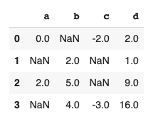

# 使用插值填充 Python 中缺失的条目

> 原文：<https://www.askpython.com/python/examples/interpolation-to-fill-missing-entries>

插值是 Python 中的一种技术，通过它可以估计两个已知数据点之间的未知数据点。它通常用于使用已知值填充表或数据集中缺失的值。

插值也是一种用于图像处理的技术。扩展图像时，您可以使用相邻像素来估计新像素的像素值。

金融分析师也使用内插法，利用过去的已知数据点来预测金融未来。

在本教程中，我们将学习插值来填充数据集中缺失的值。

[熊猫数据帧](https://www.askpython.com/python-modules/pandas/dataframes-in-python)提供了一个[。interpolate()方法](https://pandas.pydata.org/pandas-docs/stable/reference/api/pandas.DataFrame.interpolate.html)，可用于填充数据中缺失的条目。

让我们创建一些虚拟数据，看看插值是如何工作的。

## 对系列数据中的缺失值使用插值

让我们创建一个带有缺失值的[熊猫](https://www.askpython.com/python-modules/pandas/python-pandas-module-tutorial)系列。

```py
import pandas as pd
import numpy as np
a=pd.Series([0, 1, np.nan, 3,4,5,7])

```

### 1.线性内插法

如你所见，第二个索引的值是 **nan** 。使用以下代码行插入数据:

```py
a.interpolate()

```

输出结果如下。：

```py
0    0.0
1    1.0
2    2.0
3    3.0
4    4.0
5    5.0
6    7.0

```

Pandas 提供了多种插值方法。如果没有指定，线性插值是默认方法。

让我们在相同的数据上尝试另一种类型的插值。

### 2.多项式插值

多项式插值要求您指定阶数。让我们试试 2 阶插值。

```py
a.interpolate(method='polynomial', order=2)

```

输出结果如下:

```py
0    0.00000
1    1.00000
2    1.99537
3    3.00000
4    4.00000
5    5.00000
6    7.00000

```

如果在多项式插值中给定阶数为 1，则得到与线性插值相同的输出。这是因为一阶多项式是线性的。

```py
a.interpolate(method='polynomial', order=1)

```

输出:

```py
0    0.0
1    1.0
2    2.0
3    3.0
4    4.0
5    5.0
6    7.0

```

### 2.通过填充进行插值

通过填充进行插值意味着复制丢失条目之前的值。

使用填充插值时，需要指定一个界限。该限制是该方法可以连续填充的 nan 的最大数量。

让我们看看它在 python 中是如何工作的。

```py
a.interpolate(method='pad', limit=2)

```

我们得到的输出为:

```py
0    0.0
1    1.0
2    1.0
3    3.0
4    4.0
5    5.0
6    7.0

```

丢失的条目被替换为与其之前的条目相同的值。

我们将极限指定为 2，让我们看看在连续三个 nan 的情况下会发生什么。

```py
a=pd.Series([0, 1, np.nan, np.nan, np.nan, 3,4,5,7])
a.interpolate(method='pad', limit=2)

```

输出如下:

```py
0    0.0
1    1.0
2    1.0
3    1.0
4    NaN
5    3.0
6    4.0
7    5.0
8    7.0

```

第三个 nan 没有被触动。

## 熊猫数据帧的插值

我们也可以使用插值来填充熊猫数据帧中缺失的值。

让我们创建一个虚拟数据帧，并在其上应用插值。

```py
s = pd.DataFrame([(0.0, np.nan, -2.0, 2.0), (np.nan, 2.0, np.nan, 1), (2.0, 5.0, np.nan, 9.0), (np.nan, 4.0, -3.0, 16.0)], columns=list('abcd'))

```



Dataframe

### 1.熊猫数据帧的线性插值

要在数据帧上应用线性插值，请使用以下代码行:

```py
s.interpolate()

```

输出:


Linear interpolation

这里， **b 列**下的第一个值仍然是 nan，因为在它之前没有用于插值的已知数据点。

您还可以插入数据帧的各个列。

```py
s['c'].interpolate()

```

输出:

```py
0   -2.000000
1   -2.333333
2   -2.666667
3   -3.000000

```

### 2.通过填充进行插值

要应用填充方法，请使用以下代码行:

```py
s.interpolate(method='pad', limit=2)

```

我们得到的输出为:


Padding

## 结论

本教程是关于 Python 中的插值。我们主要关注使用插值来填充缺失数据。希望你和我们一起玩得开心！