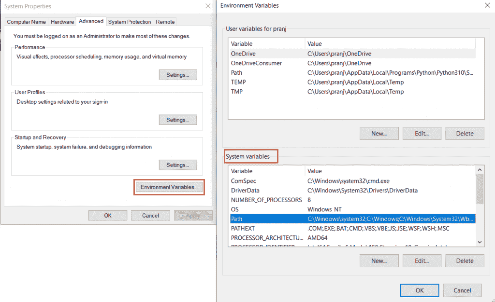

# Selenium 中的浏览器驱动程序介绍

> 原文：<https://www.askpython.com/python-modules/introduction-browser-drivers-selenium>

Selenium 中的驱动程序对于浏览器自动化是至关重要的，而不是必须的。Python 或任何其他编程语言中的 Selenium 库使用特定的浏览器驱动程序来控制浏览器的操作，为其添加功能，并在其中操作数据(网页)。

与最常见的声明浏览器驱动程序的方式相反，这种方式最常见，但经常会导致不兼容问题。在 Python 代码中有多种安装、初始化 web 驱动程序的方法(不太常见)。

***推荐阅读: [Python 硒介绍及设置](https://www.askpython.com/python-modules/selenium-introduction-and-setup)***

## 下载驱动程序

Selenium 中最主要的错误发生在浏览器的驱动程序版本与浏览器的版本不匹配时，这就产生了兼容性问题。因此，首先，你必须始终使用与你打算用于自动化的 Web 浏览器(Google Chrome、Mozilla Firefox、Apple Safari 或任何其他浏览器)版本相同的驱动程序。

下载和安装 Web 驱动程序是完全安全的，因为这些驱动程序由官方浏览器公司维护并相应更新，用于测试和自动化其浏览器和网页。

检查您打算自动化的浏览器版本，并相应地从以下参考资料中下载驱动程序:

| 网络浏览器 | 驱动程序下载参考 |
| --- | --- |
| 谷歌浏览器/Chromium | [下载](https://chromedriver.storage.googleapis.com/index.html) |
| Mozilla Firefox | [下载](https://github.com/mozilla/geckodriver/releases) |
| 微软 Edge | [下载](https://developer.microsoft.com/en-us/microsoft-edge/tools/webdriver/) |
| 苹果 Safari | 已经内置 |

Driver Download Links

## 使用驱动程序的方法

现在让我们看看如何使用 selenium web 驱动程序。

### 1.输入直接位置

*   在 Python Selenium 代码中使用 web 驱动程序实现浏览器自动化的最流行的方法。它受欢迎的原因是它使用的直接方法，在脚本中定义驱动程序。
*   这种方法需要手动下载 web 驱动程序。

**优点**:不需要关心冗长的设置或者计算出环境变量
缺点:使得代码不太灵活，每次更新都需要手动修改

```py
driver = webdriver.Chrome('path/to/chromedriver") 
driver = webdriver.Chrome('C://software/chromedriver.exe') #driver located at the specified location
driver = webdriver.Chrome('chromedriver.exe')  #driver located in the same directory as of the python script file

#other way

service = Service(executable_path="/path/to/chromedriver")
driver = webdriver.Chrome(service=service)

```

### 2.环境变量

*   如果你尝试过上面提到的方法，那么你可能已经注意到在你电脑的某个目录中记下/记住你安装的 web 驱动的位置是多么的累人。
*   为了解决这个问题，我们在环境变量中一劳永逸地定义了驱动程序的位置或路径。成功定义后，我们不需要在代码中指定路径位置，我们可以毫不费力地编码。
*   这种方法也需要手动安装驱动程序，因为你可能已经知道这种方法是用于路径变量的问题。

**优点**:没有为驱动程序指定路径的麻烦
**缺点**:没有更新功能

要设置环境路径变量，请在命令提示符下键入以下命令:使用驱动程序的路径(安装位置)代替下面命令中的“C:\WebDriver\bin”。

```py
setx PATH "%PATH%;C:\WebDriver\bin"

```

如果你觉得这种方法很难，那么你可以在你的 Windows 开始菜单中搜索环境变量，然后点击打开-" **编辑系统环境变量**。之后，从弹出窗口中选择**环境变量**，打开另一个弹出窗口。

从**系统变量**选项中，选择打开**路径**，现在点击**新建**引入一个新的路径变量。粘贴你的网络驱动的位置在里面，然后确定，确定，最后再次确定，在所有窗口。



Environment Variable

### 3.驱动程序经理

最后一个也可能是最有用的方法是 Python 代码中的 Web 驱动程序。在选择 Web 浏览器中的自动更新时，设备仅更新浏览器，而不更新已安装的驱动程序，在这种情况下，在执行 python 脚本时，代码会显示浏览器和驱动程序版本不同的错误。

**优点**:没有版本兼容性问题，有助于在多种浏览器之间轻松切换
**缺点**:对于初学者来说，设置起来可能有点困难

**安装驱动管理器**

```py
pip install webdriver-manager

```

**导入经理**

```py
from selenium import webdriver
from webdriver_manager.chrome import ChromeDriverManager            # --> for Chrome

#from webdriver_manager.firefox import GeckoDriverManager               # --> for Firefox

```

现在，我们已经安装并导入了管理器，我们在代码中使用它，如下所示

使用`**install()**`方法获取管理器使用的位置，并将其传递给 loc_service 类。此方法本身会通知已安装的 web 驱动程序的位置。

```py
driver = webdriver.Chrome(ChromeDriverManager().install())   # --> for Chrome

#driver = webdriver.Firefox(executable_path=GeckoDriverManager().install())     #--> for Firefox

```

对于其他任何浏览器，可以查看驱动管理器软件的官方 [GitHub 库](https://github.com/SergeyPirogov/webdriver_manager)。

## 结论

教程到此为止。与 Selenium 中使用 web 驱动程序的流行方法相反，在本教程中，您了解了执行相同操作的其他方法，这些方法可能更有优势。