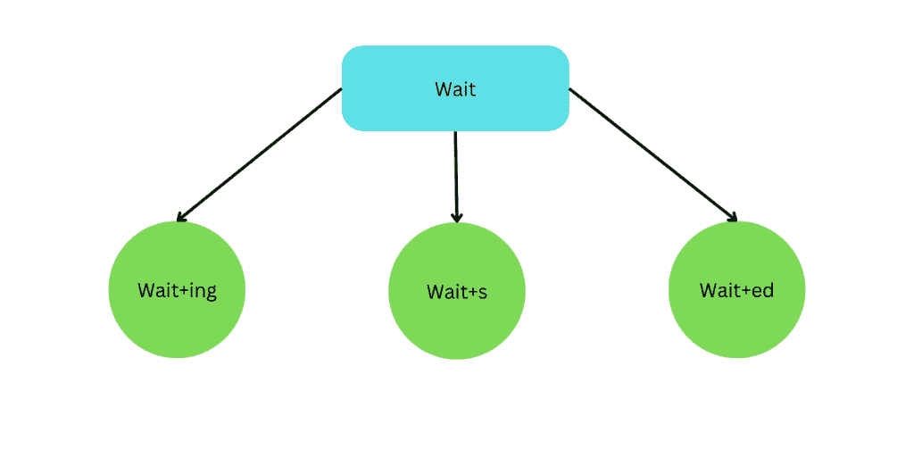
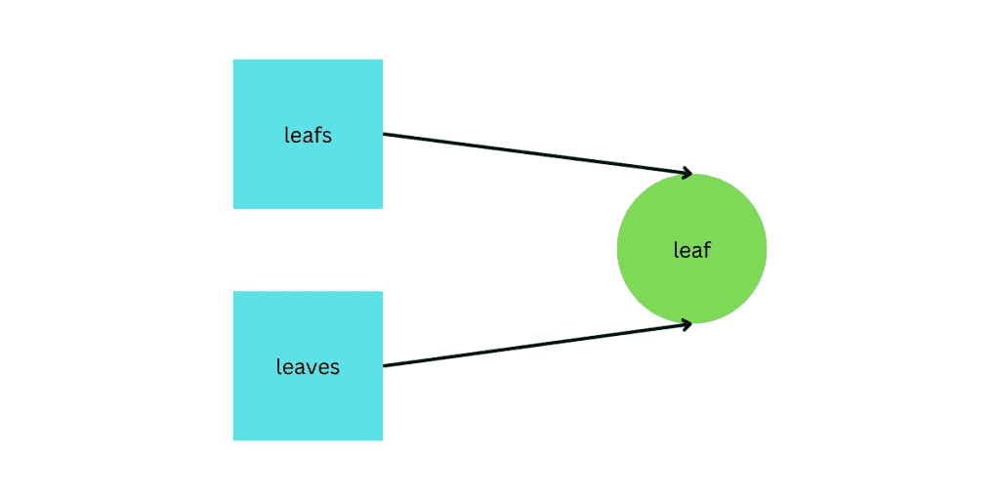
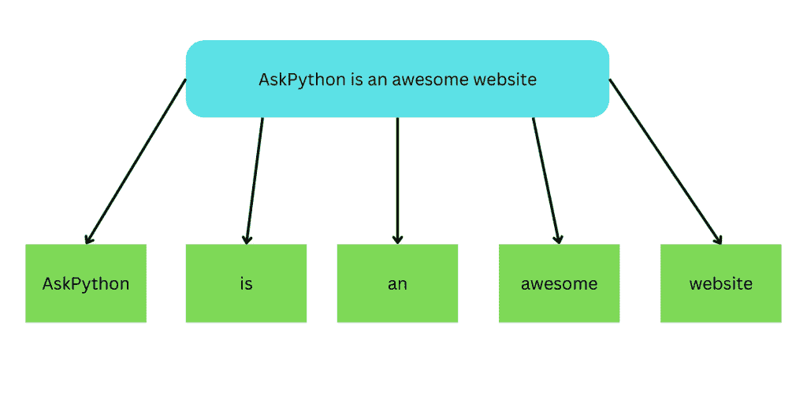
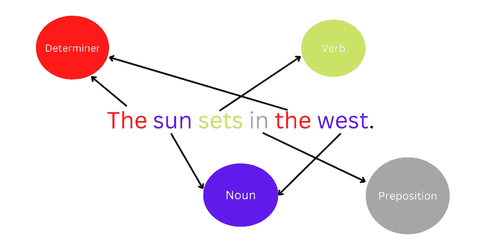
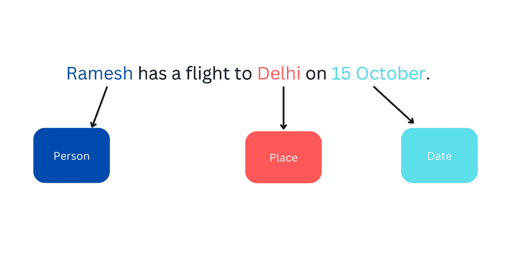
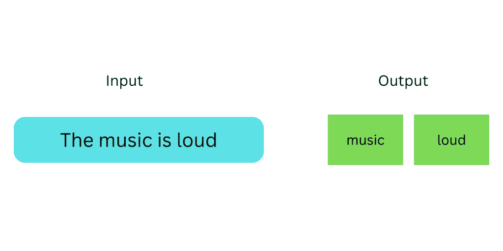

# 自然语言处理简介

> 原文：<https://www.askpython.com/python/examples/introduction-to-nlp>

自然语言处理(NLP)是计算机科学的一部分，更具体地说是人工智能的一部分，它处理计算机与人类用自然语言进行的交互。人类使用自然语言作为交流的手段。

自然语言处理旨在让计算机像人类一样理解自然语言，并生成它们。计算机可以理解结构化数据，如数据库中的表格，但人类语言是以文本和语音的形式存在的，这些是非结构化的数据形式。NLP 的应用范围从苹果的 Siri 这样的语音助手到机器翻译、文本过滤等概念。

在本文中，我们将对自然语言处理进行概述。

* * *

## NLP 难吗？

人类的语言很复杂。同样的事情在人类语言中可以用不同的方式表达。一个句子中使用的单词根据上下文和它们的用法可以有不同的意思。

为了得出句子的正确意思，需要事先知道上下文。言语、手势和声音在人类语言交流中也起着重要的作用。NLP 很难，因为语言包含了歧义和不确定性。所有这些都是自然语言处理的一些挑战。

* * *

## NLP 的组件

自然语言处理有以下两个组成部分:

1.  **自然语言理解**
    自然语言理解是指计算机理解人类语言的能力。它是重新排列非结构化数据以便计算机能够理解的过程。
2.  **自然语言生成**
    自然语言生成是从结构化或非结构化数据中生成人类可读文本的过程。

* * *

## 自然语言处理技术

我们来看看常用的自然语言处理技术。这些技术包括句法技术，如**词干化**、**词汇化**、**词性标注**和 **[标记化](https://www.askpython.com/python-modules/tokenization-in-python-using-nltk)** 以及语义技术，如**命名实体识别**和**停用词移除**。

### 堵塞物

词干化将一个单词简化为它的词干，即词根或基本形式。这是通过删除任何词缀添加到一个词。

Stemming

* * *

### 词汇化

词汇化是将单词转换成其词根的过程。这是借助词性标注和句子的上下文来确定单词的词根。

Lemmatization

* * *

### 标记化

令牌是代表一个单词或其一部分的任何东西。这意味着即使是字符也可以被认为是记号。标记化是将句子分解成单个单词并存储它们的过程。

Tokenization

* * *

### 词性标注

词性标注对于句法和语义分析非常重要，因为一个单词在给定的句子中可能有多个含义。在这种情况下，需要知道单词的具体含义，以便计算机进行适当的处理。

POS Tagging

* * *

### 命名实体识别

自然语言处理中的命名实体识别(NER)是指将单词分类到子类别中的过程。NER 模型从识别感兴趣的实体开始，然后将其归类到最合适的类别。以下是一些最常见的命名实体类型的列表:

*   人
*   组织
*   日期
*   地方

Named Entity Recognition

* * *

### 停止单词删除

停用词是句子中常用的词。停用词的例子有“is”、“the”、“in”、“a”、“an”等。这些是为了使句子语法正确而添加的，但是在开发模型时没有什么重要性，所以我们删除了它们。这也减小了数据集的大小。

Stop Words Removal

***推荐阅读:[用于 NLP 的 Python 库](https://www.askpython.com/python/top-python-libraries-for-natural-language-processing)***

* * *

## 自然语言处理的应用

下面是我们在日常生活中使用的一些最常见的 NLP 应用。

### 邮件过滤器

NLP 最常见的应用是消息过滤。这意味着将信息分为不同的类别，如垃圾邮件、社交、促销等。基于一些关键词的存在。这项技术最受欢迎的应用是在 Gmail 中。

### 语言翻译

像 Google translate 这样的翻译工具使用自然语言处理将给定的句子从一种语言翻译成另一种语言。

### 虚拟助手

虚拟助手不仅能理解用自然语言给出的命令，还能和你用同样的语言交谈。这类助手的例子有 Alexa、Siri、Google Home 等。

### 自动完成

像自动更正、自动完成和预测文本这样的功能在我们的智能手机中很常见。他们分别纠正拼写，完成单词，并通过查看到目前为止键入的句子来预测或建议句子中的下一个单词。所有这些功能都利用了 NLP。

* * *

## 结论

自然语言处理是人工智能的一个子领域，旨在帮助机器理解自然语言。NLP 在数字世界中有许多广泛的应用，它以创新的方式帮助改善了人机交互。