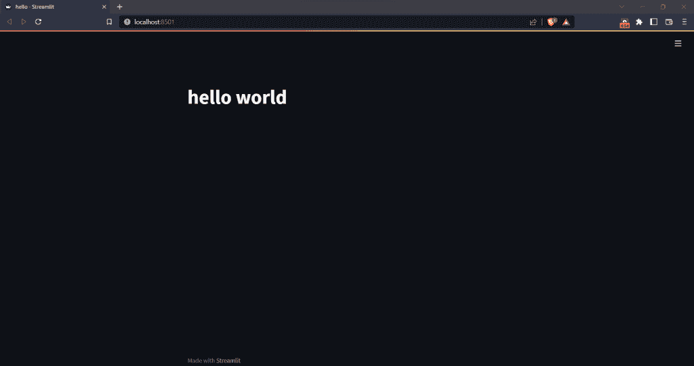
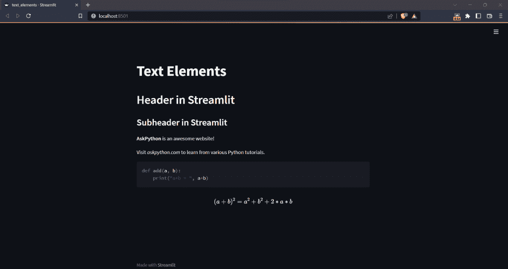

# 细流简介

> 原文：<https://www.askpython.com/python-modules/introduction-to-streamlit>

数据科学、数据分析和机器学习是过去几年中的一些新兴领域。采用上述技术的应用程序的开发有了巨大的增长，Python 是开发这种应用程序的首选语言。

但是，仅仅为机器学习模型编写代码是不够的，因为普通人无法使用它。在这里，以任何人都可以轻松使用的方式部署我们的模型是很重要的。Python 中有不同的选项来部署我们的模型，如 Django 和 Flask 框架。在使用这些框架时，我们还需要了解使用 HTML、CSS 和 JS 构建前端的知识。

如果我告诉你有一个更简单的方法呢？

Streamlit 是一个开源框架，让你不仅可以部署机器学习模型，还可以在几分钟内部署任何 Python 应用。它还能让我们管理并与他人分享我们的应用程序。

听起来很刺激，对吧？所以，让我们来探索 Streamlit 吧！

* * *

## 装置

首先，让我们先安装 streamlit。这样做真的很容易。你需要在电脑上安装 **Python 3.7-Python 3.10、Anaconda、PIP 和你最喜欢的 Python IDE** 。然后，在 anaconda 终端中，只需运行以下命令来安装`streamlit`:

```py
pip install streamlit

```

此命令仅适用于 Windows。要在 Mac 和 Linux 上安装 Streamlit，请参考此处的。

* * *

## 在细流中创建 hello world 应用程序

现在我们已经安装了 streamlit，让我们开始创建一个简单的“Hello World”应用程序。

这个文件的名字是“ **hello.py** ”。

```py
import streamlit as st

st.title("hello world")

```

要运行该应用程序，只需输入

```py
streamlit run hello.py

```

该应用将于`http://localhost:8501/`在您的默认网络浏览器中运行。

**输出:**



Streamlit Hello Word

* * *

## Streamlit 中的文本元素

现在让我们看看 Streamlit 提供的一些文本元素。

| **元素** | **描述** |
| 标题 | 设置页面的标题 |
| 页眉 | 以标题格式显示文本 |
| Subheader | 以副标题格式显示文本 |
| 降价 | 对文本使用标记格式 |
| 密码 | 将文本显示为代码，并突出显示适当的语法 |
| 乳液 | 使用 latex 显示数学方程式 |

Text Elements in Streamlit

```py
import streamlit as st

# set the app's title
st.title("Text Elements")

# header
st.header("Header in Streamlit")

# subheader
st.subheader("Subheader in Streamlit")

# markdown
# display text in bold formatting
st.markdown("**AskPython** is an awesome website!")
# display text in italic formatting
st.markdown("Visit _askpython.com_ to learn from various Python tutorials.")

# code block
code = '''
def add(a, b):
    print("a+b = ", a+b)
'''
st.code(code, language='python')

# latex
st.latex('''
(a+b)^2 = a^2 + b^2 + 2*a*b
''')

```

**输出:**



Streamlit Text Elements

在上面的代码中，我们首先导入了 streamlit，并添加了上表中讨论的每个文本元素。这里的语法也很容易理解。

在 **markdown** 部分，我们使用`** **`将文本**加粗**并使用`_ _`将其倾斜，就像我们一直做的那样。

此外，在**代码块**中，我们已经将**语言**指定为“ **Python** ”，以便根据需要突出显示代码。我们可以根据自己的需要指定任何语言。

现在，让我们来看看 **Streamlit** 中的一些小部件。

## 细流中的小组件

有了 widgets，我们可以通过使用按钮、滑块等使我们的应用程序具有交互性。

### 细流中的按钮

```py
import streamlit as st

#button
if st.button('Click here', help="Click to see the text change"):
    st.write('Hi there!')
else:
    st.write('Goodbye')

```

**输出:**

上面的代码由一个显示“点击这里”的按钮组成。在创建按钮时，我们还使用“help”参数添加了一个工具提示。如果按钮被点击，“你好！”将打印在屏幕上，否则将打印“再见”。

### 细流中的复选框

```py
import streamlit as st

# check box
checked = st.checkbox('Click here')
if checked:
    st.write('Good job!')

```

**输出:**

短信“干得好！”仅当复选框被选中时才显示。

### 细流中的单选按钮

```py
import streamlit as st

# radio button
lang = st.radio(
    "What's your favorite programming language?",
    ('C++', 'Python'))

if lang == 'C++':
    st.write('You selected C++.')
else:
    st.write('You selected Python.')

```

**输出:**

在这个例子中，我们有一个单选按钮，其中我们问了一个问题并给了用户两个选项。默认情况下选择第一个选项，如果用户选择第二个选项，将相应地显示文本。

### 细流中的滑块

```py
import streamlit as st

# slider
score = st.slider('Please specify your test score', 
                   min_value=0, max_value=100, value=10)
st.write("My test score is ", score)

```

**输出:**

这是一个简单的滑块，`min_value=0`是滑块中的最小值，也是默认的最小值，`max_value=100`是滑块中的最大值，`d` `value=10`指定最初显示的值。所有这些值都可以根据我们的要求进行更改。

* * *

## 结论

本教程到此为止！这是 Streamlit 教程系列的第一篇。也请查看本系列中的其他教程。

* * *

## 参考

*   [简化官方文档](https://docs.streamlit.io/)