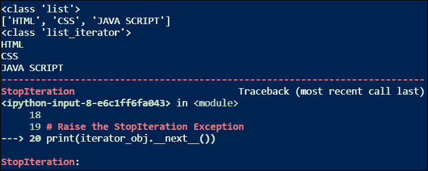

# Python 中的 Iterable 和 Iterator 有什么区别？

> 原文：<https://www.askpython.com/python/iterable-vs-iterator>

在本教程中，我们将讨论 Python 中 iterable 和 iterator 的区别。

* * *

## 理解可迭代与迭代器

在 Python 中，我们可以循环或迭代的任何东西都被称为**可迭代的**。当我们将一个 iterable 对象传递给 Python 中的`iter()`函数时，它会返回一个迭代器。

在 Python 中，**迭代器**是一个对象，通过将它传递给`iter()`函数从一个可迭代对象中获得。迭代器保存可被迭代的可数个值。迭代器用于迭代列表、字符串、元组等可迭代对象。在 Python 中。在迭代器的迭代中，它逐个返回每个元素。

***注意:Python 中的每个可迭代对象不是迭代器，但每个迭代器都是可迭代的。***

## Python 中的 Iterables

在 Python 中，有五个众所周知的可迭代对象。让我们逐一讨论。

### 1.目录

一个**列表**是 Python 中最常用的可迭代对象之一。它以有序的方式存储数据元素。让我们创建一个 [Python 列表](https://www.askpython.com/python/difference-between-python-list-vs-array)并迭代它。

```py
# Create a Python list
list = ["JournalDev", "AskPython", "LinuxforDevices"]
print("This is a Python list:")
print(list)

# Iterate through the Python list
# using a for loop
print("Iterating a Python list:")
for element in list:
    print(element)

```

**输出:**

```py
This is a Python list: 
['JournalDev', 'AskPython', 'LinuxforDevices'] 
Iterating a Python list: 
JournalDev 
AskPython 
LinuxforDevices

```

### 2.元组

一个**元组**是 Python 中另一个常用的可迭代对象。像 Python 列表一样，它也以有序的方式存储数据元素。但是元组和列表之间唯一的关键区别是——在 Python 中，元组是不可变对象，而列表是可变对象。让我们创建一个 Python 元组并迭代它。

```py
# Create a Python tuple
tuple = ('C', 'C++', 'Python', 'Java')
print("This is a Python tuple:")
print(tuple)

# Iterate through the Python tuple
# using a for loop
print("Iterating a Python tuple:")
for element in tuple:
    print(element)

```

**输出:**

```py
This is a Python tuple: 
('C', 'C++', 'Python', 'Java') 
Iterating a Python tuple: 
C 
C++ 
Python 
Java

```

### 3.线

一个 **[字符串](https://www.askpython.com/python/string/strings-in-python)** 也是 Python 中最常用的可迭代对象之一。在 Python 中，任何用单引号、双引号或三引号括起来的东西都称为字符串。它可以是单行字符串，也可以是多行字符串。让我们创建一个 Python 字符串并迭代它。

```py
# Create a Python string
string = "PYTHON"
print("This is a Python string: " + string)

# Iterate through the Python string
# using a for loop
print("Iterating a Python string:")
for element in string:
    print(element)

```

**输出:**

```py
This is a Python string: PYTHON
Iterating a Python string: 
P
Y 
T
H
O
N

```

### 4.一组

一个 **[集合](https://www.askpython.com/python/numpy-set-operations)** 也是 Python 中一个非常著名的可迭代对象。它类似于 Python 中的列表和元组，但唯一的关键区别是——集合中不允许有重复的元素。让我们创建一个 Python 集并迭代它。

```py
# Create a Python set
set = {"Go", "Dart", "Python", "Go"}
print("This is a Python set:")
print(set)

# Iterate through the Python set
# using a for loop
print("Iterating a Python set:")
for element in set:
    print(element)

```

**输出:**

```py
This is a Python set: 
{'Go', 'Python', 'Dart'} 
Iterating a Python set: 
Go 
Python 
Dart

```

### 5.词典

一个 **[字典](https://www.askpython.com/python/dictionary/python-dictionary-dict-tutorial)** 是 Python 中另一个非常广泛使用的可迭代对象。它用于以 key: value 格式存储数据，其中键必须是单值实体，而其对应的值可以是单值实体或多值实体。让我们创建一个 Python 字典并迭代它。

```py
# Create a Python dictionary
dict = {'py': 'PYTHON', 'mat': 'MATLAB', 'cpp': 'C++'}
print("This is a Python dictionary:")
print(dict)

# Iterate through the Python dictionary
# using a for loop
print("Iterating a Python dictionary:")
for key in dict:
    print(key + '-' + dict[key])

```

**输出:**

```py
This is a Python dictionary: 
{'py': 'PYTHON', 'mat': 'MATLAB', 'cpp': 'C++'} 
Iterating a Python dictionary: 
py-PYTHON 
mat-MATLAB 
cpp-C++

```

## Python 中的迭代器

当我们在 Python 中创建迭代器类的对象时，技术上有两个方法与之相关联。这两种方法属于迭代器类，统称为**迭代器协议**。

### 方法 1: __iter__()

在 Python 中，当我们试图通过将 iterable 对象传递给 iter()函数来创建迭代器对象时，会自动调用`__iter__()`方法。它用于从 iterable 对象初始化 iterator 对象。这个方法返回一个迭代器对象，可以用来迭代列表、元组、字典等可迭代对象。

### 方法 2:__ 下一个 _ _()

在 Python 中，当我们试图迭代 iterable 对象时，会自动调用`__next__()`方法。它用于遍历迭代器对象的所有元素。当应用于迭代器时，它返回 iterable 对象的下一个元素或值。当`__next__()`方法返回的可迭代对象中没有项目或元素时，通过引发`StopIteration`异常，它在停止可迭代对象的迭代中起着非常关键的作用。

## 如何转换 iterables ➔迭代器？

在 Python 中，我们可以很容易地转换列表、元组、集合等可迭代对象。简单地通过使用 iterable 对象到`iter()`函数，然后调用 iterable 对象上的`__iter__()`方法，iterable 对象被传递到`iter()`函数。

让我们从 Python 中的 iterable 对象创建一个 iterator 对象，并分析 iterator 类的`__iter__()`和`__next__()`方法的工作原理。

```py
# Create an iterable object
# here it's a Python list
iterable_obj = ['HTML', 'CSS', 'JAVA SCRIPT']
print(type(iterable_obj))
print(iterable_obj)

# Create an iterator object
# from the above iterable object (Python list)
# using the __iter__() method
iterator_obj = iterable_obj.__iter__()
print(type(iterator_obj))

# Iterate through the iterable object
# using its iterator object & the __next__() method
print(iterator_obj.__next__())
print(iterator_obj.__next__())
print(iterator_obj.__next__())

# Raise the StopIteration Exception
print(iterator_obj.__next__())

```

**输出:**



Output: iterator object creation

在上面的 Python 代码中，我们创建了一个 iterable 对象(Python 列表)，使用 __iter__()方法将其转换为 iterator 对象，使用 __next__()方法访问 iterable 对象的元素，并分析了当 __next__()方法被调用来访问 iterable 对象的下一个元素但 iterable 对象中没有剩余元素时，该方法如何引发 StopIteration 异常。

## 使用 for 循环迭代 iterable 对象

我们已经看到了上面的 iterable 对象的例子，循环的[被广泛用于在 Python 中迭代 iterable 对象的元素。让我们通过 Python 代码来分析迭代器的 for 循环的工作原理。](https://www.askpython.com/course/python-course-for-loop)

```py
# Create an iterable object here it's a Python tuple
iterable = ('macOS', 'Linux', 'Windows')
print(type(iterable))
print(iterable)

# Iterate through the iterable object using a for loop
print("Iteration using for loop:")
for item in iterable:
    print(item)

# Analyze the implemention of for loop to iterate through the elements of
# the iterable object (Python tuple) using an infinite while loop and iterator protocol
def for_loop(iterable):
    # Create an iterator object from the passed iterable object
    # using the iter() function
    iterator = iter(iterable)

    # Run an infinite while loop
    while True:
        try:
            # Access the each element of the iterable object
            # using the next() function
            print(next(iterator))
        except StopIteration:
            # If the StopIteration Exception is raised
            # by the next() function break the while loop
            break

# Driver Code to check the implementation of the for_loop() function
print("Iteration using for_loop function:")
for_loop(iterable)

```

**输出:**

```py
<class 'tuple'> 
('macOS', 'Linux', 'Windows') 
Iteration using for loop: 
macOS 
Linux 
Windows 
Iteration using for_loop function: 
macOS 
Linux 
Windows

```

从上面的 Python 代码中，我们已经理解了用于循环迭代可迭代对象元素的**实际上是通过**无限 while 循环**实现的。当我们使用 for 循环迭代 iterable 对象时，首先创建一个迭代器对象，调用`iter()`函数，然后运行一个无限 while 循环，在该循环中使用`next()`函数来访问 iterable 对象的下一个元素，当由于 iterable 对象的元素耗尽而由`next()`函数引发`StopIteration`异常时，迭代停止。**

## 结论

在本教程中，我们学习了以下内容。

1.  Python 中可迭代对象和迭代器对象的区别
2.  迭代器协议，即迭代器类的 __iter__()和 __next__()方法
3.  将可迭代对象转换为迭代器对象
4.  使用 for 循环迭代 iterable 对象的元素