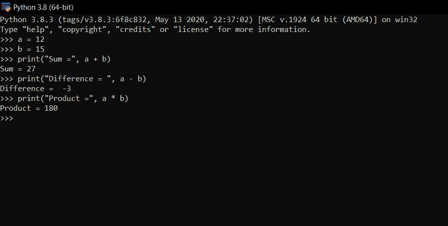
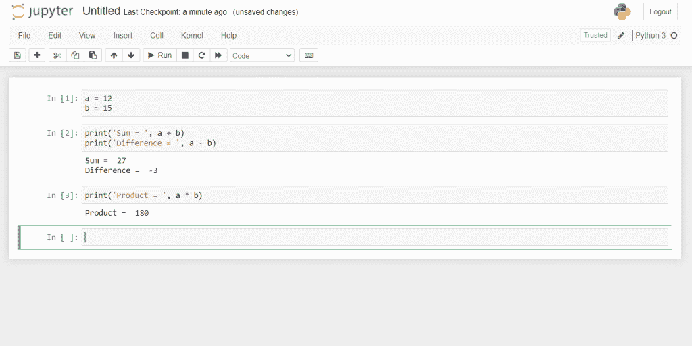
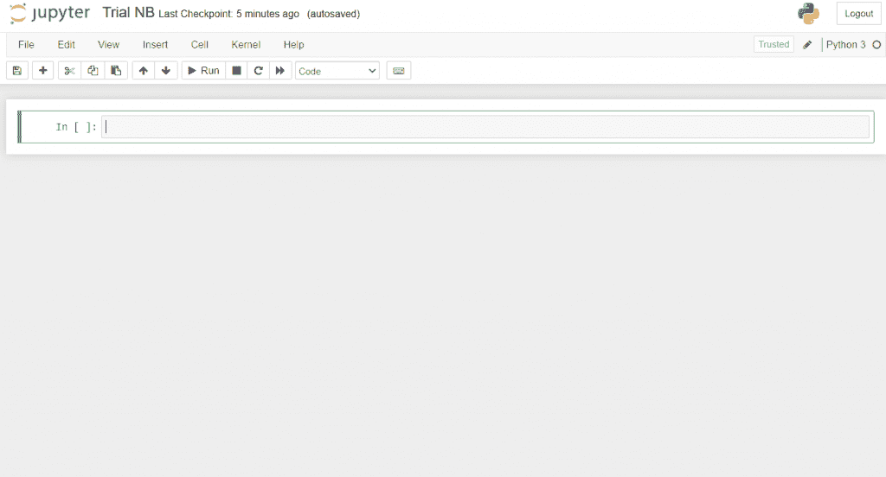
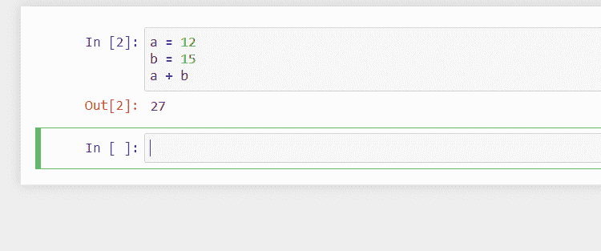
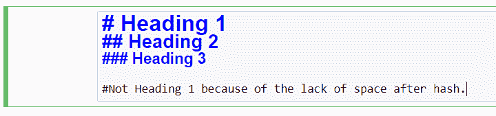
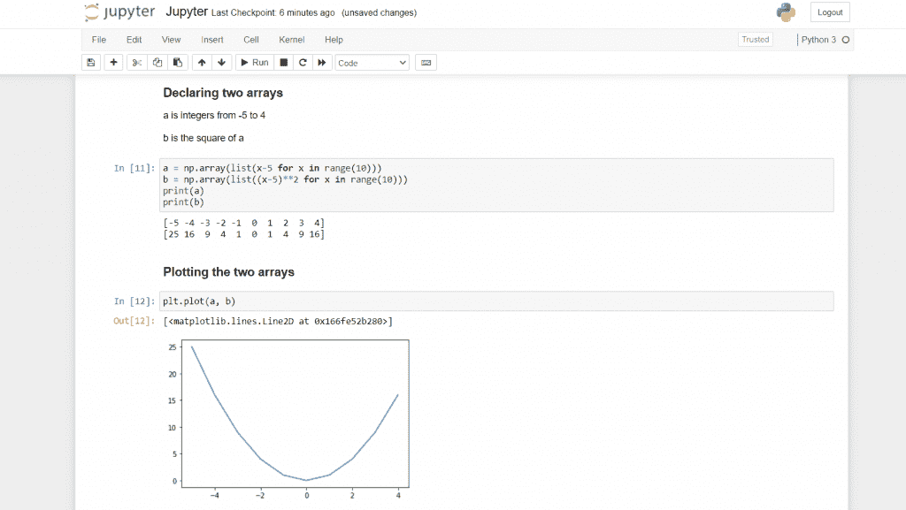

# Python 版 Jupyter 笔记本——综合指南

> 原文：<https://www.askpython.com/python/jupyter-notebook-for-python>

在本教程中，我们将了解一个简单但功能强大的 Python 笔记本。我们将学习什么是笔记本，如何安装 Jupyter 笔记本，如何使用它，以及为什么要使用 Jupyter 笔记本。

## 什么是笔记本？

要知道什么是笔记本，我们需要知道什么是 REPL。REPL 或读取-评估-打印循环是一种编程环境，顾名思义

*   它逐行读取编写的代码
*   然后它评估代码
*   查找错误并编译每个块
*   然后将结果(如果有)打印在 REPL shell 上。

这可能看起来很熟悉，因为 Python 就是这样工作的。通常我们使用文本编辑器或 IDE 来编译 Python 代码，但有时对于更简单的计算，Python shell 也能很好地工作。

笔记本是增强 REPL 体验的环境。它改善了 REPL 的许多问题，例如:

*   我们不能撤销写在前面一行的代码
*   编译的代码都不会被保存
*   而且它没有任何编辑特性，比如代码高亮和自动完成。

## 视觉差异 REPL 壳牌 vs Jupyter 笔记本

让我们看看 REPL shell 和 Jupyter Notebook 上的几个代码块之间的视觉对比。



Python on the REPL shell



Python on the Jupyter Notebook

从图片中可以清楚地看到 Jupyter Notebook 的功能与 REPL shell 基本相同，但它在许多方面都有所改进。

Jupyter Notebook 是一个开源的 web 应用程序，允许您创建和共享包含实时代码、公式、可视化和叙述性文本的文档。

引自 Jupyter 官方网站。

与文本编辑器不同，Jupyter Notebook 中的代码可以在我们需要的任何时候编译，它会给出我们决定编译的代码块的输出。

与 REPL shell 不同，它保存代码和输出，类似于文档。与文档类似，我们可以添加非 Python 文本块，如标题和段落，这些文本块对于理解笔记本中编写的 Python 代码可能有帮助，也可能没有帮助。

让我们从使用 Jupyter Notebook 的第一步开始。

## 安装 Jupyter 笔记本电脑

安装 Jupyter 有两种方法。它与 Anaconda 中的各种其他 Python 工具捆绑在一起，安装 Anaconda 非常简单，但这不在本教程的范围之内。

相反，我们将安装 Jupyter Notebook，除了 Python 本身之外没有任何其他软件。让我们开始吧。

### 1.安装 Python

假设你还没有 Python，进入 [Python 下载](https://www.python.org/downloads/)，为你的操作系统选择最新稳定版 Python 并下载安装程序，然后在合适的位置安装 Python。

要检查您是否已经成功安装了 Python 或者 Python 是否已经安装，请在终端/命令提示符下运行`*python*`(对于 macOS 为`*python3*`)。这应该运行 Python 外壳，要退出外壳，只需按 Ctrl + C 或键入`*exit()*`并回车。

### 2.升级 PIP 软件包管理器

这只是为了确保 pip(一个 python 包管理器)正常工作。转到终端/命令提示符并键入:

```py
python -m pip install --upgrade pip

```

等 pip 最新版本下载安装，现在就可以安装 Jupyter 笔记本了。

### 3.安装 Jupyter 笔记本

转到终端/命令提示符并键入:

```py
python -m pip install notebook

```

等待所有模块下载完毕，现在您应该已经在 PC 上安装了 Jupyter 笔记本电脑。

这也应该将 Jupyter Notebook 的路径添加到 Windows 上的环境变量中，这样就可以从终端运行 Jupyter Notebook 了。

### 4.运行 Jupyter 笔记本

要运行笔记本，您需要通过终端/命令提示符打开它。去那里输入:

```py
jupyter notebook

```

这将在您电脑的默认浏览器中打开笔记本。**注意:**你需要一个浏览器来打开笔记本，无论你在哪个浏览器中打开它，它都会作为一个标签运行。

**注意——一旦关闭终端窗口，进程就会退出。**

这将在以下位置打开笔记本:`C:\Users\<user name>`，这是您的用户目录。您可以在用户目录中的任何位置打开笔记本，但是您不能离开用户目录。

### 5.配置 Jupyter 笔记本

假设您需要在其他位置打开笔记本，我们该如何做呢？

*   选择需要打开笔记本的位置。确保该位置仅用于 Jupyter，因为名为。ipynb_checkpoints 将在该位置内部创建。但是，如果您不介意该文件夹，您可以选择任何位置。
*   现在打开终端/命令提示符，写:`jupyter notebook --notebook-dir "<full location goes here>"`
*   这将在指定的位置打开笔记本。
*   每次打开笔记本时都这样做是不可行的，所以最好将文本保存在. bat 文件中。每次需要打开 Jupyter Notebook 时运行该文件。

既然我们已经有了 Jupyter Notebook，我们就可以开始使用它了。

## 为 Python 使用 Jupyter 笔记本

在开始编写代码之前，我们应该知道如何做一些事情。运行笔记本，尝试以下事情。

### 1.创建文件夹

在*文件*标签下，右上角会有一个名为*新建*的按钮。点击它，在*其他*部分下，按下*文件夹*。

目录中会创建一个名为*无标题文件夹*的文件夹，勾选它旁边的复选框，在*文件*标签下，点击名为*重命名*的按钮，输入新名称。(如果需要的话，还可以使用删除按钮。)

单击文件夹名称将在同一选项卡中打开该文件夹。

### 2.创建 iPython 笔记本

点击*文件*选项卡下的*新建*按钮，点击*笔记本*栏目下的 *Python 3* 。

这将在一个新标签页中打开一个名为*未命名为*的新笔记本，您可能想要更改名称，为此，单击写在页面最上方的名称，系统将提示您编辑它。

### 3.编写和运行 Python 代码

现在我们有了一个笔记本，我们可以开始在里面编写和运行 Python 代码了。一路上，我们会学到几个有用的 Jupyter 笔记本的快捷键。

笔记本应该是这样的:



Jupyter Notebook interface

绿色包围的单元格是我们必须写代码的地方，写几行代码，在你认为需要看到输出的地方停下来。

**现在第一个快捷键来了:*Shift+Enter*T3。您也可以点击*“运行”。***

这将运行您编写的代码，并在单元格下方显示输出。它还将创建一个新的单元格，您可以在其中继续执行剩余的代码。

它看起来会像这样:



Jupyter Cells

请注意，单元格中定义的对象的范围不限于该单元格。这里的变量`a`和`b`在定义后可以在笔记本的任何地方使用。

### 4.在 Jupyter 笔记本中创建降价文档

笔记本本质上是一个包含所有代码和输出的文档。它还提供了一个附加功能，可以以纯文本形式键入。

为此，您需要将单元格设置为“Markdown”而不是“Code”。因此，在命令模式下，按下 *m* ，你写的任何内容都将被视为纯文本(没有语法高亮显示，并且 *shift + enter* 只会创建一个新的单元格)。

您也可以在上面的下拉菜单中选择*“降价”*来完成此操作。
在降价模式下按下 *y* 返回代码。

此外，在 markdown 中，您可以添加标题。与惯例类似，标题 1 最大，标题 6 最小。

在 Jupyter 笔记本中，在行前键入一个#和一个空格，使其成为 1 级标题，在行前键入两个#和一个空格，使其成为 2 级标题，依此类推。

在行前键入 7 个或更多的#和一个空格不会将其转换为任何标题，它将保持为常规纯文本。例如(在降价模式下):

```py
# Heading 1
## Heading 2
### Heading 3

#Not Heading 1 because of no space after the hash
```

请注意，在单元格上按下 *Shift + Enter* 后，哈希将会消失。输出:



Markdown Cell before pressing *Shift+Enter*


Markdown cell after pressing *Shift+Enter*

使用这些工具，您可以编写如下所示的代码:



## Jupyter 笔记本快捷方式

*   按下 *Esc* 会将上下文移出单元格并进入命令模式。现在，您可以执行与细胞相关的操作。
*   添加单元格“后”:按*一*(也可以按*“+”*按钮)
*   在“之前”添加单元格:按下 *b*
*   删除当前选中的单元格:按两次 *d* (另见*“编辑”*选项卡)
*   查找和替换:按下 *f*
*   回到编辑模式:按*键进入*

## 为什么要用 Jupyter 笔记本？

到目前为止，您可能已经意识到在 Jupyter 笔记本上书写与在文档中记笔记非常相似:

*   你写代码
*   您还要编写解释代码的文本
*   代码在运行时会提供一个输出
*   所有这些都可以动态改变——这意味着改变代码将会改变输出。

当您再次打开该文件时，它不仅会显示您在所有不同单元格中编写的代码，还会显示您上次关闭笔记本时的输出。

可以理解的是，当你要做的编程不是为了创建一个应用程序，而是为了执行和分析数学和/或技术运算时，这是非常有用的。

可以说，[机器学习](https://www.askpython.com/python/examples/roc-curves-machine-learning)和数据科学是笔记本最大的应用。

但是我发现它在几乎每个 Python 程序中都非常有用，在这些程序中，目标是运行程序并查看输出，而不创建任何最终产品。

## 结论

在本教程中，我们了解到笔记本基本上是增强的 REPL 外壳，我们了解到如何通过 [Python 包管理器 pip](https://www.askpython.com/python-modules/python-pip) 下载并安装 Jupyter Notebook，我们还了解到如何使用笔记本运行 Python 代码。我希望你喜欢阅读本教程。