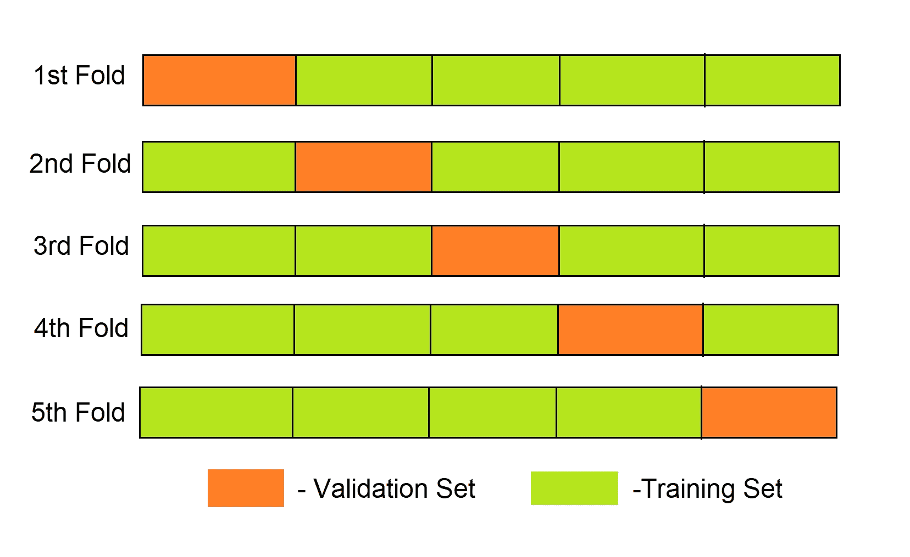

# 使用 SKLearn 在 Python 中进行 K-Fold 交叉验证

> 原文：<https://www.askpython.com/python/examples/k-fold-cross-validation>

[将数据集分割成训练集和测试集](https://www.askpython.com/python/examples/split-data-training-and-testing-set)是让机器学习模型为训练做好准备的一项基本任务。为了确定我们的模型是否过度拟合，我们需要在看不见的数据(验证集)上测试它。

如果给定的模型在验证集上表现不佳，那么在处理真实的实时数据时，它的表现会更差。这个概念使得交叉验证可能是机器学习的最重要的概念之一，它确保了我们模型的稳定性。

交叉验证只是简单地从数据集中保留一部分数据并用于测试模型(验证集)的方法，保留的数据以外的剩余数据用于训练模型。

在本文中，我们将实现 sci-kit learn 提供的交叉验证。我们将实现 K 重交叉验证。

## 交叉验证直觉

**我们先来看看为什么要使用交叉验证**。

*   它帮助我们进行模型评估，最终确定模型的质量。
*   对于确定模型是否能很好地概括数据至关重要。
*   检查模型是否过拟合或欠拟合。
*   最后，它让我们选择具有最佳性能的模型。

**交叉验证技术有很多种:**

*   遗漏一个交叉验证
*   k 倍交叉验证
*   分层 k 倍交叉验证
*   时间序列交叉验证

## 实施 K 倍交叉验证

数据集被分成“k”个子集，然后 k-1 个子集用于训练模型，最后一个子集作为验证集来测试模型。然后对模型在每个折叠上的得分进行平均，以评估模型的性能。



5 Fold Cross Validation

## 使用 scikit learn 进行 k 倍交叉验证

```py
#Importing required libraries
from sklearn.datasets import load_breast_cancer
import pandas as pd
from sklearn.model_selection import KFold 
from sklearn.linear_model import LogisticRegression
from sklearn.metrics import accuracy_score

#Loading the dataset
data = load_breast_cancer(as_frame = True)
df = data.frame
X = df.iloc[:,:-1]
y = df.iloc[:,-1]

#Implementing cross validation

k = 5
kf = KFold(n_splits=k, random_state=None)
model = LogisticRegression(solver= 'liblinear')

acc_score = []

for train_index , test_index in kf.split(X):
    X_train , X_test = X.iloc[train_index,:],X.iloc[test_index,:]
    y_train , y_test = y[train_index] , y[test_index]

    model.fit(X_train,y_train)
    pred_values = model.predict(X_test)

    acc = accuracy_score(pred_values , y_test)
    acc_score.append(acc)

avg_acc_score = sum(acc_score)/k

print('accuracy of each fold - {}'.format(acc_score))
print('Avg accuracy : {}'.format(avg_acc_score))

```

```py
accuracy of each fold - [0.9122807017543859, 0.9473684210526315, 0.9736842105263158, 0.9736842105263158, 0.9557522123893806]
Avg accuracy : 0.952553951249806 

```

在上面的代码中，我们实现了 5 重交叉验证。

sklearn.model_selection 模块为我们提供了 KFold 类，使得交叉验证的实现更加容易。`KFold`类具有`split`方法，该方法要求数据集作为输入参数执行交叉验证。

我们使用逻辑回归作为我们的模型进行了二元分类，并使用 5 重交叉验证进行了交叉验证。我们的模型的平均准确率约为 95.25%

随意查看 Sklearn KFold 文档[这里](https://scikit-learn.org/stable/modules/generated/sklearn.model_selection.KFold.html)。

## 使用 cross_val_score()进行交叉验证

您可以使用来自`sklearn.model_selection`模块的`cross_val_score`类方法来缩短上述代码。

```py
from sklearn.datasets import load_breast_cancer
import pandas as pd
from sklearn.linear_model import LogisticRegression
from sklearn.model_selection import cross_val_score
from sklearn.model_selection import KFold

data = load_breast_cancer(as_frame = True)
df = data.frame
X = df.iloc[:,:-1]
y = df.iloc[:,-1]

k = 5
kf = model_selection.KFold(n_splits=k, random_state=None)
model = LogisticRegression(solver= 'liblinear')

result = cross_val_score(model , X, y, cv = kf)

print("Avg accuracy: {}".format(result.mean()))

```

```py
Avg accuracy: 0.952553951249806

```

来自两个代码的结果是相同的。

`cross_val_score`类需要模型、数据集、标签和交叉验证方法作为输入参数。你可以在这里了解更多关于它的功能和方法[。](https://scikit-learn.org/stable/modules/generated/sklearn.model_selection.cross_val_score.html)

我希望到目前为止，您可能已经了解了交叉验证的概念。

使用交叉验证的一个重要实际含义是，随着模型在不同的数据上被训练和测试 k 次，我们将需要更多的计算资源。

## 结论

在本文中，我们试图获得交叉验证及其工作背后的一些直觉。我们使用 sklearn 实现了最常用的 K-Fold 交叉验证。

快乐学习！