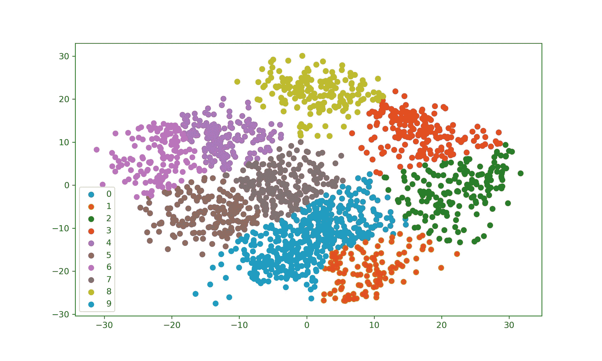

# 在 Python 中 K-Means 从零开始聚类[算法讲解]

> 原文：<https://www.askpython.com/python/examples/k-means-clustering-from-scratch>

K-Means 是一种非常流行的聚类技术。K-means 聚类是另一类非监督学习算法，用于找出给定数据集中的数据聚类。

在本文中，我们将使用 [Numpy 模块](https://www.askpython.com/python-modules/numpy/python-numpy-module)从头开始实现 K-Means 聚类算法。

## K-means 聚类算法的 5 个步骤

**第一步。随机选取 k 个数据点作为我们的初始质心。**

**第二步。**用 k 个质心找出训练集中每个数据点之间的距离(我们的目的是欧几里德距离)。

**第三步。**现在根据找到的距离将每个数据点分配到最近的质心。

**第四步。**通过取每个聚类组中的点的平均值来更新质心位置。

**第五步。重复步骤 2 到 4，直到我们的质心不变。**

我们可以使用像肘方法这样的方法来选择 K(聚类数)的最佳值。

## 实现 K 均值聚类算法

现在让我们用代码实现上面的步骤。导入 numpy 模块，然后浏览这里的其余代码，以了解 K-Means 聚类是如何在代码中实现的。

```py
#Importing required modules

import numpy as np
from scipy.spatial.distance import cdist 

#Function to implement steps given in previous section
def kmeans(x,k, no_of_iterations):
    idx = np.random.choice(len(x), k, replace=False)
    #Randomly choosing Centroids 
    centroids = x[idx, :] #Step 1

    #finding the distance between centroids and all the data points
    distances = cdist(x, centroids ,'euclidean') #Step 2

    #Centroid with the minimum Distance
    points = np.array([np.argmin(i) for i in distances]) #Step 3

    #Repeating the above steps for a defined number of iterations
    #Step 4
    for _ in range(no_of_iterations): 
        centroids = []
        for idx in range(k):
            #Updating Centroids by taking mean of Cluster it belongs to
            temp_cent = x[points==idx].mean(axis=0) 
            centroids.append(temp_cent)

        centroids = np.vstack(centroids) #Updated Centroids 

        distances = cdist(x, centroids ,'euclidean')
        points = np.array([np.argmin(i) for i in distances])

    return points 

```

上面函数为我们训练集中的每个数据点返回一个聚类标签数组。

## 测试 K 均值聚类

我们将使用 digits 数据集(内置在 sklearn 模块中)来测试我们的功能。可以参考[这篇](https://www.askpython.com/python/examples/plot-k-means-clusters-python)文章，了解更多绘制 K-Means 聚类的方法。

```py
#Loading the required modules

import numpy as np
from scipy.spatial.distance import cdist 
from sklearn.datasets import load_digits
from sklearn.decomposition import PCA
from sklearn.cluster import KMeans
import matplotlib.pyplot as plt

#Defining our function 
def kmeans(x,k, no_of_iterations):
    idx = np.random.choice(len(x), k, replace=False)
    #Randomly choosing Centroids 
    centroids = x[idx, :] #Step 1

    #finding the distance between centroids and all the data points
    distances = cdist(x, centroids ,'euclidean') #Step 2

    #Centroid with the minimum Distance
    points = np.array([np.argmin(i) for i in distances]) #Step 3

    #Repeating the above steps for a defined number of iterations
    #Step 4
    for _ in range(no_of_iterations): 
        centroids = []
        for idx in range(k):
            #Updating Centroids by taking mean of Cluster it belongs to
            temp_cent = x[points==idx].mean(axis=0) 
            centroids.append(temp_cent)

        centroids = np.vstack(centroids) #Updated Centroids 

        distances = cdist(x, centroids ,'euclidean')
        points = np.array([np.argmin(i) for i in distances])

    return points 

#Load Data
data = load_digits().data
pca = PCA(2)

#Transform the data
df = pca.fit_transform(data)

#Applying our function
label = kmeans(df,10,1000)

#Visualize the results

u_labels = np.unique(label)
for i in u_labels:
    plt.scatter(df[label == i , 0] , df[label == i , 1] , label = i)
plt.legend()
plt.show()

```



Plotting K Means Clusters

输出结果看起来很有希望。我们的实现是可行的。

## 结论

在本文中，我们使用 Python 从头开始创建了一个 K-Means 聚类算法。我们还讲述了制作 K-Means 算法的步骤，最后在 Digits 数据集上测试了我们的实现。你可以在维基百科的[页面上阅读 K-means 聚类算法的理论](https://en.wikipedia.org/wiki/K-means_clustering)

快乐学习