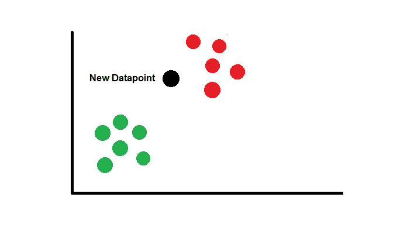

# 用 Python 从头开始 k-最近邻

> 原文：<https://www.askpython.com/python/examples/k-nearest-neighbors-from-scratch>

在本文中，我们将学习用 Python 从头开始实现 K 近邻。KNN 是一种监督算法，可用于分类和回归任务。

KNN 实现起来非常简单。在本文中，我们将从头开始实现 KNN 算法来执行分类任务。

## K-最近邻算法背后的直觉

在 K-最近邻中，不需要学习，因为模型存储整个数据集，并基于与之相似的点对数据点进行分类。它仅基于训练数据进行预测。



KNN Illustration

考虑上图。有两类数据(红色和绿色)，我们得到了一个新的数据点(黑色)，并被要求指定这个新的数据点属于哪个类？

KNN 认为相似的物品在群体中更接近。因此很明显，新的数据点更接近红色组，因此该算法将该点分类为红色。你可以在它的 [Wiki 页面](https://en.wikipedia.org/wiki/K-nearest_neighbors_algorithm)上阅读更多关于该算法的信息

**在 KNN 计算距离的方法**:

*   曼哈顿方法
*   欧几里德方法
*   闵可夫斯基方法
*   马哈拉诺比斯距离
*   等等..

在本文中，我们将使用欧氏距离来计算新数据点与训练数据集中每个点的接近度。

## 在 Python 中从头开始实现 K 近邻

首先，我们将从头开始计算 K-最近邻的实现步骤。

**第一步。**找出一个合适的距离度量来计算数据点之间的距离。

**第二步。**将距离存储在一个数组中，并按照距离的升序进行排序(保留索引，即可以使用 NumPy argsort 方法)。

**第三步。**选择排序列表中的前 K 个元素。

**第四步。**执行多数投票，出现次数最多的类别将被指定为待分类数据点的新类别。

## K 近邻的完整 Python 代码

现在在代码中转换上述步骤，从头开始实现我们的 K-最近邻

```py
#Importing the required modules
import numpy as np
from scipy.stats import mode

#Euclidean Distance
def eucledian(p1,p2):
    dist = np.sqrt(np.sum((p1-p2)**2))
    return dist

#Function to calculate KNN
def predict(x_train, y , x_input, k):
    op_labels = []

    #Loop through the Datapoints to be classified
    for item in x_input: 

        #Array to store distances
        point_dist = []

        #Loop through each training Data
        for j in range(len(x_train)): 
            distances = eucledian(np.array(x_train[j,:]) , item) 
            #Calculating the distance
            point_dist.append(distances) 
        point_dist = np.array(point_dist) 

        #Sorting the array while preserving the index
        #Keeping the first K datapoints
        dist = np.argsort(point_dist)[:k] 

        #Labels of the K datapoints from above
        labels = y[dist]

        #Majority voting
        lab = mode(labels) 
        lab = lab.mode[0]
        op_labels.append(lab)

    return op_labels

```

我们的预测函数需要一个训练数据集、真实标签、要分类的数据点以及作为输入参数的最近邻数(K)。

### 从虹膜数据集开始的 k-最近邻

现在是时候在一些数据上测试我们的实现了。

```py
#Importing the required modules
#Importing required modules
from sklearn.metrics import accuracy_score
from sklearn.datasets import load_iris
from numpy.random import randint

#Loading the Data
iris= load_iris()

# Store features matrix in X
X= iris.data
#Store target vector in 
y= iris.target

#Creating the training Data
train_idx = xxx = randint(0,150,100)
X_train = X[train_idx]
y_train = y[train_idx]

#Creating the testing Data
test_idx = xxx = randint(0,150,50) #taking 50 random samples
X_test = X[test_idx]
y_test = y[test_idx]

#Applying our function 
y_pred = predict(X_train,y_train,X_test , 7)

#Checking the accuracy
accuracy_score(y_test, y_pred)

```

**输出:**

```py
0.98

```

当 K 等于 7 时，我们实现的模型在给定的数据上表现得非常好。

## 结论

在本文中，我们从头开始实现了我们自己的 K-最近邻，并将其应用于一个分类问题。

我们确定了 KNN 算法的内部工作原理，并研究了制作该算法的步骤。如此简单的 KNN 是机器学习中非常强大和有用的算法。

如果您对一些相关的从头实现感兴趣，可以看看这些文章:

*   [从零开始的逻辑回归](https://www.askpython.com/python/examples/logistic-regression-from-scratch)
*   [K-Means 聚类算法在 Python 中从头开始](https://www.askpython.com/python/examples/k-means-clustering-from-scratch)
*   [用 Python 从头开始创建单词包模型](https://www.askpython.com/python/examples/bag-of-words-model-from-scratch)
*   [在 Python 中从头开始创建 TF-IDF 模型](https://www.askpython.com/python/examples/tf-idf-model-from-scratch)
*   [从零开始的线性回归](https://www.askpython.com/python/examples/linear-regression-from-scratch)

直到我们下次见面。

快乐学习！