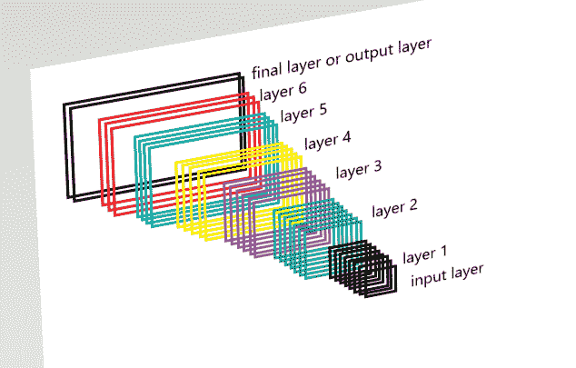
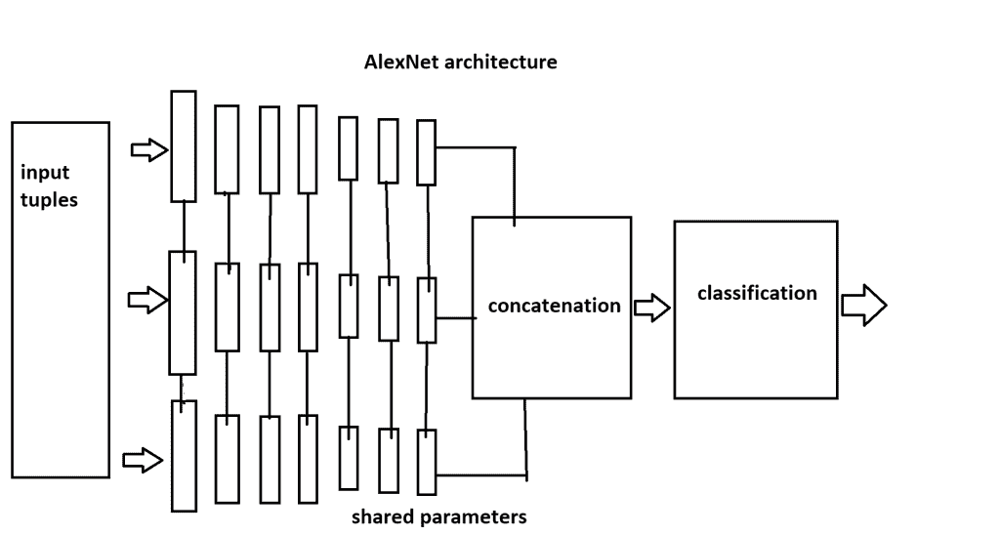
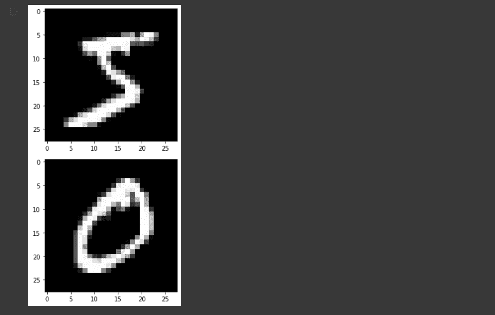

# Python 中的 Keras 深度学习[有例子]

> 原文：<https://www.askpython.com/python/examples/keras-deep-learning>

Keras 是一个强大且易于使用的 Python 开源深度学习库。它允许您轻松地建立和训练神经网络和深度学习模型。Keras 也是最受研究人员和开发人员欢迎的深度学习框架之一。Keras 由一个经验丰富的开发人员和贡献者团队开发和维护。Keras 也得到了大量用户和开发者社区的支持。

在本文中，我们将讨论以下主题:

1.  Keras 是什么？
2.  Keras 的特点
3.  Keras 贡献者
4.  Keras Models
5.  如何使用 Keras？
6.  还有更多…

所以让我们开始吧。

## Keras 是什么？

Keras 是一个非常流行的深度学习框架，是一个运行在 TensorFlow、Theano 或 CNTK 之上的神经网络 API。

### Keras 的主要特点

Keras 是一个用于创建深度学习模型的开源库。它是用 Python 编写的，可以运行在 TensorFlow、微软 CNTK 或 Theano 之上。Keras 是一个高级 API，允许开发人员轻松创建深度学习模型。Keras 由世界各地的贡献者积极开发，并在行业中被广泛采用。

Keras 是一个高性能的 API，允许轻松创建不同的程序。它专注于用户体验，在行业中被广泛采用。Keras 提供快速原型制作，并在 CPU 和 GPU 上无缝运行。它支持 NVIDeA 和 AMD。Keras 允许自由设计任何架构，并且易于上手。Keras 还为模型提供了简单的制作方法。

### Keras 的贡献者

在最初阶段，Keras 有将近 48 个以上的贡献者。

现在是近 25 万开发者或贡献者。每年都以 2 倍的速度增长。负责 Keras 框架开发的一些顶级公司有微软、谷歌、英伟达和 AWS。一些使用 Keras 框架的流行平台有网飞、优步、谷歌、Instamert 和华为。

### Keras 上的用户体验

*   **用户友好的 API**
    *   Keras 是为人类设计的 API。
    *   它遵循最佳实践来减少认知负荷。
    *   它遵循一致性和简单的 API。
*   **不是为机器设计的**
    *   Keras 对用户造成的任何错误提供了明确的反馈。
    *   这最大限度地减少了常见用例所需的用户操作数量。
*   **易学易用**
    *   它是非常多产的。
    *   它提供了比你想象的更多的想法。
    *   这有助于持续获胜，并为赢得比赛提供最佳支持。
*   **高灵活性**
    *   它通过集成其他深度学习语言，如 TensorFlow 和 Theranos，为所有开发人员提供了更高的灵活性。
    *   你可以用 basic 语言实现任何东西。

### 多后端和多平台战略

Keras 提供了多后端以及多平台的工作策略，这样代码就可以聚集在一起完成相同的任务。

*   我们可以用 python 和 R 开发 Keras。
*   我们可以使用以下后端引擎运行代码:
    *   TensorFlow
    *   提亚诺
*   它提供了将网络计算部署到多个 CPU 和 GPU 服务器的灵活性。
*   它使用以下方式生成模型:
    *   TF-服务
    *   GPU 加速
    *   安卓(TF，TF lite)
    *   iOS(原生 coreML)
    *   树莓派

## 什么是 Keras 车型？

Kers 用于构建不同的机器学习模型。Keras 的模型也提供了一些简单的工作方法。基本上，我们也将讨论两种不同的 Keras 模型。

*   顺序模型
*   功能模型

### 1.顺序模型



Sequential Model

**Keras 顺序 API 模型的特点**

*   它的工作原理类似于线性层叠。
*   这对于创建示例模型非常有用，例如:
    *   网络的简单分类
    *   编码器-解码器模型
*   该模型将每一层视为一个对象，为同一模型中的下一层提供信息。
*   这个系统被称为顺序模型。

### 2.功能模型



Functional Model

**功能 API 模型的特点**

*   该模型具有多输入、多输出和任意静态图拓扑。
*   它提供了复杂的模型，这些模型可以分成两个或更多的分支或共享层。
*   功能域中使用的概念称为域适应。

## 在 Keras API 框架中执行

**对于在 Keras API 框架中创建的模型，可能有两种不同类型的执行，如下:**

*   **符号执行**
    *   在这种类型的执行中，我们首先构建一个计算图。
    *   然后编译好的图就在后面执行了。
    *   它在 python 代码中有价值。
*   **急切(迫切)执行**
    *   在这种类型的执行过程中，python 运行时就是执行运行时。
    *   这类似于用 NumPy 执行。
    *   它在 python 代码中没有值。
    *   对于急切执行，可以使用值相关的动态拓扑(树形 rnn)。

## 使用 Keras 的实例

我们将学习如何使用 Keras API，然后是一个示例程序。跟随代码片段。首先，让我们在命令提示符下使用 **[Pip 安装程序](https://www.askpython.com/python-modules/python-pip)安装 Keras 库。**

```py
#installing keras using pip installer
pip install keras

   Looking in indexes: https://pypi.org/simple, https://us-python.pkg.dev/colab-wheels/public/simple/
   Requirement already satisfied: keras in /usr/local/lib/python3.7/dist-packages (2.9.0)

```

在我们的示例程序中，我们将加载一个预加载的数据集，Keras API 的 [**MNIST 数据集**](https://www.askpython.com/python/examples/load-and-plot-mnist-dataset-in-python) ，并使用 Keras 方法打印它。然后，我们将使用 Keras 实用程序对数据集中的输入数据进行规范化。

Keras API 中提供的一些其他预加载数据集是波士顿住房数据集、cifar 10(10 个图像标签的分类)数据集和 IMDB 电影评论数据集。MNIST 数据集是 Keras API 中预加载的数据集。

在我们获取的数据集中，有 10 条数据。我们不是处理所有的数据，而是只取两个数据并打印出来，然后处理它们。它可以通过下面的代码获得。

```py
from keras.datasets import mnist
#loading datas in variables
(x_train, y_train), (x_test, y_test) = mnist.load_data()

#we will print 1st two datas from the dataset using the following code
from matplotlib import pyplot
for i in range(2):  
 pyplot.imshow(x_train[i], cmap=pyplot.get_cmap('gray'))
 pyplot.show()

```



我们可以通过使用区间[0，1]将输入值从类型 unit8 缩放到 float32 来规范化数据集中的数据。这将允许任何值的概率落在 0 到 1 的范围内。

```py
x_train = x_train.astype(‘float32’)
x_test = x_test.astype(‘float32’)
x_train /= 255
x_test /= 255

```

由于我们要将数据从二维数组缩放到单个向量，我们需要使用以下代码片段将 28*28 数组的 MNIST 数据集的每个图像转换为具有 784(28 * 28 = 784)个分量的向量:

```py
x_train = x_train.reshape(60000, 784)
x_test = x_test.reshape(10000, 784) 

```

对于我们数据集中的每个图像，对应于该图像有一个介于 0 和 9 之间的级别。我们需要用一个包含 10 个位置的向量来表示这些信息，在对应于表示图像的数字的位置用 1 表示，在所有其他位置用 0 表示。我们可以使用`keras.util`中的 to _ categorical()方法来实现这一点。

```py
from keras.utils import to_categorical

y_train = to_categorical(y_train, num_classes=10)
y_test = to_categorical(y_test, num_classes=10)

```

```py
#Now printing our final normalized data from our datasets

print(y_test[4])
print(y_train[5])
print(y_train.shape)
print(y_test.shape)

```

因此，我们得到了数据集中数据(图像)的归一化值。我们在最后一行中打印了同样的内容，得到的输出如下。

```py
[[0\. 0\. 0\. ... 1\. 0\. 0.]
 [0\. 0\. 1\. ... 0\. 0\. 0.]
 [0\. 1\. 0\. ... 0\. 0\. 0.]
 ...
 [0\. 0\. 0\. ... 0\. 0\. 0.]
 [0\. 0\. 0\. ... 0\. 0\. 0.]
 [0\. 0\. 0\. ... 0\. 0\. 0.]]
[[0\. 0\. 0\. ... 0\. 0\. 0.]
 [1\. 0\. 0\. ... 0\. 0\. 0.]
 [0\. 0\. 0\. ... 0\. 0\. 0.]
 ...
 [0\. 0\. 0\. ... 0\. 0\. 0.]
 [0\. 0\. 0\. ... 0\. 0\. 0.]
 [0\. 0\. 0\. ... 0\. 1\. 0.]]
(60000, 10)
(10000, 10)

```

通过这种方式，我们在 Keras 数据框中使用了预加载的数据集，并对数据集中的所有输入数据(影像)进行了归一化处理。

## 结论

今天我们学习了 Keras API 框架及其不同的特性。虽然它主要是理论上的，我们希望你喜欢它。我们将带着更多激动人心的话题再次访问。