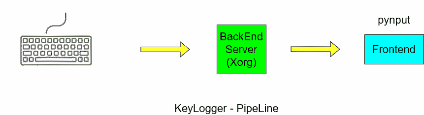

# 用 Python 实现键盘记录器

> 原文：<https://www.askpython.com/python/examples/keylogger-in-python>

大家好！在今天的帖子中，我们将做一些令人兴奋的事情——用 Python 构建一个键盘记录器！

你有没有想过监控你的键盘，看看你的打字历史，并分析你如何打字？好吧，第一步是建立一个键盘监控工具——或者一个**键盘记录器**！

虽然您很可能意识到这可能会被恶意使用，但我们假设您是控制自己机器的人！

我们开始吧！

* * *

## 安装必要的模块

第一步是确保你有合适的工具！除了 Python 3，你还必须安装 [**pynput** 模块](https://pynput.readthedocs.io/en/latest/)，以便从你的键盘读取输入。让我们使用 [pip 安装命令](https://www.askpython.com/python-modules/python-pip)。

```py
pip install pynput

```

虽然我们也可以控制键盘，但我们只是监视和记录在键盘上输入的内容！

这个模块只是使用一个后端引擎，根据你的操作系统来监控你的键盘。例如，如果你使用 Linux，你可能有一个`xorg`服务器，你可以用它作为后端。

这个模块与后端引擎交互，从键盘获取输入。

管道如下图所示:



Pipeline Keylogger

因此，这个模块将跨不同的操作系统工作，因为它完成了处理后端调用的所有工作！

我们将使用 Python 设计以下键盘记录器:

*   我们创建一个主循环，简单地等待一个键被按下。
*   一旦监听器检测到按键，我们将在控制台上打印出来。

让我们现在开始写代码。

## 用 Python 实现键盘记录器

我们将用 Python 编写一个键盘记录器，它使用了`pynput.keyboard`类。

让我们先做必要的进口

```py
import pynput.keyboard as Keyboard

```

现在，我们将监听键盘，我们将监视两种事件:

*   按键——每当按键时
*   按键释放–每当按键被释放时

现在，`pynput`已经让我们的生活变得非常容易。我们只需要定义两个函数来处理按键被按下和释放时的逻辑。

我们只需要定义这些函数，并使用`pynput`将它们作为参数传递给键盘监听器。

创建侦听器的格式如下:

```py
with Keyboard.Listener(on_press=on_press, on_release=on_release) as listener:
	listener.join()

```

只是两行代码而已！这里有两个回调函数`on_press()`和`on_release()`，它们将被相应地调用。

第二行使用`Threading.join()`方法简单地等待监听器线程完成执行。

现在让我们也来定义这两个函数。

```py
def on_press(key):
	# Callback function whenever a key is pressed
	try:
		print(f'Key {key.char} pressed!')
	except AttributeError:
		print(f'Special Key {key} pressed!')

def on_release(key):
	print(f'Key {key} released')
	if key == Keyboard.Key.esc:
		# Stop the listener
		return False

```

这里，我们首先打印使用`key.char`按下/释放的任何键。

如果按下一个特殊的键，我们必须打印出`key`，因为`key.char`不是一个有效的 ASCII 值。

同样，我们对`on_release(key)`做同样的事情，直到< Esc >键被按下。

我们简单地返回`False`，这将**自动停止**监听器并完成我们的程序！

以下是到目前为止的完整程序:

```py
import pynput.keyboard as Keyboard

def on_press(key):
	# Callback function whenever a key is pressed
	try:
		print(f'Key {key.char} pressed!')
	except AttributeError:
		print(f'Special Key {key} pressed!')

def on_release(key):
	print(f'Key {key} released')
	if key == Keyboard.Key.esc:
		# Stop the listener
		return False

with Keyboard.Listener(on_press=on_press, on_release=on_release) as listener:
	listener.join()

```

**样本输出**

```py
Key q pressed!
Key 'q' released
Key w pressed!
Key 'w' released
Special Key Key.shift pressed!
Key A pressed!
Key 'A' released
Key Key.shift released
Key a pressed!
Key 'a' released
Special Key Key.shift pressed!
Key A pressed!
Key 'A' released
Key Key.shift released
Special Key Key.shift pressed!
Key @ pressed!
Key '@' released
Key Key.shift released
Special Key Key.shift pressed!
Key $ pressed!
Key '$' released
Key Key.shift released
Special Key Key.shift pressed!
Key ) pressed!
Key ')' released
Key Key.shift released
Special Key Key.shift pressed!
Key > pressed!
Key '>' released
Key Key.shift released
Key . pressed!
Key '.' released
Special Key Key.esc pressed!
Key Key.esc released

```

正如你所看到的，这是能够成功地捕捉和打印键盘输出，甚至与特殊的关键，如`<shift>`！

* * *

## 结论

希望，你现在能够让你的键盘记录器轻松工作！你也可以在此基础上为你的键盘记录程序实现更多的功能。下次见！

* * *

## 参考

*   [pynput 模块](https://pynput.readthedocs.io/en/latest/keyboard.html)文档

* * *