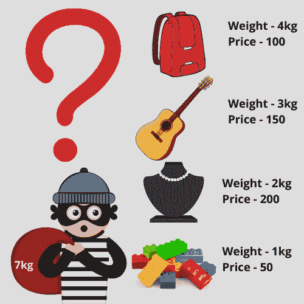

# 利用递归在 Python 中求解 0-1 背包问题

> 原文：<https://www.askpython.com/python/examples/knapsack-problem-recursion>

嗨伙计们！在本教程中，我试图解释背包问题。在面试过程中，你会在某个地方遇到这个问题。

为了解决这个问题，我们将使用递归方法。如果你不知道递归是如何工作的，看看下面的教程。

***了解更多关于递归的知识:[Python 中的递归](https://www.askpython.com/python/python-recursion-function)***

* * *

## 背包问题简介

有个小偷带着一个能装下总重量`capacity`的背包。他有 n 件不同重量和价格的物品要偷。



01 Knapsack Problem

我们的目标是创建一个名为`**knapsack**`的函数，它将找出这些物品的子集，考虑到所有物品的总重量不超过背包的给定`capacity`，从而为小偷带来最大利润。

***也读:[用 Python 解决朋友旅行问题【谷歌面试问题】](https://www.askpython.com/python/examples/friends-travel-problem)***

下图说明了同样的情况。


01 Knapsack Problem 1

* * *

## 用递归解决 Python 中的背包问题

我们将考虑到，对于每一件物品，小偷有两种选择:要么包括该物品，要么排除该物品，不要拿起它。

如果小偷**包括一个物品，**我们将为剩余的 **n-1** 物品寻找最大利润，并且也将根据所包括物品的重量减少容量。

总利润，在这种情况下，将是:**物品价格+n-1 个物品的利润(容量-物品重量)剩余**

如果一个人排除了该商品，我们将从商店中找到剩余的 **n-1** 商品的利润。在这种情况下，利润将是:**剩余产能的 n-1 项利润**

最终答案将是两种情况下的最大利润。

* * *

## 代码实现

```py
def knapsack(n,capacity,weights,prices):
    if(n==0 or capacity==0):
        return 0

    if (weights[n-1]>capacity):
        return knapsack(n-1,capacity,weights,prices)

    else:
        return max(prices[n-1] + knapsack(n-1,capacity-weights[n-1],weights,prices),
                   knapsack(n-1,capacity,weights,prices))

weights = [1,2,3,4]
prices = [50,200,150,100]
n = 4
capacity = 7

print(knapsack(n,capacity,weights,prices))

```

当前代码执行后接收到的输出为 **400** ，这是正确的输出。

* * *

感谢您花时间阅读教程！我希望背包问题现在你已经清楚了。

快乐学习！😇

* * *