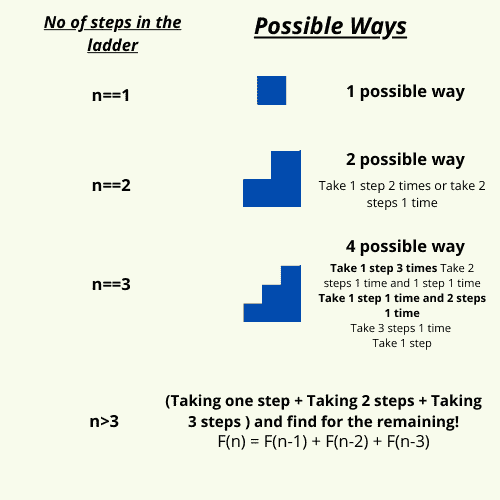

# 用 Python 解决梯子问题

> 原文：<https://www.askpython.com/python/examples/ladders-problem>

在本教程中，我们将了解一个非常有趣的问题，称为**梯子问题**。我们先来了解一下，在这个问题上，我们想达到什么目的？

* * *

## **理解梯子问题**

在这个问题中，我们有两个输入，一个是步数，另一个是一个人一次可以走的最大步数。

例如，如果最大步数= 3。一个人可以在特定时间走 1 步、2 步或 3 步。

我们需要计算这个人一次走 1 步、2 步或 3 步到达梯子顶端的所有方法。


Recursive Solution Ladders Problem 1

* * *

## 梯子问题的解决方案

现在这个问题可以用普通的循环和 if-else 语句解决了。但是更好的方法是遵循递归方法。如果你不知道递归是如何工作的，我推荐你阅读下面提到的教程。

***了解更多关于递归的知识:[Python 中的递归](https://www.askpython.com/python/python-recursion-function)***

为了解决这个问题，我们将寻找最小的问题，即 n = 1 到 n = n。让我们考虑最大的步骤数可以是 3。

下图说明了这种情况。



Recursive Solution Ladders Problem

现在让我们看看梯子问题的代码实现。

* * *

## Python 中梯子问题的代码实现

这里我们计算的是 **k** 最大步数的路数。因此，我们将按照(n-1)、(n-2)、(n-3)等顺序计算这些值，直到(n-k)。

最后，我们将对获得的所有值求和，并返回最终答案。下面给出了相同的代码实现。

```py
def count_no_ways(n,k):

    if(n<0):
        return 0

    # already on top
    if(n==0):
        return 1

    if(n<3):
        return n

    ans = 0
    for i in range(1,k+1):
        ans+=count_no_ways(n-i,k)
    return ans

n = int(input())
k = int(input())

print(count_no_ways(n,k))

```

输出:

17
17
65536

* * *

我希望你清楚梯子问题中使用的递归概念，并且能够自己实现它。

感谢您的阅读！快乐学习！😇

* * *