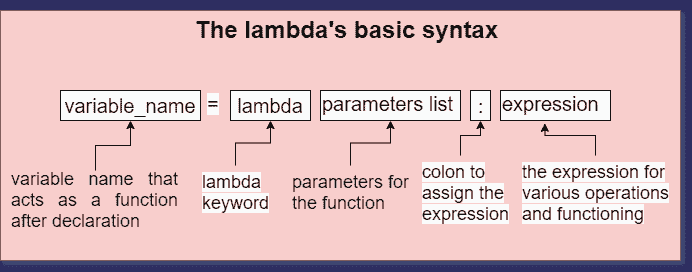
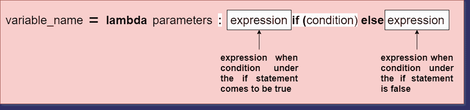

# Python 中带条件语句的 Lambda

> 原文：<https://www.askpython.com/python/examples/lambda-with-if-else-conditions>

在本文中，我们将学习如何在 Python 中使用带有 [if-else 条件](https://www.askpython.com/course/python-course-if-else-statement)的 [lambda](https://www.askpython.com/python/python-lambda-anonymous-function) 。当您需要更高级的匿名函数时，将这两者配对会非常有用。

任何编程语言中的条件语句都是需要学习的基本概念之一。它们的主要用途是根据提供的条件行动。每个程序员都必须学习这些，然后向更高级的主题前进。几乎所有的语言都只有三种条件句:

1.  **如果**
2.  **否则**
3.  **否则如果**

## **Python 中的 lambda 函数是什么？**

Python 中的 lambda 函数是一个**匿名函数**。使用这个概念的核心目的是使函数的创建变得容易。

### λ函数的语法

```py
variable = lambda parameters_list : expression

```



**Lambda Syntax**

要获取更多信息，请输入以下命令:

```py
help('lambda')

```

**我们得到以下输出:**

```py
Lambdas
*******

   lambda_expr        ::= "lambda" [parameter_list] ":" expression
   lambda_expr_nocond ::= "lambda" [parameter_list] ":" expression_nocond

Lambda expressions (sometimes called lambda forms) are used to create
anonymous functions. The expression "lambda parameters: expression"
yields a function object.  The unnamed object behaves like a function
object defined with:

   def <lambda>(parameters):
       return expression

Note that functions created with lambda expressions cannot contain
statements or annotations.

```

使用 lambdas，我们可以为初学者友好的开始执行以下操作:

1.  **加法**
2.  **减法**
3.  **乘法运算**
4.  **分部**

其他高级操作包括:

1.  **在函数式编程中使用。**
2.  **在面向对象编程中使用。**
3.  参数化一个特定类的方法。

**让我们看几个 lambda 函数**的例子。

### 添加

**代码:**

```py
add = lambda a, b: a + b
print(add(5, 5))

# output: 10

```

代码很简单。我们首先创建一个 lambda 对象作为 add。然后我们在 lambda 表达式中存储两个参数。这些参数是用于加法运算的两个数字。在冒号之后，我们将加法表达式放在冒号之前。

### 减法

**代码:**

```py
subtract = lambda a, b: a - b
print(add(100, 50))

# output: 50

```

### 增加

**代码:**

```py
multiply = lambda a, b: a * b
print(multiply(100, 50))

# output: 5000

```

## 使用带有 if-else 条件的 Lambda

使用带有 if-else 条件的 lambda 是一种有用的技术。这也减少了代码的行数。现在，注意 lambdas 中的表达式部分一次只能保存一个表达式。

#### 在 Python 中将 lambda 与 if-else 条件一起使用时的一般语法

```py
variable_name = lambda parameters : code_for_if if (condition) else code_for_else

```

语法与 lambda 的核心实现略有不同。所以，只需在 **if** 语句前声明代码，然后编写带有条件的 if 语句。如果需要，else 块直接出现在 If 语句之后。



Lambda If Else Block

```py
conditional_lambda = lambda x: x/100 if x < 20 else x
print(conditional_lambda(4))

# output: 0.04

```

**说明:**

1.  我们创建一个 lambda 对象作为 **conditional_lambda** 。
2.  然后，我们存储一个变量 **x** ，表达式为**x/100**from and in join 我们的条件语句所在。
3.  声明中说，如果 x 小于 20，则除以 100，否则按原样打印。
4.  然后我们调用 **conditional_lambda** 函数，在函数内部，我们将参数设为 4。
5.  当 4 小于 20 时，它将除以 100，屏幕上的输出是 0.04。

现在我们将学习如何使用其他高级操作。

**例:**用 lambdas 检查给定的数字是**偶数还是奇数**

```py
# setup lambda 
check = lambda num : print(num, 'is Even') if num%2 == 0 else print(num, ' is Odd')

# input from user
num = int(input('Enter any number: '))
a = check(num)
print(a)

```

**输出:**

```py
>>> Enter any number: 65
65 is Odd 

```

```py
>>> Enter any number: -56
-56 is Even

```

**例:**用 lambdas 检查给定的数字是**偶数还是奇数**

```py
check = lambda a, b : print(a,'is divisible by', b) if (a%b == 0) else print(a ,' is indivisible by ', b)
a = int(input('Enter value for a: '))
b = int(input('Enter value for b: '))
obj = check(a, b)

```

**输出:**

```py
>>> Enter value for a: 45
>>> Enter value for b: 45
45 is divisible by 45

```

```py
>>> Enter value for a: 3
>>> Enter value for b: 9
3 is indivisible by 9

```

**说明:**

1.  首先我们定义一下**λ**的说法。该函数有两个参数 **a** 和 **b** 。函数名为 **check** 。
2.  然后在 if 块来了之后。主要条件是 a 应该能被 b 整除。如果这是真的，那么木块就会打印出来(“a 能被 b 整除”)。但是如果余数不为零，则 else 块打印不可分割。
3.  然后我们创建一个函数对象作为 **obj** 并将其称为关于 **check(a，b)** 。

### **参考框架**

[https://stack overflow . com/questions/1585322/is-there-a-way-to-perform-if-in-python-lambda](https://stackoverflow.com/questions/1585322/is-there-a-way-to-perform-if-in-pythons-lambda)

## 包扎

这样，我们就结束了这个话题。使用 Lambda 和 if-else 条件语句是保持一行代码可见性的关键主题之一。最好的事情是我们不需要改变核心语法，只需要编辑我们的条件和其他东西。读者必须修改代码，并多次尝试理解代码。