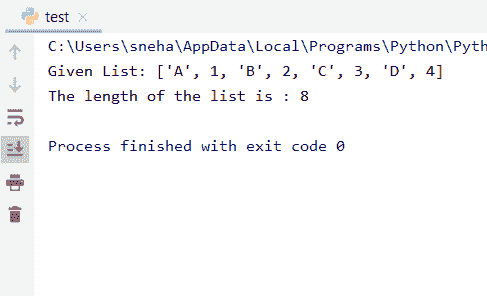

# Python 中列表的长度

> 原文：<https://www.askpython.com/python/list/length-of-a-list-in-python>

## 介绍

因此，在本教程中，我们将讨论 Python 中列表长度的含义，以及如何使用各种方法计算它。

我们知道， **Python** **List** 是一个可变的有序序列。它可能包含异类项目，也可能包含同类项目。它是 Python 中广泛使用的数据结构。为了遍历以及在列表上执行一些其他操作，我们有时需要找到列表的**长度。**

## 如何计算一个列表的长度？

计算列表的长度或大小类似于查找同一列表中的项目总数。

例如，如果我们有一个列表， **list1** :

```py
list1 = [5,4,7,2,9,6]

```

列表`lis1`的长度为 **6** 。因为元素或项目的总数是**‘6’**。

## Python 中查找列表长度的方法

在 Python 中，可以通过应用各种技术来计算列表的长度。下面我们将逐一详细讨论。

### 1.在 Python 中使用 len()方法

Python 中内置的`len()`方法被广泛用于计算任何顺序数据类型的长度。它计算对象中元素或项目的数量，并返回与对象长度相同的值。

因此，我们可以直接获得一个列表的长度，通过将它传递给内置的`len()`方法。让我们看看如何。

```py
#given list
l=[11,22,33,44,55,66]

#printing the length using len()
print("The length of the list",l, "is :",len(l))

```

**输出**:

```py
The length of the list [11, 22, 33, 44, 55, 66] is : 6

```

在这段代码中:

*   我们先拿一张单子，`list1`
*   然后我们直接将列表传递给`len()`方法，它返回列表的长度。这在我们的例子中是 **6** 。

### 2.计算列表长度的自定义函数

现在让我们在 Python 中定义我们自己的函数，它将计算传递给它的列表的长度，并在调用函数的地方返回它。

下面是我们定义的用于查找列表长度的函数。

```py
def calc_len(l):
    c=0
    for i in l:
        c=c+1
    return c

#given list
list1=['A',1,'B',2,'C',3,'D',4]

#printing the length using calc_len()
print("The length of the list",list1, "is :",calc_len(list1))

```

**输出**:



calc_len() Output

这里，

*   在上面的代码中，我们定义了一个函数`calc_len()`,它将待求长度的列表作为参数
*   在`calc_len()`函数中，我们初始化一个计数器 **c** ，它在每次`for`循环迭代中增加 **1** ，并存储列表中的总条目数，最后返回计数器 **c**
*   因此，我们将列表`list1`传递给我们的用户定义函数
*   `cal_len()`返回我们直接打印的列表的**长度。**

## 结论

因此，在本教程中，我们学习了如何在 Python 中计算或查找列表的长度。如有任何问题，欢迎使用下面的评论框。

## 参考

*   [https://stack overflow . com/questions/1712227/how-do-I-get-the-number-of-elements-in-a-list](https://stackoverflow.com/questions/1712227/how-do-i-get-the-number-of-elements-in-a-list-in-python)
*   [https://docs.python.org/3/library/functions.html#len](https://docs.python.org/3/library/functions.html#len)